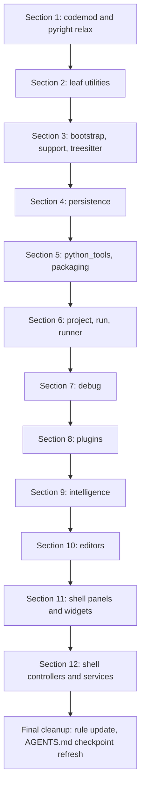

---

name: app typing strip plan
overview: Strip parameter, return, and local-variable type annotations across `app/` (plus their now-unused `typing` / `__future__` imports) using a LibCST codemod, preserve annotations only where Python semantics require them (`@dataclass`, `TypedDict`, `NamedTuple`, `Protocol`, generics on Enums), and relax pyright so it stops policing annotations. Work is split into 11 sequential sections, each a single reviewable PR with the fast test shard as the merge gate.
todos:

- id: section-1-tooling
content: "Section 1: Build LibCST codemod (scripts/typing_strip/), add fixture tests, pin libcst in requirements-dev.txt, relax pyrightconfig.json to typeCheckingMode: off, update AGENTS.md, add no_new_annotations.mdc rule, commit docs/TYPING_STRIP_PLAN.md."
status: pending
- id: section-2-leaves
content: "Section 2: Strip app/core, app/filesystem, app/templates, app/examples, app/ui (~12 files). Validates codemod end-to-end."
status: pending
- id: section-3-bootstrap
content: "Section 3: Strip app/bootstrap, app/support, app/treesitter (~16 files)."
status: pending
- id: section-4-persistence
content: "Section 4: Strip app/persistence (10 files). Heavy dataclass preservation in history_models.py."
status: pending
- id: section-5-packaging
content: "Section 5: Strip app/python_tools, app/packaging (~17 files). Run package.py --dry-run after."
status: pending
- id: section-6-project-run
content: "Section 6: Strip app/project, app/run, app/runner (~32 files). Run integration shard."
status: pending
- id: section-7-debug
content: "Section 7: Strip app/debug (9 files). Run integration + runtime_parity shards (DAP wire protocol)."
status: pending
- id: section-8-plugins
content: "Section 8: Strip app/plugins (23 files). Run integration shard for host subprocess."
status: pending
- id: section-9-intelligence
content: "Section 9: Strip app/intelligence (28 files). Heavy TYPE_CHECKING block removal."
status: pending
- id: section-10-editors
content: "Section 10: Strip app/editors (20 files). Manual review of cast() preservation."
status: pending
- id: section-11-shell-ui
content: "Section 11: Strip app/shell panels/widgets/dialogs (~27 files)."
status: pending
- id: section-12-shell-controllers
content: "Section 12: Strip app/shell controllers/coordinators/services (~26 files). Run integration + runtime_parity."
status: pending
- id: final-cleanup
content: "Final: refresh AGENTS.md checkpoint numbers, decide whether to keep or delete the codemod, mark TYPING_STRIP_PLAN.md complete."
status: pending
isProject: false

---

# App Typing Strip — Sectioned Plan

## Goals (confirmed)

- Strip **parameter and return annotations** on functions/methods.
- Strip **local variable annotations** (`x: T = ...`, bare `x: T`).
- Remove now-unused `from typing import ...` and `from __future__ import annotations` lines.
- Scope: `**app/` only** (tests, runner, packaging, plugins, examples are out of scope for this effort).
- Keep pyright but relax it.

## What we MUST keep (semantic / runtime requirements)

These are not negotiable — removing them changes program behavior:

- `@dataclass(...)` / `@dataclasses.dataclass` field annotations (the decorator scans `__annotations_`_ to build `__init__`).
- `typing.NamedTuple` / `class X(NamedTuple)` field annotations (same reason).
- `typing.TypedDict` / `class X(TypedDict)` field annotations (defines the dict shape).
- `typing.Protocol` member annotations (defines the structural contract; usually a method body is `...`).
- `enum.Enum` / `IntEnum` / `Flag` member assignments (these are values, not annotations).
- `PySide2` `Signal(...)` declarations (these are runtime descriptors, not annotations).
- Module-level constants whose annotation conveys `Final` / `ClassVar` semantics actually used (rare; codemod will leave them untouched and we'll review case-by-case).
- `cast(T, x)` — keep as runtime no-op (calls preserve behavior). The codemod removes the `T` only when we can prove it's only ever used inside `cast`. Default: leave `cast` calls and the `T` import alone.
- `TYPE_CHECKING`-guarded blocks become dead code; remove the entire `if TYPE_CHECKING:` block when nothing else inside it is referenced at runtime.

`@overload`, `TypeVar`, `Generic[...]`, `ParamSpec` — the codemod removes the decorators / class bases / definitions and any imports. They have no runtime effect we rely on (verified by the fast shard).

## Mechanical approach (recommended)

Use **LibCST** for the codemod. Rationale:

- AST-aware: it understands `FunctionDef.returns`, `Param.annotation`, `AnnAssign`, class bases, decorators.
- Preserves comments, blank lines, and existing formatting (unlike `ast.unparse`).
- Already Python-3.9 compatible and pure-Python (drops cleanly under AppRun).
- We can write one transformer and dry-run it per directory, generating reviewable diffs section by section.
- `strip-hints` is rejected because it's regex/tokenize-based, can't be told to preserve `@dataclass` selectively, and tends to mangle multi-line signatures.

### Codemod components

A new tool tree under `scripts/typing_strip/` (gitignored from product, dev-only):

- `scripts/typing_strip/__init__.py`
- `scripts/typing_strip/transformer.py` — the `cst.CSTTransformer` subclass
- `scripts/typing_strip/run.py` — CLI: `python3 scripts/typing_strip/run.py app/<subdir> [--check]`
- `scripts/typing_strip/preserve.py` — predicates that detect `@dataclass`, `TypedDict`/`NamedTuple`/`Protocol` bases, etc.

Transformer rules (in order):

1. Visit `ClassDef`. If it inherits from `TypedDict` / `NamedTuple` / `Protocol`, mark the class scope as "preserve annotations".
2. Visit `ClassDef`. If it has a `@dataclass` (or `@dataclasses.dataclass`) decorator, mark the class scope as "preserve annotations". Recursively check decorators for re-imports/aliases.
3. For every `FunctionDef` not in a preserve scope: drop `returns` and each `Param.annotation`.
4. For every `AnnAssign` not in a preserve scope:
  - If it has a value (`x: T = expr`) → rewrite to `Assign` (`x = expr`).
  - If it has no value (bare `x: T`) → delete the statement.
5. For every `Decorator` of `@overload`, drop the entire `FunctionDef` (the runtime body is the non-overloaded one). Verified safe because Python's `@overload` raises `NotImplementedError` if called.
6. Drop `if TYPE_CHECKING:` blocks entirely (after step 1-5 nothing inside them is referenced at runtime).
7. Drop class-level `TypeVar`, `ParamSpec`, `Generic[...]` bases and their definitions.
8. Recompute and prune unused imports from `typing`, `typing_extensions`, `collections.abc`. Drop `from __future__ import annotations` if present.
9. Run `python3 -m black` (or the vendored 24.10.0) on touched files to normalize whitespace after deletions.

The transformer is unit-tested by 4-6 small fixture pairs (input → expected output) committed in `scripts/typing_strip/tests/` so future maintainers can trust it.

## Pyright / CI relaxation

After Section 1 lands, edit [pyrightconfig.json](pyrightconfig.json) to:

```json
{
  "pythonVersion": "3.9",
  "include": ["app"],
  "typeCheckingMode": "off",
  ...
}
```

Plus update `AGENTS.md` line 86-92 to note that `npx pyright` now only catches syntax/import errors, and add a one-line rule under `.cursor/rules/` discouraging new annotations on function signatures going forward (so we don't regress).

## Per-section workflow (applies to every section below)

For each section:

1. Branch: `typing-strip/<section-name>`.
2. Run codemod against the section's directory(s):
  `python3 scripts/typing_strip/run.py app/<dir>`
3. Manually scan the diff for:
  - Cases where we rely on `Optional[X] = None` only as documentation — fine, value semantics unchanged.
  - Cases where a `Protocol` was implicitly the only typing of a parameter that crosses into a dataclass field — already preserved.
  - Any `cast(T, x)` whose `T` import got dropped — restore the import.
4. Run `python3 testing/run_test_shard.py fast`. Must remain at the AGENTS.md baseline (1347 passed, 5 pre-existing fails).
5. If the section touches debug/run/intelligence subprocess code, also run `python3 testing/run_test_shard.py integration`.
6. Run `npx pyright` — should report 0 errors after relaxation (Section 1 turns this gate off).
7. Open PR. Title: `chore(typing): strip annotations in app/<section>`. Body lists file count and any manual fixups.

## Sections (in execution order)

Sections are sized by file count and risk (most-isolated first, most cross-cutting last).

### Section 1 — Codemod tooling + pyright relaxation (foundation)

- Add `scripts/typing_strip/` (transformer, CLI, fixture tests). No production code touched.
- Add `libcst` to `requirements-dev.txt` (pin a 3.9-compatible release).
- Edit [pyrightconfig.json](pyrightconfig.json) → `"typeCheckingMode": "off"`.
- Update [AGENTS.md](AGENTS.md) "Type checking (pyright)" section.
- Add `.cursor/rules/no_new_annotations.mdc` (short rule discouraging future re-introduction).
- **No `app/` files modified** in this PR.

### Section 2 — Leaf utilities (lowest risk, validates the codemod)

Directories: `app/core/` (4), `app/filesystem/` (2), `app/templates/` (2), `app/examples/` (2), `app/ui/` (2). Total ~12 files. Pure helpers, very few cross-module dependencies. If the codemod misbehaves, blast radius is minimal.

Key files: [app/core/models.py](app/core/models.py), [app/core/errors.py](app/core/errors.py), [app/filesystem/trash.py](app/filesystem/trash.py).

### Section 3 — Bootstrap + support + treesitter

Directories: `app/bootstrap/` (6), `app/support/` (5), `app/treesitter/` (5). Total ~16 files. Startup + diagnostics + grammar loading. No Qt widgets; easy to validate via the fast shard.

### Section 4 — Persistence

Directory: `app/persistence/` (10). Contains [app/persistence/history_models.py](app/persistence/history_models.py) which has 5 dataclasses — the codemod's preserve logic is exercised heavily here. Also [app/persistence/local_history_store.py](app/persistence/local_history_store.py), one of the pre-existing fast-shard failures; keep an eye on whether the strip changes the failure shape.

### Section 5 — python_tools + packaging

Directories: `app/python_tools/` (6), `app/packaging/` (11). Total ~17 files. The packaging module has [app/packaging/models.py](app/packaging/models.py) (8 dataclasses) and [app/packaging/installer_manifest.py](app/packaging/installer_manifest.py) — preserve logic again exercised. After this PR, run `python package.py --dry-run` once to confirm packaging still composes cleanly.

### Section 6 — Project + run + runner

Directories: `app/project/` (13), `app/run/` (13), `app/runner/` (6). Total ~32 files. Cross-process boundaries (subprocess, IPC) — must run the integration shard, not just fast. Notable preserves: [app/run/run_manifest.py](app/run/run_manifest.py), [app/runner/execution_context.py](app/runner/execution_context.py), [app/project/file_operation_models.py](app/project/file_operation_models.py).

### Section 7 — Debug

Directory: `app/debug/` (9). Small but high-stakes — [app/debug/debug_models.py](app/debug/debug_models.py) is 13 dataclasses serialized over the DAP-like wire protocol. Run integration + the slow `runtime_parity` shard after this section.

### Section 8 — Plugins

Directory: `app/plugins/` (23). Self-contained subsystem, but has its own RPC protocol, security policy, and runtime supervisor. Notable preserves: [app/plugins/models.py](app/plugins/models.py) (8 dataclasses), [app/plugins/manifest.py](app/plugins/manifest.py), [app/plugins/rpc_protocol.py](app/plugins/rpc_protocol.py). Run `python3 testing/run_test_shard.py integration` because plugin host launches subprocesses.

### Section 9 — Intelligence

Directory: `app/intelligence/` (28). Largest non-shell module. Contains heavy annotation usage including 10 `TYPE_CHECKING` imports in [app/intelligence/semantic_session.py](app/intelligence/semantic_session.py) and 10 dataclasses in [app/intelligence/semantic_models.py](app/intelligence/semantic_models.py). Codemod's `TYPE_CHECKING` block-removal logic is most heavily exercised here. After this section, also run `npx pyright` on `app/intelligence/` specifically to confirm no syntax fallout.

### Section 10 — Editors

Directory: `app/editors/` (20). All Qt widgets. Several `cast(QWidget, ...)` calls — codemod must preserve these. Also has `@dataclass` syntax_engine model. Manual review needed for any `@overload`'d Qt event handlers (rare).

### Section 11 — Shell (part 1: panels & widgets)

Subset of `app/shell/` (~27 files): everything matching `*_widget.py`, `*_panel.py`, `*_dialog.py`, `*_dialog_*.py`, `welcome_widget.py`, `activity_bar.py`, `toolbar*.py`, `status_bar.py`, `menus.py`, `actions.py`, `events.py`, `icons*.py`, `style_sheet*.py`, `theme_tokens.py`, `file_*_icons.py`. Pure Qt UI surfaces. Lots of `cast(...)` for Qt return types — preserve.

### Section 12 — Shell (part 2: controllers, coordinators, services)

Remainder of `app/shell/` (~26 files): everything `*_controller.py`, `*_coordinator.py`, `*_service.py`, `main_window.py`, `command_broker.py`, `action_registry.py`, `background_tasks.py`, `session_persistence.py`, `layout_persistence.py`, `repl_session_manager.py`, etc. This is the most cross-cutting section; do it last so all callees are already stripped. Run the **integration + runtime_parity** shards after this lands.

## Diagram of execution flow




## Final cleanup (after Section 12)

- Refresh the "Latest checkpoint" block in [AGENTS.md](AGENTS.md) lines 59-64 with new fast/integration counts.
- Confirm `scripts/typing_strip/` is dev-only (already excluded from `package.py`'s artifact layout — verify in `app/packaging/layout.py`).
- Consider deleting the codemod entirely after the rule lands, or leave it under `scripts/` as a maintenance tool. Recommendation: leave it, mark it dev-only in its README.
- Open a follow-up to also do `tests/`, `testing/`, `bundled_plugins/` if you change your mind on scope.

## Documentation deliverable

The full plan above will be committed to `**docs/TYPING_STRIP_PLAN.md**` as part of Section 1, with each section's checkbox flipping to done as PRs merge. That keeps the rolling status visible without needing a separate tracker.

## Out of scope (explicitly)

- `tests/`, `testing/`, `scripts/` (other than the new codemod), `bundled_plugins/`, `example_projects/`, `packaging/`, `templates/`, top-level `run_*.py` and `dev_launch_editor.py`.
- Removing pyright entirely (we're keeping it as a syntax/import gate at `typeCheckingMode: off`).
- Replacing dataclasses with plain classes — explicitly preserved.
- Changing runtime behavior — codemod is annotation-only.

