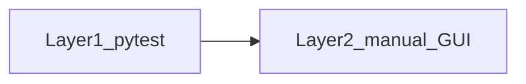

# Smoke test workflow (post–v0.2 + recent shell work)

Quick validation before a release candidate or after large shell/runner changes. Combines **automated pytest gates** with a **short manual GUI checklist**.

## Baseline

- **Last tagged release:** [CHANGELOG.md](CHANGELOG.md) — **0.2** (2026-03-09); git tag `v0.2`.
- **Scope:** Post–v0.2 changed a large surface area; this workflow uses automation for regression coverage and a **narrow manual path** for high-touch UI (run summary, test explorer, welcome/onboarding, themes).
- **Deeper coverage:** Full MVP-style checks live in [ACCEPTANCE_TESTS.md](ACCEPTANCE_TESTS.md). Example phased run logs: [smoke_test_results.md](../smoke_test_results.md) (repo root).

---

## Layer 1 — Automated (run first)

All commands route through [run_tests.py](../run_tests.py) (directly or via the shard runner), so pytest executes inside **FreeCAD AppRun** with `QT_QPA_PLATFORM=offscreen` and `--import-mode=importlib` applied automatically. The canonical command catalog lives in [docs/TESTS.md §5](TESTS.md#5-core-commands).

### A. Fast lane (start here)

```bash
python3 testing/run_test_shard.py fast
```

Runs all unit tests + non-slow integration tests (~30s). Covers the shell, run-target, test-explorer, welcome/onboarding, runtime-preflight, and theme assertions previously listed individually.

### B. Targeted spot checks (when the fast lane is green and you still want to focus on a surface)

```bash
python3 run_tests.py tests/unit/shell/test_toolbar.py \
                     tests/unit/shell/test_welcome_widget.py \
                     tests/unit/shell/test_test_explorer_panel.py \
                     tests/unit/shell/test_run_session_controller.py
python3 run_tests.py tests/integration/shell/test_run_preflight_integration.py \
                     tests/integration/shell/test_welcome_runtime_onboarding.py \
                     tests/integration/shell/test_runtime_explanation_theme_integration.py
```

### C. AppRun subprocess parity

```bash
python3 testing/run_test_shard.py runtime_parity
```

Tests self-skip if AppRun is missing.

### D. Broader gate (pre-PR)

```bash
python3 testing/run_test_shard.py integration   # includes slow subprocess + debug-session tests
python3 testing/run_test_shard.py performance   # wall-clock thresholds, serial
```

Each shard owns its own timeout overrides; the global default is 30 s and `slow`-marked tests carry their own `pytest.mark.timeout(180)`.

---

## Layer 2 — Manual smoke (15–25 minutes)

Run on a **real DISPLAY** (not only offscreen). Use sample projects from [ACCEPTANCE_TESTS.md](ACCEPTANCE_TESTS.md) §5 if you need fixtures.


| Step                          | What to verify                                                                                                                                                                                                                            |
| ----------------------------- | ----------------------------------------------------------------------------------------------------------------------------------------------------------------------------------------------------------------------------------------- |
| **M1 — Launch**               | Editor starts; status bar shows runtime readiness; **Runtime Center** and **Help → runtime** flows still work.                                                                                                                            |
| **M2 — Welcome / onboarding** | Without autoload (or after clearing last project): welcome is usable; **Help → runtime onboarding** opens and text is readable. With autoload: onboarding does not auto-open; still reachable from **Help** (see integration test above). |
| **M3 — Run / preflight**      | **F5** (active file) and **Shift+F5** (project) launch; stdout/stderr in run log; failures show traceback; **Stop** works on a long-running script. **Preflight / missing entry** dialogs should be actionable (no hang).                 |
| **M4 — Test explorer**        | Open the **Test** activity / sidebar; discovery populates; **run one test**, **run all**, **rerun failed** (after a failure) if available; **navigate to test** opens the editor at the right line.                                       |
| **M5 — Themes**               | Toggle **light / dark**; **welcome**, **test explorer**, and **runtime/onboarding** dialogs stay readable (contrast, icons).                                                                                                              |
| **M6 — Spot-checks**          | Edit `main.py`: dirty marker and save; optional: project tree **file type icons** look correct.                                                                                                                                           |


**Recording:** Use PASS / FAIL / WARN per step and optional screenshots; [smoke_test_results.md](../smoke_test_results.md) is an example log format.

---

## Quick flow




