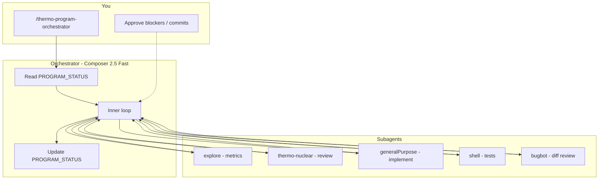

# Thermo Program — Your Workflow (Human Guide)

This is what **you** do vs what the **orchestrator agent** does. Goal: maximum automation, minimum babysitting.

**Orchestrator agent:** `.cursor/agents/thermo-program-orchestrator.md`  
**Invoke:** `/thermo-program-orchestrator` in Agent chat, or pick it from custom agents.

---

## One-time setup (~10 minutes, do once)

### 1. Confirm environment

The agent needs FreeCAD AppRun tests working (see `AGENTS.md`):

```bash
python3 testing/preflight_test_env.py
python3 testing/run_test_shard.py fast   # optional smoke — ~3 min
```

If preflight fails (stale `run_runner` children), kill orphans and retry.

### 2. Commit the agent files (when ready)

These should live in the repo so the team shares the same orchestrator:

- `.cursor/agents/thermo-program-orchestrator.md`
- `docs/code review/THERMO_PROGRAM_ORCHESTRATOR.md`
- `docs/code review/THERMO_PROGRAM_WORKFLOW.md` (this file)

### 3. Optional: enable maximum automation

| Feature | What it does | How |
|---------|--------------|-----|
| **Multitask Mode** | Background subagents while orchestrator continues | Cursor setting — use when running long sessions |
| **Auto-run terminal** | Agent runs tests without approving each command | Cursor → Agent → auto-approve safe commands (your comfort level) |
| **Yolo / full auto** | Fewer approval prompts | Only if you accept agent editing many files without per-step approval |

You do **not** need Cloud Agents for this program — local Agent + subagents is enough.

### 4. Optional: stop-hook loop (Nightly channel)

For “walk away until ACCEPT” automation, a `stop` hook can re-prompt the agent when it tries to end a turn. See [Cursor hooks](https://cursor.com/docs/hooks). Condition: continue while `PROGRAM_STATUS.md` lacks `overall: ACCEPT`. **Advanced** — skip unless you want hands-off overnight runs.

---

## Every session — what you do (minimal)

### Kickoff (first time)

1. Open **Agent** (not Ask).
2. Model: **Composer 2.5 Fast**.
3. Type:

```text
/thermo-program-orchestrator
```

That’s it. The agent creates `PROGRAM_STATUS.md`, runs baseline metrics, and starts **P0 → P1-1** (Shell Wave 2 re-baseline @ HEAD).

**Optional attachments** (usually unnecessary — agent reads paths):

- `@docs/code review/PROGRAM_STATUS.md` (after first session)
- Attach **thermo-nuclear-code-quality-review** skill if not auto-loaded

### While it runs (~30–90 min per session)

**You do nothing** unless:

| Signal | Your action |
|--------|-------------|
| Agent asks a **product scope** question (behavior change vs refactor) | Answer in one sentence; agent logs and continues |
| `PROGRAM_STATUS.blockers` has `needs_user: true` | Read blocker; decide; reply “unblock: …” |
| Terminal approval prompt | Approve (or enable auto-run) |
| You want a **checkpoint commit** | Say: “commit the thermo program work so far” |
| Context feels stale / agent confused | Start **new Agent chat**, see “Resume” below |

**You do not need to:**

- Paste the long orchestrator prompt each time (custom agent has it)
- Micromanage which subagent runs (orchestrator decides)
- Run tests yourself (shell subagent runs fast shard + pyright)

### End of session

The agent rewrites `docs/code review/PROGRAM_STATUS.md` with `next_actions`. Glance at:

```yaml
overall: IN_PROGRESS   # or BLOCKED
current_item: P1-1
next_actions:
  - "..."
blockers: []
```

**30-second review:** any `BLOCKED`? If not, you’re done until next session.

---

## Resume / continue (second and later sessions)

### Option A — Manual (recommended, simple)

New Agent chat → Composer 2.5 Fast:

```text
/thermo-program-orchestrator continue
```

Or:

```text
Continue the thermo program from @docs/code review/PROGRAM_STATUS.md
```

### Option B — Loop command (semi-automated)

After kickoff, in the **same or new** chat:

```text
/loop 45m Continue thermo program. Read docs/code review/PROGRAM_STATUS.md and execute next_actions[0]. Do not stop until overall ACCEPT or a BLOCKED item needs_user.
```

Cursor re-prompts every 45 minutes. You still approve tool runs unless auto-run is on.

### Option C — Cloud Agent (overnight)

Push a branch with in-progress work → start Cloud Agent with:

```text
/thermo-program-orchestrator continue from PROGRAM_STATUS.md on this branch
```

Good for long P2 package reviews. You review the PR in the morning.

---

## What the orchestrator does automatically (you don’t)



For each roadmap item (P1-1, P1-2, …):

1. Baseline metrics @ current commit  
2. Thermo review (or re-baseline if stale)  
3. Implement via subagent (one CC theme / one PR slice)  
4. Verify: grep gates + fast shard + pyright  
5. Re-review delta  
6. Write closure doc when wave complete  
7. Next item — **no pause for your OK**

---

## When you must intervene (cannot automate)

| Gate | Why | What you do |
|------|-----|-------------|
| **Product behavior** | Refactor vs feature change | Answer once; agent documents decision |
| **Git commit / push / PR** | Repo rule: no agent commits unless asked | Say “commit with message …” or “open PR” when you want checkpoints |
| **Four-theme manual UI** | HC Light/Dark needs human eyes | Run `docs/ACCEPTANCE_TESTS.md` scenarios OR accept “documented gap” in closure |
| **BLOCKED after 2 fix cycles** | Tests won’t pass | Read `blockers` in PROGRAM_STATUS; fix infra or waive with reason |
| **Final ACCEPT sign-off** | Program complete claim | Read `THERMO_PROGRAM_CLOSURE_*.md`; confirm you agree |

Everything else — reviews, plans, code changes, test loops — is agent-driven.

---

## Suggested checkpoint rhythm

You don’t need a commit after every subagent, but **do** commit at natural boundaries:

| When | Suggested message style |
|------|-------------------------|
| Each wave closure doc (e.g. Shell W2 ACCEPT) | `Land Shell Wave 2 thermo closure: …` |
| End of each phase P1, P2, … | `Thermo program P1 complete: …` |
| Before overnight / cloud run | Push branch so work isn’t local-only |

Ask the agent: **“commit thermo program progress for P1-1”** — it stages only program-related files.

---

## How long until done?

Rough order of magnitude (not a promise):

| Phase | Content | Agent time (estimate) |
|-------|---------|----------------------|
| P0 | Tracker + baseline | 1 session |
| P1 | Close 4 open waves | 5–15 sessions |
| P2 | 7 new package reviews | 10–20 sessions |
| P3 | Deslop docs + cleanup | 3–5 sessions |
| P4 | Integration + final ACCEPT | 2–3 sessions |

**Your wall time:** mostly approval clicks + occasional blocker answers. Plan **multiple days** of background agent time, not one afternoon.

---

## How you know it’s finished

1. Open `docs/code review/PROGRAM_STATUS.md` → `overall: ACCEPT`
2. Final doc exists: `docs/code review/THERMO_PROGRAM_CLOSURE_YYYY-MM-DD.md`
3. Fast shard + pyright clean (agent runs this; you can spot-check)
4. Every row in the program manifest has a closure doc or waiver

---

## Troubleshooting

| Problem | Fix |
|---------|-----|
| Agent stops after one PR | New chat: “Continue — do not stop until ACCEPT per PROGRAM_STATUS” |
| Tests hang | `python3 testing/preflight_test_env.py`; kill orphaned AppRun children |
| Agent implements instead of delegating | “You are orchestrator only — delegate to generalPurpose” |
| Lost context | New chat + `@PROGRAM_STATUS.md` + `/thermo-program-orchestrator continue` |
| Wrong model | Force **Composer 2.5 Fast** on orchestrator; thinking models only on thermo review subagents |

---

## Quick reference card

```text
START:     /thermo-program-orchestrator
RESUME:    /thermo-program-orchestrator continue
STATUS:    docs/code review/PROGRAM_STATUS.md
LOOP:      /loop 45m Continue thermo program from PROGRAM_STATUS.md
COMMIT:    "commit thermo program progress"
DONE WHEN: PROGRAM_STATUS overall: ACCEPT
```
