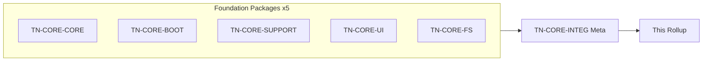
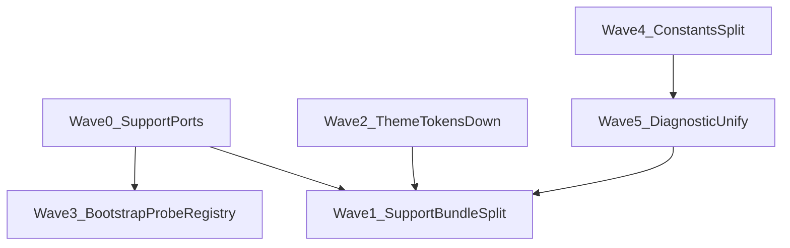

# Core Batch Wave 1 — Thermo-Nuclear Code Quality Review (2026-06-22)

> Strict **baseline** of foundational/shared layers on **`c4aed0a48dabd0663c2a666711dee85614f7fb7d`** — `app/core/`, `app/bootstrap/`, `app/support/`, `app/ui/`, `app/filesystem/`. Single integration meta-reviewer (`TN-CORE-INTEG`), thermo-nuclear rubric (code-judo, 1k-line rule, SSOT, boundary cleanliness, no rubber-stamping). **Document only** — no remediation commits in this round.
>
> **Structural template:** [`shell-wave-2`](../shell-wave-2/shell_wave_2_thermo_review_2026-06-17.md). **Architecture canon:** [`docs/ARCHITECTURE.md`](../../ARCHITECTURE.md) §4 (principles), §5 (boundaries).

---

## 0. How this review is organized

**Severity model (thermo-native):**

| Tier | Meaning |
|------|---------|
| **P0 BLOCKER** | Sole 1k-line `app/` violation, ship-blocking SSOT/boundary regression, hidden-path storage contract breach |
| **P1 STRUCTURAL** | Layer inversion, god-constants, parallel type systems, orchestration hubs, `: Any` at foundation seams |
| **P2 NICE-TO-HAVE** | Style drift, test-adjacent modules in prod paths, minor typing gaps |

**Approval bar (integration thermo):** Foundation layers pass the **1k-line rule** and **no-dot-prefixed storage paths** gate, but **`app/support/` and `app/ui/` invert the dependency graph** by importing shell, plugins, project, intelligence, and packaging modules. **`app/core/` and `app/filesystem/` are thermo-clean**; **`app/bootstrap/` is acceptable with documented upward seams**.

---

## 1. Executive summary

| Metric | Value |
|--------|------:|
| Baseline commit | `c4aed0a48dabd0663c2a666711dee85614f7fb7d` |
| Python modules reviewed | **26** |
| Total LOC (`.py`) | **3,492** |
| Files ≥700 LOC (smell) | **0** |
| Files ≥1,000 LOC (blocker) | **0** |
| Largest file | `app/bootstrap/capability_probe.py` — **379 LOC** |
| `: Any` annotations (scoped) | **3** |
| Upward import sites (foundation → higher layer) | **12 modules / 18 import lines** |
| **Deduped cross-cutting themes** | **16** |
| **P0 (deduped)** | **0** |
| **P1 STRUCTURAL (deduped)** | **10** |
| **P2 (backlog)** | **6** |
| Sub-package thermo-clean tally | **2 / 5 APPROVE** (`core`, `filesystem`) |

**Dominant risk:** not file size — **misplaced foundation boundaries**. `app/support/` acts as a cross-layer orchestrator (plugins + shell settings + persistence + project) rather than a downward-facing shared service. Complexity that should live in shell workflows or thin ports has accumulated in `support_bundle.py` and `diagnostics.py`.

**What already works (replicate this pattern):**

- `app/core/constants.py` + `app/bootstrap/paths.py` — visible-path SSOT (`cbcs/`, `choreboy_code_studio_state/`), no dot-prefixed storage dirs.
- `app/core/highlighting_policy.py` (43 LOC) — pure policy over constants; textbook single-responsibility.
- `app/core/completion_tier.py` (19 LOC) — minimal protocol boundary.
- `app/filesystem/trash.py` (135 LOC) — prioritized backend chain with explicit app-visible fallback trash.
- `app/bootstrap/paths.py` (223 LOC) — deterministic path helpers, safe path components, project/global split.
- `app/core/errors.py` (79 LOC) — small explicit exception hierarchy.

---

## 2. Baseline metric sweep @ HEAD

**Commit:** `c4aed0a48dabd0663c2a666711dee85614f7fb7d` (2026-06-22)

### 2.1 Per-package LOC table

| Package | Files | LOC | Max file | ≥700 | ≥1k |
|---------|------:|----:|---------:|:----:|:---:|
| `app/core/` | 7 | 763 | `constants.py` 297 | 0 | 0 |
| `app/bootstrap/` | 10 | 1,201 | `capability_probe.py` 379 | 0 | 0 |
| `app/support/` | 5 | 1,039 | `runtime_explainer.py` 368 | 0 | 0 |
| `app/ui/` | 2 | 342 | `help/help_dialog.py` 233 | 0 | 0 |
| `app/filesystem/` | 2 | 140 | `trash.py` 135 | 0 | 0 |
| **Total** | **26** | **3,492** | — | **0** | **0** |

### 2.2 Per-file LOC (top 15 + tail)

| LOC | File |
|----:|------|
| 379 | `app/bootstrap/capability_probe.py` |
| 368 | `app/support/runtime_explainer.py` |
| 323 | `app/support/preflight.py` |
| 297 | `app/core/constants.py` |
| 257 | `app/core/models.py` |
| 239 | `app/bootstrap/runtime_module_probe.py` |
| 233 | `app/ui/help/help_dialog.py` |
| 223 | `app/bootstrap/paths.py` |
| 219 | `app/support/support_bundle.py` |
| 219 | `app/support/diagnostics.py` |
| 153 | `app/bootstrap/logging_setup.py` |
| 135 | `app/filesystem/trash.py` |
| 109 | `app/ui/segmented_control.py` |
| 108 | `app/bootstrap/memfd_shim.py` |
| 79 | `app/core/errors.py` |
| 68 | `app/core/metrics.py` |
| 43 | `app/core/highlighting_policy.py` |
| 38 | `app/bootstrap/toml_io.py` |
| 27 | `app/bootstrap/vendor_paths.py` |
| 19 | `app/core/completion_tier.py` |
| 19 | `app/bootstrap/startup_facade.py` |
| 10 | `app/bootstrap/test_runtime_flags.py` |
| ≤6 | four `__init__.py` stubs |

### 2.3 `: Any` count (scoped packages)

| File | Count | Context |
|------|------:|---------|
| `app/support/diagnostics.py` | 1 | `_capability_checks(capability_report: Any)` — should be `CapabilityProbeReport` |
| `app/ui/segmented_control.py` | 1 | `selection_changed: Any = Signal(str)` — PySide2 typing workaround |
| `app/bootstrap/runtime_module_probe.py` | 1 | `_normalize_module_payload(payload: Any)` — JSON boundary (acceptable) |
| **Total** | **3** | |

### 2.4 Cross-package seam map (upward leaks)

Foundation layers must depend **downward** (core ← bootstrap ← services). Observed **inversions**:

| Source module | Imports from (higher layer) |
|---------------|----------------------------|
| `app/support/support_bundle.py:21-28` | `persistence`, `plugins` (×4), `project`, **`shell.settings_models`** |
| `app/support/diagnostics.py:11` | `project.project_service` |
| `app/support/runtime_explainer.py:17` | `intelligence.diagnostics_service` |
| `app/support/preflight.py:7` | `packaging.layout` |
| `app/ui/help/help_dialog.py:19` | **`shell.theme_tokens`** |
| `app/bootstrap/capability_probe.py:22,185` | `python_tools.vendor_runtime`, `treesitter.loader` (lazy) |
| `app/bootstrap/startup_facade.py:7` | **`run_editor`** (repo entry script) |

**Downstream consumers of foundation (healthy direction):**

- `app/shell/*` → `app/support/*`, `app/bootstrap/*`, `app/core/*`, `app/ui/*`
- `app/project/file_operations.py` → `app/filesystem/trash.py`
- `app/plugins/installer.py` → `app/filesystem/trash.py`

---

## 3. P0 BLOCKER — deduped themes

*None.* No module ≥1,000 LOC; no dot-prefixed project/global storage paths introduced; no ship-blocking data-loss patterns in scoped packages.

---

## 4. P1 STRUCTURAL — deduped themes

| ID | Theme | Severity | Evidence | Recommended remediation |
|----|-------|----------|----------|------------------------|
| **CC-CORE-01** | **`constants.py` god-constants monolith** — path, plugin, UI settings, theme, run, linter keys in one 297 LOC module | P1 | `app/core/constants.py:1-297` | Split into `core/constants/{paths,settings,plugins,run}.py` re-exported from `core/constants/__init__.py`; keep SSOT but reduce merge-conflict surface |
| **CC-CORE-02** | **Parallel diagnostic type systems** — `DiagnosticItem` vs `CapabilityCheckResult`; duplicate severity order maps | P1 | `app/support/diagnostics.py:14-22`; `app/core/models.py:9-14`; `app/support/runtime_explainer.py:25-29` | Unify on `CapabilityCheckResult` + adapter at support boundary; extract shared `severity_rank()` in `core/models.py` |
| **CC-CORE-03** | **`app/support/` layer inversion hub** — foundation imports shell, plugins, project, persistence, intelligence | P1 | `app/support/support_bundle.py:21-28`; `diagnostics.py:11`; `runtime_explainer.py:17`; `preflight.py:7` | Introduce narrow ports/DTOs in `core` or `support/contracts.py`; move orchestration to `shell/runtime_support_workflow` or dedicated `app/diagnostics/` sibling |
| **CC-CORE-04** | **`support_bundle.py` orchestration spaghetti** — settings parse, local history, plugin catalog in one builder | P1 | `app/support/support_bundle.py:34-219` | Extract `_build_*_diagnostics` into injectable collectors; shell passes pre-built snapshots; support emits zip only |
| **CC-CORE-05** | **`runtime_explainer.py` issue-factory monolith** — 368 LOC matrix of capability/diagnostic → `RuntimeIssue` | P1 | `app/support/runtime_explainer.py:129-357` | Split by domain: `startup_issues.py`, `project_issues.py`, `import_issues.py`; keep merge helper thin |
| **CC-CORE-06** | **`bootstrap/startup_facade` → `run_editor` inversion** — bootstrap imports repo entry script | P1 | `app/bootstrap/startup_facade.py:7-19` | Move callback registration to `app/bootstrap/capability_refresh.py` owned by entry layer; facade accepts injected probe runner |
| **CC-CORE-07** | **`capability_probe` upward runtime deps** — bootstrap imports `python_tools`, lazy `treesitter` | P1 | `app/bootstrap/capability_probe.py:22,183-208` | Register optional checks via plugin table; core probe runs filesystem/Qt/AppRun only; treesitter/tooling register from their packages at startup |
| **CC-CORE-08** | **`ui/help_dialog` → `shell.theme_tokens` inversion** | P1 | `app/ui/help/help_dialog.py:19,22-27` | Define `ThemeTokens` protocol or move token dataclass to `app/core/theme_tokens.py`; shell implements/applies QSS |
| **CC-CORE-09** | **Duplicate capability probe runners** — full vs minimal share copy-pasted loop | P1 | `app/bootstrap/capability_probe.py:36-96` | Extract `_run_check_list(runners) -> CapabilityProbeReport`; minimal = subset of check IDs |
| **CC-CORE-10** | **`diagnostics._capability_checks` untyped `Any`** — weak foundation seam | P1 | `app/support/diagnostics.py:120-128` | Type parameter as `CapabilityProbeReport`; import from `core.models` |

---

## 5. P2 NICE-TO-HAVE — backlog

| ID | Theme | Evidence | Note |
|----|-------|----------|------|
| **CC-CORE-11** | `models.py` pervasive `to_dict()` on every dataclass | `app/core/models.py:26-257` | Acceptable at JSON boundaries; avoid snapshot tests that mirror constructors (per test audit) |
| **CC-CORE-12** | `segmented_control` Signal typed as `Any` | `app/ui/segmented_control.py:19` | PySide2 stub limitation; document or use `Signal(str)` when stubs improve |
| **CC-CORE-13** | Freedesktop trash uses `~/.local/share` | `app/filesystem/trash.py:81` | OS convention, not app storage; document as external backend |
| **CC-CORE-14** | Capability probe temp file uses dot prefix | `app/bootstrap/capability_probe.py:377` | Ephemeral probe file only; not user-facing storage |
| **CC-CORE-15** | `test_runtime_flags.py` in bootstrap prod tree | `app/bootstrap/test_runtime_flags.py:1-10` | Test-only env flag; consider `app/testing/` or `tests/support/` re-export |
| **CC-CORE-16** | `paths.py` uses `Optional`/`Union` while siblings use `\| None` | `app/bootstrap/paths.py:9,17` | Style harmonization during next bootstrap touch |

---

## 6. Domain-specific notes

### 6.1 `app/core/` — TN-CORE-CORE

**Verdict: ACCEPT**

- All modules ≤297 LOC; no smell threshold breaches.
- SSOT for visible storage dirnames (`GLOBAL_STATE_DIRNAME`, `PROJECT_META_DIRNAME`) — aligns with `.cursor/rules/no_hidden_folders.mdc`.
- `highlighting_policy.py` and `completion_tier.py` exemplify code-judo extraction.
- `errors.py` provides explicit validation hierarchy without UI coupling.
- **P1 carry:** CC-CORE-01 (constants monolith), CC-CORE-02 (severity order duplication with support/packaging).

### 6.2 `app/bootstrap/` — TN-CORE-BOOT

**Verdict: ACCEPT** *(conditional — P1 debt tracked)*

- Path and logging bootstrap are deterministic and defensive (`logging_setup.py` fallback chain is intentional, not silent hard-cutover violation).
- `toml_io.py` correctly handles Python 3.9 `tomli` fallback.
- `memfd_shim.py` is focused, platform-scoped, no spillover.
- **P1 carry:** CC-CORE-06, CC-CORE-07, CC-CORE-09; `capability_probe.py` at 379 LOC is largest in batch but well under 700 smell line.

### 6.3 `app/support/` — TN-CORE-SUPPORT

**Verdict: REJECT**

- Highest upward coupling count in the foundation batch.
- `support_bundle.py` and `diagnostics.py` are orchestration hubs, not thin shared utilities.
- `runtime_explainer.py` duplicates severity ordering and rebuilds capability results from flattened diagnostic items (CC-CORE-02, CC-CORE-05).
- **Hard-cutover note:** trash/logging fallback chains in sibling packages are **documented tiered degradation**, not legacy parallel paths — acceptable for ChoreBoy constraints.

### 6.4 `app/ui/` — TN-CORE-UI

**Verdict: REJECT**

- Small surface (342 LOC total) but **`help_dialog.py` depends on `ShellThemeTokens`** — UI shared layer must not import shell (CC-CORE-08).
- `segmented_control.py` is clean, reusable, no upward imports; only consumer is `shell/settings_dialog.py` (healthy direction).
- Help markdown renderer embeds inline HTML styles from tokens — four-theme correctness depends on shell token completeness (manual acceptance gap if tokens drift).

### 6.5 `app/filesystem/` — TN-CORE-FS

**Verdict: ACCEPT**

- Minimal API: `move_path_to_trash` + `TrashMoveResult`.
- Depends only on `bootstrap.paths` (correct direction).
- Backend chain (send2trash → freedesktop → app-visible trash) matches DISCOVERY/ChoreBoy constraints.
- Consumers: `project/file_operations.py`, `plugins/installer.py` — appropriate.

---

## 7. Integration verdict (TN-CORE-INTEG)

| Sub-package | Verdict | Rationale |
|-------------|---------|-----------|
| `app/core/` | **ACCEPT** | SSOT, size, purity |
| `app/bootstrap/` | **ACCEPT** | Paths/logging solid; P1 upward seams documented |
| `app/support/` | **REJECT** | Layer inversion + orchestration hub |
| `app/ui/` | **REJECT** | Shell theme dependency |
| `app/filesystem/` | **ACCEPT** | Thin, downward deps |
| **Overall** | **REJECT** | 2/5 slices thermo-clean; support/ui block foundation approval |

**Integration bar:** Foundation passes **size and storage-path** gates but fails **boundary cleanliness** — the dependency graph bends upward through `app/support/` and `app/ui/help/`. Remediation priority: CC-CORE-03 → CC-CORE-04 → CC-CORE-08 (ports/extract orchestration/invert theme tokens).

---

## 8. Fix-agent sequencing

1. **Wave 0** — Define `SupportBundleInputs` / `ThemeTokens` protocol in `core`; stop `support` importing `shell.settings_models`.
2. **Wave 1** — Decompose `support_bundle.py` collectors; shell workflow gathers, support zips.
3. **Wave 2** — Move or duplicate-readonly theme token struct to `core`; update `help_dialog`.
4. **Wave 3** — Extract shared probe runner; register treesitter/tooling checks from owning packages.
5. **Wave 4** — Split `constants.py` by domain without changing values (hard cutover, no dual constants).
6. **Wave 5** — Unify `DiagnosticItem`/`CapabilityCheckResult` and shared severity rank.

**Do not run tests in parallel review rounds** — concurrent agents + global subprocess reaper. Run `python3 testing/run_test_shard.py fast` and `npx pyright` before closing remediation PRs.

---

## 9. Cross-reference to peer reviews (2026-06-22)

This batch is the **foundation layer** beneath shell, editors, project, plugins, and runner subsystems reviewed in parallel waves on the same commit. When remediating CC-CORE-03/04, coordinate with:

- Shell runtime/support workflows (`app/shell/runtime_support_workflow.py`) — primary caller of support bundle + health checks.
- Plugins builtin workflows (`app/plugins/builtin_workflows.py`) — imports `DiagnosticItem`/`ProjectHealthReport` directly.

---

## 10. CC theme index (quick lookup)

| ID | P | Summary |
|----|---|---------|
| CC-CORE-01 | P1 | constants.py monolith |
| CC-CORE-02 | P1 | Parallel diagnostic types + severity maps |
| CC-CORE-03 | P1 | support layer inversion hub |
| CC-CORE-04 | P1 | support_bundle orchestration |
| CC-CORE-05 | P1 | runtime_explainer monolith |
| CC-CORE-06 | P1 | startup_facade → run_editor |
| CC-CORE-07 | P1 | capability_probe upward deps |
| CC-CORE-08 | P1 | help_dialog → shell.theme_tokens |
| CC-CORE-09 | P1 | Duplicate probe runner loops |
| CC-CORE-10 | P1 | diagnostics Any type gap |
| CC-CORE-11 … 16 | P2 | See §5 |

---

*Review completed 2026-06-22. Read-only — no files modified except this document.*
