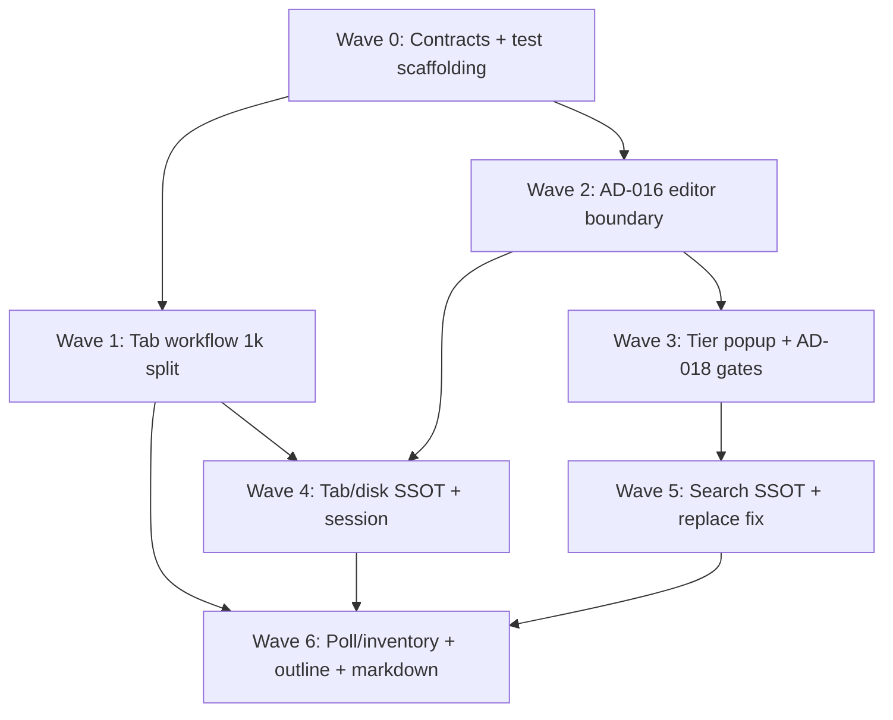

# TN-EDIT-INTEG — Thermo-Nuclear Integration Meta Review

**Critic ID:** TN-EDIT-INTEG  
**Date:** 2026-06-17  
**Baseline commit:** `042be49e5777c587391ddbb396b7ea150e296dfe`  
**Scope:** Vertical integration rollup after 11 slice critics (`TN-EDIT-CORE`, `TN-EDIT-SEM`, `TN-EDIT-COMP`, `TN-EDIT-SEARCH`, `TN-EDIT-MGR`, `TN-EDIT-MD`, `TN-EDIT-SYNTAX`, `TN-EDIT-AUX`, `TN-EDIT-SHELL-TAB`, `TN-EDIT-SHELL-FACTORY`, `TN-EDIT-SHELL-INTEL`). **Document only** — no code changes.

**Inputs:** All finding files under [`_findings/`](./), [`00-manifest.md`](../00-manifest.md) prep section (P1–P4), prior [`intelligence-wave-1/_findings/TN-INT-INTEG.md`](../../intelligence-wave-1/_findings/TN-INT-INTEG.md) (CC-02/06/10/21/22), [`project-ssot-wave-1/_findings/TN-PROJ-INTEG.md`](../../project-ssot-wave-1/_findings/TN-PROJ-INTEG.md) (CC-PROJ-13), Shell Wave 1 R3 handoff, [`TN-INT-SHELL-EDITORS.md`](../../intelligence-wave-1/_findings/TN-INT-SHELL-EDITORS.md).

---

## Executive verdict

**Not thermo-clean — REJECT for editors subsystem.** Intelligence Wave 1 and Project SSOT Wave 1 closed prefix-fork and acceptance-path blockers, but Editors Wave 1 proves **presentation boundaries are still porous**: the editor rebuilds broker context, the popup destroys tier structure on reuse, shell completion still assembles the runtime tier beside session/broker, and `editor_tab_workflow.py` at **1,013 LOC** absorbed CC-06 debt from the slimmed navigation coordinator. **~117 raw slice findings** collapse to **23 cross-cutting themes** (`CC-EDIT-01` … `CC-EDIT-23`). The dominant pattern is **orchestration without SSOT** — duplicate context builds, three prefix semantics, non-atomic tier merge across async callbacks, widget-vs-manager text authority, poll bypassing `ProjectInventoryOrchestrator`, and factory closure sprawl (TN-INT-8 still open).

**Three P0 blockers** (3 raw BLOCKER findings) must land before editors can be marked thermo-clean: `editor_tab_workflow.py` 1k decomposition (CC-EDIT-01), tier header destruction on prefix reuse (CC-EDIT-05 / COMP-1), and project replace-all rewriting beyond capped search results (CC-EDIT-14). **Six additional P0 integration themes** (CC-EDIT-04, CC-EDIT-09, CC-EDIT-10, CC-EDIT-12) are ship-blocking for the intelligence/session and tab/disk contracts. **R3** owns shell factory/tab/intelligence decomposition; **R4** owns search inventory parity and poll ↔ orchestrator unification; intelligence CC-02/CC-06/CC-10 remediation tracks remain upstream prerequisites at the popup and session merge seams.

---

## Raw vs deduped counts

| Metric | Approximate count |
|--------|------------------:|
| Slice critics | 11 |
| **Raw findings** (TN-EDIT-*-N entries) | **117** |
| — BLOCKER severity | 3 |
| — STRUCTURAL severity | ~69 |
| — NICE-TO-HAVE severity | ~45 (includes positive controls) |
| **Deduped cross-cutting themes** (CC-EDIT-01 … CC-EDIT-23) | **23** |
| — Mapped to **P0** | 7 themes (~9 raw blockers + integration-critical structural) |
| — Mapped to **P1** | 14 themes (~69 raw structural) |
| — Mapped to **P2** | 2 themes (four-theme backlog, dead-path hygiene) |
| Compression ratio (raw → themes) | ~5.1:1 |

*Counts are exact on raw IDs; severity totals are approximate because several NICE-TO-HAVE entries are positive controls (e.g. TN-EDIT-CORE-12, TN-EDIT-COMP-11).*

### Raw findings per slice

| Critic | Raw count | BLOCKER | STRUCTURAL | NICE-TO-HAVE | Verdict |
|--------|----------:|--------:|-----------:|-------------:|---------|
| TN-EDIT-CORE | 12 | 0 | 5 | 7 | REJECT |
| TN-EDIT-SEM | 11 | 0 | 7 | 4 | REJECT |
| TN-EDIT-COMP | 11 | 1 | 6 | 4 | REJECT |
| TN-EDIT-SEARCH | 9 | 1 | 6 | 2 | REJECT |
| TN-EDIT-MGR | 9 | 0 | 5 | 4 | REJECT |
| TN-EDIT-MD | 8 | 0 | 5 | 3 | REJECT |
| TN-EDIT-SYNTAX | 9 | 0 | 5 | 4 | REJECT |
| TN-EDIT-AUX | 8 | 0 | 4 | 4 | REJECT |
| TN-EDIT-SHELL-TAB | 14 | 1 | 11 | 2 | REJECT |
| TN-EDIT-SHELL-FACTORY | 12 | 0 | 7 | 5 | REJECT |
| TN-EDIT-SHELL-INTEL | 14 | 0 | 8 | 6 | REJECT |
| **Total** | **117** | **3** | **~69** | **~45** | **0 / 11 thermo-clean** |

---

## Severity mapping

| Integration tier | Slice severity | Meaning for fix agent |
|------------------|----------------|------------------------|
| **P0** | BLOCKER + integration-critical STRUCTURAL | Ship-blocking: 1k rule violation, tier trust contract, data-integrity replace scope, AD-016 runtime third locus, poll/inventory divergence, tab/disk SSOT fracture |
| **P1** | STRUCTURAL | High-conviction code-judo; debt that multiplies on next editor/intelligence/shell feature |
| **P2** | NICE-TO-HAVE | Backlog: four-theme hex forks, dead-path deletion, test placement, positive controls to preserve |

---

## P0 — Deduped themes (fix first)

| ID | Theme | Primary critics | Key evidence | Handoff |
|----|-------|-----------------|--------------|---------|
| **CC-EDIT-01** | **`editor_tab_workflow.py` at 1,013 LOC — presumptive 1k blocker; CC-06 debt relocated from nav monolith without decomposition plan** | SHELL-TAB | `editor_tab_workflow.py` — outline, markdown, poll, prefs, 195-line `MainWindowEditorTabHost`; manifest gate 7; Intelligence CC-06 nav now 132 LOC | **R3**, CC-06 |
| **CC-EDIT-04** | **Duplicate `build_completion_context`: editor trigger + shell workflow rebuild; editor owns broker classification policy** | SEM, SHELL-INTEL | `code_editor_semantics.py:126-136` vs `editor_completion_workflow.py:83-94`; dead `prefix` param (`:54-66`); TN-INT-SHELL-EDITORS-1 resolved prefix import but not duplicate build | **R3**, AD-016, CC-05 |
| **CC-EDIT-05** | **§17.4.2 tier presentation failure: reuse strips headers; delegate paints headers as rows; shell non-atomic three-callback merge (CC-02 partial)** | COMP, SHELL-INTEL | `completion_controller.py:117-130` label filter drops tier headers; `completion_item_delegate.py:86-160` no header branch; `editor_completion_workflow.py:108-255` mutable `runtime_items` / `fast_envelope[0]` | **R3**, **CC-02**, AD-016 |
| **CC-EDIT-09** | **Runtime introspection third merge locus + CC-10 completion-lane controller bypass** | SHELL-INTEL | `editor_completion_workflow.py:95-189` shell fetch/attach/merge beside session; direct `app.intelligence.*` imports while `EditorIntelligenceController` passthrough | **R3**, **CC-10**, AD-016 |
| **CC-EDIT-10** | **Poll bypasses `ProjectInventoryOrchestrator`; `cbcs/cache/` signature churn triggers rescans without Python-set change (CC-PROJ-13)** | SHELL-TAB | 1 s `scan_project_tree_signature` → `enumerate_project_entries`; `project_tree_utils.py:14-25` omits `cbcs/cache/`; reindex path injects snapshot but poll does not | **R4**, **CC-PROJ-13** |
| **CC-EDIT-12** | **Tab/disk SSOT fracture: widget vs `EditorManager` authority; forked disk-apply paths** | MGR, SHELL-FACTORY | `save_workflow` / `python_style_workflow` read widget vs tab; `_apply_text_to_open_tab` skips `update_tab_content`; `refresh_open_tabs_from_disk` duplicates `EditorSyncWorkflow` | **R3**, CC-PROJ-13 |
| **CC-EDIT-14** | **Project replace-all rewrites entire file, not capped match set — data integrity** | SEARCH | `search_panel.py:155-167` `pattern.sub` on full content; sidebar caps at 500 then calls `replace_in_files` | **R4** |

---

## P1 — Deduped themes (structural wave)

| ID | Theme | Primary critics | Key evidence | Handoff |
|----|-------|-----------------|--------------|---------|
| **CC-EDIT-02** | **Editor hub at 754 LOC: paste-hint + overlay composer stranded; no decomposition cap** | CORE | `code_editor_widget.py:352-723` ~270 LOC paste/overlay; chrome/bracket extracted but hub absorbs next features | **R3**, §12.4 |
| **CC-EDIT-03** | **Gate-8 intelligence import violations in editors: `latency_tracker`, `completion_context`, `completion_merge_policy`** | CORE, SEM | `code_editor_widget.py:37`; `code_editor_semantics.py:12-13`; manifest gate 8 presentation-only | **R3**, AD-016 |
| **CC-EDIT-06** | **Prefix semantics fork: broker vs reuse vs fuzzy match vs console (TN-INT-7 open)** | COMP, SEM, SHELL-INTEL | `reuse_items_for_prefix` startswith; `compute_match_ranges` subsequence; `python_console_widget.py:769-774` fourth prefix | **R3**, CC-02, CC-05 |
| **CC-EDIT-07** | **Factory intelligence closure sprawl + materialization fusion (TN-INT-8 open)** | SEM, SHELL-FACTORY | `editor_tab_factory.py:95-178` six nested closures; 120-line `_materialize_opened_editor_tab` | **R3**, TN-INT-8, CC-10 |
| **CC-EDIT-08** | **AD-018 gate fragmentation: completion full gate vs inline revision-only vs menu ungated vs search stale apply** | SHELL-INTEL, SEARCH | `inline_intelligence_workflow.py:49-193` omits generation; `search_sidebar_widget.py:562-573` no generation check | **R3**, CC-06, AD-018 |
| **CC-EDIT-11** | **Outline dual pipeline: sync UI-thread Go-to-Symbol miss; revision-blind cache** | SHELL-TAB | `flat_outline_symbols_for_path` sync parse; dead `set_outline_symbols_for_path`; TN-INT-3/4 partial | **R3**, AD-018 |
| **CC-EDIT-13** | **Session restore uses draft-on open path; cursor/scroll desync from silent draft clobber** | SHELL-FACTORY | `editor_session_workflow.py:183-191` → `open_file_in_editor`; `restore_draft=True` default; `open_restored_history_buffer` already passes `False` | **R3** |
| **CC-EDIT-15** | **Search options/compiler SSOT + bounded regex budget duplication** | SEARCH | Twin `FindOptions`/`SearchOptions`; `_compile_pattern` vs `_compile_search_pattern`; megabyte literal scan on UI thread | **R4** |
| **CC-EDIT-16** | **Search second exclude/include glob plane vs inventory matchers** | SEARCH | `search_panel.py:60-80` post-walk fnmatch; sidebar filter fields; CC-PROJ-01 facet | **R4**, CC-PROJ-01 |
| **CC-EDIT-17** | **Markdown shell dual-registry + rename orphan + triplicated mode control** | MD, SHELL-TAB | `_editor_widgets_by_path` / `_markdown_panes_by_path`; rename `.md`→non-md orphan; pane/View/context menu | **R3** |
| **CC-EDIT-19** | **Syntax layer coupling: editors↔treesitter bidirectional imports; dead HC flag; triplicate token mapping** | SYNTAX | `syntax_registry` ↔ `highlighter_core`; unused `build_syntax_palette(high_contrast=)`; four-module token maps | **R3**, four-theme |
| **CC-EDIT-20** | **`text_editing.py` dual-domain (~525 LOC): flat-Python engine should extract** | AUX, CORE | Lines 100–484 repair pipeline cohabits with indent/comment helpers; paste hint wiring in hub | **R3**, §12.4 |
| **CC-EDIT-21** | **Completion/hover mixin state fracture + `cast(Any)` requester shim; semantics owns editing keys** | CORE, SEM | Hub init duplicates mixin fields; `TypeError` 5/7-arg shim; `keyPressEvent` indent in semantics | **R3**, TN-INT-6/10 |
| **CC-EDIT-23** | **QuickOpenDialog dual-model Qt contract (`_QuickOpenItemModel` side channel)** | AUX | `quick_open_dialog.py:51-59,407-411` parallel to `QStringListModel` | **R3** |

---

## P2 — Deduped themes (backlog)

| ID | Theme | Primary critics | Key evidence | Handoff |
|----|-------|-----------------|--------------|---------|
| **CC-EDIT-18** | **Four-theme gaps: bracket/paste/popup/search/md/quick-open hardcoded hex or `is_dark` collapse** | CORE, COMP, MD, AUX, SEARCH | `code_editor_bracket_overlay_mixin.py:30`; `completion_item_delegate.py:58-64`; `markdown_editor_pane.py:136-139`; `quick_open_dialog.py:259-264` | **R3**, manual acceptance |
| **CC-EDIT-22** | **Dead paths + hard-cutover backlog: `SearchResultsCoordinator`, sync hover provider, dead helpers, tab teardown asymmetry, console completion fork** | SEARCH, SEM, COMP, SHELL-TAB, MGR | `diagnostics_search_coordinator.py:117-130` unwired; `_request_completion_with_metadata` dead; `SearchResultsCoordinator`; preview vs user close diverge | **R1**, R6 |

---

## Top P0 blockers for fix agent (integration view, ordered)

| Rank | CC | Blocker | Why integration-first |
|------|-----|---------|------------------------|
| 1 | **CC-EDIT-01** | `editor_tab_workflow.py` 1,013 LOC | Gate 7 presumptive blocker; every new tab hook lands in god-module; blocks R3 shell decomposition |
| 2 | **CC-EDIT-05** | Tier headers destroyed on prefix reuse | §17.4.2 trust contract broken mid-keystroke; CC-02 cannot close at popup boundary |
| 3 | **CC-EDIT-14** | Replace-all exceeds capped results | User-visible data corruption on project search replace |
| 4 | **CC-EDIT-09** | Runtime tier assembled in shell | AD-016/CC-10 violation; third merge locus beside broker/session |
| 5 | **CC-EDIT-04** | Duplicate context build in editor + workflow | Editor executes broker policy; gate 8 violated; prefix fork root cause |
| 6 | **CC-EDIT-10** | Poll bypasses inventory orchestrator | CC-PROJ-13 regression; spurious rescans on `cbcs/cache/` churn |
| 7 | **CC-EDIT-12** | Widget vs manager text authority | Format-on-save and manual format disagree on buffer SSOT |

*CC-EDIT-01 decomposition is the integration hub — most shell P1 themes unblock once tab workflow splits and factory attach moves to workflow.*

---

## Fix-agent sequencing (ordered PR waves)

### Wave 0 — Contracts + test scaffolding (no behavioral moves)

| PR | CC themes | Scope | Gate |
|----|-----------|-------|------|
| 0a | CC-EDIT-04 (partial) | `CompletionRequester` Protocol; document single context owner; delete-dead-param plan for workflow `prefix` | Types only; pyright on semantics |
| 0b | CC-EDIT-05 (partial) | Tier row metadata contract (`row_kind: header\|item`); parametrized popup tier test skeleton | Test file exists; no UI change |
| 0c | CC-EDIT-14 (partial) | Replace-scope fixture: 10 matches, cap 3 → expect 3 edits | Failing test documents blocker |
| 0d | CC-EDIT-08 (partial) | AD-018 gate matrix doc in ARCHITECTURE §17.4; extend `test_editor_stale_result_policy` cases | Doc + test scaffold |

### Wave 1 — Tab workflow 1k decomposition (R3; CC-06 partial close)

| PR | CC themes | Scope | Gate |
|----|-----------|-------|------|
| 1a | CC-EDIT-01 | Extract `editor_tab_outline_workflow.py`, `editor_tab_poll_workflow.py`, `editor_tab_preferences_workflow.py`, `main_window_editor_tab_host.py` | `wc -l editor_tab_workflow.py` ≤ 200 |
| 1b | CC-EDIT-01, CC-EDIT-07 (partial) | Split `EditorTabWorkflowHost` into sub-protocols; factory calls `attach_editor_bindings` only | Protocol method count ≤ 15 per slice |
| 1c | CC-EDIT-17 (partial) | `markdown_tab_registry.py` shared unwrap/teardown | Single `release_editor_widget` implementation |

### Wave 2 — AD-016 editor/intelligence boundary (R3; CC-10/CC-05)

| PR | CC themes | Scope | Gate |
|----|-----------|-------|------|
| 2a | CC-EDIT-04, CC-EDIT-03 | Remove `build_completion_context` from `code_editor_semantics.py`; workflow sole builder; delete intelligence imports from editors | `rg completion_context app/editors/` empty |
| 2b | CC-EDIT-09 | Move runtime fetch/attach into `SemanticSession`; shell gate-and-paint only | `rg runtime_introspection app/shell/editor_completion_workflow.py` empty |
| 2c | CC-EDIT-07 | Move factory closures to `EditorTabWorkflow.attach_editor_bindings` | Factory ≤ 60 LOC orchestration |
| 2d | CC-EDIT-03 | Relocate `RollingLatencyTracker` to `app.core.metrics` | `rg latency_tracker app/editors/` empty |

### Wave 3 — Tier popup + AD-018 gates (CC-02; TN-INT-7)

| PR | CC themes | Scope | Gate |
|----|-----------|-------|------|
| 3a | CC-EDIT-05, CC-EDIT-06 | Tier-preserving reuse or disable label reuse; delegate header paint path; list skips header selection | Reuse test: tier headers survive prefix lengthen |
| 3b | CC-EDIT-05 | Session-owned atomic merge; single paint per request_generation | Out-of-order callbacks → one stable tier order |
| 3c | CC-EDIT-08 | Inline/menu paths pass generation to `deliver_revision_gated_editor_result` | Stale generation matrix green |
| 3d | CC-EDIT-06, CC-EDIT-22 (partial) | Console `CompletionHostMixin` parity; delete `_completion_prefix` fork | Console tier headers honored |
| 3e | CC-EDIT-23 | `QuickOpenListModel(QAbstractListModel)` hard cutover | Dialog refresh single sync point |

### Wave 4 — Tab/disk SSOT + session restore (R3)

| PR | CC themes | Scope | Gate |
|----|-----------|-------|------|
| 4a | CC-EDIT-12 | `EditorManager.replace_tab_content` SSOT; `_apply_text_to_open_tab` updates manager first | Save-without-`textChanged` test green |
| 4b | CC-EDIT-12 | `refresh_open_tabs_from_disk` delegates to `EditorSyncWorkflow` only | Zero inline `setPlainText` in tab workflow |
| 4c | CC-EDIT-13 | `open_file_in_editor(..., restore_draft=False)` for session restore | Session round-trip cursor matches persisted |
| 4d | CC-EDIT-21 (partial) | Typed requester Protocol; delete `cast(Any)` shim | pyright clean semantics mixin |
| 4e | CC-EDIT-02 | Extract paste-hint + overlay mixins; hub ≤ 650 LOC | `wc -l code_editor_widget.py` ≤ 650 |

### Wave 5 — Search SSOT + replace fix (R4)

| PR | CC themes | Scope | Gate |
|----|-----------|-------|------|
| 5a | CC-EDIT-14 | Line/column-scoped replace from `SearchMatch` tuples; reject when truncated | Cap-3 replaces exactly 3 occurrences |
| 5b | CC-EDIT-15 | Unified `SearchPatternOptions` + single `compile_search_pattern` | One compiler in codebase |
| 5c | CC-EDIT-16 | Fold UI globs into `EffectiveExcludes` pre-walk | Parity with inventory matchers |
| 5d | CC-EDIT-08 (search) | Search generation token on worker callback; shutdown cancel hook | Rapid double-query test green |
| 5e | CC-EDIT-22 (partial) | Delete `SearchResultsCoordinator` dead class | `rg SearchResultsCoordinator app/` empty |

### Wave 6 — Poll/inventory + outline + markdown + syntax (R4; CC-PROJ-13)

| PR | CC themes | Scope | Gate |
|----|-----------|-------|------|
| 6a | CC-EDIT-10 | Poll compares orchestrator generation/fingerprint; drop per-tick `enumerate_project_entries` | Stable tree → zero walks |
| 6b | CC-EDIT-10 | Align signature with intelligence set; ignore `cbcs/cache/` churn | Cache-only write → no rescan |
| 6c | CC-EDIT-11 | Single async outline coordinator; revision-keyed cache | Go-to-Symbol never sync-parse on UI thread |
| 6d | CC-EDIT-17 | Rename unwrap + mode SSOT via registry; wire `mode_changed` | `.md`→`.txt` single widget |
| 6e | CC-EDIT-19 | Neutral syntax package; break editors↔treesitter cycle; collapse token maps | Import cycle test green |
| 6f | CC-EDIT-20 | Extract `flat_python_indent_repair.py` | `text_editing.py` ≤ 200 LOC |
| 6g | CC-EDIT-18 | Four-theme token pass on bracket/paste/md/popup/search chrome | Manual HC Light/Dark acceptance |

**Parallelism:** Wave 0 immediate. Wave 1 must precede Wave 4/6 tab hooks. Wave 2 session boundary must precede Wave 3 tier merge. Wave 5 search can parallelize with Wave 4 after Wave 0 tests land. Wave 6a–6b depends on Project SSOT `ProjectInventoryOrchestrator` (CC-PROJ-03 closed at baseline per TN-PROJ-INTEG closure note — wire poll consumer only).

**Intelligence Wave alignment:** Editors Wave 2 ≡ Intelligence CC-10 runtime/session cutover. Editors Wave 3 ≡ Intelligence CC-02 popup boundary + CC-05 prefix SSOT. Editors Wave 1 + 3 ≡ Intelligence CC-06 AD-018 gate uniformity. Editors Wave 6a ≡ Project CC-PROJ-13 poll tier.

---

## R3 / R4 / Intelligence CC / Project CC mapping summary

| Handoff brief | Primary CC-EDIT themes | Slice critics most involved | Upstream cross-ref |
|---------------|------------------------|----------------------------|-------------------|
| **R3** — Shell editor seam decomposition | CC-EDIT-01, CC-EDIT-02, CC-EDIT-03, CC-EDIT-07, CC-EDIT-08, CC-EDIT-09, CC-EDIT-11, CC-EDIT-12, CC-EDIT-13, CC-EDIT-17, CC-EDIT-19, CC-EDIT-21, CC-EDIT-23 | SHELL-TAB, SHELL-FACTORY, SHELL-INTEL, CORE, SEM | **CC-06**, **CC-10**, TN-INT-8 |
| **R4** — Search + poll inventory consumers | CC-EDIT-10, CC-EDIT-14, CC-EDIT-15, CC-EDIT-16 | SEARCH, SHELL-TAB | **CC-PROJ-13**, CC-PROJ-01 |
| **R1** — Hygiene / dead-path sweep | CC-EDIT-22 | SEARCH, SEM, MGR | CC-19 |
| **R6** — Test audit | CC-EDIT-05 (tests), CC-EDIT-08, CC-EDIT-14 fixtures | COMP, SEARCH | CC-21 |
| Architecture gate 7 (1k rule) | CC-EDIT-01 | SHELL-TAB | CC-06 |
| Architecture gate 8 (intelligence imports) | CC-EDIT-03, CC-EDIT-04 | CORE, SEM | AD-016 |
| Architecture gate 9 (R4 inventory) | CC-EDIT-10, CC-EDIT-16 | SHELL-TAB, SEARCH | CC-PROJ-03, CC-PROJ-13 |
| AD-016 session boundary | CC-EDIT-04, CC-EDIT-09, CC-EDIT-05 | SEM, SHELL-INTEL, COMP | CC-10 |
| AD-018 revision gate | CC-EDIT-08, CC-EDIT-11 | SHELL-INTEL, SHELL-TAB, SEARCH | CC-06 |
| §17.4.2 tier separation | CC-EDIT-05, CC-EDIT-06 | COMP, SHELL-INTEL | **CC-02** |

Global rules: hard cutover importers; factory materialization-only; one context build per completion request; tier headers must survive prefix reuse; replace scope must match displayed results; poll must not walk when orchestrator generation stable; four-theme validation for UI-touching PRs; no dot-prefixed storage paths.

---

## Positive signals (patterns to replicate)

| Extraction / pattern | Why it worked | Critics citing |
|----------------------|---------------|----------------|
| **`editor_overlay_policy.py` pure helpers** | Testable overlay mode/window without Qt | CORE-12 |
| **`CodeEditorEditingMixin` clean** | No intelligence imports; pure transforms | SEM |
| **`completion_popup/` MVC split** | Eight modules, all &lt; 400 LOC; theme via tokens | COMP-11 |
| **`quick_open.py` / dialog split** | Pure rank/match vs Qt overlay | AUX-4 |
| **`markdown_rendering.py` + injected editor** | 485 LOC three-module extraction; factory gate | MD-8 |
| **`EditorWorkspaceController` AD-018 SSOT** | Monotonic revision counter | SHELL-FACTORY-5 |
| **`editor_stale_result_policy.py`** | Canonical gate helper with tests | SHELL-INTEL-10 |
| **`semantic_navigation_workflow.py` 132 LOC** | CC-06 coordinator split — keep pass-through | SHELL-INTEL-9 |
| **`EditorManager` dirty + `atomic_write`** | Credible tab/disk core | MGR-7 |
| **`search_panel` R4 walk** | `iter_text_file_paths` + exclude merge | SEARCH-1 |
| **`EditorTabsCoordinator` + `MiddleClickTabBar`** | Focused presentation modules | SHELL-TAB-12 |
| **TN-INT acceptance path resolved** | Factory → workflow → session worker | SHELL-INTEL-14, SEM |

**Pattern to replicate:** typed host protocols per sub-workflow; single attach for intelligence bindings; session-owned merge envelopes; manager-first buffer writes; orchestrator generation for poll; tier-aware popup view model; neutral syntax/highlighting package.

**Pattern to retire:** editor-side `build_completion_context`; label-based prefix reuse; factory nested closures; widget-first format reads; per-tick project enumeration; dual markdown registries; `cast(Any)` requester shims; file-wide replace from capped matches.

---

## Approval bar (Editors Wave 1 → fix agent)

**Do not approve** editors subsystem completion, new tab-workflow hooks, completion popup features, or search replace UX until:

1. All **P0** themes (CC-EDIT-01, CC-EDIT-04, CC-EDIT-05, CC-EDIT-09, CC-EDIT-10, CC-EDIT-12, CC-EDIT-14) are fixed or explicitly product-waived with parity tests documenting the exception.
2. **`editor_tab_workflow.py` ≤ 200 LOC** facade (CC-EDIT-01) — no new methods on monolith.
3. **Single `build_completion_context` call site** per completion request — not in `app/editors/` (CC-EDIT-04).
4. **Tier headers survive prefix reuse** and render as non-selectable section UI in four themes (CC-EDIT-05).
5. **Runtime tier owned by session/broker** — no shell-side `runtime_introspection` merge (CC-EDIT-09).
6. **Poll uses orchestrator generation** — no per-second `enumerate_project_entries` when stable (CC-EDIT-10).
7. **Replace-all edits only capped match spans** (CC-EDIT-14).
8. **Format/save reads `EditorManager` first** — widget is projection (CC-EDIT-12).

---

## Per-critic verdict summary

| Critic | Verdict | Integration note |
|--------|---------|-------------------|
| **TN-EDIT-CORE** | **Not thermo-clean** | Hub 754 LOC; intelligence metrics import; overlay/paste debt → CC-EDIT-02, CC-EDIT-03 |
| **TN-EDIT-SEM** | **Not thermo-clean** | Prior blockers 1/2/5 resolved; duplicate context + gate 8 → CC-EDIT-04, CC-EDIT-03, CC-EDIT-21 |
| **TN-EDIT-COMP** | **Not thermo-clean** | Supplies 1 blocker (CC-EDIT-05); CC-02 partial at popup |
| **TN-EDIT-SEARCH** | **Not thermo-clean** | Supplies 1 blocker (CC-EDIT-14); R4 walk OK; replace/async gaps |
| **TN-EDIT-MGR** | **Not thermo-clean** | Core manager credible; shell bypass → CC-EDIT-12 |
| **TN-EDIT-MD** | **Not thermo-clean** | Editor modules OK; shell registry → CC-EDIT-17 |
| **TN-EDIT-SYNTAX** | **Not thermo-clean** | Import cycle + HC dual path → CC-EDIT-19 |
| **TN-EDIT-AUX** | **Not thermo-clean** | Quick-open split good; text_editing dual-domain → CC-EDIT-20, CC-EDIT-23 |
| **TN-EDIT-SHELL-TAB** | **Not thermo-clean** | Supplies 1 blocker (CC-EDIT-01); poll/outline → CC-EDIT-10, CC-EDIT-11 |
| **TN-EDIT-SHELL-FACTORY** | **Not thermo-clean** | TN-INT-8 open; session/disk forks → CC-EDIT-07, CC-EDIT-12, CC-EDIT-13 |
| **TN-EDIT-SHELL-INTEL** | **Not thermo-clean** | CC-06/CC-10 partial; runtime third locus → CC-EDIT-09, CC-EDIT-05 |

**Slice approval tally:** 0 of 11 thermo-clean; 11 not clean.

**Integration verdict for editors subsystem:** **REJECT**

---

## Cross-reference: intelligence-wave-1 CC themes

| Intelligence CC | Editors Wave 1 status | CC-EDIT mapping |
|-----------------|----------------------|-----------------|
| **CC-02** — §17.4.2 flat tier merge | **Partial** — merge policy injects headers; popup reuse/presentation fails | **CC-EDIT-05**, CC-EDIT-06 |
| **CC-06** — `semantic_navigation_workflow` 1k+ / AD-018 gates | **Partially fixed** — nav 132 LOC; debt moved to `editor_tab_workflow` 1k; gate fragmentation open | **CC-EDIT-01**, CC-EDIT-08, CC-EDIT-11 |
| **CC-10** — Shell bypasses controller | **Partial** — nav/inline clean; completion workflow direct imports + runtime merge | **CC-EDIT-09**, CC-EDIT-07 |
| **CC-21** — Test gaps / prefix parity | **Open** — manifest high-gap rows; no prefix parity matrix | CC-EDIT-06, Wave 0 tests |
| **CC-22** — misplaced import rewrite | **Done** (project layer) — out of editors scope; source-root quick-fix split brain remains intelligence/shell | CC-EDIT-12 (partial, format apply) |
| TN-INT-SHELL-EDITORS-1 prefix fork | **Resolved** — `build_completion_context`; new debt duplicate build | CC-EDIT-04 |
| TN-INT-SHELL-EDITORS-2 acceptance | **Resolved** | SHELL-INTEL-14 (positive) |
| TN-INT-SHELL-EDITORS-7 prefix reuse | **Open** | CC-EDIT-06 |
| TN-INT-SHELL-EDITORS-8 factory closures | **Open** | CC-EDIT-07 |
| TN-INT-SHELL-EDITORS-3/4 outline | **Partial** | CC-EDIT-11 |
| TN-INT-SHELL-EDITORS-5 dead provider | **Resolved** | — |
| TN-INT-SHELL-EDITORS-6 cast shim | **Open** | CC-EDIT-21 |
| TN-INT-SHELL-EDITORS-9 tier UI | **Partial** | CC-EDIT-05 |
| TN-INT-SHELL-EDITORS-10 hover split | **Open** | CC-EDIT-21 |

---

## Cross-reference: Project SSOT CC-PROJ-13 and Shell R3

| Upstream theme | Editors Wave 1 finding | CC-EDIT |
|----------------|------------------------|---------|
| **CC-PROJ-13** — Shell rescan orchestration / poll tiers | Poll still independent walk; `cbcs/cache` signature mismatch; save double-index out of slice | **CC-EDIT-10** |
| **CC-PROJ-03** — Snapshot orchestration | Reindex injects snapshot; poll/signature do not consume orchestrator | **CC-EDIT-10** |
| **CC-PROJ-01** — Exclude parity | Search second glob plane post-walk | **CC-EDIT-16** |
| **Shell R3** — Editor seam decomposition | Factory closures, 1k tab workflow, intelligence routing scattered | **CC-EDIT-01**, CC-EDIT-07, CC-EDIT-09 |
| **Shell R3** — Session/sync workflows | Draft-on session restore; duplicate disk sync | **CC-EDIT-13**, CC-EDIT-12 |

Project SSOT Wave 1 P0 closure (TN-PROJ-INTEG 2026-06-17) means orchestrator **exists** — Editors Wave 1 fix agents must **wire poll and search consumers** to it, not rebuild inventory policy.

---

## Raw finding coverage checklist

Every raw finding ID maps to at least one CC-EDIT theme. ✓ = covered.

### TN-EDIT-CORE (12/12)

| Raw ID | CC-EDIT | Raw ID | CC-EDIT |
|--------|---------|--------|---------|
| CORE-1 | CC-EDIT-02 | CORE-7 | CC-EDIT-18 |
| CORE-2 | CC-EDIT-03 | CORE-8 | CC-EDIT-22 |
| CORE-3 | CC-EDIT-02 | CORE-9 | CC-EDIT-21 |
| CORE-4 | CC-EDIT-02 | CORE-10 | CC-EDIT-18 |
| CORE-5 | CC-EDIT-18 | CORE-11 | CC-EDIT-22 |
| CORE-6 | CC-EDIT-18 | CORE-12 | CC-EDIT-02 (positive) |

### TN-EDIT-SEM (11/11)

| Raw ID | CC-EDIT | Raw ID | CC-EDIT |
|--------|---------|--------|---------|
| SEM-1 | CC-EDIT-04 | SEM-7 | CC-EDIT-04 |
| SEM-2 | CC-EDIT-03 | SEM-8 | CC-EDIT-22 |
| SEM-3 | CC-EDIT-21 | SEM-9 | CC-EDIT-06 |
| SEM-4 | CC-EDIT-22 | SEM-10 | CC-EDIT-07 |
| SEM-5 | CC-EDIT-21 | SEM-11 | CC-EDIT-08 |
| SEM-6 | CC-EDIT-21 | | |

### TN-EDIT-COMP (11/11)

| Raw ID | CC-EDIT | Raw ID | CC-EDIT |
|--------|---------|--------|---------|
| COMP-1 | CC-EDIT-05 | COMP-7 | CC-EDIT-05 |
| COMP-2 | CC-EDIT-05 | COMP-8 | CC-EDIT-05 |
| COMP-3 | CC-EDIT-05 | COMP-9 | CC-EDIT-18 |
| COMP-4 | CC-EDIT-06 | COMP-10 | CC-EDIT-18 |
| COMP-5 | CC-EDIT-22 | COMP-11 | CC-EDIT-05 (positive) |
| COMP-6 | CC-EDIT-22 | | |

### TN-EDIT-SEARCH (9/9)

| Raw ID | CC-EDIT | Raw ID | CC-EDIT |
|--------|---------|--------|---------|
| SEARCH-1 | CC-EDIT-16 (positive R4) | SEARCH-6 | CC-EDIT-08 |
| SEARCH-2 | CC-EDIT-16 | SEARCH-7 | CC-EDIT-22 |
| SEARCH-3 | CC-EDIT-14 | SEARCH-8 | CC-EDIT-22 |
| SEARCH-4 | CC-EDIT-15 | SEARCH-9 | CC-EDIT-18 |
| SEARCH-5 | CC-EDIT-15 | | |

### TN-EDIT-MGR (9/9)

| Raw ID | CC-EDIT | Raw ID | CC-EDIT |
|--------|---------|--------|---------|
| MGR-1 | CC-EDIT-12 | MGR-6 | CC-EDIT-12 |
| MGR-2 | CC-EDIT-12 | MGR-7 | CC-EDIT-12 (positive) |
| MGR-3 | CC-EDIT-22 | MGR-8 | CC-EDIT-20 (positive boundary) |
| MGR-4 | CC-EDIT-22 | MGR-9 | CC-EDIT-22 |
| MGR-5 | CC-EDIT-22 | | |

### TN-EDIT-MD (8/8)

| Raw ID | CC-EDIT | Raw ID | CC-EDIT |
|--------|---------|--------|---------|
| MD-1 | CC-EDIT-17 | MD-5 | CC-EDIT-18 |
| MD-2 | CC-EDIT-17 | MD-6 | CC-EDIT-18 |
| MD-3 | CC-EDIT-17 | MD-7 | CC-EDIT-22 |
| MD-4 | CC-EDIT-18 | MD-8 | CC-EDIT-17 (positive) |

### TN-EDIT-SYNTAX (9/9)

| Raw ID | CC-EDIT | Raw ID | CC-EDIT |
|--------|---------|--------|---------|
| SYNTAX-1 | CC-EDIT-19 | SYNTAX-6 | CC-EDIT-19 |
| SYNTAX-2 | CC-EDIT-19 | SYNTAX-7 | CC-EDIT-19 |
| SYNTAX-3 | CC-EDIT-19 | SYNTAX-8 | CC-EDIT-19 |
| SYNTAX-4 | CC-EDIT-19 | SYNTAX-9 | CC-EDIT-19 (positive) |
| SYNTAX-5 | CC-EDIT-19 | | |

### TN-EDIT-AUX (8/8)

| Raw ID | CC-EDIT | Raw ID | CC-EDIT |
|--------|---------|--------|---------|
| AUX-1 | CC-EDIT-20 | AUX-5 | CC-EDIT-23 |
| AUX-2 | CC-EDIT-20 | AUX-6 | CC-EDIT-22 |
| AUX-3 | CC-EDIT-20 | AUX-7 | CC-EDIT-18 |
| AUX-4 | CC-EDIT-20 (positive) | AUX-8 | CC-EDIT-22 |

### TN-EDIT-SHELL-TAB (14/14)

| Raw ID | CC-EDIT | Raw ID | CC-EDIT |
|--------|---------|--------|---------|
| TAB-1 | CC-EDIT-01 | TAB-8 | CC-EDIT-22 |
| TAB-2 | CC-EDIT-01 | TAB-9 | CC-EDIT-22 |
| TAB-3 | CC-EDIT-11 | TAB-10 | CC-EDIT-17 |
| TAB-4 | CC-EDIT-11 | TAB-11 | CC-EDIT-22 |
| TAB-5 | CC-EDIT-10 | TAB-12 | CC-EDIT-01 (positive) |
| TAB-6 | CC-EDIT-10 | TAB-13 | CC-EDIT-11 |
| TAB-7 | CC-EDIT-10 | TAB-14 | CC-EDIT-10 |

### TN-EDIT-SHELL-FACTORY (12/12)

| Raw ID | CC-EDIT | Raw ID | CC-EDIT |
|--------|---------|--------|---------|
| FACTORY-1 | CC-EDIT-07 | FACTORY-7 | CC-EDIT-07 |
| FACTORY-2 | CC-EDIT-07 | FACTORY-8 | CC-EDIT-08 |
| FACTORY-3 | CC-EDIT-13 | FACTORY-9 | CC-EDIT-13 |
| FACTORY-4 | CC-EDIT-12 | FACTORY-10 | CC-EDIT-13 |
| FACTORY-5 | CC-EDIT-08 | FACTORY-11 | CC-EDIT-13 |
| FACTORY-6 | CC-EDIT-22 | FACTORY-12 | CC-EDIT-22 |

### TN-EDIT-SHELL-INTEL (14/14)

| Raw ID | CC-EDIT | Raw ID | CC-EDIT |
|--------|---------|--------|---------|
| INTEL-1 | CC-EDIT-09 | INTEL-8 | CC-EDIT-04 |
| INTEL-2 | CC-EDIT-05 | INTEL-9 | CC-EDIT-09 (positive) |
| INTEL-3 | CC-EDIT-08 | INTEL-10 | CC-EDIT-08 (positive) |
| INTEL-4 | CC-EDIT-08 | INTEL-11 | CC-EDIT-22 |
| INTEL-5 | CC-EDIT-09 | INTEL-12 | CC-EDIT-07 |
| INTEL-6 | CC-EDIT-04 | INTEL-13 | CC-EDIT-05 |
| INTEL-7 | CC-EDIT-06 | INTEL-14 | CC-EDIT-09 (positive) |

**Coverage summary:** 117 / 117 raw findings mapped. **0 orphans.**

---

## Cross-reference index (raw finding → CC theme)

Quick lookup: slice finding IDs → CC-EDIT theme (click to expand)

| Raw IDs (sample) | CC-EDIT |
|------------------|---------|
| CORE-1,3,4,12 | CC-EDIT-02 |
| CORE-2, SEM-2 | CC-EDIT-03 |
| SEM-1,7, INTEL-6,8 | CC-EDIT-04 |
| COMP-1,2,3,7, INTEL-2,13 | CC-EDIT-05 |
| COMP-4, SEM-9, INTEL-7 | CC-EDIT-06 |
| SEM-10, FACTORY-1,2,7,12, INTEL-12 | CC-EDIT-07 |
| INTEL-3,4, FACTORY-5,8, SEARCH-6, SEM-11 | CC-EDIT-08 |
| INTEL-1,5,9,14 | CC-EDIT-09 |
| TAB-5,6,7,14, INTEL-1 (poll facet) | CC-EDIT-10 |
| TAB-1,2,12 | CC-EDIT-01 |
| TAB-3,4,13 | CC-EDIT-11 |
| MGR-1,2,6, FACTORY-4 | CC-EDIT-12 |
| FACTORY-3,9,10,11 | CC-EDIT-13 |
| SEARCH-3 | CC-EDIT-14 |
| SEARCH-4,5 | CC-EDIT-15 |
| SEARCH-2, SEARCH-1 | CC-EDIT-16 |
| MD-1,2,3,8, TAB-8,10 | CC-EDIT-17 |
| CORE-5,6,7,10, COMP-9,10, MD-4,5,6, AUX-7, SEARCH-9 | CC-EDIT-18 |
| SYNTAX-1,2,3,4,5,6,7,8 | CC-EDIT-19 |
| AUX-1,2,3,4, CORE-3 | CC-EDIT-20 |
| CORE-9, SEM-3,4,5,6 | CC-EDIT-21 |
| SEARCH-7,8, SEM-4,8, COMP-5,6, MGR-3,4,5,9, TAB-8,9,11, FACTORY-6,12, INTEL-11 | CC-EDIT-22 |
| AUX-5 | CC-EDIT-23 |

---

*End of TN-EDIT-INTEG. Per-slice evidence: [`TN-EDIT-CORE.md`](./TN-EDIT-CORE.md) … [`TN-EDIT-SHELL-INTEL.md`](./TN-EDIT-SHELL-INTEL.md). Consolidated rollup target: [`../editors_wave_1_thermo_review_2026-06-17.md`](../editors_wave_1_thermo_review_2026-06-17.md). Remediation sequencing target: [`../editors_wave_1_remediation_plan.md`](../editors_wave_1_remediation_plan.md).*
