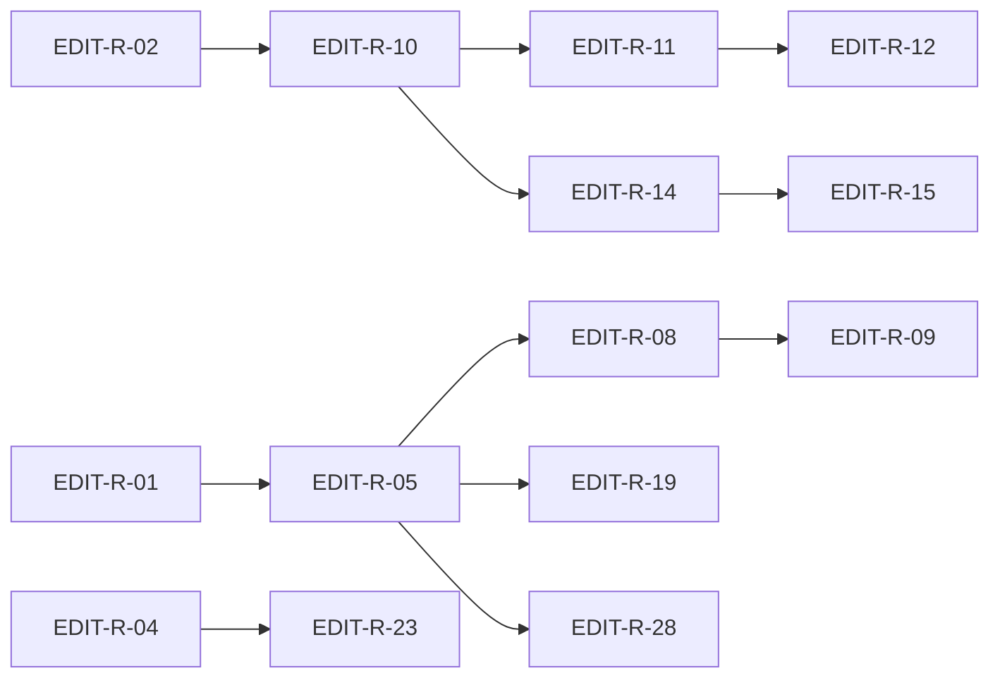

# Editors Wave 1 — End-to-End Implementation Plan

Status: **implementation-ready** (Phase 2 execution)  
Baseline: `042be49e5777c587391ddbb396b7ea150e296dfe`  
Source review: [`editors_wave_1_thermo_review_2026-06-17.md`](editors_wave_1_thermo_review_2026-06-17.md)  
Strategy doc: [`editors_wave_1_remediation_plan.md`](editors_wave_1_remediation_plan.md)  
Integration themes: [`_findings/TN-EDIT-INTEG.md`](_findings/TN-EDIT-INTEG.md)

Executable companion: every CC-EDIT theme maps to concrete PRs, files, verification gates, and dependencies.

---

## 1. Program scope and completion definition

### In scope

- Close all **P0** themes CC-EDIT-01, CC-EDIT-04, CC-EDIT-05, CC-EDIT-09, CC-EDIT-10, CC-EDIT-12, CC-EDIT-14 (mandatory).
- Close all **P1** themes CC-EDIT-02 … CC-EDIT-23 except explicit P2 waivers (mandatory for thermo-clean declaration).
- Converge with Intelligence Wave CC-02/CC-06/CC-10 and Project SSOT CC-PROJ-13 at editor seams.

### Program complete when (all must pass)

| # | Criterion | Verification |
|---|-----------|--------------|
| 1 | P0 themes closed | §4 P0 checklist |
| 2 | `editor_tab_workflow.py` ≤ 200 LOC | `wc -l` |
| 3 | No `completion_context` in `app/editors/` | `rg completion_context app/editors/` |
| 4 | No runtime merge in shell completion workflow | `rg runtime_introspection app/shell/editor_completion_workflow.py` |
| 5 | Tier header reuse test green | `run_tests.py` completion_popup tier test |
| 6 | Poll stable tree → zero walks/tick | Spy/orchestrator test |
| 7 | Replace cap test green | `test_search_replace_scope` |
| 8 | `python3 testing/run_test_shard.py fast` green | §16 |
| 9 | `npx pyright` → 0 errors | §16 |
| 10 | Four-theme manual acceptance per UI PR | §17 |
| 11 | 117/117 raw findings mapped; P0/P1 closed | TN-EDIT-INTEG checklist |

---

## 2. Non-negotiable rules (every PR)

1. Hard cutover — delete old paths in same PR.
2. Python 3.9; no dot-prefixed storage paths.
3. `editor_tab_workflow.py` method count must not increase during decomposition.
4. Factory materializes only; workflow attaches intelligence bindings.
5. One `build_completion_context` per request — shell workflow only.
6. Four-theme validation for UI-touching PRs.
7. Tests only when risk-first gate applies.

---

## 3. CC theme closure matrix

| CC | Priority | Primary PR | Wave | Key files | Depends on |
|----|----------|------------|------|-----------|------------|
| CC-EDIT-01 | P0 | EDIT-R-05, R-06, R-07 | 1 | `editor_tab_workflow.py`, new sub-workflows | EDIT-R-01 |
| CC-EDIT-04 | P0 | EDIT-R-10, R-11 | 2 | `code_editor_semantics.py`, `editor_completion_workflow.py` | EDIT-R-02 |
| CC-EDIT-05 | P0 | EDIT-R-14, R-15, R-16 | 3 | `completion_popup/*`, `editor_completion_workflow.py` | EDIT-R-10 |
| CC-EDIT-09 | P0 | EDIT-R-12 | 2 | `editor_completion_workflow.py`, `semantic_session.py` | EDIT-R-10 partial |
| CC-EDIT-10 | P0 | EDIT-R-24, R-25 | 6 | `editor_tab_poll_workflow.py`, `project_inventory_orchestrator.py` | EDIT-R-05 |
| CC-EDIT-12 | P0 | EDIT-R-18, R-19 | 4 | `editor_manager.py`, `save_workflow.py`, `editor_sync_workflow.py` | EDIT-R-05 |
| CC-EDIT-14 | P0 | EDIT-R-21 | 5 | `search_panel.py`, `search_sidebar_widget.py` | EDIT-R-04 |
| CC-EDIT-02 | P1 | EDIT-R-20 | 4 | `code_editor_widget.py`, new overlay mixins | EDIT-R-05 |
| CC-EDIT-03 | P1 | EDIT-R-10, R-13 | 2 | `code_editor_widget.py`, `code_editor_semantics.py` | — |
| CC-EDIT-06 | P1 | EDIT-R-14, R-17 | 3 | `completion_controller.py`, `python_console_widget.py` | EDIT-R-14 |
| CC-EDIT-07 | P1 | EDIT-R-08, R-09 | 1–2 | `editor_tab_factory.py`, `editor_tab_workflow.py` | EDIT-R-05 |
| CC-EDIT-08 | P1 | EDIT-R-03, R-16, R-23 | 0,3,5 | `editor_stale_result_policy.py`, inline workflow, search sidebar | EDIT-R-02 |
| CC-EDIT-11 | P1 | EDIT-R-26 | 6 | outline coordinator, `symbol_navigation_workflow.py` | EDIT-R-06 |
| CC-EDIT-13 | P1 | EDIT-R-19 | 4 | `editor_session_workflow.py` | EDIT-R-18 |
| CC-EDIT-15 | P1 | EDIT-R-22 | 5 | search modules unified compiler | EDIT-R-21 |
| CC-EDIT-16 | P1 | EDIT-R-23 | 5 | `search_panel.py`, `file_excludes.py` | PROJ-R-03 parallel |
| CC-EDIT-17 | P1 | EDIT-R-07, R-27 | 1,6 | `markdown_tab_registry.py`, `markdown_editor_pane.py` | EDIT-R-05 |
| CC-EDIT-19 | P1 | EDIT-R-28 | 6 | `syntax_registry.py`, `highlighter_core.py` | — |
| CC-EDIT-20 | P1 | EDIT-R-29 | 6 | `text_editing.py`, `flat_python_indent_repair.py` | — |
| CC-EDIT-21 | P1 | EDIT-R-20 | 4 | `code_editor_semantics.py`, mixins | EDIT-R-10 |
| CC-EDIT-23 | P1 | EDIT-R-17 | 3 | `quick_open_dialog.py` | — |
| CC-EDIT-18 | P2 | EDIT-R-30 | 6 | theme token pass across chrome | EDIT-R-14, R-27 |
| CC-EDIT-22 | P2 | EDIT-R-23, R-31 | 5–6 | dead path deletion | Wave 5+ |

---

## 4. P0 blocker closure checklist

| CC | Done when | Command / test |
|----|-----------|----------------|
| **CC-EDIT-01** | Tab workflow ≤ 200 LOC | `wc -l app/shell/editor_tab_workflow.py` |
| **CC-EDIT-04** | No context build in editors | `rg build_completion_context app/editors/` → empty |
| **CC-EDIT-05** | Tier headers survive reuse | `python3 run_tests.py tests/unit/editors/completion_popup/ -k tier` |
| **CC-EDIT-09** | Runtime merge in session | `rg runtime_introspection app/shell/editor_completion_workflow.py` → empty |
| **CC-EDIT-10** | Poll uses orchestrator | Poll spy test: stable tree → 0 `enumerate_project_entries` |
| **CC-EDIT-12** | Manager-first save/format | Save-without-textChanged unit test |
| **CC-EDIT-14** | Scoped replace | Cap-3 replaces exactly 3 spans |

---

## 5. PR catalog (EDIT-R-01 … EDIT-R-31)

### Wave 0 — Contracts + scaffolding

| PR | Title | Files | CC | Verification |
|----|-------|-------|-----|--------------|
| **EDIT-R-01** | Editor tab decomposition scaffold + host protocol types | New protocol modules, `editor_tab_workflow.py` (types only) | CC-EDIT-01 partial | pyright |
| **EDIT-R-02** | `CompletionRequester` Protocol + context owner doc | `editor_completion_contracts.py`, ARCHITECTURE §17.4 | CC-EDIT-04 partial | pyright |
| **EDIT-R-03** | AD-018 gate matrix + stale policy test expansion | `test_editor_stale_result_policy.py`, ARCHITECTURE | CC-EDIT-08 partial | targeted tests |
| **EDIT-R-04** | Replace-scope failing fixture | `test_search_replace_scope.py` | CC-EDIT-14 partial | test fails documenting blocker |

### Wave 1 — Tab workflow split

| PR | Title | Files | CC | Verification |
|----|-------|-------|-----|--------------|
| **EDIT-R-05** | Extract poll + outline + preferences sub-workflows | New `editor_tab_*_workflow.py`, slim `editor_tab_workflow.py` | CC-EDIT-01, CC-EDIT-10 partial | `wc -l` ≤ 200 |
| **EDIT-R-06** | Extract `main_window_editor_tab_host.py` | Host adapter move | CC-EDIT-01 | shell unit tests |
| **EDIT-R-07** | `markdown_tab_registry.py` shared unwrap | Registry module, tree/tab workflows | CC-EDIT-17 partial | markdown pane tests |
| **EDIT-R-08** | Split host protocol; factory calls `attach_editor_bindings` | `editor_tab_factory.py`, workflow | CC-EDIT-07 partial | factory LOC ≤ 60 target |
| **EDIT-R-09** | Delete factory intelligence closures | `editor_tab_factory.py`, `editor_tab_workflow.py` | CC-EDIT-07 | `rg on_completion` factory → workflow only |

### Wave 2 — AD-016 boundary

| PR | Title | Files | CC | Verification |
|----|-------|-------|-----|--------------|
| **EDIT-R-10** | Remove `build_completion_context` from editor | `code_editor_semantics.py` | CC-EDIT-04, CC-EDIT-03 | `rg completion_context app/editors/` empty |
| **EDIT-R-11** | Workflow sole context builder + metadata envelope | `editor_completion_workflow.py` | CC-EDIT-04 | semantic editor interaction tests |
| **EDIT-R-12** | Runtime tier into session/broker | `semantic_session.py`, `editor_completion_workflow.py` | CC-EDIT-09 | runtime grep empty in shell |
| **EDIT-R-13** | Relocate `RollingLatencyTracker` to neutral module | `app/core/metrics.py`, `code_editor_widget.py` | CC-EDIT-03 | `rg latency_tracker app/editors/` empty |

### Wave 3 — Tier popup + AD-018

| PR | Title | Files | CC | Verification |
|----|-------|-------|-----|--------------|
| **EDIT-R-14** | Tier row model + preserving reuse | `completion_item_model.py`, `completion_controller.py` | CC-EDIT-05, CC-EDIT-06 | tier reuse test |
| **EDIT-R-15** | Delegate header paint path | `completion_item_delegate.py`, `completion_list_view.py` | CC-EDIT-05 | manual four-theme |
| **EDIT-R-16** | Atomic session merge; single paint | `editor_completion_workflow.py`, session | CC-EDIT-05 | callback ordering test |
| **EDIT-R-17** | QuickOpen single `QAbstractListModel` | `quick_open_dialog.py` | CC-EDIT-23 | quick open tests |
| **EDIT-R-18** | Console completion parity | `python_console_widget.py` | CC-EDIT-06 | console completion smoke |

### Wave 4 — Tab/disk SSOT

| PR | Title | Files | CC | Verification |
|----|-------|-------|-----|--------------|
| **EDIT-R-19** | `EditorManager.replace_tab_content` SSOT | `editor_manager.py`, `save_workflow.py` | CC-EDIT-12 | save-without-textChanged |
| **EDIT-R-20** | Extract paste-hint + overlay mixins; hub ≤ 650 | `code_editor_widget.py`, new mixins | CC-EDIT-02, CC-EDIT-21 | `wc -l` ≤ 650 |
| **EDIT-R-21** | Disk refresh via `EditorSyncWorkflow` only | `editor_tab_workflow.py`, `editor_sync_workflow.py` | CC-EDIT-12 | grep setPlainText |
| **EDIT-R-22** | Session restore `restore_draft=False` | `editor_session_workflow.py` | CC-EDIT-13 | session workflow tests |

### Wave 5 — Search SSOT

| PR | Title | Files | CC | Verification |
|----|-------|-------|-----|--------------|
| **EDIT-R-23** | Scoped replace from `SearchMatch` tuples | `search_panel.py`, sidebar | CC-EDIT-14 | EDIT-R-04 test green |
| **EDIT-R-24** | Unified search compiler/options | search modules | CC-EDIT-15 | single compiler grep |
| **EDIT-R-25** | Exclude globs into `EffectiveExcludes` | `search_panel.py`, `file_excludes.py` | CC-EDIT-16 | search panel tests |
| **EDIT-R-26** | Search generation gate + shutdown cancel | `search_sidebar_widget.py` | CC-EDIT-08 | double-query test |
| **EDIT-R-27** | Delete `SearchResultsCoordinator` dead class | `diagnostics_search_coordinator.py` | CC-EDIT-22 | grep empty |

### Wave 6 — Poll/outline/markdown/syntax

| PR | Title | Files | CC | Verification |
|----|-------|-------|-----|--------------|
| **EDIT-R-28** | Poll orchestrator consumer | `editor_tab_poll_workflow.py` | CC-EDIT-10 | poll spy test |
| **EDIT-R-29** | Signature `cbcs/cache` alignment | `project_tree_utils.py` | CC-EDIT-10 | inventory poll test |
| **EDIT-R-30** | Async outline coordinator | outline workflow, symbol nav | CC-EDIT-11 | stale outline test |
| **EDIT-R-31** | Markdown mode SSOT + pane theming | `markdown_editor_pane.py`, registry | CC-EDIT-17 | four-theme manual |
| **EDIT-R-32** | Syntax import cycle break + token map collapse | `syntax_registry.py`, treesitter | CC-EDIT-19 | import cycle test |
| **EDIT-R-33** | Extract `flat_python_indent_repair.py` | `text_editing.py` | CC-EDIT-20 | `wc -l` ≤ 200 |
| **EDIT-R-34** | Four-theme token pass (P2) | chrome/popup/md/search | CC-EDIT-18 | manual acceptance |

*Note: PR IDs EDIT-R-28+ in wave 6 continue numbering from integr wave 6 steps; total 34 PRs including P2 tail.*

---

## 6. Dependency graph (critical path)



**Critical path:** R-01 → R-05 (1k split) → R-08/09 (factory) parallel with R-02 → R-10 → R-11 → R-14 (completion boundary + tiers).

---

## 7. Verification commands (§16)

```bash
# Default agent loop
python3 testing/run_test_shard.py fast

# Targeted editor/shell
python3 run_tests.py tests/unit/editors/ tests/unit/shell/test_editor_*

# Typecheck
npx pyright

# P0 grep gates
rg build_completion_context app/editors/
rg runtime_introspection app/shell/editor_completion_workflow.py
rg completion_context app/editors/
wc -l app/shell/editor_tab_workflow.py app/editors/code_editor_widget.py
```

---

## 8. Four-theme manual acceptance (§17)

Record in PR summary for UI-touching PRs:

- [ ] Light — completion tiers visible; markdown pane chrome; search delegate readable
- [ ] Dark — same surfaces
- [ ] HC Light — bracket/paste/popup/search borders meet WCAG AAA on white
- [ ] HC Dark — same on black

PRs requiring four-theme pass: EDIT-R-15, R-18, R-31, R-34 minimum.

---

## 9. Raw finding coverage

All 117 raw TN-EDIT-*-N findings map to CC-EDIT-01 … CC-EDIT-23 per [`TN-EDIT-INTEG.md`](_findings/TN-EDIT-INTEG.md) § Raw finding coverage checklist. **0 orphans.**

---

## 10. Fix-agent read order

1. [`editors_wave_1_thermo_review_2026-06-17.md`](editors_wave_1_thermo_review_2026-06-17.md)
2. [`_findings/TN-EDIT-INTEG.md`](_findings/TN-EDIT-INTEG.md)
3. Per-slice evidence TN-EDIT-*.md
4. This implementation plan — PR queue
5. [`docs/deslop/AUDIT_app_remaining_handoff.md`](../../deslop/AUDIT_app_remaining_handoff.md) R3/R4 briefs
6. [`docs/ARCHITECTURE.md`](../../ARCHITECTURE.md) §12.4, §16, §17.4, AD-016, AD-018
