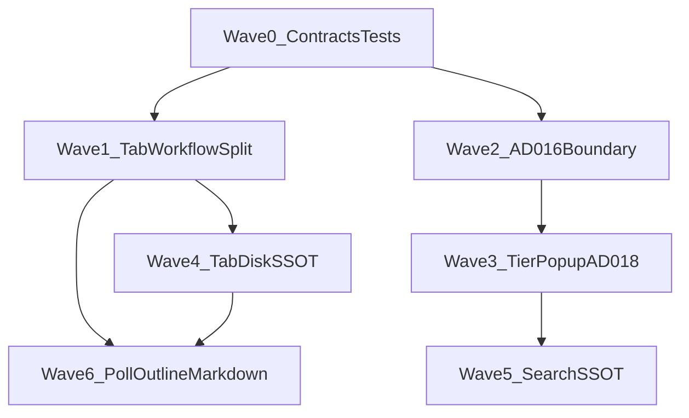

# Editors Wave 1 — Thermo-Nuclear Code Quality Review (2026-06-17)

> Strict maintainability and structural-simplification pass over `app/editors/` plus the shell editor seam on **`042be49e5777c587391ddbb396b7ea150e296dfe`**. Eleven slice critics plus one integration meta-reviewer (`TN-EDIT-INTEG`), using the thermo-nuclear rubric (code-judo, 1k-line rule, no rubber-stamping). **Document only** — no remediation commits in this round.
>
> **Per-critic raw findings:** [`_findings/`](_findings/) (12 files). **Prior handoff:** [`intelligence-wave-1`](../intelligence-wave-1/intelligence_wave_1_thermo_review_2026-06-16.md) TN-INT-SHELL-EDITORS; [`project-ssot-wave-1`](../project-ssot-wave-1/project_ssot_wave_1_thermo_review_2026-06-16.md) CC-PROJ-13.

---

## 0. How this review is organized

```mermaid
flowchart LR
    subgraph sliceCritics [Slice Critics x11]
        core[TN-EDIT-CORE]
        sem[TN-EDIT-SEM]
        comp[TN-EDIT-COMP]
        search[TN-EDIT-SEARCH]
        mgr[TN-EDIT-MGR]
        md[TN-EDIT-MD]
        syntax[TN-EDIT-SYNTAX]
        aux[TN-EDIT-AUX]
        tab[TN-EDIT-SHELL-TAB]
        factory[TN-EDIT-SHELL-FACTORY]
        intel[TN-EDIT-SHELL-INTEL]
    end
    sliceCritics --> integration[TN-EDIT-INTEG Meta]
    integration --> summary[This Rollup]
```

**Severity model (thermo-native):**

| Tier | Meaning |
|------|---------|
| **P0 BLOCKER** | AD-016/AD-018/§17.4 contract violation, 1k-line god module, data-integrity replace scope, poll/inventory divergence, tab/disk SSOT fracture |
| **P1 STRUCTURAL** | High-conviction code-judo: duplicate context builds, tier merge fragmentation, factory closure sprawl, mixin hub growth, search compiler forks |
| **P2 NICE-TO-HAVE** | Four-theme hex forks, dead-path deletion, test placement, positive controls to preserve |

**Approval bar (integration thermo):** Editors subsystem is **not thermo-clean**. Intelligence Wave 1 closed prefix-import and acceptance-path blockers, but Editors Wave 1 proves presentation boundaries remain porous: editor rebuilds broker context, popup destroys tier structure on reuse, shell completion still assembles the runtime tier beside session/broker, and `editor_tab_workflow.py` at **1,013 LOC** absorbed CC-06 debt from the slimmed navigation coordinator.

---

## 1. Executive summary

| Metric | Count |
|--------|------:|
| Slice critics | 11 |
| Raw finding entries (slice) | 117 |
| — BLOCKER severity | 3 |
| — STRUCTURAL severity | ~69 |
| — NICE-TO-HAVE severity | ~45 |
| **Deduped cross-cutting themes** | **23** |
| **P0 BLOCKER (deduped)** | **7** |
| **P1 STRUCTURAL (deduped)** | **14** |
| **P2 NICE-TO-HAVE (deduped)** | **2** |
| Slice thermo-clean tally | **0 / 11** |

**Top blockers (integration view):**

1. **`editor_tab_workflow.py` at 1,013 LOC** — presumptive 1k rule violation; CC-06 debt relocated from nav monolith without decomposition.
2. **Tier headers destroyed on prefix reuse** — §17.4.2 trust contract broken mid-keystroke (COMP-1 BLOCKER).
3. **Project replace-all rewrites entire file** — exceeds capped search results; data-integrity risk (SEARCH-3 BLOCKER).
4. **Runtime introspection third merge locus** — shell completion workflow owns fetch/attach/merge beside session (CC-10 partial).
5. **Duplicate `build_completion_context`** — editor trigger + shell workflow both build; editor owns broker policy (gate 8).
6. **Poll bypasses `ProjectInventoryOrchestrator`** — `cbcs/cache/` signature churn triggers rescans (CC-PROJ-13).
7. **Widget vs `EditorManager` text authority** — format-on-save and manual format disagree on buffer SSOT.

**Dominant risk:** not missing modules — **orchestration without SSOT**. Duplicate context builds, three prefix semantics, non-atomic tier merge across async callbacks, widget-vs-manager text authority, poll bypassing orchestrator, and factory closure sprawl (TN-INT-8 still open).

**What already works (replicate this pattern):**

- `editor_overlay_policy.py` pure helpers; `CodeEditorEditingMixin` intelligence-free.
- `completion_popup/` eight-module MVC split; `quick_open.py` / dialog boundary.
- `markdown_rendering.py` + injected editor; `EditorManager` dirty + `atomic_write`.
- `EditorWorkspaceController` monotonic revisions; `editor_stale_result_policy.py` gate helper.
- `semantic_navigation_workflow.py` 132 LOC coordinator split (CC-06 win).
- TN-INT acceptance path resolved: factory → workflow → session worker.
- `search_panel` R4 walk via `iter_text_file_paths`.

---

## 2. P0 BLOCKER — deduped themes

| ID | Theme | Primary critics |
|----|-------|-----------------|
| **CC-EDIT-01** | `editor_tab_workflow.py` 1,013 LOC — presumptive 1k blocker; CC-06 debt relocated | SHELL-TAB |
| **CC-EDIT-04** | Duplicate `build_completion_context` in editor + workflow | SEM, SHELL-INTEL |
| **CC-EDIT-05** | §17.4.2 tier failure: reuse strips headers; non-atomic shell merge | COMP, SHELL-INTEL |
| **CC-EDIT-09** | Runtime introspection third locus + controller bypass | SHELL-INTEL |
| **CC-EDIT-10** | Poll bypasses orchestrator; `cbcs/cache/` signature churn | SHELL-TAB |
| **CC-EDIT-12** | Widget vs `EditorManager` text authority; forked disk-apply | MGR, SHELL-FACTORY |
| **CC-EDIT-14** | Replace-all exceeds capped match set | SEARCH |

---

## 3. P1 STRUCTURAL — deduped themes (selected)

| ID | Theme | Primary critics |
|----|-------|-----------------|
| **CC-EDIT-02** | Hub `code_editor_widget.py` 754 LOC; paste/overlay stranded | CORE |
| **CC-EDIT-03** | Gate-8 intelligence imports: `latency_tracker`, `completion_context`, `completion_merge_policy` | CORE, SEM |
| **CC-EDIT-06** | Prefix semantics fork: broker vs reuse vs fuzzy vs console | COMP, SEM, SHELL-INTEL |
| **CC-EDIT-07** | Factory closure sprawl + materialization fusion (TN-INT-8 open) | SHELL-FACTORY, SEM |
| **CC-EDIT-08** | AD-018 gate fragmentation across completion/inline/menu/search | SHELL-INTEL, SEARCH |
| **CC-EDIT-11** | Outline dual pipeline: sync Go-to-Symbol miss | SHELL-TAB |
| **CC-EDIT-13** | Session restore uses draft-on open path | SHELL-FACTORY |
| **CC-EDIT-15** | Search options/compiler SSOT duplication | SEARCH |
| **CC-EDIT-16** | Second exclude glob plane vs inventory matchers | SEARCH |
| **CC-EDIT-17** | Markdown dual-registry + rename orphan | MD, SHELL-TAB |
| **CC-EDIT-19** | Syntax editors↔treesitter bidirectional coupling | SYNTAX |
| **CC-EDIT-20** | `text_editing.py` dual-domain 525 LOC | AUX, CORE |
| **CC-EDIT-21** | Mixin state fracture + `cast(Any)` shim; semantics owns editing keys | CORE, SEM |
| **CC-EDIT-23** | QuickOpenDialog dual-model Qt hack | AUX |

---

## 4. Fix-agent sequencing

**Parallelism:** Wave 0 immediate. Wave 1 before Wave 4/6 tab hooks. Wave 2 before Wave 3 tier merge. Wave 5 can parallelize with Wave 4 after Wave 0 tests. Wave 6a–6b wires poll to existing `ProjectInventoryOrchestrator` (do not rebuild inventory policy).

Full wave detail: [`editors_wave_1_remediation_plan.md`](editors_wave_1_remediation_plan.md). Executable PR catalog: [`editors_wave_1_implementation_plan.md`](editors_wave_1_implementation_plan.md).

---

## 5. Per-critic index

| Critic | Verdict | Integration note |
|--------|---------|-------------------|
| [TN-EDIT-CORE](_findings/TN-EDIT-CORE.md) | Not thermo-clean | Hub 754 LOC; intelligence metrics import |
| [TN-EDIT-SEM](_findings/TN-EDIT-SEM.md) | Not thermo-clean | Prior blockers 1/2/5 resolved; duplicate context open |
| [TN-EDIT-COMP](_findings/TN-EDIT-COMP.md) | Not thermo-clean | Supplies CC-EDIT-05 BLOCKER |
| [TN-EDIT-SEARCH](_findings/TN-EDIT-SEARCH.md) | Not thermo-clean | Supplies CC-EDIT-14 BLOCKER; R4 walk OK |
| [TN-EDIT-MGR](_findings/TN-EDIT-MGR.md) | Not thermo-clean | Core manager credible; shell bypass |
| [TN-EDIT-MD](_findings/TN-EDIT-MD.md) | Not thermo-clean | Editor modules OK; shell registry debt |
| [TN-EDIT-SYNTAX](_findings/TN-EDIT-SYNTAX.md) | Not thermo-clean | Import cycle + HC dual path |
| [TN-EDIT-AUX](_findings/TN-EDIT-AUX.md) | Not thermo-clean | Quick-open split good; text_editing monolith |
| [TN-EDIT-SHELL-TAB](_findings/TN-EDIT-SHELL-TAB.md) | Not thermo-clean | Supplies CC-EDIT-01 BLOCKER |
| [TN-EDIT-SHELL-FACTORY](_findings/TN-EDIT-SHELL-FACTORY.md) | Not thermo-clean | TN-INT-8 open; session/disk forks |
| [TN-EDIT-SHELL-INTEL](_findings/TN-EDIT-SHELL-INTEL.md) | Not thermo-clean | Runtime third locus; CC-06/CC-10 partial |
| [TN-EDIT-INTEG](_findings/TN-EDIT-INTEG.md) | Meta | Deduped CC-EDIT-01 … CC-EDIT-23 |

**Slice approval tally:** 0 of 11 thermo-clean.

---

## 6. Cross-reference to prior waves

| Prior theme | Editors Wave 1 status |
|-------------|----------------------|
| Intelligence **CC-02** flat tier merge | Partial — headers in merge data; popup reuse/presentation fails → CC-EDIT-05 |
| Intelligence **CC-06** nav monolith 1k+ | Partially fixed — nav 132 LOC; debt → `editor_tab_workflow` 1k → CC-EDIT-01 |
| Intelligence **CC-10** shell bypasses controller | Partial — completion workflow direct imports + runtime merge → CC-EDIT-09 |
| TN-INT-SHELL-EDITORS-1 prefix fork | Resolved import; duplicate build open → CC-EDIT-04 |
| TN-INT-SHELL-EDITORS-2 acceptance | Resolved |
| TN-INT-SHELL-EDITORS-7 prefix reuse | Open → CC-EDIT-06 |
| TN-INT-SHELL-EDITORS-8 factory closures | Open → CC-EDIT-07 |
| Project **CC-PROJ-13** poll tiers | Open — poll independent walk → CC-EDIT-10 |

---

## 7. Fix-agent quick start

1. Read [`TN-EDIT-INTEG`](_findings/TN-EDIT-INTEG.md) first for deduped CC themes and ordered waves.
2. Start with **Wave 0** contracts/tests, then **Wave 1** tab workflow 1k split.
3. Do not add completion popup features until **CC-EDIT-05** tier reuse is fixed.
4. Do not add search replace UX until **CC-EDIT-14** scoped replace lands.
5. Wire poll to `ProjectInventoryOrchestrator` — do not invent a third inventory walk.
6. Run targeted editor/shell tests plus `python3 testing/run_test_shard.py fast` and `npx pyright` before closing any remediation PR.
7. Four-theme manual acceptance for every UI-touching PR.

**Manifest and metric baseline:** [`00-manifest.md`](00-manifest.md)

**Remediation plan:** [`editors_wave_1_remediation_plan.md`](editors_wave_1_remediation_plan.md)

**Implementation plan:** [`editors_wave_1_implementation_plan.md`](editors_wave_1_implementation_plan.md)
