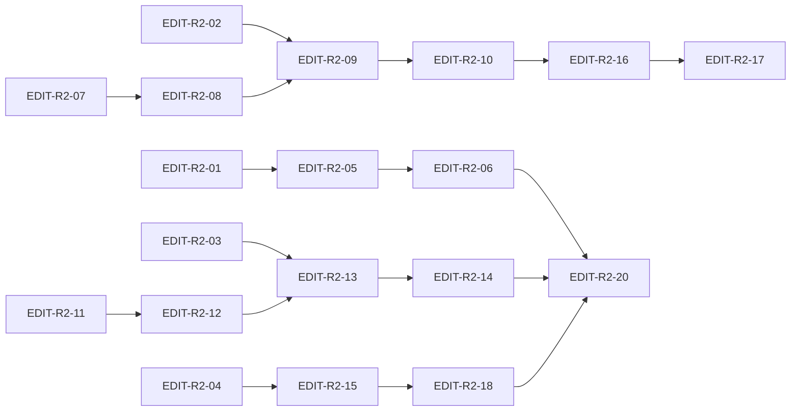

# Editors Wave 2 — End-to-End Implementation Plan

Status: **implementation-ready** (Phase 2b execution)  
Wave 1 closure: [`editors_wave_1_remediation_closure_2026-06-17.md`](editors_wave_1_remediation_closure_2026-06-17.md)  
Strategy doc: [`editors_wave_2_remediation_plan.md`](editors_wave_2_remediation_plan.md)  
Source review: [`editors_wave_1_thermo_review_2026-06-17.md`](editors_wave_1_thermo_review_2026-06-17.md)

Executable companion: every residual CC-EDIT theme maps to concrete PRs, files, verification gates, and dependencies.

---

## 1. Program scope and completion definition

### In scope

Close all Wave 1 **residual** themes:

| CC | Priority | Wave 1 | Wave 2 |
|----|----------|--------|--------|
| CC-EDIT-06 | P1 | open (low) | **mandatory** |
| CC-EDIT-17 | P1 | open (low) | **mandatory** |
| CC-EDIT-19 | P1 | open (low) | **mandatory** |
| CC-EDIT-21 | P1 | open (low) | **mandatory** |
| CC-EDIT-18 | P2 | partial | **mandatory** |
| CC-EDIT-22 | P2 | partial | **mandatory** |

### Program complete when (all must pass)

| # | Criterion | Verification |
|---|-----------|--------------|
| 1 | CC-EDIT-06 closed | Console tier reuse test green |
| 2 | CC-EDIT-17 closed | `rg '_markdown_panes_by_path' app/shell/` scoped to registry |
| 3 | CC-EDIT-19 closed | Import cycle broken + ARCHITECTURE §12.4 doc |
| 4 | CC-EDIT-21 closed | `rg 'hover_provider' app/` empty |
| 5 | CC-EDIT-18 closed | No hardcoded popup/overlay hex fallbacks |
| 6 | CC-EDIT-22 closed | Dead-path audit checklist green |
| 7 | `python3 testing/run_test_shard.py fast` green | §7 |
| 8 | `npx pyright` → 0 errors | §7 |
| 9 | Four-theme manual acceptance per UI PR | §8 |
| 10 | TN-EDIT-INTEG full CC matrix closed | V3 auditor |

---

## 2. Non-negotiable rules (every PR)

1. Hard cutover — delete old paths in same PR.
2. Python 3.9; no dot-prefixed storage paths.
3. Console mirrors editor `reuse_items_for_prefix` contract.
4. Markdown rename unwrap is atomic (pane destroyed, bare editor remains).
5. Hover async-only via `_hover_requester`.
6. Syntax HC via `ShellThemeTokens` only.
7. Four-theme validation for UI-touching PRs.
8. Tests only when risk-first gate applies.

---

## 3. CC theme closure matrix

| CC | Priority | Primary PRs | Wave | Key files | Depends on |
|----|----------|-------------|------|-----------|------------|
| CC-EDIT-06 | P1 | EDIT-R2-04, R2-05, R2-06 | 1 | `python_console_widget.py`, `python_console_workflow.py` | EDIT-R2-01 |
| CC-EDIT-17 | P1 | EDIT-R2-07, R2-08, R2-09, R2-10 | 2 | `editor_tab_content_registry.py`, `markdown_*` | EDIT-R2-02 |
| CC-EDIT-19 | P1 | EDIT-R2-11, R2-12, R2-13 | 3 | `app/syntax/`, `syntax_registry.py`, `ARCHITECTURE.md` | EDIT-R2-03 |
| CC-EDIT-21 | P1 | EDIT-R2-14 | 4 | `code_editor_diagnostics.py`, semantics tests | EDIT-R2-04 |
| CC-EDIT-18 | P2 | EDIT-R2-15, R2-16, R2-17 | 4 | overlay mixin, popup chrome, markdown pane | EDIT-R2-10 |
| CC-EDIT-22 | P2 | EDIT-R2-05, R2-14, R2-18 | 1,4 | console fork, hover delete, grep sweep | Wave 1 R-27 |

---

## 4. PR catalog (EDIT-R2-01 … EDIT-R2-20)

### Wave 0 — Contracts + test scaffolding

| PR | Title | Files | CC | Verification |
|----|-------|-------|-----|--------------|
| **EDIT-R2-01** | Console prefix reuse + tier test scaffold | `test_python_console_widget.py`, `test_completion_tier_rows.py` | CC-EDIT-06 | test file exists |
| **EDIT-R2-02** | Markdown rename unwrap failing test | `test_markdown_tab_registry.py` (new) | CC-EDIT-17 | failing test documents MD-2 |
| **EDIT-R2-03** | Syntax palette round-trip test scaffold | `test_syntax_palette_roundtrip.py` (new) | CC-EDIT-19 | parametrized keys |
| **EDIT-R2-04** | Hover async-only contract + test plan | `test_semantic_editor_interactions.py`, diagnostics docstring | CC-EDIT-21 | plan only |

### Wave 1 — Console completion parity

| PR | Title | Files | CC | Verification |
|----|-------|-------|-----|--------------|
| **EDIT-R2-05** | Console `_active_completion_prefix` + reuse | `python_console_widget.py` | CC-EDIT-06, CC-EDIT-22 | EDIT-R2-01 test green |
| **EDIT-R2-06** | Shared prefix resolver for console workflow | `python_console_workflow.py`, new `completion_prefix.py` or extend `completion_context.py` | CC-EDIT-06 | prefix parity unit test |

### Wave 2 — Markdown tab registry SSOT

| PR | Title | Files | CC | Verification |
|----|-------|-------|-----|--------------|
| **EDIT-R2-07** | `EditorTabContentRegistry` composition module | `editor_tab_content_registry.py`, `main_window_composition.py` | CC-EDIT-17 | registry API |
| **EDIT-R2-08** | Hard cutover shell reads → registry | `main_window_editor_tab_host.py`, `shell_composition.py`, `project_tree_ui_workflow.py`, `semantic_navigation_host.py`, `lint_workflow.py`, etc. | CC-EDIT-17 | grep gate |
| **EDIT-R2-09** | Rename md→non-md unwrap + tab reparent | `editor_tab_content_registry.py`, `project_tree_ui_workflow.py`, `editor_tab_factory.py` | CC-EDIT-17 | EDIT-R2-02 green |
| **EDIT-R2-10** | Mode checked sync + markdown chrome tokens | `editor_tab_markdown_workflow.py`, `markdown_editor_pane.py`, `markdown_preview_widget.py` | CC-EDIT-17, CC-EDIT-18 | four-theme manual |

### Wave 3 — Syntax ownership

| PR | Title | Files | CC | Verification |
|----|-------|-------|-----|--------------|
| **EDIT-R2-11** | Extract `app/syntax/` neutral package | `app/syntax/palette.py`, `app/syntax/contracts.py`, move from `syntax_engine.py` | CC-EDIT-19 | import cycle test |
| **EDIT-R2-12** | Break treesitter→editors import | `app/treesitter/highlighting_policy.py`, `highlighter_core.py` | CC-EDIT-19 | `rg from app.editors app/treesitter/highlighter_core` empty |
| **EDIT-R2-13** | Collapse token map + delete HC flag | `app/syntax/palette.py`, `theme_tokens.py`, `syntax_registry.py` | CC-EDIT-19 | EDIT-R2-03 round-trip green |
| **EDIT-R2-14** | ARCHITECTURE §12.4 syntax ownership doc | `docs/ARCHITECTURE.md` | CC-EDIT-19 | doc review |

### Wave 4 — Hygiene + four-theme closure

| PR | Title | Files | CC | Verification |
|----|-------|-------|-----|--------------|
| **EDIT-R2-15** | Delete sync hover provider | `code_editor_diagnostics.py`, `code_editor_semantics.py`, `code_editor_widget.py` | CC-EDIT-21, CC-EDIT-22 | `rg hover_provider app/` empty |
| **EDIT-R2-16** | Overlay + breakpoint token init | `code_editor_extra_selections_overlay_mixin.py`, `code_editor_chrome_mixin.py`, `code_editor_widget.py` | CC-EDIT-18 | no overlay hex literals |
| **EDIT-R2-17** | Popup/quick-open fallback cleanup | `completion_list_view.py`, `completion_popup_container.py`, `completion_docs_panel.py`, `quick_open_dialog.py` | CC-EDIT-18 | grep gate |
| **EDIT-R2-18** | Dead-path grep sweep + deletions | TBD from audit | CC-EDIT-22 | INTEG checklist |
| **EDIT-R2-19** | INI line parser dedup (optional) | `ini_highlighter.py` | TN-EDIT-SYNTAX-4 | INI tests green |
| **EDIT-R2-20** | Wave 2 closure report | `editors_wave_2_remediation_closure_*.md` | all | ACCEPT verdict |

---

## 5. File-lock manifest (coordinator)

Prevent parallel subagent collisions:

| File / directory | Locked through PR |
|------------------|-------------------|
| `app/shell/python_console_widget.py` | EDIT-R2-05 |
| `app/shell/python_console_workflow.py` | EDIT-R2-06 |
| `app/shell/editor_tab_content_registry.py` | EDIT-R2-07 … R2-09 |
| `app/shell/main_window_composition.py` | EDIT-R2-07, R2-08 |
| `app/editors/markdown_*.py` | EDIT-R2-09, R2-10 |
| `app/syntax/**` | EDIT-R2-11 … R2-13 |
| `app/treesitter/highlighter_core.py` | EDIT-R2-12 |
| `app/editors/code_editor_diagnostics.py` | EDIT-R2-15 |
| `app/editors/completion_popup/**` | EDIT-R2-17 |
| `docs/ARCHITECTURE.md` §12.4 | EDIT-R2-14 |

**Parallel lanes after Wave 0:**

- Lane A: R2-05 → R2-06 (console)
- Lane B: R2-07 → R2-08 → R2-09 → R2-10 (markdown)
- Lane C: R2-11 → R2-12 → R2-13 → R2-14 (syntax)
- Lane D: R2-15 → R2-16 → R2-17 → R2-18 (hygiene/theme)

Lanes A–D merge independently; coordinator runs fast shard + pyright after each merge.

---

## 6. Dependency graph



**Critical path:** R2-01 → R2-05 (console) parallel with R2-07 → R2-09 (markdown) and R2-11 → R2-13 (syntax). Theme/hygiene (R2-15–18) follows markdown chrome (R2-10).

---

## 7. Verification commands

```bash
# Default agent loop
python3 testing/run_test_shard.py fast

# Targeted Wave 2 suites
python3 run_tests.py tests/unit/shell/test_python_console_widget.py
python3 run_tests.py tests/unit/shell/test_markdown_tab_registry.py
python3 run_tests.py tests/unit/editors/test_syntax_palette_roundtrip.py
python3 run_tests.py tests/unit/editors/completion_popup/test_completion_tier_rows.py
python3 run_tests.py tests/integration/shell/test_markdown_viewer_integration.py

# Typecheck
npx pyright

# Wave 2 residual grep gates
rg '_markdown_panes_by_path' app/shell/
rg 'hover_provider' app/
rg 'high_contrast=' app/editors/ app/syntax/
rg 'from app\.editors' app/treesitter/highlighter_core.py
rg 'or "#' app/editors/completion_popup/
```

---

## 8. Four-theme manual acceptance

Record in PR summary for UI-touching PRs:

- [ ] Light — console popup tiers; markdown toolbar; overlay/search colors
- [ ] Dark — same surfaces
- [ ] HC Light — popup borders, markdown toolbar, diag colors on `#FFFFFF`
- [ ] HC Dark — same on `#000000`

**Required PRs:** EDIT-R2-06, R2-10, R2-16, R2-17.

---

## 9. Verification agents (V0–V5)

| Phase | Agent | Pass criteria |
|-------|-------|---------------|
| V0 | Coordinator grep + pyright | All §7 gates |
| V1-V-Console | Console parity verifier | CC-EDIT-06 closed |
| V1-V-Markdown | Registry + rename verifier | CC-EDIT-17 closed |
| V1-V-Syntax | Import + palette verifier | CC-EDIT-19 closed |
| V1-V-Theme | Token grep verifier | CC-EDIT-18 closed |
| V2 | TN-EDIT-MD + TN-EDIT-SYNTAX re-critics | No new STRUCTURAL findings |
| V3 | TN-EDIT-INTEG closure | CC-EDIT-01…23 all closed |
| V4 | Fix-loop | Max 3 iter per residual theme |
| V5 | Closure doc | `editors_wave_2_remediation_closure_*.md` |

---

## 10. Coordinator checkpoint schedule

After each wave merge:

1. Run §7 fast shard + pyright.
2. Run cumulative residual greps (§7 bottom).
3. Update CC closure matrix in coordinator notes.
4. Stop-the-line on failure; fix-loop before next wave.

---

## 11. Estimated effort

| Wave | PRs | Relative size |
|------|-----|---------------|
| 0 | 4 | Small (tests/docs only) |
| 1 | 2 | Medium |
| 2 | 4 | Large (wide shell cutover) |
| 3 | 4 | Large (package extraction) |
| 4 | 5 | Medium |
| Closure | 1 | Small |

**Total: 20 PRs** (19 code + 1 closure doc). Optional EDIT-R2-19 adds 1 if INI dedup included.

---

## 12. Raw finding coverage

Wave 2 closes residual raw findings from:

- TN-EDIT-MD-2 … MD-6 (via CC-EDIT-17)
- TN-EDIT-SYNTAX-1 … SYNTAX-3 (via CC-EDIT-19)
- TN-INT-SHELL-EDITORS-7 console prefix (via CC-EDIT-06)
- TN-EDIT-CORE/COMP theme hex gaps (via CC-EDIT-18)
- TN-EDIT-INTEG CC-EDIT-22 dead-path backlog

No new CC IDs introduced. Wave 1 closed findings remain closed.
