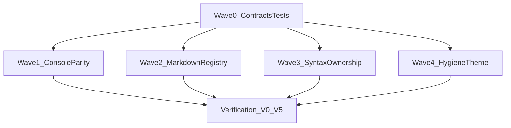

# Editors Wave 2 — Residual Remediation Plan (Phase 2b)

Status: **ready for implementation approval**  
Implementation plan: [`editors_wave_2_implementation_plan.md`](editors_wave_2_implementation_plan.md)  
Wave 1 closure: [`editors_wave_1_remediation_closure_2026-06-17.md`](editors_wave_1_remediation_closure_2026-06-17.md)  
Source review: [`editors_wave_1_thermo_review_2026-06-17.md`](editors_wave_1_thermo_review_2026-06-17.md)  
Integration themes: [`_findings/TN-EDIT-INTEG.md`](_findings/TN-EDIT-INTEG.md)

**Do not start implementation until this plan is approved.** Wave 1 closed all P0 blockers and 10/14 P1 themes. Wave 2 closes the documented residuals and declares Editors thermo-clean.

---

## Goals

1. Close remaining **P1** themes: CC-EDIT-06, CC-EDIT-17, CC-EDIT-19, CC-EDIT-21.
2. Close remaining **P2** themes: CC-EDIT-18, CC-EDIT-22 (full dead-path sweep).
3. Land TN-EDIT-MD and TN-EDIT-SYNTAX slice residuals that Wave 1 deferred.
4. Record four-theme manual acceptance for all UI-touching PRs (or document gap).
5. Produce Wave 2 closure report with **ACCEPT (full Editors thermo-clean)** verdict.

---

## Scope boundary

### In scope (Wave 2)

| Theme | Priority | Wave 1 status | Wave 2 target |
|-------|----------|---------------|---------------|
| CC-EDIT-06 | P1 | open (low) | Console prefix reuse + tier parity |
| CC-EDIT-17 | P1 | open (low) | Composition-level tab registry SSOT |
| CC-EDIT-19 | P1 | open (low) | Syntax ownership doc + import cycle break |
| CC-EDIT-21 | P1 | open (low) | Delete sync hover provider fallback |
| CC-EDIT-18 | P2 | partial | Full four-theme token pass |
| CC-EDIT-22 | P2 | partial | Console fork + dead helpers + teardown audit |

### Explicitly out of scope

- `app/shell/icon_provider.py` (>1k LOC) — **Project SSOT** program, not Editors Wave 2.
- Integration shard MainWindow theme-apply timeout — flaky CI hygiene; track separately unless reproducible locally.
- New editor features, intelligence policy changes, or inventory rebuilds.
- R6 full test audit — risk-first tests only per `.cursor/rules/testing_when_to_write.mdc`.

---

## Non-negotiable rules (every PR)

- Hard cutover — delete obsolete paths in the same PR that introduces the replacement.
- Python 3.9 syntax; no dot-prefixed runtime paths.
- Console completion must use the same `CompletionController.reuse_items_for_prefix` contract as the editor.
- Markdown rename `.md` → non-markdown must leave a single `CodeEditorWidget` tab (no orphaned pane).
- Hover tooltips use async `_hover_requester` + AD-018 gates only; no sync `_hover_provider`.
- Syntax HC colors resolve through `ShellThemeTokens` only — delete dead `build_syntax_palette(high_contrast=)` branches.
- UI-touching PRs record four-theme validation (Light, Dark, HC Light, HC Dark) or document gap.
- Tests only when risk-first gate applies.

---

## Residual inventory (from Wave 1 closure §6)

### CC-EDIT-06 — Console prefix reuse parity

**Evidence today:**

- Editor: `code_editor_semantics.py` calls `reuse_items_for_prefix` before async re-request on typing.
- Console: `python_console_widget.py` always fires a new async request; no prefix reuse, no `_active_completion_prefix`.
- Console workflow: `python_console_workflow.py` builds context via `build_completion_context` independently of editor shell path.

**Risk:** Mid-keystroke tier headers and ordering diverge between editor and console; fourth prefix semantics fork (TN-INT-7 residual).

### CC-EDIT-17 — Markdown dual-registry at composition layer

**Evidence today:**

- `main_window_composition.py` wires both `_editor_widgets_by_path` (from workspace controller) and `_markdown_panes_by_path` (standalone dict).
- `MarkdownTabRegistry` exists but callers still reach through `window._markdown_panes_by_path` in 10+ shell modules.
- `rekey_for_widget` drops registry entry on `.md` → non-`.md` rename without tab unwrap (TN-EDIT-MD-2).
- Pane toolbar/status chrome and preview CSS partially bypass tokens (TN-EDIT-MD-4, MD-5, MD-6).

### CC-EDIT-19 — Syntax editors↔treesitter coupling

**Evidence today:**

- `syntax_registry.py` imports `app.treesitter.*`; `highlighter_core.py` imports `app.editors.editor_overlay_policy` and `app.editors.syntax_engine`.
- `test_syntax_import_boundary.py` guards one edge; full ownership not documented in ARCHITECTURE §12.4.
- Triplicate token mapping across `syntax_engine.py`, `theme_tokens._SYNTAX_OVERRIDE_FIELD_MAP`, `syntax_palette_from_tokens`.
- Dead `high_contrast` parameter on `build_syntax_palette` (TN-EDIT-SYNTAX-2).

### CC-EDIT-21 — Sync hover provider fallback

**Evidence today:**

- `code_editor_diagnostics.py:130-134` falls back to sync `_hover_provider` when `_hover_requester` is None.
- `editor_tab_bindings_workflow.py` wires `_hover_requester` for all production tabs; sync path is dead legacy.
- `set_hover_provider` API and unit tests remain.

### CC-EDIT-18 — Four-theme hex gaps (partial)

**Evidence today:**

- Init colors in `code_editor_extra_selections_overlay_mixin.py:58-60` (`#EEF7FF`, `#FFE066`, `#FF922B`) before first `apply_theme`.
- Popup fallbacks in `completion_list_view.py`, `completion_popup_container.py`, `completion_docs_panel.py`.
- Breakpoint color fork in `code_editor_chrome_mixin.py:77` (`is_dark` ternary).
- `code_editor_widget.py` diag colors initialized empty `QColor()` until theme apply.

### CC-EDIT-22 — Dead paths (partial)

**Evidence today:**

- `SearchResultsCoordinator` deleted in Wave 1.
- Remaining: console completion fork, sync hover provider, tab teardown asymmetry (preview close vs user close), any unwired helpers surfaced by grep audit.

---

## Wave 0 — Contracts + test scaffolding

**Blocks:** CC-EDIT-06, CC-EDIT-17, CC-EDIT-19, CC-EDIT-21

**Goal:** Named contracts and failing/skeleton tests before behavior moves.

### Step 0.1 — Console prefix reuse contract

**Files:** `tests/unit/shell/test_python_console_widget.py`, `tests/unit/editors/completion_popup/test_completion_tier_rows.py`

**Work:**

1. Document console must mirror editor: track `_active_completion_prefix`, call `reuse_items_for_prefix` before async re-request.
2. Parametrize test: tier headers survive console prefix lengthen (reuse path).

**Gate:** Test scaffold exists; may fail until Wave 1a.

### Step 0.2 — Markdown rename unwrap fixture

**Files:** `tests/unit/shell/test_markdown_tab_registry.py` (new)

**Work:**

1. Fixture: pane registered for `README.md`; rename to `README.txt` → registry empty, pane destroyed, bare editor remains.
2. Document TN-EDIT-MD-2 acceptance criterion.

**Gate:** Failing test documents blocker until Wave 2b.

### Step 0.3 — Syntax palette round-trip contract

**Files:** `tests/unit/editors/test_syntax_palette_roundtrip.py` (new)

**Work:**

1. Parametrize: every key in `DEFAULT_LIGHT_PALETTE` round-trips `tokens → syntax_palette_from_tokens → highlighter`.
2. Document single HC resolution path (no `build_syntax_palette(high_contrast=True)` in production).

**Gate:** Test scaffold; behavior fix in Wave 3.

### Step 0.4 — Hover async-only contract

**Files:** `app/editors/code_editor_diagnostics.py`, `tests/unit/editors/test_semantic_editor_interactions.py`

**Work:**

1. Document deletion plan for `set_hover_provider` / `_hover_provider`.
2. Update hover tests to assert `_hover_requester`-only path.

**Gate:** Doc + test plan; deletion in Wave 4a.

---

## Wave 1 — Console completion parity (CC-EDIT-06, CC-EDIT-22 partial)

**Blocks:** CC-EDIT-06, CC-EDIT-22 (console fork)

**Goal:** Editor and console share prefix reuse semantics and tier presentation.

### Step 1.1 — Console prefix reuse on typing

**Files:** `app/shell/python_console_widget.py`

**Work:**

1. Add `_active_completion_prefix` tracking (mirror `code_editor_semantics.py`).
2. On printable keypress while popup visible, call `reuse_items_for_prefix` before async re-request.
3. Update `_show_completion_items` to set active prefix.

**Gate:** Wave 0 console tier reuse test green.

### Step 1.2 — Console completion context SSOT

**Files:** `app/shell/python_console_workflow.py`, `app/intelligence/completion_context.py`

**Work:**

1. Extract shared `resolve_completion_prefix(source, cursor, …)` helper used by editor workflow and console workflow.
2. Hard cutover: console workflow stops duplicating prefix extraction logic inline.
3. Ensure tier merge envelope from REPL uses same `CompletionItem` row kinds as editor.

**Gate:** `rg build_completion_context app/shell/python_console_workflow.py` uses helper only at apply boundary; prefix parity unit test green.

### Step 1.3 — Console tier header smoke

**Files:** `app/shell/python_console_widget.py`, `tests/unit/shell/test_python_console_widget.py`

**Work:**

1. Verify `CompletionController` tier header navigation skips non-selectable rows in console.
2. Four-theme smoke on console popup (inherits delegate tokens).

**Gate:** Console completion tier test green; manual four-theme note in PR.

---

## Wave 2 — Markdown tab registry SSOT (CC-EDIT-17)

**Blocks:** CC-EDIT-17, TN-EDIT-MD-2 … MD-6

**Goal:** Single composition-level registry; rename-safe unwrap; token-complete pane chrome.

### Step 2.1 — `EditorTabContentRegistry` at composition layer

**Files:** New `app/shell/editor_tab_content_registry.py`, `main_window_composition.py`, `main_window_editor_tab_host.py`

**Work:**

1. Introduce registry owning `{path → TabContent}` where `TabContent` is either bare `CodeEditorWidget` or `MarkdownEditorPane` wrapper.
2. Expose `editor_widget_for_path`, `markdown_pane_for_path`, `register_code`, `register_markdown`, `release_widget`, `rekey`.
3. Hard cutover: delete direct `window._markdown_panes_by_path` reads from shell modules; route through registry/host protocol.

**Gate:** `rg '_markdown_panes_by_path' app/shell/` → only registry module + composition init.

### Step 2.2 — Rename unwrap (md → non-md)

**Files:** `editor_tab_content_registry.py`, `project_tree_ui_workflow.py`, `editor_tab_factory.py`

**Work:**

1. On `rekey` when `not is_markdown_path(new_path)`: unwrap pane, reparent `source_editor()` into tab slot, `deleteLater()` pane.
2. Wire from `update_widget_language_for_path` and save-as/rename paths.

**Gate:** Wave 0 rename test green; integration `test_markdown_viewer_integration.py` still green.

### Step 2.3 — Mode command SSOT + checked sync

**Files:** `editor_tab_markdown_workflow.py`, `markdown_editor_pane.py`, `editor_tab_factory.py`

**Work:**

1. Confirm `mode_changed` wired at factory; extend `refresh_markdown_action_states` to `setChecked` on View menu actions.
2. Collapse context menu branches to workflow helpers only (no inline `set_mode` duplicates).

**Gate:** Unit test: toolbar mode toggle updates menu checked state.

### Step 2.4 — Pane chrome + preview token pass

**Files:** `markdown_editor_pane.py`, `markdown_preview_widget.py`, `shell_composition.py`

**Work:**

1. Extend `apply_theme` to toolbar, mode buttons, status label from `ShellThemeTokens`.
2. Map preview CSS from `syntax_markdown_*` token fields (TN-EDIT-MD-5).
3. Call `schedule_preview_render()` after theme apply (TN-EDIT-MD-6).

**Gate:** Four-theme manual acceptance for markdown pane chrome + preview.

---

## Wave 3 — Syntax ownership (CC-EDIT-19)

**Blocks:** CC-EDIT-19, TN-EDIT-SYNTAX-1 … SYNTAX-3

**Goal:** Neutral syntax contracts; one palette SSOT; documented ownership.

### Step 3.1 — Neutral `app/syntax/` package (hard cutover)

**Files:** New `app/syntax/palette.py`, `app/syntax/contracts.py`; move from `syntax_engine.py`

**Work:**

1. Move `SyntaxPalette`, `ThemedSyntaxHighlighter`, default palettes, and round-trip helpers to `app/syntax/`.
2. Relocate `effective_highlighting_mode` next to tree-sitter (`app/treesitter/highlighting_policy.py`) so `highlighter_core.py` stops importing `app.editors`.
3. Update `syntax_registry.py`, `ini_highlighter.py`, `highlighter_core.py` imports.

**Gate:**

```text
rg 'from app\.editors' app/treesitter/highlighter_core.py  → empty
rg 'from app\.syntax' app/editors/syntax_registry.py app/treesitter/highlighter_core.py  → hits
```

### Step 3.2 — Collapse token mapping triplication

**Files:** `app/syntax/palette.py`, `app/shell/theme_tokens.py`, `app/editors/syntax_registry.py`

**Work:**

1. Single declarative `TOKEN_FIELD_MAP` in `app/syntax/palette.py`.
2. Delete `_SYNTAX_OVERRIDE_FIELD_MAP` duplicate and inline `syntax_palette_from_tokens` field list.
3. `settings_dialog_handlers.py` imports defaults from `app/syntax/palette.py` only.

**Gate:** Wave 0 round-trip test green.

### Step 3.3 — Delete dead HC flag + document §12.4

**Files:** `app/syntax/palette.py`, `docs/ARCHITECTURE.md` §12.4

**Work:**

1. Remove `high_contrast` parameter and `DEFAULT_HC_*` branches from `build_syntax_palette`.
2. Document ownership diagram: shell resolves tokens → `syntax_palette_from_tokens` → registry → highlighter.
3. Note INI fallback and tree-sitter package boundaries.

**Gate:** `rg 'high_contrast=' app/editors/ app/syntax/` → empty (except theme mode constants); ARCHITECTURE §12.4 updated.

### Step 3.4 — INI line parser dedup (optional P2)

**Files:** `app/editors/ini_highlighter.py`

**Work:**

1. Extract `parse_ini_line(text) -> IniLineSpans`.
2. `highlightBlock` and `_token_name_for_column` share parser.

**Gate:** Existing INI tests green; ~40 LOC reduction. *Skip if schedule-constrained.*

---

## Wave 4 — Hygiene + four-theme closure (CC-EDIT-18, CC-EDIT-21, CC-EDIT-22)

**Blocks:** CC-EDIT-18, CC-EDIT-21, CC-EDIT-22

**Goal:** Delete dead paths; token-complete editor chrome; thermo-clean declaration.

### Step 4.1 — Delete sync hover provider

**Files:** `code_editor_diagnostics.py`, `code_editor_semantics.py`, `code_editor_widget.py`, tests

**Work:**

1. Remove `_hover_provider`, `set_hover_provider`, and sync fallback branch in `event()`.
2. Hard cutover: update `test_semantic_editor_interactions.py` to use `_hover_requester` mocks only.

**Gate:** `rg 'hover_provider' app/` → empty; hover tests green.

### Step 4.2 — Overlay + diag init token defaults

**Files:** `code_editor_extra_selections_overlay_mixin.py`, `code_editor_widget.py`, `code_editor_chrome_mixin.py`

**Work:**

1. Initialize overlay colors from neutral light defaults matching `ShellThemeTokens` light preset (not hardcoded one-off hex).
2. Breakpoint color from `tokens.debug_*` or semantic token — delete `is_dark` ternary.
3. Ensure first paint before `apply_theme` is readable in all four themes.

**Gate:** No `#FFE066` / `#FF922B` / `#EEF7FF` literals in overlay mixin after theme hook.

### Step 4.3 — Popup + quick-open fallback cleanup

**Files:** `completion_list_view.py`, `completion_popup_container.py`, `completion_docs_panel.py`, `quick_open_dialog.py`

**Work:**

1. Replace `or "#FFFFFF"` / `or "#000000"` fallbacks with required token fields or `ShellThemeTokens` preset lookup.
2. Fix `completion_docs_panel.py` `text_color = "#FFFFFF"` regardless of theme.

**Gate:** `rg 'or "#' app/editors/completion_popup/` → empty.

### Step 4.4 — Dead-path grep sweep

**Files:** TBD from audit

**Work:**

1. Run dead-code grep manifest: unwired helpers, duplicate teardown paths, console/editor completion duplication.
2. Delete surfaced dead paths; document any intentional retention.

**Gate:** TN-EDIT-INTEG CC-EDIT-22 checklist items all closed or waived with rationale.

---

## Verification loop (post-waves)

| Phase | Agent | Scope |
|-------|-------|-------|
| V0 | Coordinator | Residual grep gates + `npx pyright` |
| V1 | Domain verifiers | V-Console, V-Markdown, V-Syntax, V-Theme |
| V2 | Thermo re-critics | TN-EDIT-MD, TN-EDIT-SYNTAX, TN-EDIT-COMP (console), TN-EDIT-CORE (theme) |
| V3 | TN-EDIT-INTEG closure | Full CC-EDIT-01…23 matrix |
| V4 | Fix-loop | Max 3 iterations per theme |
| V5 | Closure doc | `editors_wave_2_remediation_closure_YYYY-MM-DD.md` |

### V0 grep gates

```bash
rg '_markdown_panes_by_path' app/shell/          # → registry + composition only
rg 'hover_provider' app/                         # → empty
rg 'high_contrast=' app/editors/ app/syntax/     # → empty (prod)
rg 'from app\.editors' app/treesitter/highlighter_core.py  # → empty
rg 'or "#' app/editors/completion_popup/        # → empty
python3 testing/run_test_shard.py fast
npx pyright
```

### Four-theme manual acceptance (required PRs)

- EDIT-R2-13 (console popup)
- EDIT-R2-17 (markdown pane chrome)
- EDIT-R2-21 … R2-23 (overlay/popup/dead-path)

---

## Program complete when

1. CC-EDIT-06, CC-EDIT-17, CC-EDIT-19, CC-EDIT-21 **closed**.
2. CC-EDIT-18, CC-EDIT-22 **closed** (not partial).
3. All V0 grep gates pass.
4. `python3 testing/run_test_shard.py fast` + `npx pyright` green.
5. Four-theme manual acceptance recorded for UI PRs (or documented gap).
6. Wave 2 closure report verdict: **ACCEPT (Editors thermo-clean)**.

---

## Subagent execution model

Mirror Wave 1 coordinator pattern:

- **Coordinator** owns file-lock manifest, wave merge checkpoints, V0 gates after each wave.
- **Parallel lanes** within waves where file locks do not overlap (e.g., Wave 3 syntax + Wave 4a hover deletion in parallel after Wave 0).
- **Serial dependencies:** Wave 0 → all behavior waves; Wave 2.1 registry before 2.2 rename; Wave 3.1 neutral package before 3.2 mapping collapse.
- **Stop-the-line:** any V0 gate failure blocks next wave.



**Parallelism:** Waves 1, 2, 3, 4 can run concurrently after Wave 0 lands (separate file domains). Coordinator merges serially with fast shard between merges.
