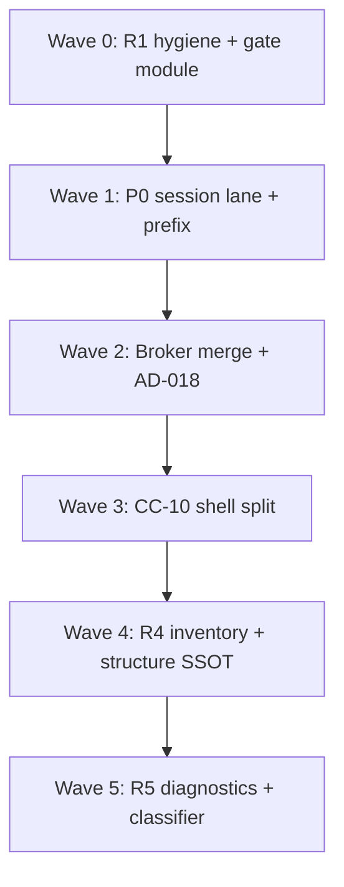

# TN-INT-INTEG — Thermo-Nuclear Integration Meta Review

**Critic ID:** TN-INT-INTEG  
**Date:** 2026-06-16  
**Baseline commit:** `ce176983f3d3434b390718692047583c9b38c4ed`  
**Scope:** Vertical integration rollup after 10 slice critics (`TN-INT-01` … `TN-INT-07`, `TN-INT-SHELL-NAV`, `TN-INT-SHELL-SEAM`, `TN-INT-SHELL-EDITORS`). **Document only** — no code changes.

**Inputs:** All finding files under [`_findings/`](./), [`00-manifest.md`](../00-manifest.md), [`docs/deslop/AUDIT_app_remaining_handoff.md`](../../../deslop/AUDIT_app_remaining_handoff.md) (R2–R5 briefs), prior [`shell-wave-1`](../shell-wave-1/shell_wave_1_thermo_review_2026-05-25.md) CC-15 cross-read, [`run-wave-1`](../run-wave-1/run_wave_1_thermo_review_2026-05-25.md) seam patterns.

---

## Executive verdict

**Not thermo-clean.** Phase 2+3 extractions (`import_diagnostics.py`, `file_inventory.iter_python_files`, `MainWindow` under 1k) moved debt rather than deleting it: **shell-wave-1 CC-15 intelligence-on-MainWindow relocated to `semantic_navigation_workflow.py` (1,103 LOC — the new sole `app/` file above 1k)**. AD-016 session ownership is structurally right (`SemanticSession` + `SemanticWorker` + facade), but **~121 raw slice findings** collapse to **18 cross-cutting themes** (CC-01 … CC-18). The dominant pattern is **contract fragmentation across the session/shell/editor boundary**: broker caches mutate from UI and worker threads; completion context/prefix is computed in three places; AD-018 revision gating is implemented four different ways (or skipped); outline and symbol extraction fork across five modules; and a 1,103-line shell orchestrator absorbs every new intelligence feature by default.

**Seven P0 blockers** (10 raw BLOCKER findings) must land before intelligence feature growth: UI-thread broker mutation, UI-thread blocking hover/signature, §17.4.2 flat tier merge, revision-blind completion cache reuse, editor prefix contract bypass, completion acceptance bypassing worker lane, and CC-10 file-size violation plus inconsistent AD-018 gates in the navigation monolith. **R4** owns inventory/traversal SSOT and python-structure dedup; **R5** owns diagnostics decomposition and dependency-classifier SSOT; **R2/R3** own shell monolith splits; **AD-016** is the architectural north star for session/worker lane purity.

---

## Raw vs deduped counts

| Metric | Approximate count |
|--------|------------------:|
| Slice critics | 10 |
| **Raw findings** (TN-*-N entries) | **~121** |
| — BLOCKER severity | 10 |
| — STRUCTURAL severity | ~82 |
| — NICE-TO-HAVE severity | ~29 |
| **Deduped cross-cutting themes** (CC-01 … CC-18) | **18** |
| — Mapped to **P0** | 7 themes (~10 raw blockers) |
| — Mapped to **P1** | 11 themes (~82 raw structural) |
| — Mapped to **P2** | absorbed into CC-16 … CC-18 + backlog nits |
| Compression ratio (raw → themes) | ~6.7:1 |

*Counts are approximate: several findings are facets of the same theme (e.g. TN-INT-01-1/05 and TN-INT-SHELL-NAV-4/05 all feed CC-03; TN-INT-01-2/02-2/02-3 and TN-INT-SHELL-SEAM-2/EDITORS-2 all feed CC-01).*

---

## Severity mapping

| Integration tier | Slice severity | Meaning for fix agent |
|------------------|----------------|------------------------|
| **P0** | BLOCKER | Ship-blocking: UI-thread semantic work, broker races, §17.4.2/AD-018 contract violations, CC-10 1k+ monolith |
| **P1** | STRUCTURAL | High-conviction code-judo; debt that multiplies on next intelligence/shell/editor growth |
| **P2** | NICE-TO-HAVE | Backlog: typing nits, test placement, minor perf, doc drift |

---

## P0 — Deduped themes (fix first)

| ID | Theme | Primary critics | Key evidence | Handoff |
|----|-------|-----------------|--------------|---------|
| **CC-01** | **Broker/session lane violation: `complete_fast` + `record_acceptance` mutate shared caches from UI thread while worker runs semantic completion** | INT-01, INT-02, SHELL-SEAM, SHELL-EDITORS | `semantic_session.py:71-74,57-59` — broker on caller thread; `completion_broker.py:78-80,152-156,222-229` — unsynchronized dicts; `semantic_navigation_workflow.py:535` — sync `complete_fast`; `editor_tab_factory.py:159` — acceptance bypasses workflow | **AD-016**, **R2** |
| **CC-02** | **§17.4.2 flat merge: heuristic + semantic + runtime items presented as one ranked list** | INT-02, SHELL-NAV, SHELL-EDITORS | `completion_broker.py:116-140,294-305` — extend+rank, envelope `confidence="exact"`; `semantic_navigation_workflow.py:536-557,635-638` — shell merge + semantic repaint drops runtime tier; popup flat list with no section headers | **AD-016**, **R4** |
| **CC-03** | **Completion cache reuse ignores `buffer_revision` (AD-018 bypass on broker path)** | INT-02, INT-01 | `completion_context.py:299-307` — fingerprint includes revision; `completion_broker.py:222-242` — reuse checks prefix only, keyed by `file_path`; stale items can paint after edit | **AD-018**, **R5** |
| **CC-04** | **UI-thread blocking hover/signature via `resolve_*_blocking` on menu path** | INT-01, SHELL-NAV | `semantic_session.py:296-338` — `worker.call` 5s default; `editor_intelligence_controller.py:198-220`; `semantic_navigation_workflow.py:261-287` — sync menu handlers, no revision gate | **AD-016**, **R2** |
| **CC-05** | **Editor prefix contract bypass: `extract_completion_prefix` forked from `build_completion_context`** | SHELL-EDITORS, INT-02 | `code_editor_semantics.py:13,118,342` — imports from `completion_providers`; identifier-only prefix vs dotted-member/import contexts in `completion_context.py:144-211`; wrong delete span on accept fallback | **AD-016**, **R4** |
| **CC-06** | **CC-10: `semantic_navigation_workflow.py` sole `app/` file above 1k (1,103 LOC) + inconsistent AD-018 gates** | SHELL-NAV, SHELL-SEAM | `wc -l` → 1103; three gate implementations (shared helper, inline fast path, bespoke resolve with `editor_widgets_by_path`); god workflow owns 10 surfaces + 30-method host protocol | **CC-10**, **R3**, **R5**, **AD-018** |
| **CC-07** | **Completion acceptance wired factory → controller, bypassing workflow and worker lane** | SHELL-EDITORS, INT-01 | `editor_tab_factory.py:158-159` — direct `record_completion_acceptance`; request path goes through `semantic_navigation_workflow`; pairs with CC-01 | **AD-016**, **R2** |

---

## P1 — Deduped themes (structural wave)

| ID | Theme | Primary critics | Key evidence | Handoff |
|----|-------|-----------------|--------------|---------|
| **CC-08** | **Copy-paste orchestration: `semantic_session.py` + `EditorIntelligenceController` duplicate ten `request_*` wrappers** | INT-01, SHELL-SEAM | `semantic_session.py:76-354` — identical submit shape; `editor_intelligence_controller.py:28-188` — one-line passthroughs; `request_custom` escape hatch (`340-354`) | **R4**, **AD-016** |
| **CC-09** | **Global navigation worker keys cancel cross-file operations** | INT-01 | `semantic_session.py:151,179,209` — bare keys `go_to_definition`, `find_references`, `rename_symbol` vs per-file keys for hover/completion | **AD-016** |
| **CC-10** | **Shell intelligence bypasses controller: seven direct `app.intelligence.*` imports in navigation monolith** | SHELL-NAV, SHELL-SEAM | `semantic_navigation_workflow.py:12-27` — completion_context, diagnostics, outline, runtime_introspection; runtime merge is third locus beside broker (gate 4) | **AD-016**, **R3** |
| **CC-11** | **Parallel background worker model: `SymbolIndexWorker` beside AD-017 `SemanticWorker`** | INT-04, SHELL-SEAM | `symbol_index.py:38-71` — bespoke thread; `intelligence_cache_workflow.py:65-80` — parallel generation gate; SQLite read path treats cache as truth (`completion_providers.py:135-159`) | **AD-016**, **AD-017**, **R4** |
| **CC-12** | **Python structure extraction forked across five modules (outline, symbol_index, completion_providers, diagnostics, import_diagnostics)** | INT-04, INT-05, INT-06 | TN-INT-04-6, TN-INT-06-2 — three+ independent AST walks; tree-sitter vs AST outline paths diverge on properties/decorators/fields (`outline_service.py:59-510`) | **R4** |
| **CC-13** | **Outline on UI thread, no AD-018 gate, duplicate cache paths** | INT-06, SHELL-EDITORS, SHELL-NAV | `editor_tab_workflow.py:253-255` — sync `build_outline_from_source`; `semantic_navigation_workflow.py:365-370` — second parse on cache miss; no revision check before `set_outline` | **AD-018**, **R5** |
| **CC-14** | **`diagnostics_service.py` god module (614 LOC): incomplete Phase 2+3 split, Pyflakes fork drops PY200, runtime probe on lint hot path** | INT-05, SHELL-NAV, SHELL-SEAM | `diagnostics_service.py:167-189` — mutually exclusive provider fork; `import_diagnostics.py` circular imports; `python_style_workflow.py:144-153` sync lint bypass; analyze-imports duplicates lint orchestration | **R5**, **R3** |
| **CC-15** | **R4 inventory SSOT partial: `iter_python_files` exists but orchestration still multiplies full walks** | INT-04, INT-05 | `symbol_index.py:83-84`, `diagnostics_service.py:106`, `completion_providers.py:196-204`, `save_workflow.py:212-216` — independent traversals; `_PROJECT_MODULE_CACHE` global+racy (`completion_providers.py:21`) | **R4** |
| **CC-16** | **`jedi_engine.py` monolith (502 LOC): inconsistent RLock, test vacuum, duplicate completion pipelines** | INT-03 | Double serialization worker+RLock; `invalidate_project_cache` unlocked; zero direct engine tests; `Any`-typed Jedi boundary | **R4**, **R5** |
| **CC-17** | **Rename split-brain: Jedi gates on `source_text`, Rope plans from disk; unvalidated `reference_hits`** | INT-07, INT-01 | `semantic_facade.py:189-205` vs `refactor_engine.py:49-62`; facade relabels `old_symbol` without re-planning; triplicated batch apply+rollback | **AD-016**, **R2**, **R5** |
| **CC-18** | **AD-018 revision gate fragmented: nav helpers, lint inline, widget generation, cache generation — not one policy** | SHELL-SEAM, SHELL-NAV, SHELL-EDITORS, INT-06 | `semantic_navigation_workflow.py:33-66` vs `lint_workflow.py:125-133` vs `code_editor_semantics.py:183-252`; runtime introspection repaints check revision only, not generation | **AD-018**, **R4** |

---

## P2 — Deduped themes (backlog)

| ID | Theme | Primary critics | Key evidence | Handoff |
|----|-------|-----------------|--------------|---------|
| **CC-19** | **Degradation metadata gaps: signature silent `None`, envelope fields unused, outline tier invisible** | INT-01, INT-02, INT-06, INT-07 | `semantic_facade.py:129-131` vs hover explicit metadata; `CompletionEnvelope.is_incomplete` never set; outline returns bare tuple | **R1**, **AD-016** |
| **CC-20** | **Typing debt: `cast(Callable...)`, `request: Any`, `window: Any`, `list[object]` outline cache** | INT-01, INT-02, INT-03, SHELL-NAV, SHELL-SEAM | 11 session casts; broker duck-types request; `PythonStyleWorkflow(window: Any)`; host protocol erasure | **R4**, **R6** |
| **CC-21** | **Test gaps: no `test_jedi_engine.py`, session undertested, shell revision-gate regressions absent** | INT-03, INT-01, INT-06, INT-07 | Engine behavior only via facade; `test_semantic_session.py` stubs private attrs; no outline stale-apply test | **R6** |
| **CC-22** | **Misplaced modules and dead surface: `import_rewrite` in intelligence, dead sync completion provider, dead `complete_blocking`** | INT-07, SHELL-EDITORS, INT-01 | `import_rewrite.py` consumed by `project_tree_controller`; `_completion_provider` unused; `complete_blocking` zero callers | **R3**, **R5** |
| **CC-23** | **Perf/micro-debt: tree-sitter init per outline, `api_index` duplicate tuples, bare worker exception swallow** | INT-06, INT-04, INT-01 | `outline_service.py:113` — init every build; `api_index.py:59-132` Qt/PySide2 duplication; `semantic_worker.py:139-147` silent except | **R1**, **R4** |

---

## Top P0 blockers for fix agent (integration view, ordered)

| Rank | CC | Blocker | Why integration-first |
|------|-----|---------|------------------------|
| 1 | **CC-01** | UI-thread broker mutation races worker semantic lane | Data corruption + nondeterministic ranking on every keystroke completion path |
| 2 | **CC-04** | Menu hover/signature block Qt UI thread up to 5s | Direct §17.4.3 violation; jank on every F1/help gesture |
| 3 | **CC-03** | Completion cache reuse ignores `buffer_revision` | Stale completions apply after edit — AD-018 bypass at broker layer |
| 4 | **CC-05** | Editor prefix fork causes wrong accept/delete spans | User-visible text corruption on dotted-member/import completions |
| 5 | **CC-02** | §17.4.2 flat merge mislabels approximate as semantic | Trust UX violation; status bar degradation undermined by popup presentation |
| 6 | **CC-06** | CC-10 1,103 LOC monolith + four AD-018 gate variants | Every new intelligence feature lands in violation file; stale UI applies intermittently |
| 7 | **CC-07** | Acceptance bypasses workflow/worker | Second entry point for CC-01; factory couples editor to controller internals |

*CC-06 decomposition can parallelize with CC-01/CC-04 lane fixes once revision-gate module (CC-18 partial) is extracted first.*

---

## Fix-agent sequencing (ordered PR waves)

### Wave 0 — R1 hygiene + shared stale-result policy (no architectural moves)

| PR | CC themes | Scope | Gate |
|----|-----------|-------|------|
| 0a | CC-19 (partial), CC-23 | Signature unsupported metadata parity; worker exception logging; remove dead imports (`complete_blocking`, `_completion_provider`) | `rg complete_blocking\|_completion_provider` empty in `app/` |
| 0b | CC-18 (partial) | Extract `editor_stale_result_policy.py` — revision + generation + widget identity; lint hard cutover to shared helper | Parametrized stale-drop tests for lint + nav |

### Wave 1 — P0 session lane + editor prefix contract

| PR | CC themes | Scope | Gate |
|----|-----------|-------|------|
| 1a | CC-01, CC-07 | Route all broker mutation through worker (fast tier priority 0); acceptance via workflow → session queue; delete UI-thread `complete_fast`/`record_acceptance` from shell API | Stress test: worker semantic + UI hammer → no dict errors |
| 1b | CC-04 | Remove/privatize `resolve_*_blocking` from shell; menu → async `request_hover_info`/`request_signature_help` with AD-018 gate | Menu test never calls blocking resolvers |
| 1c | CC-05 | Delete `extract_completion_prefix` import from editors; broker guarantees `replacement_*` on every item; single prefix from `build_completion_context` | Dotted-member/import accept tests |
| 1d | CC-09 (partial) | Per-file worker keys for definition/references/rename | Two-file concurrent nav test — both callbacks fire |

### Wave 2 — Broker merge policy + AD-018 completion cache

| PR | CC themes | Scope | Gate |
|----|-----------|-------|------|
| 2a | CC-02, CC-02 (runtime) | Typed `CompletionMergePolicy` tiered envelope; move runtime introspection merge into broker/session; popup section headers | Contract test: approximate+semantic → two tiers; no envelope `confidence="exact"` with approximate items |
| 2b | CC-03 | Revision gate in `_reuse_cached_envelope`; fingerprint-keyed cache or delete reuse until safe | Revision 1→2 same prefix → reuse returns None |
| 2c | CC-08 (partial) | Generic `_submit` helper in session; collapse controller passthroughs or delete controller routing layer | Session LOC ↓ ~200; priority table test |
| 2d | CC-18 (remainder) | Unified `deliver_gated_editor_result(revision, generation)` for completion, runtime, resolve | Generation bump without edit → no repaint |

### Wave 3 — CC-10 shell decomposition (R2/R3)

| PR | CC themes | Scope | Gate |
|----|-----------|-------|------|
| 3a | CC-06 | Split `semantic_navigation_workflow.py` per TN-INT-SHELL-NAV-15 map: host, revision gate, completion, import analysis, symbol navigation | `awk '$1>1000'` empty under `app/` |
| 3b | CC-10 | Zero direct `app.intelligence` imports in shell nav layer; extend controller or `EditorIntelligencePort` | `rg '^from app\.intelligence' app/shell/semantic_*` → no matches |
| 3c | CC-08, CC-22 | Extract `intelligence_composition.py` bootstrap; move `import_rewrite` to `app/project/`; `PythonStyleWorkflowHost` Protocol | pyright on shell workflows |
| 3d | CC-13, CC-14 (shell paths) | Outline coordinator off UI thread; lint/import analysis through `LintWorkflow` only; delete sync safe-fix broker call | Single `analyze_python_with_workflow` owner in shell |

### Wave 4 — R4 inventory + python structure SSOT

| PR | CC themes | Scope | Gate |
|----|-----------|-------|------|
| 4a | CC-15 | `ProjectInventorySnapshot` shared by symbol worker, diagnostics, completion module list | One walk per generation metric |
| 4b | CC-11 | Replace `SymbolIndexWorker` with AD-017 scheduler; cache-as-acceleration metadata on symbol reads | AD-017 gate pass; empty SQLite → degraded not empty |
| 4c | CC-12 | `python_structure.py` shared extractors; outline projection only; dedupe completion_providers regexes | Shared fixture tests across outline/index/completion |
| 4d | CC-16 (partial) | Split `jedi_engine.py` → project cache, mappers, references; remove redundant RLock after worker-only contract | Engine modules <300 LOC; `test_jedi_engine.py` |

### Wave 5 — R5 diagnostics + dependency classifier

| PR | CC themes | Scope | Gate |
|----|-----------|-------|------|
| 5a | CC-14 | Decompose `diagnostics_service.py`; unified pipeline (syntax + PY200 + provider); break circular imports | Pyflakes mode still emits PY200 |
| 5b | CC-14 (probe) | Static-only lint path; probe only in explain/manual audit | Mock: collect never calls subprocess |
| 5c | CC-17 | Rename buffer-aware Rope input; validate hits vs patches; shared `atomic_write_batch` | Unsaved buffer ≠ disk → fail closed |
| 5d | CC-19, CC-21 | Outline tier metadata; expand degradation constants; session/integration tests for gates | Manual acceptance doc update for tier UI |

**Parallelism:** Wave 0 can start immediately. Wave 1a–1c are sequential (lane before prefix). Wave 3a (split) can begin once 0b revision module exists. Wave 4 and 5 can parallelize by subsystem after Wave 2b lands.

---

## R2 / R3 / R4 / R5 / AD-016 mapping summary

| Handoff brief | Primary CC themes | Slice critics most involved |
|---------------|-------------------|----------------------------|
| **AD-016** — Semantic session ownership | CC-01, CC-04, CC-07, CC-08, CC-09, CC-10, CC-11, CC-17, CC-19 | INT-01, INT-02, INT-04, INT-07, SHELL-NAV, SHELL-SEAM, SHELL-EDITORS |
| **AD-018** — Buffer revision gate | CC-03, CC-06, CC-13, CC-18 | INT-02, INT-06, SHELL-NAV, SHELL-SEAM, SHELL-EDITORS |
| **R2** — MainWindow wave 4 / shell workflow extraction | CC-04, CC-06, CC-07, CC-08, CC-17 | INT-01, INT-07, SHELL-NAV, SHELL-SEAM |
| **R3** — Shell hotspot splits | CC-06, CC-10, CC-14 (shell), CC-22 | SHELL-NAV, SHELL-SEAM, INT-05, INT-07 |
| **R4** — Project inventory SSOT | CC-05, CC-11, CC-12, CC-15, CC-16 (partial), CC-18 (partial) | INT-04, INT-06, INT-02, INT-03, SHELL-EDITORS |
| **R5** — Dependency classifier + diagnostics SSOT | CC-03, CC-13, CC-14, CC-17, CC-22 | INT-05, INT-04, INT-07, INT-06 |
| **R1** — Small cleanup sweep | CC-19, CC-23 | INT-01, INT-03, INT-06 |
| **R6** — Test audit | CC-21, CC-20 | INT-03, INT-01, INT-06, INT-07 |

Global rules: hard cutover importers; do not grow `semantic_navigation_workflow.py` past 1k without split; shell seam workflows use typed host bundles not `window: Any`; four-theme validation recorded for UI-touching shell PRs; no dot-prefixed storage paths.

---

## Positive signals (patterns to replicate)

| Extraction / pattern | Why it worked | Critics citing |
|----------------------|---------------|----------------|
| **`SemanticSession` + `SemanticWorker` composition** | Single owner for facade, completion service, worker; keyed generation stale-skip; completion-first priority documented in ARCHITECTURE §17.4.3 | INT-01 |
| **`SemanticFacade` degradation metadata on definition/references/hover** | Typed `unsupported_metadata` instead of silent failure — extend to signature (CC-19) | INT-01, INT-07 |
| **`import_diagnostics.py` Phase 2+3 extraction** | PY200 moved out of god module — finish the split (CC-14), don't revert | INT-05, manifest |
| **`file_inventory.iter_python_files`** | R4 SSOT started — extend to snapshot sharing (CC-15) | INT-04, manifest |
| **`MainWindow` under 1k (542 LOC)** | Shell-wave-1 CC-15 **moved** not deleted — next split target identified (CC-06) | manifest, SHELL-NAV |
| **`LintWorkflow` + `WorkflowBroker` for lint** | Correct AD-016 separation from semantic session — extend to all diagnostics ingress (CC-14) | SHELL-SEAM, INT-05 |
| **`deliver_revision_gated_editor_result` helpers** | Right abstraction — must become sole gate (CC-18) | SHELL-NAV, SHELL-SEAM |
| **`CompletionController` + popup package split** | Editor UI separated from broker — needs tier-aware model (CC-02) | SHELL-EDITORS |
| **§17.4.5 Rope-only rename, no token-replace fallback** | Hard-cut semantic rename contract; fix input validation (CC-17) | INT-07 |
| **`test_semantic_worker.py` priority/stale tests** | Strong worker-level safety net — replicate at session boundary (CC-21) | INT-01 |
| **`IntelligenceCacheWorkflow` generation gate** | Stale async drop pattern — unify naming with AD-018 (CC-18) | SHELL-SEAM, INT-04 |
| **Protocol hosts for lint/cache/console** | Typed seams without MainWindow — extend to python style + nav (CC-10) | SHELL-SEAM |

**Pattern to replicate:** typed ports + worker-serialized mutation + revision/generation dual gate + single wire-format/context owner at intelligence boundaries.

**Pattern to retire:** UI-thread broker access; shell-side third merge locus; sync blocking resolvers; per-file outline parse on UI thread; duplicate AST walks; 1k+ orchestrator absorbing the next menu action.

---

## Approval bar (intelligence wave 1 → fix agent)

**Do not approve** new intelligence features, completion providers, diagnostic rules, or shell navigation handlers until:

1. All **P0** themes (CC-01 … CC-07) are fixed or explicitly product-waived.
2. `semantic_navigation_workflow.py` does not grow past **1,103 LOC** without decomposition (CC-06).
3. New completion/context fields go through **one classifier** (`build_completion_context`) — no fourth prefix implementation (CC-05).
4. Broker mutation is **worker-serialized only** (CC-01) — no new shell calls to `complete_fast`/`record_acceptance` off-worker.
5. Async editor results use **one stale gate** (CC-18) — no new inline revision checks in workflows.

---

## Per-critic verdict summary

| Critic | Verdict | Integration note |
|--------|---------|------------------|
| **TN-INT-01** | **Not thermo-clean** | Supplies 2 blockers (CC-04 lane + CC-01); session shape right, boundaries wrong |
| **TN-INT-02** | **Not thermo-clean** | Supplies 2 blockers (CC-02, CC-03); merge policy and cache ownership violate §17.4.2/AD-016 |
| **TN-INT-03** | **Not thermo-clean** | 502 LOC monolith + test vacuum (CC-16); no blockers but blocks engine growth |
| **TN-INT-04** | **Not thermo-clean** | Parallel worker + cache-as-truth (CC-11, CC-15); AD-017 gate fail |
| **TN-INT-05** | **Not thermo-clean** | God module persists post-extraction (CC-14); probe-on-lint risk |
| **TN-INT-06** | **Not thermo-clean** | UI-thread outline + no AD-018 (CC-13); feeds CC-12 extractor sprawl |
| **TN-INT-07** | Conditionally thermo-clean for §17.4.5 core | Rename no-fallback correct; split-brain input (CC-17) blocks growth |
| **TN-INT-SHELL-NAV** | **Not thermo-clean** | Supplies 2 blockers (CC-06); CC-10 successor to shell-wave-1 CC-15 |
| **TN-INT-SHELL-SEAM** | **Not thermo-clean** | Supplies 1 blocker (CC-01 via composition API); passthrough controller (CC-08) |
| **TN-INT-SHELL-EDITORS** | **Not thermo-clean** | Supplies 2 blockers (CC-05, CC-07); prefix + acceptance boundary leaks |

**Slice approval tally:** 0 of 10 thermo-clean; 1 conditional (TN-INT-07 rename core); 9 not clean.

---

## Cross-reference: shell-wave-1 CC-15 and run-wave-1

| Prior theme | Intelligence wave 1 status | New CC mapping |
|-------------|---------------------------|----------------|
| **shell-wave-1 CC-15** — intelligence logic on `MainWindow` | **Moved, not fixed** — logic in `semantic_navigation_workflow.py` (1,103 LOC) | **CC-06**, **CC-10** |
| shell-wave-1 CC-01 agent debug logging | **Fixed** (per manifest) | — |
| shell-wave-1 typed host ports pattern | **Partial** — lint/cache/console have Protocol hosts; nav/style do not | **CC-10**, CC-20 |
| run-wave-1 CC-09 triple session mirrors | **Analog** — session/controller/shell mirrors for intelligence (`SemanticSession` + passthrough controller + nav workflow merge) | **CC-01**, **CC-08**, **CC-10** |
| run-wave-1 CC-16 god workflow | **Direct parallel** — `semantic_navigation_workflow.py` is intelligence CC-10 | **CC-06** |
| run-wave-1 CC-18 SSOT bypass via mutable aliases | **Analog** — broker dicts mutated from UI bypass session ownership | **CC-01** |
| run-wave-1 revision/stale gate fragmentation | **Same pattern** — AD-018 helpers exist but not adopted uniformly | **CC-18** |

Run wave 1 remediation is **done** and unrelated to intelligence implementation, but **seam patterns replicate**: god workflow relocation without decomposition, parallel state stores, and gate fragmentation. Intelligence fix waves should not repeat run-wave-1's mistake of moving monoliths without splitting them (CC-06 is the intelligence CC-10).

---

## Cross-reference index (raw finding → CC theme)

Quick lookup: slice finding IDs → CC theme (click to expand)

| Raw IDs (sample) | CC |
|------------------|-----|
| INT-01-2, INT-02-2, INT-02-3, SHELL-SEAM-2, SHELL-EDITORS-2, SHELL-NAV-6 | CC-01 |
| INT-02-1, INT-02-4, INT-02-11, SHELL-NAV-6/7, SHELL-EDITORS-9 | CC-02 |
| INT-02-3, INT-02-7 | CC-03 |
| INT-01-1, SHELL-NAV-5 | CC-04 |
| SHELL-EDITORS-1, INT-02-8, INT-02-10, SHELL-EDITORS-7 | CC-05 |
| SHELL-NAV-1, SHELL-NAV-4, SHELL-NAV-15 | CC-06 |
| SHELL-EDITORS-2, INT-01-2 | CC-07 |
| INT-01-3, INT-01-4, SHELL-SEAM-1, INT-01-6 | CC-08 |
| INT-01-5 | CC-09 |
| SHELL-NAV-3, SHELL-NAV-6/7/8/9/10 | CC-10 |
| INT-04-1, INT-04-2, INT-02-6 | CC-11 |
| INT-04-6, INT-06-1/2, INT-05-5 | CC-12 |
| INT-06-3/4/5/6, SHELL-EDITORS-3/4 | CC-13 |
| INT-05-1…12, SHELL-NAV-10, SHELL-SEAM-4 | CC-14 |
| INT-04-5, INT-04-4, INT-02-6 | CC-15 |
| INT-03-1…8 | CC-16 |
| INT-07-1/2/3/4/7, INT-07-5 | CC-17 |
| SHELL-SEAM-5/6, SHELL-NAV-4, INT-06-4 | CC-18 |
| INT-01-7, INT-02-11, INT-06-5, INT-07-7 | CC-19 |
| INT-01-4, INT-02-12, INT-03-5, SHELL-NAV-14, SHELL-SEAM-9 | CC-20 |
| INT-03-8/9, INT-01-10, INT-06-11, INT-07-8 | CC-21 |
| INT-07-5, SHELL-EDITORS-5, INT-01-9, INT-03-12 | CC-22 |
| INT-06-7, INT-04-9, INT-01-11, INT-05-14 | CC-23 |

---

*End of TN-INT-INTEG. Consolidated wave summary: [`../intelligence_wave_1_thermo_review_2026-06-16.md`](../intelligence_wave_1_thermo_review_2026-06-16.md). Per-slice evidence: [`TN-INT-01.md`](./TN-INT-01.md) … [`TN-INT-SHELL-EDITORS.md`](./TN-INT-SHELL-EDITORS.md).*
