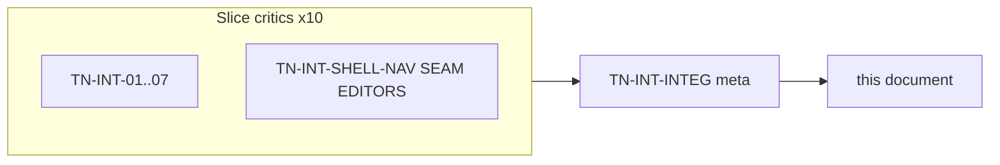
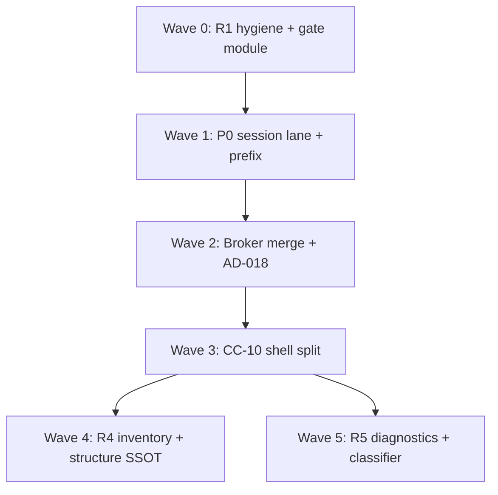

# Intelligence Wave 1 — Thermo-Nuclear Code Quality Review (2026-06-16)

> Strict maintainability and structural-simplification pass over `app/intelligence/` plus the shell/editor intelligence seam on **`ce176983f3d3434b390718692047583c9b38c4ed`**. Ten slice critics plus one integration meta-reviewer (`TN-INT-INTEG`), using the thermo-nuclear rubric (code-judo, 1k-line rule, no rubber-stamping). **Document only** — no remediation commits in this round.
>
> **Per-critic raw findings:** [`_findings/`](_findings/) (11 files). **Remediation plan:** [`intelligence_wave_1_remediation_plan.md`](intelligence_wave_1_remediation_plan.md). **Prior handoff:** [`docs/deslop/AUDIT_app_remaining_handoff.md`](../deslop/AUDIT_app_remaining_handoff.md) R2–R5.

---

## 0. How this review is organized



**Severity model (thermo-native):**

| Tier | Meaning |
|------|---------|
| **P0 BLOCKER** | AD-016/§17.4 contract violation: thread races, silent tier merge, stale UI, 1k+ monolith |
| **P1 STRUCTURAL** | High-conviction code-judo; debt that multiplies on next intelligence growth |
| **P2 NICE-TO-HAVE** | Backlog: typing, test gaps, minor duplication |

**Approval bar (integration thermo):** `app/intelligence/` + shell seam are **not thermo-clean**. AD-016 session shape is correct, but **`semantic_navigation_workflow.py` is 1,103 LOC** — the sole `app/` file above 1k after MainWindow refactor. Do not grow intelligence features until P0 themes land and navigation-touching PRs **net-reduce** orchestrator LOC.

---

## 1. Executive summary

| Metric | Count |
|--------|------:|
| Slice critics | 10 |
| Raw finding entries (slice) | ~121 |
| — BLOCKER severity | 10 |
| — STRUCTURAL severity | ~82 |
| — NICE-TO-HAVE severity | ~29 |
| **Deduped cross-cutting themes** | **18** |
| **P0 BLOCKER (deduped)** | **7** |
| **P1 STRUCTURAL (deduped)** | **11** |
| **P2 NICE-TO-HAVE (deduped)** | **5** |

**Top 6 blockers (integration view):**

1. **UI-thread broker mutation** — `complete_fast` and `record_acceptance` race worker semantic lane ([CC-01](_findings/TN-INT-INTEG.md), [INT-01](_findings/TN-INT-01.md), [INT-02](_findings/TN-INT-02.md)).
2. **Menu hover/signature block Qt UI thread** — `resolve_*_blocking` up to 5s ([CC-04](_findings/TN-INT-INTEG.md), [INT-01](_findings/TN-INT-01.md)).
3. **Completion cache ignores buffer revision** — AD-018 bypass at broker layer ([CC-03](_findings/TN-INT-INTEG.md)).
4. **Editor prefix fork** — `extract_completion_prefix` vs `build_completion_context` ([CC-05](_findings/TN-INT-INTEG.md), [SHELL-EDITORS](_findings/TN-INT-SHELL-EDITORS.md)).
5. **§17.4.2 flat tier merge** — approximate + semantic + runtime in one ranked list ([CC-02](_findings/TN-INT-INTEG.md)).
6. **CC-10 monolith + AD-018 gate sprawl** — `semantic_navigation_workflow.py` 1,103 LOC; four stale-gate variants ([CC-06](_findings/TN-INT-INTEG.md), [SHELL-NAV](_findings/TN-INT-SHELL-NAV.md)).

**Dominant risk:** not missing modules — **contract fragmentation at the session/shell/editor boundary**. MainWindow decomposition moved intelligence orchestration into `semantic_navigation_workflow.py` without splitting it (shell-wave-1 **CC-15 relocated, not resolved**).

**What already works (replicate this pattern):**

- `SemanticSession` + `SemanticWorker` single-owner composition
- `SemanticFacade` degradation metadata on definition/references/hover
- `import_diagnostics.py` Phase 2+3 extraction (finish the split)
- `file_inventory.iter_python_files` R4 SSOT start
- `LintWorkflow` + `WorkflowBroker` for lint (extend to all diagnostics ingress)
- `deliver_revision_gated_editor_result` helpers (make sole gate)
- §17.4.5 Rope-only rename with no token-replace fallback

Full positive-signal table: [TN-INT-INTEG § Positive signals](_findings/TN-INT-INTEG.md#positive-signals-patterns-to-replicate).

---

## 2. P0 BLOCKER — deduped themes

| ID | Theme | Primary critics | Key evidence |
|----|-------|-----------------|--------------|
| **CC-01** | UI-thread broker mutation races worker lane | INT-01, INT-02, SHELL-SEAM, SHELL-EDITORS | `complete_fast` / `record_acceptance` on UI; unsynchronized `_result_cache` |
| **CC-02** | §17.4.2 flat merge mislabels tiers | INT-02, SHELL-NAV, SHELL-EDITORS | Single ranked list; envelope `confidence="exact"` with approximate items |
| **CC-03** | Completion cache reuse ignores `buffer_revision` | INT-02 | `_reuse_cached_envelope` checks prefix only |
| **CC-04** | UI-thread blocking hover/signature on menu path | INT-01, SHELL-NAV | `resolve_*_blocking` via `worker.call` |
| **CC-05** | Editor prefix contract bypass | SHELL-EDITORS, INT-02 | `extract_completion_prefix` in `code_editor_semantics.py` |
| **CC-06** | CC-10: 1,103 LOC monolith + inconsistent AD-018 gates | SHELL-NAV, SHELL-SEAM | Sole `app/` file >1k; three gate implementations |
| **CC-07** | Completion acceptance bypasses workflow/worker | SHELL-EDITORS, INT-01 | `editor_tab_factory` → controller directly |

---

## 3. P1 STRUCTURAL — deduped themes

| ID | Theme | Primary critics |
|----|-------|-----------------|
| **CC-08** | Copy-paste session + controller orchestration | INT-01, SHELL-SEAM |
| **CC-09** | Global navigation worker keys cancel cross-file ops | INT-01 |
| **CC-10** | Shell bypasses controller — direct intelligence imports | SHELL-NAV, SHELL-SEAM |
| **CC-11** | `SymbolIndexWorker` beside AD-017 scheduler; cache as truth | INT-04, SHELL-SEAM |
| **CC-12** | Five-way Python structure extraction fork | INT-04, INT-05, INT-06 |
| **CC-13** | Outline on UI thread, no AD-018 gate | INT-06, SHELL-EDITORS, SHELL-NAV |
| **CC-14** | `diagnostics_service.py` god module (614 LOC) | INT-05, SHELL-NAV, SHELL-SEAM |
| **CC-15** | R4 inventory partial — multiplied full walks | INT-04, INT-05 |
| **CC-16** | `jedi_engine.py` monolith + test vacuum | INT-03 |
| **CC-17** | Rename split-brain: Jedi buffer vs Rope disk | INT-07, INT-01 |
| **CC-18** | AD-018 gate fragmented across workflows | SHELL-SEAM, SHELL-NAV, SHELL-EDITORS, INT-06 |

---

## 4. P2 NICE-TO-HAVE — deduped themes

| ID | Theme | Primary critics |
|----|-------|-----------------|
| **CC-19** | Degradation metadata gaps (signature, outline tier) | INT-01, INT-02, INT-06, INT-07 |
| **CC-20** | Typing debt (`cast`, `Any`, weak caches) | INT-01, INT-02, INT-03, SHELL-NAV, SHELL-SEAM |
| **CC-21** | Test gaps (`jedi_engine`, session boundary, gates) | INT-03, INT-01, INT-06, INT-07 |
| **CC-22** | Misplaced modules / dead surface | INT-07, SHELL-EDITORS, INT-01 |
| **CC-23** | Perf micro-debt (tree-sitter init, api_index dup) | INT-06, INT-04, INT-01 |

---

## 5. Fix-agent sequencing

See [TN-INT-INTEG § Fix-agent sequencing](_findings/TN-INT-INTEG.md#fix-agent-sequencing-ordered-pr-waves) and [`intelligence_wave_1_remediation_plan.md`](intelligence_wave_1_remediation_plan.md).



| Wave | Focus | Handoff |
|------|-------|---------|
| 0 | Shared stale gate; dead code removal | R1 |
| 1 | Worker-serialized broker; async menu hover/signature; prefix SSOT | AD-016, R2 |
| 2 | Tier merge policy; revision-safe cache; session `_submit` collapse | AD-016, AD-018 |
| 3 | Split `semantic_navigation_workflow.py`; zero direct intelligence imports in nav | R2, R3, CC-10 |
| 4 | Inventory snapshot; AD-017 index worker; `python_structure` SSOT; Jedi split | R4 |
| 5 | Diagnostics decomposition; rename input contract; test gaps | R5, R6 |

**Global rules:** hard cutover importers; no file >1k under `app/`; broker mutation worker-only; one stale gate module; four-theme validation for shell UI PRs.

---

## 6. Per-critic index

| Critic | Verdict | Findings |
|--------|---------|----------|
| [TN-INT-01](_findings/TN-INT-01.md) | Not thermo-clean | 12 |
| [TN-INT-02](_findings/TN-INT-02.md) | Not thermo-clean | 12 |
| [TN-INT-03](_findings/TN-INT-03.md) | Not thermo-clean | 12 |
| [TN-INT-04](_findings/TN-INT-04.md) | Not thermo-clean | 12 |
| [TN-INT-05](_findings/TN-INT-05.md) | Not thermo-clean | 14 |
| [TN-INT-06](_findings/TN-INT-06.md) | Not thermo-clean | 12 |
| [TN-INT-07](_findings/TN-INT-07.md) | Conditional (§17.4.5 core OK) | 10 |
| [TN-INT-SHELL-NAV](_findings/TN-INT-SHELL-NAV.md) | Not thermo-clean | 15 |
| [TN-INT-SHELL-SEAM](_findings/TN-INT-SHELL-SEAM.md) | Not thermo-clean | 12 |
| [TN-INT-SHELL-EDITORS](_findings/TN-INT-SHELL-EDITORS.md) | Not thermo-clean | 10 |

### Integration

| Critic | Role |
|--------|------|
| [TN-INT-INTEG](_findings/TN-INT-INTEG.md) | Deduped CC-01 … CC-23, fix sequencing, handoff mapping |

---

## 7. Cross-reference to prior waves

| Prior theme | Intelligence wave 1 resolution |
|-------------|--------------------------------|
| shell-wave-1 **CC-15** intelligence on MainWindow | **Moved** to `semantic_navigation_workflow.py` (1,103 LOC) → **CC-06** |
| shell-wave-1 CC-01 agent debug logging | **Fixed** (per manifest) |
| run-wave-1 god workflow pattern | **Repeated** — monolith relocated without split |
| Phase 2+3 `import_diagnostics` | **Partial** — god module persists |
| Phase 2+3 R4 `file_inventory` | **Partial** — callers still re-walk |

---

## 8. Fix-agent quick start

1. Read this rollup for P0/P1 priority.
2. Open [TN-INT-INTEG](_findings/TN-INT-INTEG.md) for deduped CC themes and wave ordering.
3. Follow [`intelligence_wave_1_implementation_plan.md`](intelligence_wave_1_implementation_plan.md) for step-by-step implementation (18 PRs, CC-01…CC-23 closure). Strategy summary: [`intelligence_wave_1_remediation_plan.md`](intelligence_wave_1_remediation_plan.md).
4. Start **Wave 0** (shared stale gate) in parallel with planning **Wave 1a** (broker lane).
5. Before closing any PR touching `semantic_navigation_workflow.py`: `wc -l` must decrease.
6. Run validation before declaring a wave complete:

```bash
python3 testing/run_test_shard.py fast
python3 testing/run_test_shard.py runtime_parity
python3 run_tests.py tests/unit/intelligence/ tests/integration/intelligence/ tests/runtime_parity/intelligence/
npx pyright
```

**High-signal targeted tests:**

```bash
python3 run_tests.py tests/unit/intelligence/test_semantic_session.py tests/unit/intelligence/test_semantic_worker.py
python3 run_tests.py tests/unit/intelligence/test_completion_broker.py tests/unit/intelligence/test_completion_context.py
python3 run_tests.py tests/unit/intelligence/test_diagnostics_service.py tests/unit/intelligence/test_outline_service.py
python3 run_tests.py tests/unit/shell/test_semantic_navigation_integration.py
```

---

*End of Intelligence Wave 1 rollup. Metric baseline: [`00-manifest.md`](00-manifest.md).*
