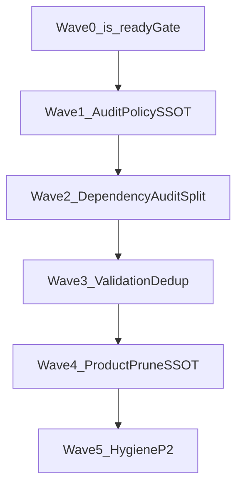

# Packaging Wave 1 — Thermo-Nuclear Code Quality Review (2026-06-22)

> Strict maintainability pass over **`app/packaging/`** on **`6eb9e4fc8885aab4452efc83da10cf28c9f4fe60`**, scoped to packaging-specific logic (manifest-driven export, product builder, cp39 bundle contract, validation orchestration). **Does not re-open** Project SSOT Wave 1 inventory/classifier closure — cross-read [`project-ssot-wave-1`](../project-ssot-wave-1/project_ssot_wave_1_remediation_closure_2026-06-22.md) for CC-PROJ-08…09, CC-PROJ-16…17, CC-PROJ-23 status. **Document only** — no remediation commits in this round.
>
> **Structural template:** [`shell-wave-2`](../shell-wave-2/shell_wave_2_thermo_review_2026-06-17.md). **Architecture anchor:** AD-019 in `docs/ARCHITECTURE.md`; cp39 bundle contract in `AGENTS.md` / `vendor/README.md`.

---

## 0. Scope boundary vs Project SSOT Wave 1

| Project SSOT theme | Packaging slice status @ HEAD | This review |
|--------------------|-------------------------------|-------------|
| CC-PROJ-08 inventory-backed payload copy | **CLOSED** — `_copy_project_tree` uses `DEFAULT_PACKAGING_PAYLOAD_POLICY.iter_payload_entries` | Acknowledge; do not re-litigate |
| CC-PROJ-09 orphan vendor native binaries | **CLOSED** — `_orphan_vendor_native_issues` + validator tests | Acknowledge; note duplicate scan (CC-PKG-07) |
| CC-PROJ-16 `cbcs/` copy/audit policy | **CLOSED** — `PackagingPayloadPolicy` + parity tests | Acknowledge |
| CC-PROJ-17 relative imports + manifest consistency | **PARTIAL CLOSED** — classifier routed; `check_manifest_consistency` wired into validator | **New P0:** `is_ready` gate ignores manifest blocking issues (CC-PKG-01) |
| CC-PROJ-23 hidden-path scan | **CLOSED** @ HEAD — `_discover_hidden_paths` uses `walk_project` | Acknowledge |

**In scope for Packaging Wave 1:** validation orchestration seams, product vs project builder divergence, cp39 staging, checksum/artifact traversal, module sizing, SSOT drift inside `app/packaging/`, and export gate correctness.

---

## 1. Baseline metrics @ `6eb9e4fc8885aab4452efc83da10cf28c9f4fe60`

### 1.1 Per-file LOC (`app/packaging/*.py`)

| File | LOC | Flag |
|------|----:|------|
| `dependency_audit.py` | 647 | **≥700 smell** (13 LOC below threshold) |
| `product_builder.py` | 478 | OK |
| `validator.py` | 367 | OK |
| `artifact_builder.py` | 341 | OK |
| `models.py` | 293 | OK |
| `installer_manifest.py` | 258 | OK |
| `config.py` | 145 | OK |
| `packager.py` | 144 | OK |
| `tree_sitter_cp39.py` | 140 | OK |
| `desktop_builder.py` | 128 | OK |
| `layout.py` | 123 | OK |
| `payload_policy.py` | 99 | OK |
| `launcher_bootstrap.py` | 59 | OK |
| `zip_safety.py` | 29 | OK |
| `__init__.py` | 0 | OK |
| **Total** | **3,251** | |

| Gate | Result |
|------|--------|
| Files ≥700 LOC | **0** |
| Files ≥1000 LOC | **0** |
| Largest module | `dependency_audit.py` **647** |

### 1.2 `: Any` boundary leaks

| Pattern | Count |
|---------|------:|
| Bare `: Any` parameter/return annotations | **0** |
| JSON/serialization boundaries (`dict[str, Any]`, `Mapping[str, Any]`) | **13** |

Primary locations: `models.py` (`to_dict` serializers), `artifact_builder.py:161`, `installer_manifest.py:122`, `config.py:77`.

### 1.3 cp39 bundle contract & staging seams

| Seam | Owner | Notes |
|------|-------|-------|
| cp39 tree-sitter wheel fetch + overlay | `tree_sitter_cp39.py` | Self-heals cp39 `_binding.cpython-39-x86_64-linux-gnu.so`; pip download with py39/manylinux selectors |
| Product bundle validation | `product_builder.validate_choreboy_tree_sitter_bundle` | Enforces SOABI + per-package binding names; strips incompatible cp312+ `.so` |
| Repo-root CLI | `package.py` | Thin wrapper → `build_product_artifact` |
| Shared installable writer | `artifact_builder.write_installable_artifact_tree` | AD-019 shared substrate for product + project |
| Project payload policy | `payload_policy.py` | Explicit copy vs audit matrix; inventory-backed walk |

### 1.4 Traversal vocabulary

| Path | Mechanism | Risk tier |
|------|-----------|-----------|
| Project copy | `walk_project` via `iter_packaging_payload_entries` | Low — SSOT-aligned |
| Dependency audit file set | `iter_python_files` + `is_packaging_excluded_path` | Medium — bypasses `iter_audit_python_files` (CC-PKG-03) |
| Artifact checksums | `installer_manifest.build_artifact_checksums` → `rglob("*")` on **output** tree | Low — post-staging |
| Product copy | `iterdir` + allowlists in `product_builder` | Low — intentional product contract |

---

## 2. Executive summary

| Metric | Count |
|--------|------:|
| **Deduped CC themes** | **14** |
| **P0 BLOCKER** | **1** |
| **P1 STRUCTURAL** | **8** |
| **P2 NICE-TO-HAVE** | **5** |
| **Integration verdict** | **REJECT** |

**Dominant risk:** Project SSOT Wave 1 fixed inventory-backed payload enumeration and orphan-native detection, but **export gating still has a validation seam leak** — manifest consistency blocking issues land in `issue_report` yet `PackageValidationReport.is_ready` ignores them, so `build_project_package_artifact` can export while `cbcs/dependencies.json` disagrees with `vendor/`.

**What already works (replicate this pattern):**

- `PackagingPayloadPolicy` + `test_packaging_payload_policy.py` copy/audit matrix — explicit, test-locked product policy.
- `write_installable_artifact_tree` shared writer — AD-019 hard cutover; product and project share manifest/installer layout.
- `tree_sitter_cp39.py` + `validate_choreboy_tree_sitter_bundle` — strong cp39 contract enforcement on product path.
- `packager.py` thin façade; installable-only profile enforced in both packager and validator.
- `launcher_bootstrap.py` dependency-light bootstrap copied into installer artifacts.
- `zip_safety.py` path-traversal guard for archive extraction.
- Classifier-routed absolute + relative import audit; `check_manifest_consistency` invoked from `build_package_validation_report`.

---

## 3. P0 BLOCKER — CC themes

### CC-PKG-01 — `PackageValidationReport.is_ready` ignores manifest blocking issues

| Field | Value |
|-------|-------|
| **Severity** | **P0 BLOCKER** |
| **Evidence** | `app/packaging/models.py:243-244` — `is_ready` checks only `preflight.is_ready and dependency_audit.is_ready`; `app/packaging/validator.py:91-96` — `check_manifest_consistency` issues merged into `issue_report` but not into preflight or dependency_audit; `app/packaging/artifact_builder.py:76-88` — export gated on `validation.is_ready` only |
| **Impact** | Export succeeds when manifest lists active dependency with missing `vendor/` path (`package.dependency.manifest_missing_vendor.*`, severity `blocking` in `dependency_audit.py:563-564`) — ship-blocking metadata drift |
| **Remediation** | Extend `PackageValidationReport.is_ready` to require `issue_report` has no blocking issues **or** fold manifest issues into `dependency_audit.issues` before computing readiness; add validator integration test asserting `is_ready is False` when manifest vendor dir missing |
| **Project SSOT overlap** | Supersedes residual CC-PROJ-17 manifest wiring gap |

---

## 4. P1 STRUCTURAL — CC themes

### CC-PKG-02 — `dependency_audit.py` monolith approaching 700 LOC smell

| Field | Value |
|-------|-------|
| **Severity** | **P1 STRUCTURAL** |
| **Evidence** | `dependency_audit.py` **647 LOC** — AST import walk, subprocess heuristics, orphan native scan, manifest consistency, issue builders |
| **Remediation** | Split into focused modules: `import_audit.py`, `subprocess_packaging_rules.py`, re-export thin `run_dependency_audit`; target each file **≤400 LOC** before adding new audit rules |

### CC-PKG-03 — Audit walk bypasses `PackagingPayloadPolicy.iter_audit_python_files`

| Field | Value |
|-------|-------|
| **Severity** | **P1 STRUCTURAL** |
| **Evidence** | `dependency_audit.py:69-72` — `iter_python_files(...)` + manual `is_packaging_excluded_path`; contrast `payload_policy.py:55-63` — canonical `iter_audit_python_files` encodes vendor skip + exclude policy |
| **Remediation** | Replace audit loops with `DEFAULT_PACKAGING_PAYLOAD_POLICY.iter_audit_python_files(project_root)`; delete redundant exclude filter; lock with existing parity fixture |

### CC-PKG-04 — Duplicate `validate_packaged_entry_relative_path` (layout vs launcher_bootstrap)

| Field | Value |
|-------|-------|
| **Severity** | **P1 STRUCTURAL** |
| **Evidence** | `layout.py:97-109` and `launcher_bootstrap.py:15-27` — identical validation logic and `_UNSAFE_ENTRY_CHARS`; `installer_manifest.py:15` imports layout copy |
| **Remediation** | Single SSOT in `launcher_bootstrap.py`; layout re-exports or imports from bootstrap module (bootstrap stays dependency-light for installer copy). Add one unit test that both entry points stay aligned |

### CC-PKG-05 — Validator imports private dependency_audit helpers

| Field | Value |
|-------|-------|
| **Severity** | **P1 STRUCTURAL** |
| **Evidence** | `validator.py:10-14` — imports `_collect_imported_top_levels`, `_orphan_vendor_native_issues` (underscore-private); used in `validate_package_config:261-265` |
| **Remediation** | Promote to public functions in `dependency_audit.py` (e.g. `collect_imported_top_levels`, `orphan_vendor_native_issues`) or extract shared `vendor_native_validation.py` consumed by both validator and audit |

### CC-PKG-06 — Duplicate package ID / version regex validation

| Field | Value |
|-------|-------|
| **Severity** | **P1 STRUCTURAL** |
| **Evidence** | `config.py:16-17` — `_PACKAGE_ID_RE`, `_PACKAGE_VERSION_RE`; `validator.py:27-28` — duplicate patterns; `validate_package_config:137-185` re-validates fields already enforced by `parse_project_package_config` |
| **Remediation** | Single validation module or validate-on-load only; validator should trust parsed `ProjectPackageConfig` for format rules and focus on filesystem/state checks (icon, hidden paths, orphan native) |

### CC-PKG-07 — Double full-project AST parse for orphan native detection

| Field | Value |
|-------|-------|
| **Severity** | **P1 STRUCTURAL** |
| **Evidence** | `run_dependency_audit:69-116` parses every audited file; `_collect_imported_top_levels:468-483` re-reads and re-parses the same file set; invoked twice per export (`run_dependency_audit` + `validate_package_config:261-264`) |
| **Remediation** | Compute imported top-levels once inside `run_dependency_audit`; expose cached result to validator preflight or merge orphan scan into single audit pass |

### CC-PKG-08 — Product vs project copy policy duplication (no shared prune helper)

| Field | Value |
|-------|-------|
| **Severity** | **P1 STRUCTURAL** |
| **Evidence** | `product_builder.py:314-340` — `_should_prune_dir`, `_copytree_filtered`, allowlisted vendor; `payload_policy.py:69-99` — inventory walk + `is_payload_excluded`; AD-019 intentionally diverges but prune rules overlap (`__pycache__`, dot-prefix, `.pyc`) |
| **Remediation** | Extract shared `PackagingPruneRules` dataclass (hidden paths, cache dirs, suffixes) consumed by product filtered copy and payload policy; keep product allowlist separate |

### CC-PKG-09 — Packaging ignores user `EffectiveExcludes` (undocumented ship risk)

| Field | Value |
|-------|-------|
| **Severity** | **P1 STRUCTURAL** |
| **Evidence** | `payload_policy.py:79-82` — `walk_project` called without `exclude_patterns`; `layout.py:119-121` documents distinction from `file_excludes` but no preflight advisory when user-excluded `.py` files will still ship |
| **Remediation** | Either (a) apply effective excludes minus packaging overrides (`vendor` always ships), or (b) emit degraded preflight issue listing `.py` files under user excludes that will ship — align with editor search panel expectations |

---

## 5. P2 NICE-TO-HAVE — CC themes

### CC-PKG-10 — Inline imports in `check_manifest_consistency`

| Field | Value |
|-------|-------|
| **Severity** | **P2** |
| **Evidence** | `dependency_audit.py:545-550` — function-body imports from `dependency_manifest`, `native_extension_scan` |
| **Remediation** | Move to module top per repo no-inline-imports rule |

### CC-PKG-11 — Dead helper `_expected_tree_sitter_binding_name`

| Field | Value |
|-------|-------|
| **Severity** | **P2** |
| **Evidence** | `product_builder.py:363-366` — defined, never referenced |
| **Remediation** | Delete or wire into validation error messages |

### CC-PKG-12 — `PRUNE_DIR_NAMES` contains `.pyc` as directory name

| Field | Value |
|-------|-------|
| **Severity** | **P2** |
| **Evidence** | `product_builder.py:43` — `PRUNE_DIR_NAMES = {"__pycache__", ".pyc"}`; `.pyc` is a file suffix, not a directory |
| **Remediation** | Remove dead entry; rely on `_should_skip_file` |

### CC-PKG-13 — Broad `except Exception` on artifact write path

| Field | Value |
|-------|-------|
| **Severity** | **P2** |
| **Evidence** | `artifact_builder.py:139-151` — catches all exceptions, returns stringified error |
| **Remediation** | Narrow to expected filesystem/validation errors; log unexpected exceptions |

### CC-PKG-14 — Artifact checksum `rglob` vocabulary (residual CC-PROJ-23)

| Field | Value |
|-------|-------|
| **Severity** | **P2** |
| **Evidence** | `installer_manifest.py:245` — `root.rglob("*")` on staged artifact; acceptable for output tree but multiplies traversal patterns |
| **Remediation** | Defer; optionally feed checksum builder from written artifact file list when manifest is built |

---

## 6. Architecture gate scorecard (packaging-specific)

| Gate | Status | Notes |
|------|--------|-------|
| AD-019 shared installable writer | **Pass** | `write_installable_artifact_tree` shared |
| Installable-only profile hard cutover | **Pass** | No portable profile fallback |
| Project payload inventory-backed copy | **Pass** | CC-PROJ-08 closed |
| Explicit copy vs audit policy object | **Pass** | `PackagingPayloadPolicy` + tests |
| Audit uses policy iterator | **Fail** | CC-PKG-03 |
| Export gate = full blocking issue set | **Fail** | CC-PKG-01 |
| cp39 tree-sitter product contract | **Pass** | Staging + validation |
| No dot-prefixed storage paths in packaging | **Pass** | Uses `cbcs/` visible metadata |
| Python 3.9 syntax compliance | **Pass** | `from __future__ import annotations`; no 3.10+ syntax at runtime |
| Private cross-module imports | **Fail** | CC-PKG-05 |

---

## 7. Fix-agent sequencing

1. **Wave 0 (P0):** Fix CC-PKG-01 — blocking manifest issues must prevent export.
2. **Wave 1:** CC-PKG-03 audit iterator SSOT; CC-PKG-07 single AST pass.
3. **Wave 2:** CC-PKG-02 split `dependency_audit.py` before it crosses 700 LOC.
4. **Wave 3:** CC-PKG-04/05/06 validation dedup and public seams.
5. **Wave 4:** CC-PKG-08/09 product/project prune alignment or explicit user-exclude advisory.
6. **Wave 5:** P2 hygiene (CC-PKG-10…14).

---

## 8. TN-PKG-INTEG verdict

| Verdict | **REJECT** |
|---------|------------|
| **Rationale** | Project SSOT Wave 1 materially improved packaging payload SSOT and closed the inventory `rglob` bypass, but **one ship-blocking validation gate leak remains**: manifest consistency blocking issues do not affect `is_ready`, so exports can proceed with stale `cbcs/dependencies.json`. `dependency_audit.py` at 647 LOC is one feature away from the 700 smell line, and audit/policy/validation duplication creates drift risk on the exact boundary Project SSOT Wave 1 was meant to unify. |
| **Accept bar** | Thermo-clean packaging requires CC-PKG-01 closed, audit file-set routed through `iter_audit_python_files`, and `dependency_audit.py` split or shrunk below 600 LOC before new audit rules land. |

---

## 9. Cross-reference summary

| Prior finding (TN-PROJ-PKG / CC-PROJ) | Packaging Wave 1 @ HEAD |
|---------------------------------------|-------------------------|
| TN-PROJ-PKG-1 rglob copy bypass | **CLOSED** — policy iterator |
| TN-PROJ-PKG-2 copy vs audit file-set | **CLOSED** — policy + parity tests |
| TN-PROJ-PKG-7 dead manifest validation | **CLOSED** — wired in validator |
| TN-PROJ-PKG-6 relative import fork | **CLOSED** — `classify_relative_import` |
| TN-PROJ-PKG-9 orphan native | **CLOSED** — scan + tests; duplicate pass remains (CC-PKG-07) |
| TN-PROJ-PKG-10 hidden rglob | **CLOSED** — inventory walk |
| TN-PROJ-PKG-11 product pattern for project | **PARTIAL** — project improved; product/project prune still parallel (CC-PKG-08) |
