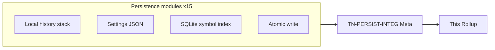
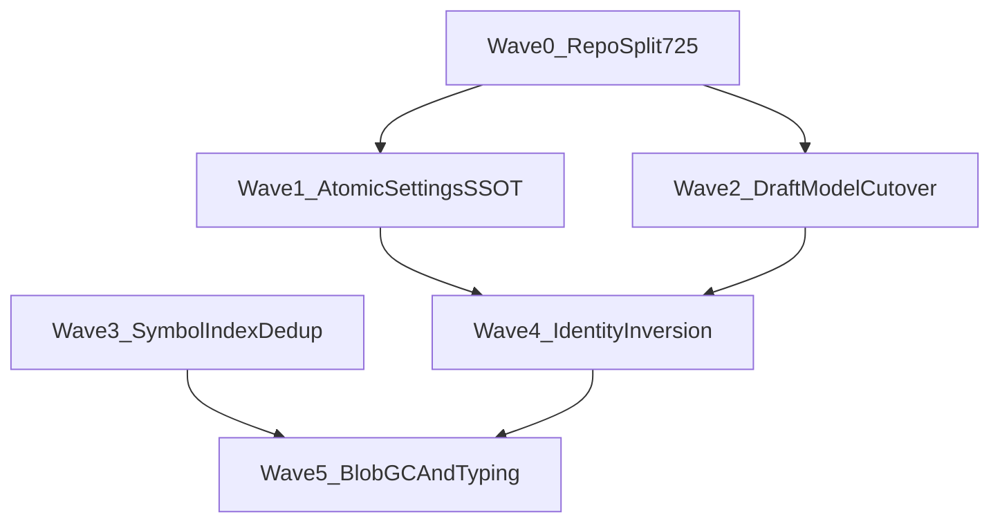

# Persistence Wave 1 — Thermo-Nuclear Code Quality Review (2026-06-22)

> Strict maintainability and structural-simplification pass over `app/persistence/` on **`6eb9e4fc8885aab4452efc83da10cf28c9f4fe60`**. Single-package integration review (`TN-PERSIST-INTEG`) using the thermo-nuclear rubric (code-judo, 1k-line rule, no rubber-stamping). **Document only** — no remediation commits in this round.
>
> **Cross-waves:** [`shell-wave-2`](../shell-wave-2/), [`editors-wave-1`](../editors-wave-1/), [`project-ssot-wave-1`](../project-ssot-wave-1/), [`intelligence-wave-1`](../intelligence-wave-1/). Prior program baseline: [`00-program-manifest.md`](../00-program-manifest.md) (flags `local_history_repository.py` at 725 LOC).

---

## 0. How this review is organized

**Severity model (thermo-native):**

| Tier | Meaning |
|------|---------|
| **P0 BLOCKER** | Ship-blocking data loss, durability holes on hot paths, sole 1k `app/` violation, debug slop |
| **P1 STRUCTURAL** | High-conviction code-judo: monolith modules, layer inversion, duplicated SQL/contracts, durability drift |
| **P2 NICE-TO-HAVE** | Dead constants, silent failures, cache hygiene, typing polish |

**Approval bar (integration thermo):** `app/persistence/` is **not thermo-clean**, but it is **thermo-acceptable for wave landing**. The local-history stack is a genuine extraction win (schema / rows / identity / blob / retention / facade), autosave hard-cutover succeeded, and there is **no 1k-line blocker**. Dominant debt is **one 725 LOC repository monolith**, **copy-pasted symbol-index SQL**, and **inconsistent atomic-write contracts** — structural P1, not ship-blocking P0.

---

## 1. Baseline commit and metric sweep

**Baseline commit:** `6eb9e4fc8885aab4452efc83da10cf28c9f4fe60`

### 1.1 Per-file LOC (`find app/persistence -name '*.py' -exec wc -l {} +`)

| LOC | File |
|----:|------|
| 725 | `local_history_repository.py` |
| 435 | `sqlite_index.py` |
| 300 | `local_history_store.py` |
| 180 | `local_history_schema.py` |
| 152 | `local_history_identity.py` |
| 137 | `settings_store.py` |
| 137 | `settings_service.py` |
| 136 | `autosave_store.py` |
| 111 | `local_history_writer.py` |
| 110 | `history_retention.py` |
| 99 | `local_history_rows.py` |
| 94 | `history_models.py` |
| 67 | `atomic_write.py` |
| 41 | `local_history_blob_store.py` |
| 8 | `__init__.py` |
| **2732** | **total (15 files)** |

| Threshold | Count | Files |
|-----------|------:|-------|
| ≥700 LOC (smell) | **1** | `local_history_repository.py` (725) |
| ≥1000 LOC (blocker) | **0** | — |
| Largest file | **725** | `local_history_repository.py` |

### 1.2 Boundary typing sweep

| Pattern | Count | Notes |
|---------|------:|-------|
| `window: Any` | **0** | No shell host leaks in persistence |
| Bare `: Any` parameter | **1** | `settings_store.py:134` `_coerce_schema_version(raw_value: Any)` |
| `dict[str, Any]` / settings JSON boundary | **23** | Intentional schemaless JSON contract in `settings_store.py` + `settings_service.py` |
| **`Any` boundary total (bare + dict)** | **24** | Acceptable at JSON seam; no UI host typing debt |

### 1.3 Cross-package import seams (outbound)

| Importer module | Imports from | Role |
|-----------------|--------------|------|
| Most modules | `app.bootstrap.paths` | Canonical visible state paths (`choreboy_code_studio_state/`, `cbcs/`) |
| `settings_store.py`, `history_retention.py` | `app.core.constants` | Settings override keys, retention defaults |
| `local_history_identity.py` | `app.project.project_manifest.ensure_project_id` | **Layer inversion** — persistence discovers project identity via project domain |

**Inbound consumers (grep `from app.persistence`):** shell (~12), intelligence (~8), project (~5), plugins (~3), editors (~2), tests (~15). Persistence is correctly positioned as a **canonical helper layer** per ARCHITECTURE §12.8.

### 1.4 Platform compliance

| Check | Status |
|-------|--------|
| Dot-prefixed storage paths in package | **PASS** — none; uses `cbcs/` and `choreboy_code_studio_state/` via bootstrap |
| Python 3.9 syntax | **PASS** — `from __future__ import annotations`; no `match`/`case`; no runtime `X \| Y` union syntax in annotations except deferred forms |
| Hard-cutover legacy chains | **PASS** on autosave — `autosave_store.py:40-41` documents removed JSON tree; no read fallback |
| `merge_window_seconds` policy field | **FAIL (dead)** — defined `history_retention.py:23` but never read anywhere in repo |

---

## 2. Executive summary

| Metric | Value |
|--------|------:|
| Python modules | 15 |
| Total LOC | 2,732 |
| Files ≥700 | 1 |
| Files ≥1k | 0 |
| Deduped CC themes | **13** |
| P0 | **0** |
| P1 STRUCTURAL | **7** |
| P2 | **6** |
| Integration verdict | **ACCEPT** |

**Top structural themes (integration view):**

1. **`local_history_repository.py` at 725 LOC** — sole smell-threshold module; mixes drafts, checkpoints, lineage, global timeline SQL, and pruning (CC-PERSIST-01).
2. **`sqlite_index.py` SQL triplication** — three near-identical `INSERT INTO symbols` blocks and three row→`IndexedSymbol` mappers (CC-PERSIST-02).
3. **Durability contract fork** — blobs use `atomic_write_text` (fsync); settings JSON uses temp+replace without directory fsync (CC-PERSIST-03).
4. **Triple draft model + AutosaveStore wrapper** — `DraftEntry`, `LocalHistoryDraft`, `LocalHistoryDraftRecord` with repetitive mapping (CC-PERSIST-05).
5. **Persistence→project identity coupling** — `resolve_history_subject` walks manifest via `ensure_project_id` (CC-PERSIST-04).

**Dominant risk:** not missing persistence — **consolidation without deletion**. Wave extractions created good submodules (`local_history_schema`, `local_history_rows`, `local_history_identity`, `local_history_blob_store`) but left orchestration + SQL volume in one repository class and duplicated symbol-index statements. Intelligence Wave 1 already flagged non-atomic symbol index commits; `apply_index_delta` (`sqlite_index.py:300-372`) partially addresses that but coexists with legacy per-method commits.

**What already works (replicate this pattern):**

- `LocalHistoryStore` facade — thin blob+metadata orchestration (`local_history_store.py`, 300 LOC).
- `LocalHistorySchema` — owned connection PRAGMAs (WAL, foreign keys, synchronous FULL) at `local_history_schema.py:38-44`.
- `history_retention.py` — pure retention policy + `checkpoint_ids_to_prune` (testable, no I/O).
- `atomic_write_text` + `atomic_write_batch` — canonical editor/refactor durability primitive (`atomic_write.py`).
- Autosave hard cutover — unified draft head in SQLite+blobs; legacy JSON path removed with comment only.
- Content-addressed blob store — dedup by SHA-256 before write (`local_history_blob_store.py:27-34`).

---

## 3. P0 BLOCKER — deduped themes

*None.* No sole 1k `app/` file, no agent debug slop, no identified ship-blocking data-loss path on the persistence hot paths reviewed. Settings silent-reset on corrupt JSON is a durability/UX concern but handled consistently with explicit default return — classified P2 (CC-PERSIST-11), not P0.

---

## 4. P1 STRUCTURAL — deduped themes

### CC-PERSIST-01 — `local_history_repository.py` monolith at 725 LOC

| | |
|--|--|
| **Severity** | P1 STRUCTURAL |
| **Evidence** | `local_history_repository.py:27-724` — single `LocalHistoryRepository` owns draft CRUD (`42-170`), checkpoint CRUD + prune (`172-281`), global timeline CTE (`298-352`), lineage remap/delete (`354-439`), and private file-record graph (`441-724`). 13 `with self._schema.connect()` sites — one connection per public method. |
| **Remediation** | Code-judo split: `local_history_drafts.py`, `local_history_checkpoints.py`, `local_history_lineage.py` (or query module for CTE). Extract shared `DraftColumns` / SQL fragment constants. Optional: connection context manager on schema passed into repo methods to batch multi-step store operations. Target: no module ≥500 LOC. |

### CC-PERSIST-02 — `sqlite_index.py` copy-pasted symbol SQL and row mapping

| | |
|--|--|
| **Severity** | P1 STRUCTURAL |
| **Evidence** | `sqlite_index.py:49-79`, `:267-297`, `:328-357` — identical 10-column `INSERT INTO symbols`. Row→`IndexedSymbol` construction duplicated at `:103-115`, `:163-175`, and inline in delta path. `_initialize_schema` + `_ensure_symbols_column` mirrors local-history column-migration pattern but standalone. |
| **Remediation** | Extract `_insert_symbols(connection, rows)` and `_rows_to_symbols(rows)` helpers; single `_SYMBOLS_INSERT_SQL` constant. Consider sharing generic `ensure_column(connection, table, defs)` with `local_history_schema._ensure_draft_columns`. |

### CC-PERSIST-03 — Settings JSON write path bypasses canonical atomic helper

| | |
|--|--|
| **Severity** | P1 STRUCTURAL |
| **Evidence** | `settings_store.py:48-51` — `temp_path.write_text` + `replace` without `os.fsync`. Contrast `atomic_write.py:12-36` — temp file, fsync payload, `os.replace`, directory fsync. Blobs and editor saves use the canonical helper; global/project settings do not. |
| **Remediation** | Route `save_json_object` through `atomic_write_text` (serialize first) or extend `atomic_write_text` with bytes mode. One durability contract for all persisted user state. |

### CC-PERSIST-04 — Persistence layer imports project manifest for identity

| | |
|--|--|
| **Severity** | P1 STRUCTURAL |
| **Evidence** | `local_history_identity.py:10-12,70-76` — `discover_project_context` calls `project_manifest_path` + `ensure_project_id`. Persistence infers `project_id` by walking parents for `cbcs/project.json`. |
| **Remediation** | Invert dependency: callers (shell/project workflows) resolve `(project_id, project_root)` via project SSOT and pass into store; persistence accepts `ResolvedHistorySubject` only. Keep hash fallbacks (`fallback_project_id_for_root`) for external files but remove manifest walk from persistence. |

### CC-PERSIST-05 — Triple draft DTO + AutosaveStore compatibility wrapper

| | |
|--|--|
| **Severity** | P1 STRUCTURAL |
| **Evidence** | `history_models.py:44-58` (`LocalHistoryDraft`), `local_history_rows.py:18-30` (`LocalHistoryDraftRecord`), `autosave_store.py:17-28` (`DraftEntry`). Mapping loops at `local_history_store.py:90-103`, `:120-133`, `:154-167` and `autosave_store.py:69-78`, `:96-105`, `:124-135`. `AutosaveStore` docstring admits compatibility wrapper (`autosave_store.py:32`). |
| **Remediation** | Hard cutover: delete `DraftEntry` + `AutosaveStore`; migrate shell callers to `LocalHistoryStore` / `LocalHistoryDraft`. Collapse `LocalHistoryDraftRecord` to internal row type or generate facade mapping once via `draft_record_to_model(record, content)`. |

### CC-PERSIST-06 — `sqlite_index` lives in persistence but serves intelligence-only cache

| | |
|--|--|
| **Severity** | P1 STRUCTURAL |
| **Evidence** | `sqlite_index.py:33-434` — symbol acceleration cache. Consumers: `app/intelligence/symbol_index.py`, `completion_providers.py` (grep). Uses raw `sqlite3.connect` without WAL/foreign-key PRAGMAs unlike `LocalHistorySchema`. Intelligence Wave 1 TN-INT-04 documents split-commit hazard; `apply_index_delta` exists but worker still calls separate upsert methods. |
| **Remediation** | Either (a) move to `app/intelligence/` as cache implementation detail, or (b) add `PersistenceSqliteConnection` helper shared by both schemas with consistent PRAGMAs. Prefer (a) if persistence stays user-state-only per ARCHITECTURE §12.8. |

### CC-PERSIST-07 — Repository opens one SQLite connection per method call

| | |
|--|--|
| **Severity** | P1 STRUCTURAL |
| **Evidence** | `local_history_repository.py` — each public method wraps body in `with self._schema.connect()`. Multi-step store operations (e.g. `create_checkpoint` at `:184-229` — upsert project, resolve file, insert checkpoint, prune, commit) cannot be composed by callers inside one transaction. `remap_file_lineage` loops path pairs with full connect/commit per outer call only — inner loop shares one connection (good) but store facade cannot batch cross-file checkpoint writes. |
| **Remediation** | Expose optional `connection: sqlite3.Connection | None` on repo methods or a `@contextmanager unit_of_work()` on `LocalHistorySchema`. `LocalHistoryStore.create_checkpoint` + writer transaction helper could share one connection for N files. |

---

## 5. P2 NICE-TO-HAVE — deduped themes

### CC-PERSIST-08 — Dead policy constants and unused merge window

| | |
|--|--|
| **Severity** | P2 |
| **Evidence** | `history_retention.py:23` — `merge_window_seconds` field never read (repo-wide grep). `history_models.py:8-9` — `HISTORY_ENTRY_KIND_DRAFT` / `HISTORY_ENTRY_KIND_CHECKPOINT` defined but unused outside file. |
| **Remediation** | Implement merge-window dedup in checkpoint creation or delete the field. Remove dead kind constants or wire them into UI/query filters. |

### CC-PERSIST-09 — `Optional[object]` checkpoint writer return type

| | |
|--|--|
| **Severity** | P2 |
| **Evidence** | `local_history_writer.py:52` — `record_local_history_checkpoint(...) -> Optional[object]`. Callers lose typed checkpoint metadata. |
| **Remediation** | Return `Optional[LocalHistoryCheckpoint]`; import from `history_models`. |

### CC-PERSIST-10 — Checkpoint prune does not garbage-collect blob files

| | |
|--|--|
| **Severity** | P2 |
| **Evidence** | `local_history_repository.py:657-681` — `DELETE FROM checkpoints` only. `LocalHistoryBlobStore` has no `delete_blob` or refcount scan. Retention pruning accumulates orphaned blobs under `global_history_blobs_dir`. |
| **Remediation** | After prune, optional `VACUUM`-style blob sweep: delete blobs whose SHA-256 is not referenced by drafts or checkpoints (batch job or inline with refcount table). |

### CC-PERSIST-11 — Silent load failures on settings and blobs

| | |
|--|--|
| **Severity** | P2 |
| **Evidence** | `settings_store.py:27-35` — `FileNotFoundError`, `OSError`, `JSONDecodeError` all return default without log. `local_history_blob_store.py:36-41` — missing blob returns `None`; `local_history_store.py:117-119` drops draft silently. |
| **Remediation** | Log at warning once per path; surface metric for support bundle. Do not change default-on-corrupt behavior without product sign-off. |

### CC-PERSIST-12 — `SettingsService` in-process cache without external invalidation

| | |
|--|--|
| **Severity** | P2 |
| **Evidence** | `settings_service.py:22-23,32-35,48-52` — caches global + per-project payloads until `force_refresh` or `invalidate_cache`. No file watcher; external edits to `settings.json` stale until restart. |
| **Remediation** | Document single-writer assumption or compare mtime on load. Shell already owns settings UX — ensure all writes go through service. |

### CC-PERSIST-13 — Repository `resolve_subject` passthrough duplicates store facade

| | |
|--|--|
| **Severity** | P2 |
| **Evidence** | `local_history_repository.py:33-40` — delegates to `resolve_history_subject`. Every `LocalHistoryStore` public method resolves subject then calls repo (`local_history_store.py:76,113,143,...`). Repo should accept `ResolvedHistorySubject` only; identity resolution stays at store boundary. |
| **Remediation** | Delete `LocalHistoryRepository.resolve_subject`; repo private methods take `ResolvedHistorySubject`. Reduces duplicate import of identity helpers in repository module. |

---

## 6. Fix-agent sequencing

**Parallelism:** Wave 0 (repository split) gates large history features. Waves 1–2 can parallelize (settings vs draft DTO). Wave 3 (sqlite_index) is independent of history. Wave 4 (identity inversion) should follow draft cutover so callers pass resolved subjects.

**Suggested PR order:**

1. Split `local_history_repository.py` below 500 LOC per module (CC-PERSIST-01).
2. Route `save_json_object` through `atomic_write_text` (CC-PERSIST-03).
3. Remove `AutosaveStore` / `DraftEntry` hard cutover (CC-PERSIST-05).
4. Deduplicate `sqlite_index.py` SQL helpers (CC-PERSIST-02); evaluate move to intelligence (CC-PERSIST-06).
5. Push manifest discovery out of persistence (CC-PERSIST-04).
6. P2 backlog: blob GC, merge window, typing polish.

---

## 7. Cross-reference to prior waves

| Prior theme | Persistence Wave 1 status |
|-------------|---------------------------|
| Shell **CC-05** draft recovery divergent paths | **Outside scope** — shell workflow; persistence store API is unified |
| Shell LHIST **LocalHistoryStore facade** | **Substantially closed** — good extraction pattern |
| Editors **atomic_write_batch** unused by save-all | **Open at editors** — primitive exists `atomic_write.py:53-67` |
| Intelligence **TN-INT-04** split symbol commits | **PARTIAL** — `apply_index_delta` added; worker still uses split upserts |
| Project SSOT manifest identity | **PARTIAL** — persistence still walks manifest in identity helper |
| Program manifest **725 LOC repository** | **OPEN** — CC-PERSIST-01 |

---

## 8. TN-PERSIST-INTEG verdict

| | |
|--|--|
| **Verdict** | **ACCEPT** |
| **Rationale** | The persistence package is **materially healthier** than shell/intelligence hotspots reviewed in prior waves: **zero 1k files**, **one 700-smell module**, clean visible-path compliance, successful autosave hard cutover, and a coherent local-history decomposition (schema / rows / blobs / retention / facade). Remaining issues are **high-conviction P1 simplifications** (repository split, SQL dedup, atomic settings, layer inversion) rather than ship-blocking regressions. **Do not block persistence-wave landing** on P1 themes, but **do not add features to `local_history_repository.py` without splitting first** — it is the sole growth choke point. |

**Pre-merge gates for persistence-touching PRs:**

1. No file in `app/persistence/` may cross **900 LOC** without split plan.
2. New JSON/settings writes must use `atomic_write_text` after Wave 1 remediation.
3. No new imports from `app.project.*` into persistence without architecture sign-off.
4. Run `python3 testing/run_test_shard.py fast` and targeted `tests/unit/persistence/` before closing remediation PRs (not required for this document-only review).

---

## 9. CC theme index

| ID | Severity | Theme |
|----|----------|-------|
| CC-PERSIST-01 | P1 | `local_history_repository.py` 725 LOC monolith |
| CC-PERSIST-02 | P1 | `sqlite_index.py` triplicated symbol SQL |
| CC-PERSIST-03 | P1 | Settings save bypasses `atomic_write_text` fsync contract |
| CC-PERSIST-04 | P1 | Persistence imports project manifest for identity |
| CC-PERSIST-05 | P1 | Triple draft DTO + `AutosaveStore` wrapper |
| CC-PERSIST-06 | P1 | Symbol index placement + SQLite PRAGMA drift |
| CC-PERSIST-07 | P1 | Per-method SQLite connections / no unit-of-work |
| CC-PERSIST-08 | P2 | Dead `merge_window_seconds` + kind constants |
| CC-PERSIST-09 | P2 | `Optional[object]` writer return type |
| CC-PERSIST-10 | P2 | Orphan blob accumulation after prune |
| CC-PERSIST-11 | P2 | Silent settings/blob load failures |
| CC-PERSIST-12 | P2 | SettingsService cache without invalidation |
| CC-PERSIST-13 | P2 | Repository `resolve_subject` passthrough |

**Severity tally:** P0=0, P1=7, P2=6
