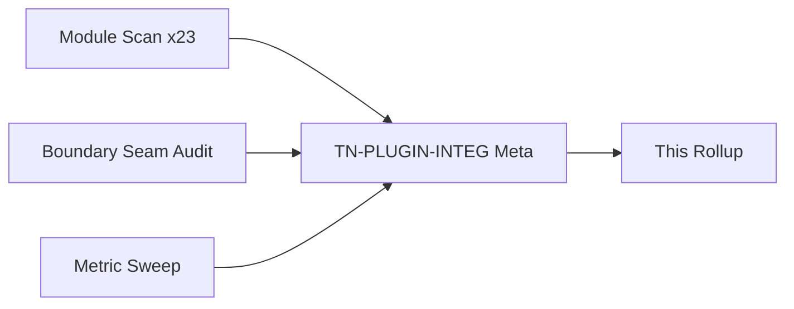
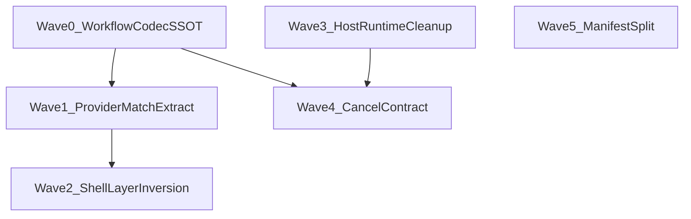

# Plugins Wave 1 — Thermo-Nuclear Code Quality Review (2026-06-22)

> Full-package baseline of `app/plugins/` on **`6eb9e4fc8885aab4452efc83da10cf28c9f4fe60`**. Single integration reviewer (`TN-PLUGIN-INTEG`) applying the thermo-nuclear rubric (code-judo, 1k-line rule, boundary SSOT, no rubber-stamping). **Document only** — no remediation commits in this round.
>
> **Architecture canon:** `docs/ARCHITECTURE.md` §12.11 / §24; plugin host IPC via `run_plugin_host.py` + `PluginRuntimeManager`.

---

## 0. How this review is organized

**Severity model (thermo-native):**

| Tier | Meaning |
|------|---------|
| **P0 BLOCKER** | Sole 1k-line violation, ship-blocking boundary break, data-loss/debug-slop |
| **P1 STRUCTURAL** | High-conviction code-judo: SSOT forks, layer inversion, IPC `Any` seams, dead surface |
| **P2 NICE-TO-HAVE** | Approaching-700 smell, thin wrappers, helper duplication, registration soup |

**Approval bar (integration thermo):** Package decomposition is **strong** (23 modules, 4,725 LOC, **zero files ≥700**), but the **workflow IPC boundary is not thermo-clean**: serialize/coerce logic is triplicated, provider-matching rules diverge, and `contributions.py` inverts the layer graph into `app.shell`. **No P0 blockers.**

---

## 1. Executive summary

| Metric | Value |
|--------|------:|
| Baseline commit | `6eb9e4fc8885aab4452efc83da10cf28c9f4fe60` |
| Python files in `app/plugins/` | 23 |
| Total LOC | 4,725 |
| Largest file | `manifest.py` — **533 LOC** |
| Files ≥700 LOC (smell) | **0** |
| Files ≥1000 LOC (blocker) | **0** |
| Explicit `: Any` annotations (`rg ': Any\b'`) | **22** |
| Total `Any` token occurrences (incl. `dict[str, Any]`) | 162 |
| Cross-package imports (non-`app.plugins`) | **14 modules** import **28 distinct `app.*` packages** |
| **Deduped CC themes** | **14** |
| **P0** | **0** |
| **P1 STRUCTURAL** | **7** |
| **P2 backlog** | **7** |
| Integration verdict | **REJECT** |

**Top structural risks (integration view):**

1. **Workflow IPC SSOT fork** — `runtime_serializers.py`, `workflow_adapters.py` `_coerce_*`, and `builtin_workflows.py` private dict builders serve the same contract three ways (CC-PLUGIN-01).
2. **Provider context matching duplicated with divergent file-extension logic** — `workflow_broker._descriptor_matches` vs `workflow_catalog._matches_provider_context` (CC-PLUGIN-02).
3. **Layer inversion** — `contributions.py` imports `app.shell.events`; plugins package depends on shell UI layer (CC-PLUGIN-03).
4. **`workflow_adapters.py` coercion monolith** — 467 LOC / 13 coercers at the editor-side IPC boundary (CC-PLUGIN-04).
5. **IPC boundary typed as `Any`** — manager/broker return paths erase typed workflow results (CC-PLUGIN-05).
6. **Dead / private host-runtime surface** — unused module-level loader + handler factory reaching `_command_bindings` (CC-PLUGIN-06).
7. **Builtin job cancel stub** — `is_cancelled` ignored in pytest/packaging builtins while host wires real cancel events (CC-PLUGIN-07).

**What already works (replicate this pattern):**

- **Module decomposition** — lifecycle (`discovery`, `installer`, `registry_store`), manifest (`manifest`, `models`, `auditor`), runtime IPC (`runtime_manager`, `rpc_protocol`, `host_supervisor`), workflow routing (`workflow_broker`, `workflow_catalog`, `project_config`) are cleanly separated; no monoliths.
- **Process isolation** — editor never imports plugin runtime code; `host_runtime.py` loads entrypoints inside plugin host; `PluginHostSupervisor` reuses `run/process_supervisor` seam.
- **Visible storage paths** — project policy at `cbcs/plugins.json`; global registry under `choreboy_code_studio_state/plugins/`; auditor forbids hidden path tokens in plugin packages (`auditor.py:10-17`, `48-55`).
- **Python 3.9 posture** — `from __future__ import annotations` on every module; auditor AST-parses at `(3, 9)` feature version.
- **Trust + safe mode** — bundled plugins auto-trusted; install-time audit gate; failure quarantine hooks in contributions manager.

---

## 2. Baseline metric sweep

### 2.1 Per-file LOC (@ HEAD)

| LOC | File |
|----:|------|
| 533 | `manifest.py` |
| 467 | `workflow_adapters.py` |
| 411 | `workflow_broker.py` |
| 403 | `builtin_workflows.py` |
| 401 | `runtime_manager.py` |
| 344 | `host_runtime.py` |
| 228 | `registry_store.py` |
| 225 | `contributions.py` |
| 221 | `models.py` |
| 218 | `project_config.py` |
| 211 | `discovery.py` |
| 169 | `workflow_catalog.py` |
| 127 | `installer.py` |
| 125 | `rpc_protocol.py` |
| 123 | `auditor.py` |
| 110 | `runtime_serializers.py` |
| 84 | `api_broker.py` |
| 72 | `host_supervisor.py` |
| 68 | `package_format.py` |
| 60 | `trust_store.py` |
| 56 | `exporter.py` |
| 41 | `security_policy.py` |
| 28 | `__init__.py` |

**1k rule:** PASS — no file ≥1000. **700 smell:** PASS — no file ≥700; watch `manifest.py` (533) and `workflow_adapters.py` (467).

### 2.2 `: Any` boundary leak inventory

22 explicit `: Any` parameter/return annotations (thermo boundary metric):

| File | Count | Role |
|------|------:|------|
| `workflow_adapters.py` | 13 | IPC result coercion |
| `builtin_workflows.py` | 7 | Request/response parsing |
| `rpc_protocol.py` | 2 | RPC result slots |
| `api_broker.py` | 1 | `coerce_result_payload` |

Additional boundary erosion: `runtime_manager.py` methods `invoke_command`, `invoke_workflow_query`, `wait_for_workflow_job`, `cancel_workflow_job` all return untyped `Any` (`runtime_manager.py:100,122,177,204,223,387`); `WorkflowBroker.invoke_query` / `run_job` return `tuple[..., Any]` (`workflow_broker.py:194,238`).

### 2.3 Cross-package import seams

**Inbound (consumers of `app.plugins`):** `app.shell.*` workflows (`save_workflow`, `python_style_workflow`, `lint_workflow`, `runtime_support_workflow`, `file_project_commands_workflow`, `shell_composition`), `app.support.support_bundle`, `run_plugin_host.py`, `bundled_plugins/*/runtime.py`.

**Outbound (plugins → rest of app):**

| Seam | Modules | Notes |
|------|---------|-------|
| Bootstrap / paths | 8 modules | Correct for global + project storage |
| Run / subprocess | `host_supervisor`, `runtime_manager` | Reuses runner process supervisor — good |
| **Shell (layer inversion)** | `contributions.py` | Imports `app.shell.events` — **plugins should not depend on shell** |
| Domain workflow backends | `builtin_workflows`, `workflow_adapters` | Expected for built-in providers; heavy fan-in (packaging, pytest, intelligence, templates, support) |
| Persistence | `registry_store`, `trust_store`, `project_config` | JSON SSOT — correct layer |

**Plugin-host subprocess boundary:**

Editor-side: `PluginApiBroker` → `PluginRuntimeManager` → `rpc_protocol` encode/decode → `workflow_adapters` coerce → shell workflows.

Host-side: `run_plugin_host.py` dispatch loop → `host_runtime.RuntimePluginIndex` → plugin entrypoint handlers → `runtime_serializers` (bundled plugins).

---

## 3. P0 BLOCKER — deduped themes

*None. No file ≥1000 LOC, no ship-blocking data-loss path, process isolation intact.*

---

## 4. P1 STRUCTURAL — deduped themes

| ID | Theme | Severity | Evidence | Recommended remediation |
|----|-------|----------|----------|------------------------|
| **CC-PLUGIN-01** | Workflow IPC serialize/coerce SSOT fork | P1 | `runtime_serializers.py:16-110` (outbound); `workflow_adapters.py:186-446` (13 `_coerce_*` inbound); `builtin_workflows.py:224-246` (`_pytest_run_result_to_dict` duplicates `serialize_pytest_run_result`); dead `_package_result_to_dict` at `236-237` never called | **Code-judo:** one `workflow_payload_codec.py` (or extend `runtime_serializers`) with symmetric `serialize_*` / `parse_*` per workflow kind; builtins and bundled plugins call serialize only; adapters call parse only; delete duplicate private dict builders |
| **CC-PLUGIN-02** | Provider context matching duplicated + divergent | P1 | `workflow_broker.py:387-407` `_descriptor_matches` uses `file_path.rsplit(".", 1)`; `workflow_catalog.py:149-168` `_matches_provider_context` uses `Path(file_path).suffix.lower()`; language/extension filters reimplemented | Extract `provider_matches_context(descriptor, *, kind, lane, language, file_path)` in `workflow_catalog.py`; broker and catalog both delegate — eliminates subtle mismatch (e.g. multi-dot filenames) |
| **CC-PLUGIN-03** | Layer inversion: plugins → shell | P1 | `contributions.py:8-14` imports five shell event types; `EVENT_TYPE_MAP` couples plugin event hooks to shell dataclasses | Move event hook contract to `app.core` or `app.plugins.events` (stable names + payload dict schema); shell registers type→handler mapping at composition time; plugins package stops importing `app.shell` |
| **CC-PLUGIN-04** | `workflow_adapters.py` coercion monolith | P1 | 467 LOC, 8 public `*_with_workflow` wrappers + 13 coercers in one file (`workflow_adapters.py:18-467`) | Split by workflow kind (`workflow_adapters_format.py`, `_diagnostics.py`, `_pytest.py`, …) **or** collapse coercers into shared codec from CC-PLUGIN-01 (preferred — deletes file growth) |
| **CC-PLUGIN-05** | IPC boundary erased to `Any` | P1 | `runtime_manager.py:100,122,177,204,223,387`; `workflow_broker.py:194,238`; `workflow_adapters.py:73` `project_metadata: Any \| None` | Introduce `WorkflowQueryResult` / per-kind result unions at broker boundary; typed parse immediately after IPC return; replace `Any` returns with `object` + narrow at single codec site |
| **CC-PLUGIN-06** | Dead / private host-runtime surface | P1 | `host_runtime.py:299-310` module-level `_load_runtime_module` (empty cache, no callers); `host_runtime.py:292` `load_runtime_command_handlers` iterates private `runtime_index._command_bindings` | Delete dead `_load_runtime_module`; expose public `iter_command_ids()` on `RuntimePluginIndex`; handler factory uses public API |
| **CC-PLUGIN-07** | Builtin job cancel contract stub | P1 | `builtin_workflows.py:157,196` `_ = is_cancelled`; host passes real `cancel_event.is_set` (`run_plugin_host.py:235-236`) | Poll `is_cancelled()` in pytest/packaging loops or document builtins as non-cancellable and skip cancel wiring for builtin lane |

---

## 5. P2 NICE-TO-HAVE — deduped themes

| ID | Theme | Severity | Evidence | Recommended remediation |
|----|-------|----------|----------|------------------------|
| **CC-PLUGIN-08** | `manifest.py` validation sprawl approaching 700 smell | P2 | 533 LOC; `_parse_command_contributions` + `_parse_workflow_providers` dominate (`manifest.py:184-401`) | Extract `manifest_parsing.py` for list/object validators; keep `load_plugin_manifest` / `parse_plugin_manifest` as thin façade |
| **CC-PLUGIN-09** | Duplicate payload string helpers | P2 | `_require_string` / `_optional_string` in `builtin_workflows.py:322-333` and `workflow_adapters.py:449-467` (different exception types: `ValueError` vs `TypeError`) | Single `workflow_request_utils.py` or fold into CC-PLUGIN-01 codec module |
| **CC-PLUGIN-10** | Thin `PluginApiBroker` pass-through | P2 | `api_broker.py:8-84` — every method delegates 1:1 to `PluginRuntimeManager` | Merge into manager **or** make broker the sole editor-facing typed façade (add typed methods, delete manager re-export from shell) |
| **CC-PLUGIN-11** | `WorkflowProviderDescriptor` construction triplicated | P2 | `workflow_broker.py:163-176`, `321-333`, and catalog `DiscoveredWorkflowProvider` mapping | Factory `descriptor_from_discovered(provider: DiscoveredWorkflowProvider) -> WorkflowProviderDescriptor` |
| **CC-PLUGIN-12** | Contributions lambda registration soup | P2 | `contributions.py:96-129` nested lambdas with default-arg capture for command/menu registration | Extract `_RuntimeCommandRegistrar` helper class; mirrors shell composition debt called out in Shell Wave 2 |
| **CC-PLUGIN-13** | Untyped `project_metadata` at adapter boundary | P2 | `workflow_adapters.py:73,84-85` accepts `Any`, calls `.to_dict()` duck-typed | Type as `ProjectMetadata \| None`; serialize in adapter before broker request |
| **CC-PLUGIN-14** | `run_plugin_host.py` orchestration outside package | P2 | 302 LOC IPC loop at repo root (`run_plugin_host.py:27-285`) — not counted in package LOC but owned by plugin subsystem | Optional: move to `app/plugins/host_main.py` for cohesion; keep `run_plugin_host.py` as 3-line re-export bootstrap |

---

## 6. Compliance checklist

| Rule | Status | Notes |
|------|--------|-------|
| 1k-line rule | **PASS** | Max 533 LOC |
| 700 LOC smell | **PASS** (watch) | Two files >450 LOC trending up |
| Python 3.9 | **PASS** | Future annotations; auditor enforces 3.9 syntax |
| No dot-prefixed storage paths | **PASS** | Uses `cbcs/`, `choreboy_code_studio_state/`; auditor rejects hidden paths in packages |
| Hard-cutover / no legacy fallback chains | **PASS** | Activation fallbacks in `host_runtime._activation_matches` are explicit contract, not silent legacy paths |
| Process isolation (AD-005) | **PASS** | Editor IPC only; `host_runtime` runs in host process |
| Four-theme UI | **N/A** | No direct UI in package; contributions wire shell menus |

---

## 7. Fix-agent sequencing

**Parallelism:** Wave 0 (CC-PLUGIN-01) unblocks CC-PLUGIN-04, CC-PLUGIN-09, and shrinks CC-PLUGIN-05. Wave 2 (layer inversion) is independent of codec work but touches shell composition. Wave 3–4 can run after Wave 0.

**Suggested PR order:**

1. **Workflow payload codec SSOT** — merge serializers + coercers; wire `builtin_workflows` + bundled plugins; delete dead helpers.
2. **Provider match helper extraction** — single `_matches_provider_context` owner.
3. **Event hook layer inversion fix** — move event type map to shell-side adapter.
4. **Host runtime public API + dead code deletion**.
5. **Builtin cancel polling** (or explicit non-cancellable docs + host skip).
6. **Manifest parser split** (P2, when manifest grows past 600 LOC).

---

## 8. Integration verdict

### REJECT

**Rationale:** The package passes the **1k/700 LOC gate** and shows **exemplary module decomposition** for a subsystem of this scope. Thermo rejection is driven by **missed code-judo at the workflow IPC boundary**, not by monolithic file size. The serialize/coerce/privatized-dict triad (CC-PLUGIN-01) is exactly the class of “works but relocates complexity” debt the rubric treats as presumptive blocker when a single codec would delete three parallel implementations. Layer inversion into `app.shell` (CC-PLUGIN-03) and divergent provider-matching logic (CC-PLUGIN-02) compound maintainability risk at the highest-traffic extensibility seam.

**Re-accept criteria:**

- CC-PLUGIN-01 closed (single codec SSOT, builtins use it, coercers deleted or generated from same schema)
- CC-PLUGIN-02 closed (one provider-match function)
- CC-PLUGIN-03 closed (no `app.shell` imports from `app/plugins`)
- CC-PLUGIN-05 materially reduced (broker returns typed results, not bare `Any`)
- No new file crosses 700 LOC during remediation

---

## 9. Fix-agent quick start

1. Read CC-PLUGIN-01 first — highest leverage code-judo move in the package.
2. Do **not** add new `_coerce_*` helpers in `workflow_adapters.py`; extend the shared codec instead.
3. When touching provider selection, consolidate matching logic before adding kind/language filters.
4. Preserve process isolation: no editor-side `importlib` of plugin entrypoints.
5. Other agents may be running tests — do not run `run_tests.py` from this review doc; remediation PRs should run `python3 testing/run_test_shard.py fast` + `npx pyright` before merge.

**Review artifact:** `docs/code review/plugins-wave-1/plugins_wave_1_thermo_review_2026-06-22.md`
