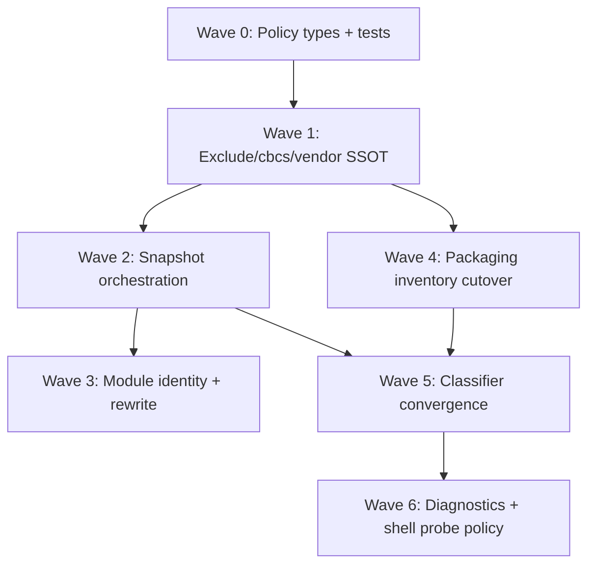

# TN-PROJ-INTEG — Thermo-Nuclear Integration Meta Review

**Critic ID:** TN-PROJ-INTEG  
**Date:** 2026-06-16  
**Baseline commit:** `042be49e5777c587391ddbb396b7ea150e296dfe`  
**Scope:** Vertical integration rollup after 7 slice critics (`TN-PROJ-INV`, `TN-PROJ-CONSUMERS`, `TN-PROJ-REWRITE`, `TN-PROJ-CLASS`, `TN-PROJ-DIAG`, `TN-PROJ-PKG`, `TN-PROJ-SHELL`). **Document only** — no code changes.

**Inputs:** All finding files under [`_findings/`](./), [`00-manifest.md`](../00-manifest.md), [`docs/deslop/AUDIT_app_remaining_handoff.md`](../../../deslop/AUDIT_app_remaining_handoff.md) (R4/R5 briefs), prior [`intelligence-wave-1/_findings/TN-INT-INTEG.md`](../../intelligence-wave-1/_findings/TN-INT-INTEG.md) (Wave 4/5 cross-ref), [`intelligence_wave_1_remediation_plan.md`](../../intelligence-wave-1/intelligence_wave_1_remediation_plan.md) (Wave 4/5).

---

## Executive verdict

**Not thermo-clean.** Intelligence Wave 1 remediation created the R4/R5 kernel modules (`file_inventory.py`, `ProjectInventorySnapshot`, `dependency_classifier.py`, `import_rewrite` relocation), but Project SSOT Wave 1 proves **SSOT stops at module boundaries**: the walk primitive exists while **composed surfaces disagree** on excludes, vendor, `cbcs/`, module naming, and file sets. **~95 raw slice findings** collapse to **20 cross-cutting themes** (`CC-PROJ-01` … `CC-PROJ-20`). The dominant pattern is **contract fragmentation without orchestration** — three independent snapshot builds per generation, tree/search/packaging/intelligence exclude semantics that diverge on slash patterns, triplicate path→module helpers that break `src/` layouts on rewrite, and packaging copy that ships payloads dependency audit never inspects.

**Nine P0 blockers** (13 raw BLOCKER findings) must land before R4/R5 can be marked complete: exclude/pattern-mode parity (tree vs search), snapshot orchestration absence + exclude drift across consumers, move/rename rewrite ignoring source-root stripping, classifier/resolvability policy fork + layer inversion + native-detection fork, packaging copy/audit file-set disagreement, and unreferenced vendor native binaries shipping without audit. **R4** owns inventory policy unification, snapshot orchestration, packaging enumeration cutover, and module-identity SSOT; **R5** owns classifier convergence, layer inversion fix, diagnostics explain adapter, runtime probe policy, and native-extension primitive. Intelligence Wave 4 (`CC-15`, `CC-12`) and Wave 5 (`CC-14`, `CC-22`) remain the upstream remediation tracks — Project SSOT Wave 1 is the **verification gate** that those waves must satisfy for project-layer contracts.

---

## Raw vs deduped counts

| Metric | Approximate count |
|--------|------------------:|
| Slice critics | 7 |
| **Raw findings** (TN-PROJ-*-N entries) | **~95** |
| — BLOCKER severity | 13 |
| — STRUCTURAL severity | ~68 |
| — NICE-TO-HAVE severity | ~14 |
| **Deduped cross-cutting themes** (CC-PROJ-01 … CC-PROJ-20) | **20** |
| — Mapped to **P0** | 9 themes (~13 raw blockers) |
| — Mapped to **P1** | 11 themes (~68 raw structural) |
| — Mapped to **P2** | absorbed into CC-PROJ-18 … CC-PROJ-20 + backlog nits |
| Compression ratio (raw → themes) | ~4.8:1 |

*Counts are approximate: several findings are facets of the same theme (e.g. TN-PROJ-INV-1/8 and TN-PROJ-INV-6 all feed CC-PROJ-01; TN-PROJ-CONSUMERS-1/2/3 and TN-PROJ-SHELL-1/2/5 all feed CC-PROJ-03).*

---

## Severity mapping

| Integration tier | Slice severity | Meaning for fix agent |
|------------------|----------------|------------------------|
| **P0** | BLOCKER | Ship-blocking: file-set disagreement, exclude/`cbcs`/vendor regression, packaging copy vs audit drift, `src/` rewrite corruption, classifier policy fork, layer inversion |
| **P1** | STRUCTURAL | High-conviction code-judo; debt that multiplies on next inventory/classifier/packaging growth |
| **P2** | NICE-TO-HAVE | Backlog: test placement, symlink coverage, inline imports, doc drift, minor dedupe |

---

## P0 — Deduped themes (fix first)

| ID | Theme | Primary critics | Key evidence | Handoff |
|----|-------|-----------------|--------------|---------|
| **CC-PROJ-01** | **Exclude policy fragmentation: three incompatible semantics (name-mode tree, relative-path search, packaging `extra_top_level_skips`) + duplicated `compute_effective_excludes` orchestration** | INV, PKG | `file_inventory.py:53-59,204-208,174-177` — tree hardcodes name mode, search hardcodes relative path; `file_excludes.py:105-108` — slash patterns ignored in name mode; `dependency_audit.py:58` — `extra_top_level_skips=("vendor",)` third knob; `search_panel.py:59-79` — UI `exclude_globs` second plane; `project_service.py:83-87` + four shell call sites duplicate manifest merge | **R4**, gate 4 |
| **CC-PROJ-02** | **Vendor/`cbcs` policy unowned: DEFAULT excludes ≠ walk defaults ≠ packaging skips ≠ layout reserved names** | INV, PKG, REWRITE | `file_excludes.py:18-26` — `"vendor"` in DEFAULT; `iter_python_files` prunes only `cbcs/`; `dependency_audit.py:58` — vendor skip via `extra_top_level_skips`; `import_layout.py:13,115-116` — `_RESERVED_ROOT_NAMES` third plane; `layout.py:8-11` — cbcs subtree rules differ from inventory meta-dir prune | **R4**, gates 3–4 |
| **CC-PROJ-03** | **`ProjectInventorySnapshot` API exists but zero production orchestration; exclude parity broken across consumers; N walks per generation** | CONSUMERS, SHELL, DIAG | `rg inventory_snapshot app/shell/` → no matches; `symbol_index.py:120` passes excludes; `diagnostics_service.py:81` and `completion_providers.py:171,223` rebuild with empty excludes; three independent `build_project_inventory_snapshot` paths; poll + open + save each trigger separate walks (`SHELL-2`, `SHELL-5`) | **R4**, **CC-15**, gates 5–6 |
| **CC-PROJ-04** | **Module identity fork: move/rename rewrite ignores source-root stripping; triplicate path→module helpers; snapshot fallback diverges from canonical layout** | REWRITE, INV, CONSUMERS | `import_rewrite.py:34-35,62-72` → `"src.my_pkg.foo"`; `import_layout.py:212-238` → `"my_pkg.foo"`; `file_inventory.py:280-294` naive fallback; `completion_providers.py:408-428` dead duplicate; no `src/` rewrite tests | **R4**, **CC-22**, **CC-12** |
| **CC-PROJ-05** | **`classify_module` vs `is_module_resolvable` policy fork: packaging and PY200 diagnostics disagree when runtime inventory loaded** | CLASS, DIAG | `dependency_classifier.py:152-157` stdlib-first vs `:229-232` inventory-authoritative; packaging uses `classify_module`, lint uses `is_module_resolvable`; gate 8 open; no cross-consumer parity tests | **R5**, **CC-14**, gate 8 |
| **CC-PROJ-06** | **Layer inversion: project-layer SSOT imports intelligence resolver and runtime probe** | CLASS, DIAG | `dependency_classifier.py:33-34` — `from app.intelligence.import_resolver` + `runtime_import_probe`; gate 10 violated; explain and resolver duplicate filesystem resolution | **R5**, gate 10 |
| **CC-PROJ-07** | **Native-extension detection forked three ways (classifier glob, ingest archive scan, plugin auditor rglob) with different scope semantics** | CLASS, PKG | `has_compiled_extension_candidate` top-level scoped; `dependency_ingest.py:175-201` any-member scan; `auditor.py:48-66` full plugin tree; ingest bypasses classifier; gate 12 open | **R5**, gate 12 |
| **CC-PROJ-08** | **Packaging payload copy bypasses inventory SSOT; copy file-set disagrees with dependency audit** | PKG | `artifact_builder.py:334` — raw `rglob("*")` copies all types including `vendor/`; `dependency_audit.py:58-61` — `iter_python_files` + vendor skip + packaging excludes; ship-blocking: payloads audit never considered | **R4**, **R5** |
| **CC-PROJ-09** | **Unreferenced vendor native binaries can ship without audit coverage** | PKG, CLASS | Audit skips `vendor/` walk; `classify_module` only flags native when import references module; `artifact_builder.py` copies entire `vendor/` including orphan `.so`; contrast `product_builder.py:369-402` native binding validation | **R5**, gate 12 |

---

## P1 — Deduped themes (structural wave)

| ID | Theme | Primary critics | Key evidence | Handoff |
|----|-------|-----------------|--------------|---------|
| **CC-PROJ-10** | **`explain_unresolved_import` is parallel classifier tree, not adapter over `classify_module`** | DIAG, CLASS | `diagnostics_service.py:227-348` bespoke taxonomy; gate 9; never calls `classify_module`; `_looks_like_runtime_specific_module` heuristic duplicates classifier | **R5**, **CC-14**, gate 9 |
| **CC-PROJ-11** | **Runtime probe policy inconsistent: manual lint gated; import analysis and per-node PY200 collection still probe** | DIAG, SHELL | `lint_workflow.py:127` manual-only probe; `:225-226` import analysis hardcodes `allow_runtime_import_probe=True`; `import_diagnostics.py:41-47` subprocess on hot path; startup probe timer independent | **R5**, **CC-14**, gate 9 |
| **CC-PROJ-12** | **Quick-fix/source-root split-brain: intelligence plans, shell applies; message-string parsing contract** | REWRITE, DIAG | `code_actions.py:247-256` emits `add_source_root`; `:101-113` apply drops it; `python_style_workflow.py:262-289` shell-only apply; `_extract_unresolved_module_name` parses message prefix | **R5**, **CC-22**, **CC-14** |
| **CC-PROJ-13** | **Shell rescan orchestration conflates tiers: poll triggers plugin reload + full reindex; tree signature file set ≠ intelligence Python set** | SHELL | `editor_tab_workflow.py:786-790` full entry enumeration includes `cbcs/cache`; `iter_python_files` prunes all `cbcs/`; `reload_current_project` always `reload_plugins=True, reindex=True`; save double-schedules index | **R4**, **CC-15** |
| **CC-PROJ-14** | **Entry inference and layout helpers bypass inventory walk (`iterdir`, `glob`, direct path probes)** | INV, REWRITE | `project_service.py:375-387` — `iterdir()` for entry discovery; `import_layout.py:309-317` — `iterdir()` for source-root suggestion; `:291-294` — `glob("*.py")` namespace probe; pre-open inference before excludes applied | **R4**, gate 1 |
| **CC-PROJ-15** | **`python_structure` dedup incomplete: completion duplicates AST collectors; symbol scope semantics diverge** | CONSUMERS | `collect_completion_symbol_names` never imported; `completion_providers.py:290-405` duplicate walkers; index doc says top-level but `ast.walk` collects nested; maps to intelligence **CC-12** | **R4**, **CC-12** |
| **CC-PROJ-16** | **Packaging cbcs policy split across three mechanisms; docstring lies about full `cbcs/` exclusion** | PKG, INV | `layout.py:122-130` doc claims full `cbcs/` exclude; code only prunes runs/logs/cache; integration test asserts `cbcs/package.json` copied; inventory cbcs prune ≠ packaging cbcs copy rules | **R4**, gate 3 |
| **CC-PROJ-17** | **Relative import classification outside `dependency_classifier`; `check_manifest_consistency` dead validation path** | PKG, CLASS | `dependency_audit.py:211-254` parallel `_classify_relative_import`; `validator.py:79-88` never calls `check_manifest_consistency`; manifest taxonomy (`pure_python`) unmapped to classifier categories | **R5** |
| **CC-PROJ-18** | **`diagnostics_service.py` god module persists (510 LOC): explain tree + four AST walkers + orchestration** | DIAG | Walkers at `:360-477`; explain at `:227-348`; models/PY200 extracted but decomposition incomplete; maps to intelligence **CC-14** | **R5**, **CC-14** |
| **CC-PROJ-19** | **Classifier engine duplication: `is_module_resolvable` reimplements decision tree; runtime inventory tri-state implicit; ingest bypasses classifier** | CLASS | Two functions with divergent stdlib/inventory ordering; `frozenset()` falsy tri-state; `dependency_ingest` parallel taxonomy; manifest ↔ category unmapped | **R5** |
| **CC-PROJ-20** | **SQLite cache-as-truth drift: broker downgrades cache hits; stale indexed paths; non-atomic index delta** | CONSUMERS | `completion_broker.py:416-451` blanket approximate tag; module completion uses indexed paths without generation gate; `symbol_index.py:74-110` separate commit steps | **R4**, **CC-11**, **CC-15** |

---

## P2 — Deduped themes (backlog)

| ID | Theme | Primary critics | Key evidence | Handoff |
|----|-------|-----------------|--------------|---------|
| **CC-PROJ-21** | **Test gaps: snapshot untested, no parity matrices, rescan/cache orchestration untested, rewrite tests in wrong package** | INV, CONSUMERS, SHELL, REWRITE, CLASS | Manifest high-gap rows all open; `tests/unit/intelligence/test_import_rewrite.py` for project module; zero `ProjectRescanWorkflow` tests; symlink coverage python-only | **R6** |
| **CC-PROJ-22** | **Typing/doc/hygiene: inline imports, misleading re-export docstring, duplicate AST offset helpers, double sort in enumeration** | INV, CLASS, DIAG | `file_inventory.py:276-277` inline import; classifier docstring re-export claim false; `ImportDiagnostic` strip/rebuild cycle | **R1**, **R6** |
| **CC-PROJ-23** | **Packaging traversal vocabulary still multiplies (`validator` hidden-path rglob, checksum rglob) — lower risk post CC-PROJ-08** | PKG | `validator.py:323-334`; `installer_manifest.py:245`; defer until project source traversal unified | **R4** |

---

## Top P0 blockers for fix agent (integration view, ordered)

| Rank | CC | Blocker | Why integration-first |
|------|-----|---------|------------------------|
| 1 | **CC-PROJ-03** | No shared snapshot; exclude drift symbol index vs diagnostics/completion | Gate 5/6 violation on every project open; intelligence consumers disagree on file set |
| 2 | **CC-PROJ-01** | Tree vs search exclude semantics disagree on slash patterns | User-configured excludes silently ignored in project tree while honored in search |
| 3 | **CC-PROJ-04** | Move/rename rewrite breaks `src/` layout module names | User-visible import corruption on tree move/rename — data integrity |
| 4 | **CC-PROJ-08** | Packaging copy bypasses inventory; copy ≠ audit file set | Ship payloads dependency audit never evaluated |
| 5 | **CC-PROJ-05** | Classifier vs resolvability policy fork | Same import: stdlib in packaging audit, PY200 in editor when slim inventory |
| 6 | **CC-PROJ-06** | Layer inversion project → intelligence | SSOT module depends on layer it should own; blocks clean R5 cutover |
| 7 | **CC-PROJ-07** | Native detection fork | False negative/positive on vendored native artifacts across ingest/audit/plugin |
| 8 | **CC-PROJ-09** | Orphan vendor `.so` ships unaudited | Ship-blocking native payload gap |
| 9 | **CC-PROJ-02** | Vendor/cbcs/reserved-name third planes | Metadata churn, spurious reloads, inconsistent pruning |

*CC-PROJ-03 shell orchestration is the integration hub — most P1 themes unblock once snapshot + effective-excludes are owned at shell boundary.*

---

## Fix-agent sequencing (ordered PR waves)



### Wave 0 — Policy foundations + parity test scaffolding (no behavioral moves)

| PR | CC themes | Scope | Gate |
|----|-----------|-------|------|
| 0a | CC-PROJ-21 (partial) | Add `inventory_parity_fixtures.py` parametrized matrix skeleton; relocate `test_import_rewrite.py` → `tests/unit/project/` | Fixture module exists; test discovery unchanged |
| 0b | CC-PROJ-02 (partial) | Export `MetaDirPolicy` / `InventoryScope` enum stubs + document vendor triple role in ARCHITECTURE | Doc + types only; no caller migration |

### Wave 1 — Exclude/cbcs/vendor policy unification (R4 gate 3–4)

| PR | CC themes | Scope | Gate |
|----|-----------|-------|------|
| 1a | CC-PROJ-01 | `EffectiveExcludes` with split name/path patterns at settings load; tree + search use same relative-path semantics when patterns contain `/`; merge `compute_effective_excludes` into `effective_excludes_for_project` | Parity test: `exclude_patterns=["src/generated/*"]` — tree/search/python agree |
| 1b | CC-PROJ-02, CC-PROJ-16 | Centralize cbcs policy table; align packaging `layout.py` doc + implementation; unify reserved top-level names via `constants` | Matrix: `cbcs/package.json` copied-not-audited; `cbcs/runs` neither |
| 1c | CC-PROJ-01 (search) | Route search UI globs into effective exclude list or document intentional divergence with parity tests | `exclude_patterns=["build"]` ≡ `exclude_globs=["build/**"]` |

### Wave 2 — Snapshot orchestration at shell boundary (R4 gate 5–6; Intelligence CC-15)

| PR | CC themes | Scope | Gate |
|----|-----------|-------|------|
| 2a | CC-PROJ-03 | `ProjectInventoryOrchestrator` on open/rescan/exclude-change: one `build_project_inventory_snapshot` with effective excludes + generation token; store on session host | Spy: project open → one walk before first completion/import analysis |
| 2b | CC-PROJ-03, CC-PROJ-20 (partial) | Thread snapshot into `start_symbol_indexing`, `find_unresolved_imports`, completion broker; delete per-consumer fallback builds | Same `python_file_paths` tuple reference across three consumers |
| 2c | CC-PROJ-13 | Rescan tiers: poll uses snapshot fingerprint not full entry walk; demote poll reload; save guard against double index | Save-new-file: `update_symbol_index_cache` call count == 1 |
| 2d | CC-PROJ-03 | Snapshot tests: builder, module names, exclude propagation, `discover_canonical_project_modules` parity | Manifest high-gap rows addressed |

### Wave 3 — Module identity SSOT (R4; Intelligence CC-12 partial)

| PR | CC themes | Scope | Gate |
|----|-----------|-------|------|
| 3a | CC-PROJ-04 | Delete `_module_name_from_relative_path` from rewrite; thread `ProjectImportLayout` into `plan_import_rewrites`; `src/` layout tests | Move `src/my_pkg/module.py` → rewrite updates `my_pkg.*` not `src.my_pkg.*` |
| 3b | CC-PROJ-04 | Collapse path→module helpers: inventory snapshot uses `discover_canonical_project_modules` only; delete completion dead forks | `rg _module_name_from_relative_path app/` → only `import_layout` |
| 3c | CC-PROJ-14 | Entry inference via filtered inventory; replace layout `iterdir`/`glob` with inventory primitives | `vendor/run.py` not selected as entry when vendor excluded |
| 3d | CC-PROJ-15 | Hard cutover completion to `python_structure.collect_completion_symbol_names`; explicit `SymbolExtractionScope` | Delete duplicate AST walkers in `completion_providers.py` |

### Wave 4 — Packaging inventory cutover (R4 gate 2; blocks CC-PROJ-08/09)

| PR | CC themes | Scope | Gate |
|----|-----------|-------|------|
| 4a | CC-PROJ-08 | `iter_packaging_payload_entries` replaces `artifact_builder` rglob; shared policy dataclass for copy vs audit subsets | Copy/audit parity test module green |
| 4b | CC-PROJ-08, CC-PROJ-16 | Explicit `PackagingPayloadPolicy`: vendor ships, audit skips vendor python, cbcs metadata rules test-locked | Fixture: vendor + cbcs + user excludes |
| 4c | CC-PROJ-09, CC-PROJ-07 (partial) | Post-copy vendor native scan via shared primitive; block export on orphan `.so` | `vendor/orphan.so` no imports → export blocked |
| 4d | CC-PROJ-23 | Replace `validator._discover_hidden_paths` rglob with inventory walk | Hidden path list matches inventory-derived scan |

### Wave 5 — Classifier convergence (R5 gates 7–8, 10, 12)

| PR | CC themes | Scope | Gate |
|----|-----------|-------|------|
| 5a | CC-PROJ-06 | Move `resolve_project_import` to `app/project/import_resolution.py`; relocate runtime probe to project/bootstrap; classifier imports project-only | `rg 'from app\.intelligence' app/project/dependency_classifier.py` empty |
| 5b | CC-PROJ-05, CC-PROJ-19 | Single classification pipeline; `RuntimeModuleInventory` typed carrier; `is_module_resolvable` as adapter | Parity suite: `json`/`tomllib`/slim inventory — audit vs lint documented or unified |
| 5c | CC-PROJ-07, CC-PROJ-17 | `native_extension_scan.py` primitive; ingest + auditor + classifier consume it; relative imports via classifier | Wheel/tree/wheel classified identically across three callers |
| 5d | CC-PROJ-17 | Wire `check_manifest_consistency` into `build_package_validation_report`; manifest taxonomy mapping module | Export fails on manifest/vendor drift without manual call |

### Wave 6 — Diagnostics adapter + shell probe policy (R5; Intelligence CC-14)

| PR | CC themes | Scope | Gate |
|----|-----------|-------|------|
| 6a | CC-PROJ-10 | `explain_unresolved_import` adapts `classify_module` → `ImportExplanation` templates; delete parallel tree | Parity matrix green |
| 6b | CC-PROJ-11, CC-PROJ-12 | Static-only lint/import collection; probe only on explain/manual audit; unified quick-fix apply owner; `CodeDiagnostic.detail` for module name | Manual lint never calls subprocess; source-root fix end-to-end test |
| 6c | CC-PROJ-18 | Split `diagnostics_service.py`: `builtin_lint_rules.py`, `import_explanations.py`; single AST visitor pass | No file >250 LOC in diagnostics lane |
| 6d | CC-PROJ-20 | Broker whitelist for cache tier; snapshot generation gate on SQLite reads; atomic index delta commit | Cache hit retains `source="cache"` |

**Parallelism:** Wave 0 immediate. Wave 1 must precede Wave 2 (excludes before snapshot). Wave 4a can start after Wave 1b (cbcs policy). Wave 5a layer inversion should precede 5b policy unification. Wave 6 depends on Wave 5b classifier SSOT. Wave 3 module identity can parallelize with Wave 4 packaging once Wave 2a snapshot exists.

**Intelligence Wave alignment:** Project Wave 2 ≡ Intelligence remediation Wave 4 Step 4.1 (`CC-15`). Project Wave 3d ≡ Intelligence Wave 4 Step 4.3 (`CC-12`). Project Wave 5–6 ≡ Intelligence Wave 5 (`CC-14`, `CC-22`, `CC-17` partial).

---

## R4 / R5 / Intelligence CC mapping summary

| Handoff brief | Primary CC-PROJ themes | Slice critics most involved | Intelligence CC cross-ref |
|---------------|------------------------|----------------------------|---------------------------|
| **R4** — Project inventory SSOT | CC-PROJ-01, CC-PROJ-02, CC-PROJ-03, CC-PROJ-04, CC-PROJ-08, CC-PROJ-13, CC-PROJ-14, CC-PROJ-16, CC-PROJ-20, CC-PROJ-23 | INV, CONSUMERS, SHELL, PKG, REWRITE | **CC-15**, CC-12, CC-11 |
| **R5** — Dependency classifier SSOT | CC-PROJ-05, CC-PROJ-06, CC-PROJ-07, CC-PROJ-09, CC-PROJ-10, CC-PROJ-11, CC-PROJ-12, CC-PROJ-17, CC-PROJ-18, CC-PROJ-19 | CLASS, DIAG, PKG, REWRITE | **CC-14**, CC-22, CC-17 |
| **R1** — Small cleanup sweep | CC-PROJ-22 | INV, CLASS, DIAG | CC-19, CC-23 |
| **R6** — Test audit | CC-PROJ-21, CC-PROJ-22 | All slices | CC-21 |
| Architecture gate 1 | CC-PROJ-14, CC-PROJ-08 | INV, REWRITE, PKG | — |
| Architecture gate 2 | CC-PROJ-08 | PKG | — |
| Architecture gate 3 | CC-PROJ-02, CC-PROJ-16 | INV, PKG, SHELL | — |
| Architecture gate 4 | CC-PROJ-01, CC-PROJ-02 | INV, PKG, REWRITE | — |
| Architecture gate 5 | CC-PROJ-03, CC-PROJ-13 | CONSUMERS, SHELL | CC-15 |
| Architecture gate 6 | CC-PROJ-03 | CONSUMERS, SHELL | CC-15 |
| Architecture gate 7 | CC-PROJ-05, CC-PROJ-17 | CLASS, PKG | — |
| Architecture gate 8 | CC-PROJ-05 | CLASS, DIAG | — |
| Architecture gate 9 | CC-PROJ-10, CC-PROJ-11 | DIAG, SHELL | CC-14 |
| Architecture gate 10 | CC-PROJ-06 | CLASS, DIAG | — |
| Architecture gate 11 | CC-PROJ-06 (partial) | PKG | — |
| Architecture gate 12 | CC-PROJ-07, CC-PROJ-09 | CLASS, PKG | — |

Global rules: hard cutover importers; one walk per generation once Wave 2 lands; packaging copy/audit divergence must be explicit policy object not accidental loops; four-theme validation for UI-touching shell PRs; no dot-prefixed storage paths.

---

## Positive signals (patterns to replicate)

| Extraction / pattern | Why it worked | Critics citing |
|----------------------|---------------|----------------|
| **`walk_project` SSOT kernel** | Deterministic `os.walk`, explicit `cbcs/` prune, sorted yields — credible primitive | INV |
| **Historical `rglob('*.py')` migration** | Zero live `rglob('*.py')` in `app/`; intelligence consumers use `iter_python_files` | manifest, CONSUMERS |
| **`import_rewrite` hard cutover to `app/project/`** | No intelligence importers; inventory scan; `atomic_write_batch` | REWRITE-9, CC-22 done |
| **`project_tree_controller` rewrite seam** | Shell delegates plan/apply to project layer; policy injection; no intelligence imports | REWRITE-14 |
| **`dependency_classifier.py` public module + strong unit matrix** | Constants, categories, packaging audit delegation started | CLASS |
| **`ProjectInventorySnapshot` frozen dataclass** | Right contract shape — needs orchestration not deletion | INV-4, CONSUMERS-1 |
| **`python_structure.py` extraction started** | Canonical AST helpers exist — finish cutover to completion | CONSUMERS-7, CC-12 |
| **AD-017 scheduler for symbol index** | Bespoke `SymbolIndexWorker` thread gone; generation stale-drop | CONSUMERS, manifest |
| **`LintWorkflow` manual probe policy + tests** | `trigger == "manual"` gate with strong test coverage | SHELL-7, DIAG-1 partial |
| **`product_builder` filtered copy + native validation** | Pattern packaging export should adopt | PKG-11 |
| **`file_inventory` iterator test suite** | Thorough per-iterator tests — extend to parity matrices | INV-15 |
| **Packaging blocks on validation before copy** | Export gate ordering correct; residual risk is audit subset not TOCTOU | PKG-14 |
| **Pyflakes + PY200 coexistence fixed** | Intelligence Wave 1 remediated provider fork for unresolved imports | DIAG-15 partial |

**Pattern to replicate:** typed policy objects (`InventoryScope`, `PackagingPayloadPolicy`, `RuntimeModuleInventory`) + single walk product consumed by N surfaces + canonical module naming through `import_layout` only + classifier as sole resolution engine with explicit policy adapters.

**Pattern to retire:** per-consumer `build_project_inventory_snapshot` fallbacks; dual `pattern_mode` footguns; triplicate path→module helpers; packaging `rglob` copy; parallel explain classifier tree; project→intelligence imports in SSOT modules; message-string diagnostic contracts.

---

## Approval bar (Project SSOT Wave 1 → fix agent)

**Do not approve** R4 or R5 completion, new inventory iterators, classifier branches, packaging export paths, or import rewrite features until:

1. All **P0** themes (CC-PROJ-01 … CC-PROJ-09) are fixed or explicitly product-waived with parity tests documenting the exception.
2. **One walk per project generation** at shell boundary (CC-PROJ-03) — no new independent `build_project_inventory_snapshot` on hot paths.
3. **Tree/search/intelligence exclude parity** (CC-PROJ-01) — slash patterns cannot silently fail in tree enumeration.
4. **Move/rename rewrite uses `import_layout` module names** (CC-PROJ-04) — no fourth path→module implementation.
5. **Packaging copy and audit share explicit payload policy** (CC-PROJ-08) — no raw `rglob` on project source export.
6. **`dependency_classifier` has zero `app.intelligence` imports** (CC-PROJ-06) — layer direction restored.
7. **`classify_module` and `is_module_resolvable` parity documented or unified** (CC-PROJ-05) — packaging and PY200 cannot disagree without signed policy.
8. **Native extension detection uses one primitive** (CC-PROJ-07) — ingest, audit, plugin paths consume shared scan.

---

## Per-critic verdict summary

| Critic | Verdict | Integration note |
|--------|---------|------------------|
| **TN-PROJ-INV** | **Not thermo-clean** | Supplies 2 blockers (CC-PROJ-01, CC-PROJ-02); walk kernel credible but composed surfaces disagree |
| **TN-PROJ-CONSUMERS** | **Not thermo-clean** | Supplies 1 blocker (CC-PROJ-03 exclude drift); snapshot API dead wiring; maps to intelligence CC-15/CC-11 |
| **TN-PROJ-REWRITE** | **Not thermo-clean** | Supplies 1 blocker (CC-PROJ-04); CC-22 relocation done; module identity + source-root split brain open |
| **TN-PROJ-CLASS** | **Not thermo-clean** | Supplies 3 blockers (CC-PROJ-05, CC-PROJ-06, CC-PROJ-07); classifier exists but is not SSOT |
| **TN-PROJ-DIAG** | **Not thermo-clean** | Supplies 1 blocker (CC-PROJ-11 probe); explain parallel tree (CC-PROJ-10); layer inversion (CC-PROJ-06) |
| **TN-PROJ-PKG** | **Not thermo-clean** | Supplies 4 blockers (CC-PROJ-08, CC-PROJ-09, CC-PROJ-16 partial, CC-PROJ-02 partial); R4 gate 2 open |
| **TN-PROJ-SHELL** | **Not thermo-clean** | Supplies 1 blocker (CC-PROJ-03 orchestration); poll/rescan/save multiply walks; signature/intelligence file-set mismatch |

**Slice approval tally:** 0 of 7 thermo-clean; 7 not clean.

---

## Cross-reference: intelligence-wave-1 Wave 4/5 and CC themes

| Intelligence CC | Project SSOT Wave 1 status | CC-PROJ mapping |
|-----------------|----------------------------|-----------------|
| **CC-15** — R4 inventory partial; N walks | **Open, verified worse** — snapshot API exists, zero shell orchestration, exclude drift | **CC-PROJ-03**, CC-PROJ-13, CC-PROJ-20 |
| **CC-12** — Python structure fork (5 modules) | **Partial** — `python_structure.py` exists; completion duplicates collectors | **CC-PROJ-15**, CC-PROJ-04 (module names) |
| **CC-14** — `diagnostics_service.py` god module | **Open** — 510 LOC; explain tree; probe on hot paths | **CC-PROJ-10**, CC-PROJ-11, CC-PROJ-18 |
| **CC-22** — misplaced `import_rewrite` | **Done** — project layer, inventory scan | REWRITE-9 (positive); CC-PROJ-12 remains (source-root split) |
| **CC-11** — parallel worker / cache-as-truth | **Partial** — AD-017 scheduler fixed; broker downgrade + stale SQLite paths open | **CC-PROJ-20** |
| **CC-17** — rename split-brain | **Out of project wave scope** — rewrite uses `atomic_write_batch`; code_actions rollback bespoke | CC-PROJ-12 (partial, quick-fix apply) |
| Intelligence CC-01–CC-10 (session/broker/shell) | **Out of scope** — owned by Intelligence Wave 1 | No CC-PROJ mapping |

Intelligence Wave 4 Step 4.1 (`ProjectInventorySnapshot` shared) is the **prerequisite** for closing CC-PROJ-03. Intelligence Wave 5 Step 5.1 (diagnostics decomposition + static-only lint) is the **prerequisite** for closing CC-PROJ-10/CC-PROJ-11/CC-PROJ-18. Project SSOT Wave 1 fix agents should treat intelligence remediation Waves 4–5 as **parallel tracks** that must converge at the shell orchestration seam (Wave 2 above).

---

## Cross-reference: R4/R5 handoff briefs

| R4/R5 acceptance criterion (handoff) | Wave 1 finding | CC-PROJ |
|--------------------------------------|----------------|---------|
| R4: Search, diagnostics, symbol indexing, import rewrite, completion, packaging use same inventory API | Packaging still uses `rglob`; snapshot not shared; exclude modes diverge | CC-PROJ-01, CC-PROJ-03, CC-PROJ-08 |
| R4: Existing exclude behavior preserved | Tree ignores slash patterns — behavior differs from search by design bug | CC-PROJ-01 |
| R4: No hidden directory rule regressions | cbcs policy split three ways | CC-PROJ-02, CC-PROJ-16 |
| R5: Classification rules in one public module | Two engines + explain tree + relative import fork | CC-PROJ-05, CC-PROJ-10, CC-PROJ-17 |
| R5: Packaging does not import private intelligence symbols | **Pass** — verify no regression | — |
| R5: Diagnostics and packaging agree on representative cases | **Fail** — stdlib policy fork | CC-PROJ-05 |
| R5: No packaging regression on native-extension blocking | **Fail** — orphan vendor native can ship; detection forked | CC-PROJ-07, CC-PROJ-09 |

---

## Cross-reference index (raw finding → CC theme)

<details>
<summary>Quick lookup: slice finding IDs → CC-PROJ theme (click to expand)</summary>

| Raw IDs (sample) | CC-PROJ |
|------------------|---------|
| INV-1, INV-6, INV-7, INV-8, PKG-5, REWRITE-8 | CC-PROJ-01 |
| INV-2, INV-9, PKG-3, REWRITE-7, SHELL-3 | CC-PROJ-02 |
| CONSUMERS-1, CONSUMERS-2, CONSUMERS-3, SHELL-1, SHELL-2, SHELL-5, SHELL-8, SHELL-10, DIAG-12, INV-4, INV-12, INV-15 | CC-PROJ-03 |
| REWRITE-1, REWRITE-2, REWRITE-12, INV-5, CONSUMERS-4 | CC-PROJ-04 |
| CLASS-1, CLASS-6, CLASS-7, CLASS-8, DIAG-6 | CC-PROJ-05 |
| CLASS-2, DIAG-4, DIAG-5 | CC-PROJ-06 |
| CLASS-3, CLASS-4, CLASS-12, PKG-9 | CC-PROJ-07 |
| PKG-1, PKG-2, PKG-8, PKG-11, PKG-13 | CC-PROJ-08 |
| PKG-9, PKG-14 | CC-PROJ-09 |
| DIAG-2, DIAG-3, CLASS-1 (explain facet) | CC-PROJ-10 |
| DIAG-1, DIAG-13, SHELL-6, SHELL-7 | CC-PROJ-11 |
| REWRITE-3, REWRITE-4, REWRITE-10, DIAG-8, DIAG-9 | CC-PROJ-12 |
| SHELL-2, SHELL-3, SHELL-4, SHELL-5, SHELL-8, SHELL-12 | CC-PROJ-13 |
| INV-3, REWRITE-5, REWRITE-6, SHELL-9 | CC-PROJ-14 |
| CONSUMERS-7, CONSUMERS-8 | CC-PROJ-15 |
| PKG-3, PKG-4, INV-9 | CC-PROJ-16 |
| PKG-6, PKG-7, CLASS-5 | CC-PROJ-17 |
| DIAG-10, DIAG-11, DIAG-14, DIAG-15 | CC-PROJ-18 |
| CLASS-4, CLASS-5, CLASS-6, CLASS-7, CLASS-10 | CC-PROJ-19 |
| CONSUMERS-5, CONSUMERS-6, CONSUMERS-9, CONSUMERS-11 | CC-PROJ-20 |
| INV-11, INV-13, INV-14, INV-15, CONSUMERS-12, REWRITE-9, REWRITE-11, REWRITE-13, CLASS-9, CLASS-11, SHELL-11 | CC-PROJ-21 |
| INV-13, INV-14, CLASS-9, DIAG-7, DIAG-14 | CC-PROJ-22 |
| PKG-10, PKG-12 | CC-PROJ-23 |

</details>

---

## Wave 1 remediation closure (2026-06-17)

**Status:** P0 blockers CC-PROJ-01…09 addressed; program verification gates green on fast shard + pyright.

| CC | Closure evidence |
|----|------------------|
| CC-PROJ-01 | `EffectiveExcludes` + auto pattern mode; `test_inventory_parity.py -k exclude` green |
| CC-PROJ-02 | `RESERVED_PROJECT_TOP_LEVEL_NAMES`, layout doc fix, `test_inventory_parity.py -k cbcs_vendor` green |
| CC-PROJ-03 | `ProjectInventoryOrchestrator`; snapshot injected; no `build_project_inventory_snapshot` in `app/intelligence/` |
| CC-PROJ-04 | Layout-aware `import_rewrite`; `_module_name_from_relative_path` deleted |
| CC-PROJ-05 | Unified classifier pipeline + `test_classifier_parity.py` |
| CC-PROJ-06 | `rg 'from app\.intelligence' app/project/` → empty |
| CC-PROJ-07 | Shared `native_extension_scan.py` + `test_native_extension_scan.py` |
| CC-PROJ-08 | `iter_packaging_payload_entries`; no `rglob` in `artifact_builder.py` project copy |
| CC-PROJ-09 | Orphan vendor `.so` blocking in audit/validator tests |

**Verification (2026-06-17):**

```bash
python3 testing/run_test_shard.py fast   # green
npx pyright                              # 0 errors
rg 'from app\.intelligence' app/project/ # empty
rg 'build_project_inventory_snapshot' app/intelligence/  # empty
rg 'rglob\("' app/packaging/artifact_builder.py           # empty
rg '_module_name_from_relative_path' app/                  # empty
```

**Residual P1/P2 (not blocking P0):** CC-PROJ-18 (`diagnostics_service.py` 259 LOC, target ≤250); CC-PROJ-22 inline-import hygiene (PROJ-R-26 optional / waived).

---

*End of TN-PROJ-INTEG. Per-slice evidence: [`TN-PROJ-INV.md`](./TN-PROJ-INV.md) … [`TN-PROJ-SHELL.md`](./TN-PROJ-SHELL.md). Consolidated rollup target: [`../project_ssot_wave_1_thermo_review_2026-06-16.md`](../project_ssot_wave_1_thermo_review_2026-06-16.md). Remediation sequencing target: [`../project_ssot_wave_1_remediation_plan.md`](../project_ssot_wave_1_remediation_plan.md).*
