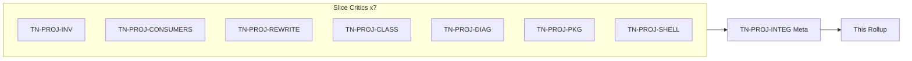
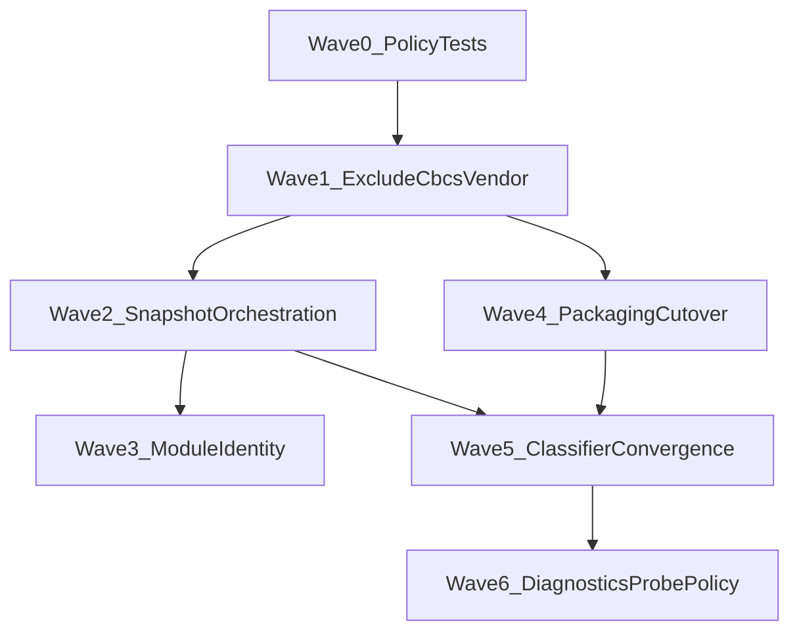

# Project SSOT Wave 1 — Thermo-Nuclear Code Quality Review (2026-06-16)

> Strict maintainability and structural-simplification pass over R4/R5 Project SSOT on **`042be49e5777c587391ddbb396b7ea150e296dfe`**. Seven slice critics plus one integration meta-reviewer (`TN-PROJ-INTEG`), using the thermo-nuclear rubric (code-judo, 1k rule, no rubber-stamping). **Document only** — no remediation commits in this round.
>
> **Per-critic raw findings:** [`_findings/`](_findings/) (8 files). **Prior handoff:** [`docs/deslop/AUDIT_app_remaining_handoff.md`](../../deslop/AUDIT_app_remaining_handoff.md) R4/R5. **Intelligence cross-read:** [`intelligence-wave-1`](../intelligence-wave-1/intelligence_wave_1_thermo_review_2026-06-16.md) Wave 4/5.

---

## 0. How this review is organized

**Severity model (thermo-native):**

| Tier | Meaning |
|------|---------|
| **P0 BLOCKER** | SSOT contract violation with user-visible or ship-blocking impact: file-set disagreement, `cbcs`/exclude regression, packaging-vs-diagnostics classification disagreement, native-extension false negative/positive, or runtime probes on hot lint paths |
| **P1 STRUCTURAL** | High-conviction code-judo moves: duplicated full-project walks, forked AST/structure extractors, parallel classification trees, ownership inversion, or packaging traversal drift |
| **P2 NICE-TO-HAVE** | Backlog: tests, doc drift, typing hygiene, dead helpers, or small cleanup that does not change SSOT contracts |

**Approval bar (integration thermo):** Project SSOT is **not thermo-clean**. `file_inventory.py` and `dependency_classifier.py` exist, but the SSOT stops at module boundaries: tree/search/packaging/intelligence disagree on excludes, project generations trigger multiple walks, move/rename rewrite breaks `src/` layouts, and diagnostics/packaging can classify the same import differently.

---

## 1. Executive summary

| Metric | Count |
|--------|------:|
| Slice critics | 7 |
| Raw finding entries (slice) | ~95 |
| — BLOCKER severity | 13 |
| — STRUCTURAL severity | ~68 |
| — NICE-TO-HAVE severity | ~14 |
| **Deduped cross-cutting themes** | **23** |
| **P0 BLOCKER (deduped)** | **9** |
| **P1 STRUCTURAL (deduped)** | **11** |
| **P2 NICE-TO-HAVE (deduped)** | **3** |

**Top blockers (integration view):**

1. **No shared `ProjectInventorySnapshot` orchestration** — symbol index, diagnostics, and completion rebuild different snapshots with different exclude policy.
2. **Exclude policy fragmentation** — tree enumeration ignores slash patterns that search honors; vendor and `cbcs` policy is split across multiple knobs.
3. **Move/rename rewrite corrupts `src/` layouts** — import rewrite derives `src.my_pkg` while import layout says `my_pkg`.
4. **Packaging copy bypasses inventory** — payload copy uses raw `rglob("*")` and ships file sets dependency audit never inspected.
5. **Classifier policy fork** — `classify_module` and `is_module_resolvable` can disagree for stdlib/runtime cases.
6. **Project-layer classifier imports intelligence** — dependency direction is inverted.
7. **Native-extension detection forks** — ingest, audit, and plugin auditor scan with different semantics.
8. **Orphan vendor native binaries can ship unaudited** — import audit only sees referenced modules.

**Dominant risk:** not missing helpers — **contract fragmentation without orchestration**. The primitives are mostly present; the codebase needs one owned project-generation inventory, one module-identity contract, one classifier contract, and one packaging payload policy.

**What already works (replicate this pattern):**

- `walk_project` as deterministic traversal kernel.
- Historical `rglob('*.py')` migration is complete.
- `import_rewrite` hard-cut to `app/project/` with `atomic_write_batch`.
- `project_tree_controller` delegates rewrite planning cleanly.
- `dependency_classifier.py` provides a useful public module and strong unit matrix.
- `ProjectInventorySnapshot` has the right shape, but needs orchestration.
- AD-017 symbol indexing scheduler replaced the old worker thread.
- Product packaging has a strong allowlist/native-validation pattern worth adapting.

---

## 2. P0 BLOCKER — deduped themes

| ID | Theme | Primary critics |
|----|-------|-----------------|
| **CC-PROJ-01** | Exclude policy fragmentation: name-mode tree, relative-path search, packaging `extra_top_level_skips`, duplicated effective-excludes orchestration | INV, PKG |
| **CC-PROJ-02** | Vendor/`cbcs` policy unowned: default excludes, inventory defaults, packaging skips, and import-layout reserved names all differ | INV, PKG, REWRITE |
| **CC-PROJ-03** | `ProjectInventorySnapshot` API exists but production does not share it; consumers rebuild with different excludes and N walks per generation | CONSUMERS, SHELL, DIAG |
| **CC-PROJ-04** | Module identity fork: move/rename rewrite ignores source-root stripping and duplicates path-to-module logic | REWRITE, INV, CONSUMERS |
| **CC-PROJ-05** | `classify_module` vs `is_module_resolvable` policy fork can make packaging and PY200 disagree | CLASS, DIAG |
| **CC-PROJ-06** | Layer inversion: `app/project/dependency_classifier.py` imports intelligence resolver/probe modules | CLASS, DIAG |
| **CC-PROJ-07** | Native-extension detection forked across classifier, dependency ingest, and plugin auditor | CLASS, PKG |
| **CC-PROJ-08** | Packaging payload copy bypasses inventory and copies a different file set than dependency audit scans | PKG |
| **CC-PROJ-09** | Unreferenced vendor native binaries can ship without audit coverage | PKG, CLASS |

---

## 3. P1 STRUCTURAL — deduped themes

| ID | Theme | Primary critics |
|----|-------|-----------------|
| **CC-PROJ-10** | `explain_unresolved_import` is a second classifier, not an adapter over `classify_module` | DIAG, CLASS |
| **CC-PROJ-11** | Runtime probe policy is inconsistent; import analysis can still run per-import AppRun probes | DIAG, SHELL |
| **CC-PROJ-12** | Quick-fix/source-root ownership is split between intelligence planning and shell apply, with message-string contracts | REWRITE, DIAG |
| **CC-PROJ-13** | Shell rescan conflates plugin reload, tree refresh, and full reindex; tree signature file set differs from intelligence file set | SHELL |
| **CC-PROJ-14** | Entry inference and layout helpers bypass inventory with `iterdir`, `glob`, and direct probes | INV, REWRITE |
| **CC-PROJ-15** | `python_structure` dedup is incomplete; completion still has AST collectors and symbol scope mismatch | CONSUMERS |
| **CC-PROJ-16** | Packaging `cbcs` policy is split; `is_packaging_excluded_path` docs claim full `cbcs` exclusion but code copies metadata | PKG, INV |
| **CC-PROJ-17** | Relative import classification and manifest consistency live outside classifier/validator flow | PKG, CLASS |
| **CC-PROJ-18** | `diagnostics_service.py` remains a broad orchestrator with explain logic and multiple AST walkers | DIAG |
| **CC-PROJ-19** | Classifier engine still duplicates decision logic and leaves runtime inventory tri-state implicit | CLASS |
| **CC-PROJ-20** | SQLite cache-as-truth drift: broker downgrades cache hits, stale paths are possible, and index delta writes are non-atomic | CONSUMERS |

---

## 4. P2 NICE-TO-HAVE — deduped themes

| ID | Theme | Primary critics |
|----|-------|-----------------|
| **CC-PROJ-21** | Test gaps: snapshot API, parity matrices, rescan orchestration, rewrite package placement | All |
| **CC-PROJ-22** | Typing/doc/hygiene: inline imports, misleading re-export docs, duplicate offset helpers, double sorting | INV, CLASS, DIAG |
| **CC-PROJ-23** | Packaging traversal vocabulary still multiplies in lower-risk artifact/checksum paths | PKG |

---

## 5. Fix-agent sequencing

Ordered PR waves from [`TN-PROJ-INTEG`](_findings/TN-PROJ-INTEG.md). **Wave 0 and Wave 1 establish policy before orchestration.**

| Wave | Focus | CC themes | Gate |
|------|-------|-----------|------|
| **0** | Policy foundations + parity test scaffolding | CC-PROJ-21, CC-PROJ-02 partial | Fixtures exist; no behavior moves |
| **1** | Exclude/`cbcs`/vendor policy unification | CC-PROJ-01, CC-PROJ-02, CC-PROJ-16 | Tree/search/python/package parity fixture |
| **2** | Snapshot orchestration at shell boundary | CC-PROJ-03, CC-PROJ-13, CC-PROJ-20 partial | One walk per project generation |
| **3** | Module identity SSOT | CC-PROJ-04, CC-PROJ-14, CC-PROJ-15 | `src/` move/rename rewrite correct |
| **4** | Packaging inventory cutover | CC-PROJ-08, CC-PROJ-09, CC-PROJ-16, CC-PROJ-23 | Payload copy/audit parity |
| **5** | Classifier convergence | CC-PROJ-05, CC-PROJ-06, CC-PROJ-07, CC-PROJ-17, CC-PROJ-19 | Project classifier has zero intelligence imports |
| **6** | Diagnostics adapter + shell probe policy | CC-PROJ-10, CC-PROJ-11, CC-PROJ-12, CC-PROJ-18, CC-PROJ-20 | Explain adapts classifier; lint hot paths static-only |

**Parallelism:** Wave 0 can start immediately. Wave 4 can begin after Wave 1b defines the payload policy. Wave 3 can parallelize with Wave 4 after Wave 2a gives module identity a shared snapshot. Wave 6 depends on Wave 5 because diagnostics should adapt the classifier after the classifier boundary is corrected.

---

## 6. Per-critic index

| Critic | Verdict | Integration note |
|--------|---------|------------------|
| [TN-PROJ-INV](_findings/TN-PROJ-INV.md) | Not thermo-clean | Walk kernel credible; tree/search/vendor/`cbcs` semantics disagree |
| [TN-PROJ-CONSUMERS](_findings/TN-PROJ-CONSUMERS.md) | Not thermo-clean | Snapshot API exists but production sharing is absent |
| [TN-PROJ-REWRITE](_findings/TN-PROJ-REWRITE.md) | Not thermo-clean | Import rewrite relocated, but module identity breaks `src/` layouts |
| [TN-PROJ-CLASS](_findings/TN-PROJ-CLASS.md) | Not thermo-clean | Classifier exists but is not the sole classification boundary |
| [TN-PROJ-DIAG](_findings/TN-PROJ-DIAG.md) | Not thermo-clean | Explain/probe/quick-fix paths bypass classifier contracts |
| [TN-PROJ-PKG](_findings/TN-PROJ-PKG.md) | Not thermo-clean | Copy/audit file-set disagreement blocks R4 packaging acceptance |
| [TN-PROJ-SHELL](_findings/TN-PROJ-SHELL.md) | Not thermo-clean | Shell has no shared inventory owner |
| [TN-PROJ-INTEG](_findings/TN-PROJ-INTEG.md) | Meta | Deduped CC-PROJ-01 … CC-PROJ-23 |

**Slice approval tally:** 0 of 7 thermo-clean.

---

## 7. Cross-reference to prior waves

| Prior theme | Project SSOT status |
|-------------|---------------------|
| Intelligence **CC-15** — R4 inventory partial | Open and verified: no shared snapshot; maps to CC-PROJ-03 |
| Intelligence **CC-12** — Python structure fork | Partial: `python_structure.py` exists but completion duplication remains; maps to CC-PROJ-15 |
| Intelligence **CC-14** — diagnostics god module | Open: explain tree and probe policy remain; maps to CC-PROJ-10/11/18 |
| Intelligence **CC-22** — misplaced `import_rewrite` | Relocation done; module identity/source-root issues remain; maps to CC-PROJ-04/12 |
| Shell wave 2 — R4 Project Inventory SSOT | This review is the planned verification pass |
| Shell wave 3 — R5 Dependency Classifier SSOT | This review is the planned verification pass |

---

## 8. Fix-agent quick start

1. Read [`TN-PROJ-INTEG`](_findings/TN-PROJ-INTEG.md) first for deduped CC themes and ordered waves.
2. Start with **Wave 0** fixtures/policy types, then **Wave 1** exclude/`cbcs` policy.
3. Do not implement snapshot sharing before exclude policy is explicit; otherwise the snapshot just centralizes drift.
4. Do not mark R5 complete until `dependency_classifier.py` no longer imports intelligence and diagnostics/package audit parity tests exist.
5. Run targeted R4/R5 tests plus `python3 testing/run_test_shard.py fast` and `npx pyright` before closing any remediation PR.

**Manifest and metric baseline:** [`00-manifest.md`](00-manifest.md)

**Remediation plan:** [`project_ssot_wave_1_remediation_plan.md`](project_ssot_wave_1_remediation_plan.md)

**Implementation plan:** [`project_ssot_wave_1_implementation_plan.md`](project_ssot_wave_1_implementation_plan.md)
