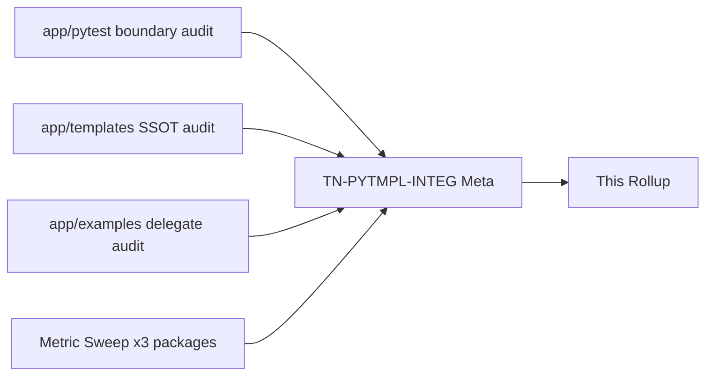
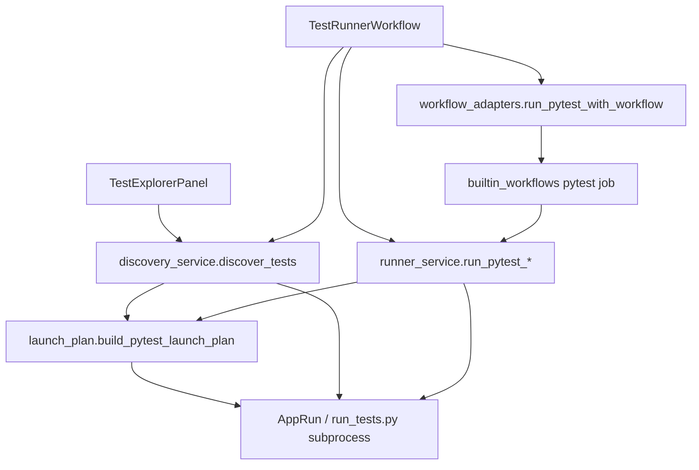
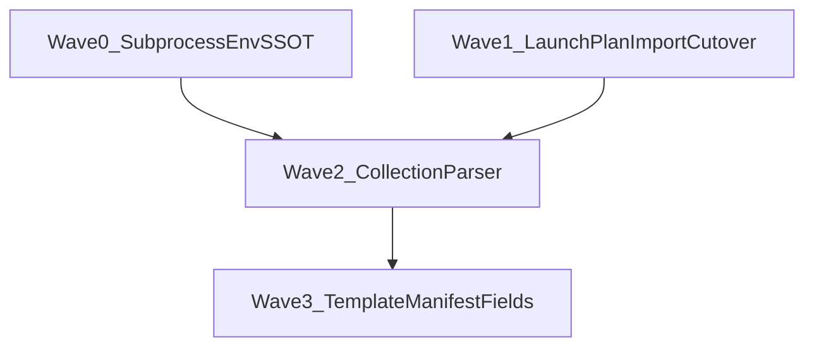

# Pytest / Templates / Examples Wave 1 — Thermo-Nuclear Code Quality Review (2026-06-22)

> Full-package baseline of **`app/pytest/`**, **`app/templates/`**, and **`app/examples/`** on **`c4aed0a48dabd0663c2a666711dee85614f7fb7d`**. Single integration reviewer (`TN-PYTMPL-INTEG`) applying the thermo-nuclear rubric (code-judo, 1k-line rule, boundary SSOT, hard-cutover, no rubber-stamping). **Document only** — no remediation commits in this round.
>
> **Architecture canon:** `docs/ARCHITECTURE.md` §12.9 (templates), §18 (template types + Help-only examples), §25b (first-class testing workflow), §12.12.1 (import layout SSOT for pytest `sys.path`); Run Wave 1 grep gates in `tests/unit/run/test_run_wave_grep_gates.py`.

---

## 0. How this review is organized

**Severity model (thermo-native):**

| Tier | Meaning |
|------|---------|
| **P0 BLOCKER** | Sole 1k-line violation, ship-blocking subprocess/discovery break, manifest data-loss |
| **P1 STRUCTURAL** | High-conviction code-judo: AppRun seam drift, stdout-parser fragility, manifest SSOT fork |
| **P2 NICE-TO-HAVE** | Dead helpers, inline imports, magic-string coupling, schema minimalism |

**Approval bar (integration thermo):** Package size and decomposition are **excellent** (8 modules, 862 LOC combined, **zero files ≥700**). Hard cutover from `app/run/pytest_*.py` is **complete** (grep-gated). **`app/pytest/` is not thermo-clean at the AppRun subprocess boundary**: discovery and runner diverge on subprocess environment, stdout parsing is the semantic source of truth for the Test Explorer tree, and `runner_service` re-exports launch-plan SSOT. **`app/templates/` and `app/examples/` pass** with one manifest-parity P1. **No P0 blockers.**

---

## 1. Executive summary

| Metric | `app/pytest/` | `app/templates/` | `app/examples/` | Combined |
|--------|-------------:|-----------------:|----------------:|---------:|
| Python files | 5 | 2 | 2 | **8** |
| Total LOC | 678 | 144 | 40 | **862** |
| Largest file | `discovery_service.py` / `launch_plan.py` — **217** | `template_service.py` — **139** | `example_project_service.py` — **40** | **217** |
| Files ≥700 LOC | 0 | 0 | 0 | **0** |
| Files ≥1000 LOC | 0 | 0 | 0 | **0** |
| Explicit `: Any` (`rg ': Any\b'`) | **0** | **0** | **0** | **0** |
| `Any` in JSON boundary helpers (`dict[str, Any]`) | 0 | **2** | 0 | **2** |
| Inbound importers (non-self) | **9** | **8** | **4** | — |

| Integration item | Value |
|------------------|------:|
| Baseline commit | `c4aed0a48dabd0663c2a666711dee85614f7fb7d` |
| **Deduped CC themes** | **11** |
| **P0** | **0** |
| **P1 STRUCTURAL** | **4** |
| **P2 backlog** | **7** |
| **`app/pytest/` verdict** | **REJECT** |
| **`app/templates/` verdict** | **ACCEPT** |
| **`app/examples/` verdict** | **ACCEPT** |
| **Overall verdict** | **REJECT** |

**Top structural risks (integration view):**

1. **Discovery vs runner subprocess env asymmetry** — discovery sets `QT_QPA_PLATFORM=offscreen`; runner passes no env override (CC-PYTEST-01).
2. **Stdout parsing is the Test Explorer semantic SSOT** — collect-only and `-rA` parsers drop parametrized nodes, never populate line numbers (CC-PYTEST-02).
3. **`build_pytest_launch_plan` duplicated at runner façade** — grep gate requires string in both modules but implementation re-export invites drift (CC-PYTEST-03).
4. **`default_entry` hardcoded in materializer, not in `template.json`** — manifest parity relies on convention + tests, not template SSOT (CC-TMPL-01).

**What already works (replicate this pattern):**

- **`launch_plan.py` as shared AppRun contract** — discovery and runner both call `build_pytest_launch_plan` / `build_pytest_command`; vendor probe, `run_tests.py` bootstrap, import-mode injection, cacheprovider disable centralized (`launch_plan.py:55-217`).
- **Hard cutover from `app/run/pytest_*`** — `test_no_pytest_modules_under_app_run` gate passes; dedicated `app/pytest/` package is sole production path.
- **Module split** — `outcome_types.py` (8 LOC) vocabulary; discovery vs runner vs launch plan responsibilities separated; no monoliths.
- **`ExampleProjectService` code-judo** — 40 LOC delegate to `TemplateService` with separate root; Help-only boundary matches ARCHITECTURE §18.4.
- **Visible metadata paths** — materializer injects `cbcs/project.json`; copytree ignores legacy dot-prefixed metadata dirs (`template_service.py:16-20`, `88-90`); integration tests assert no `.cbcs/` (`test_template_generation.py:52-55`).
- **Python 3.9 posture** — `from __future__ import annotations` on all scoped modules; `Literal` types for outcomes/kinds.

---

## 2. Baseline metric sweep (@ HEAD)

### 2.1 Per-file LOC — `app/pytest/`

| LOC | File |
|----:|------|
| 217 | `discovery_service.py` |
| 217 | `launch_plan.py` |
| 182 | `runner_service.py` |
| 54 | `__init__.py` |
| 8 | `outcome_types.py` |

### 2.2 Per-file LOC — `app/templates/`

| LOC | File |
|----:|------|
| 139 | `template_service.py` |
| 5 | `__init__.py` |

### 2.3 Per-file LOC — `app/examples/`

| LOC | File |
|----:|------|
| 40 | `example_project_service.py` |
| 0 | `__init__.py` (empty) |

**1k rule:** PASS — no file ≥1000 across scoped packages. **700 smell:** PASS — max 217 LOC.

### 2.4 `: Any` inventory

| Package | `: Any` param/return | `dict[str, Any]` boundary | Notes |
|---------|---------------------:|--------------------------:|-------|
| `app/pytest/` | 0 | 0 | Fully typed dataclasses + Literals |
| `app/templates/` | 0 | 2 | `_require_*` JSON helpers only (`template_service.py:128,135`) |
| `app/examples/` | 0 | 0 | No JSON parsing |
| **Total (thermo metric)** | **0** | **2** | Acceptable JSON boundary use |

### 2.5 Bundled assets outside `app/` (materialization SSOT)

| Root | Role | Template IDs |
|------|------|--------------|
| `templates/` (repo root) | New Project picker SSOT | `utility_script`, `headless_tool`, `qt_app` |
| `example_projects/` | Help-only SSOT | `crud_showcase` |

`TemplateService` resolves default root via `resolve_app_root() / "templates"` (`template_service.py:38-39`, `bootstrap/paths.py:12-14`) — correctly points at repo-root `templates/`. `ExampleProjectService` uses `resolve_app_root() / "example_projects"` (`example_project_service.py:15-27`).

**Manifest parity (bundled `template.json` vs injected `cbcs/project.json`):**

| Field | In `templates/*/template.json` | At materialize time |
|-------|-------------------------------|---------------------|
| `template_id` | Yes | Copied to `metadata.template` |
| `display_name`, `description`, `template_version` | Yes | Discovery only |
| `default_entry` | **No** | Hardcoded `"main.py"` (`template_service.py:118`) |
| `source_roots` | **No** | Not set; import layout falls back to heuristics |

All three v1 templates use `main.py` entry today — parity holds **by convention**, not schema.

---

## 3. Cross-package seam audit

### 3.1 In-app Test Explorer boundary (`app/pytest/`)

| Consumer | Imports from `app/pytest` | Role |
|----------|---------------------------|------|
| `app/shell/test_runner_workflow.py` | discovery, runner, outcomes | Orchestration: discovery refresh, run scopes, outcomes → Problems |
| `app/shell/test_explorer_panel.py` | discovery, outcomes | Tree UI |
| `app/plugins/builtin_workflows.py` | runner | Job lane backend |
| `app/plugins/workflow_adapters.py` | `PytestRunResult` | IPC coercion boundary |
| `app/plugins/workflow_payload_codec.py` | runner types | Serialize/coerce (Plugins Wave 1 seam) |
| `bundled_plugins/cbcs.pytest/runtime.py` | runner | Optional plugin provider |

**Outbound dependencies (pytest → rest of app):**

| Seam | Modules | Assessment |
|------|---------|------------|
| AppRun / bootstrap | `launch_plan` → `app.run.runtime_launch`, `app.bootstrap.vendor_paths` | Correct — shared with runner lane |
| Import layout SSOT | `launch_plan` → `app.project.import_layout`, `project_manifest` | Correct per ARCHITECTURE §12.12.1 |
| Problems pane | `runner_service` → `app.run.problem_parser.ProblemEntry` | Correct reuse |
| Shell | None direct from `app/pytest` | Good — shell imports pytest, not reverse |

### 3.2 Template / example materialization boundary

| Consumer | Service | Entry |
|----------|---------|-------|
| `file_project_commands_workflow.py` | `TemplateService`, `ExampleProjectService` | New Project + Help > Load Example |
| `main_window_composition_phases.py` | Both | Composition wiring |
| `builtin_workflows.py` | `TemplateService` | Query lane template list |
| `bundled_plugins/cbcs.templates.standard/runtime.py` | `TemplateService` | Plugin provider |

**Delegate pattern (examples → templates):** `ExampleProjectService._delegate = TemplateService(templates_root=example_projects/)` — single materialization SSOT (`example_project_service.py:28-40`).

---

## 4. P0 BLOCKER — deduped themes

*None. No file ≥1000 LOC, no ship-blocking data-loss path, hard cutover from legacy pytest modules complete.*

---

## 5. P1 STRUCTURAL — deduped themes

| ID | Theme | Package | Evidence | Recommended remediation |
|----|-------|---------|----------|------------------------|
| **CC-PYTEST-01** | Discovery vs runner subprocess env asymmetry | pytest | Discovery copies env and sets `QT_QPA_PLATFORM=offscreen` (`discovery_service.py:212-217`); runner `subprocess.run` passes no `env` (`runner_service.py:117-124`) | Extract `_pytest_subprocess_env()` in `launch_plan.py`; both discovery and runner call it — prevents Qt plugin / display drift between collect-only and execute |
| **CC-PYTEST-02** | Stdout parsing is fragile Test Explorer SSOT | pytest | Collect parser skips lines without `::`, only handles 2–3 `::` segments (`discovery_service.py:152-207`); `line_number` always 0 (`discovery_service.py:172-205`); `parse_test_results` string-splits on `" PASSED"` etc. (`discovery_service.py:93-120`) | Prefer structured collection (`pytest --collect-only -q --json` when available) or `--collect-only` with explicit report plugin; populate line numbers via AST or pytest location metadata; handle parametrized / nested class node IDs |
| **CC-PYTEST-03** | Launch-plan SSOT re-export in runner façade | pytest | `runner_service.py:18-19` redefines `build_pytest_launch_plan`; grep gate (`test_run_wave_grep_gates.py:45-49`) only checks substring presence | Delete runner re-export; import `build_pytest_launch_plan` from `launch_plan` only; update tests monkeypatching `app.pytest.runner_service.build_pytest_launch_plan` to patch `launch_plan` |
| **CC-TMPL-01** | `default_entry` not in template metadata SSOT | templates | Materializer hardcodes `default_entry="main.py"` (`template_service.py:116-121`); `template.json` files omit entry field (e.g. `templates/qt_app/template.json`) | Add optional `default_entry` (and future `source_roots`) to `template.json`; materializer reads template metadata; keep `main.py` default for backward compatibility |

---

## 6. P2 NICE-TO-HAVE — deduped themes

| ID | Theme | Package | Evidence | Recommended remediation |
|----|-------|---------|----------|------------------------|
| **CC-PYTEST-04** | Dead `_select_pytest_runtime` in runner | pytest | Defined at `runner_service.py:110-111`; no callers in package (canonical impl in `launch_plan.py:119-130`) | Delete dead helper |
| **CC-PYTEST-05** | Inline imports in function bodies | pytest | `import os` in `_discovery_env` (`discovery_service.py:214`); `import subprocess` in `_runtime_supports_pytest` (`launch_plan.py:168`); `import ast` in `identify_test_at_cursor` (`runner_service.py:65`) | Move to module top per repo `no-inline-imports` rule |
| **CC-PYTEST-06** | Swallowed manifest load errors in launch plan | pytest | `except Exception: metadata = None` (`launch_plan.py:47-50`) | Catch `ProjectManifestError` / `OSError` explicitly; log at debug once |
| **CC-PYTEST-07** | Cursor test identification returns name not node_id | pytest | `identify_test_at_cursor` returns bare function name (`runner_service.py:60-85`); shell rebuilds node_id in `_node_id_for_cursor_test` | Optional: return qualified node_id when file path known; or document shell as sole resolver |
| **CC-TMPL-02** | Minimal `template.json` schema | templates | Only id/name/description/version; no entry/README validation at load | Extend `_load_template_metadata` validation; optional README presence check per ARCHITECTURE §18.2 |
| **CC-EXAMPLE-01** | Magic `SHOWCASE_TEMPLATE_ID` string | examples | Constant `crud_showcase` (`example_project_service.py:15-16`) must match `example_projects/crud_showcase/template.json` | Fail fast at init with discovered-id check, or load id from sidecar |
| **CC-EXAMPLE-02** | Empty package `__init__.py` | examples | `app/examples/__init__.py` is empty; consumers import submodule directly | Export `ExampleProjectService` from `__init__.py` for stable import path (optional) |

---

## 7. Sub-package compliance checklist

| Rule | `app/pytest/` | `app/templates/` | `app/examples/` |
|------|---------------|------------------|-----------------|
| 1k-line rule | **PASS** | **PASS** | **PASS** |
| 700 LOC smell | **PASS** | **PASS** | **PASS** |
| Python 3.9 | **PASS** | **PASS** | **PASS** |
| No dot-prefixed storage paths | **PASS** (consumer) | **PASS** (legacy dir filter) | **PASS** (via delegate) |
| Hard-cutover / no legacy pytest under `app/run/` | **PASS** | N/A | N/A |
| Single-responsibility decomposition | **PASS** (env seam open) | **PASS** | **PASS** |
| SSOT | **PARTIAL** (launch plan good; parsing bad) | **PARTIAL** (default_entry) | **PASS** (delegate) |

---

## 8. Integration verdicts

| Sub-package | Verdict | Rationale |
|-------------|---------|-----------|
| **`app/pytest/`** | **REJECT** | Release-critical Test Explorer boundary has three P1 seams (env asymmetry, stdout-parser SSOT, launch-plan re-export). Decomposition and cutover are wins, but thermo bar requires subprocess contract parity before ACCEPT. |
| **`app/templates/`** | **ACCEPT** | 139 LOC service with clear discovery + materialize API; legacy hidden-dir filter; visible `cbcs/` injection. One P1 schema gap (`default_entry`) is backlog-safe while all v1 templates use `main.py`. |
| **`app/examples/`** | **ACCEPT** | Exemplar thin delegate; matches ARCHITECTURE §18.4 Help-only boundary. P2 magic-string coupling only. |
| **Overall** | **REJECT** | Pytest package fails integration thermo bar; templates/examples cannot compensate for discovery/run subprocess drift and parser fragility on a RELEASE-CRITICAL workflow (`docs/TASKS.md` R02–R05). |

---

## 9. Fix-agent sequencing

1. **Wave 0** — `CC-PYTEST-01`: shared `_pytest_subprocess_env()` in `launch_plan.py`.
2. **Wave 1** — `CC-PYTEST-03` + `CC-PYTEST-04`: remove runner launch-plan re-export and dead helper; fix test monkeypatch paths.
3. **Wave 2** — `CC-PYTEST-02`: structured discovery + line numbers; parametrized node support.
4. **Wave 3** — `CC-TMPL-01`: extend `template.json` schema + materializer read path.

P2 items (inline imports, example magic string) can land in any wave touching those files.

---

## 10. Cross-reference to prior waves

| Prior theme | Status in this scope |
|-------------|---------------------|
| Run Wave 1 — pytest modules moved to `app/pytest/` | **CLOSED** — grep gates pass |
| Run Wave 1 — shared `build_pytest_launch_plan` | **PARTIAL** — shared impl in `launch_plan.py` but runner re-export remains (`CC-PYTEST-03`) |
| Plugins Wave 1 — workflow IPC codec | **Adjacent** — `workflow_adapters` / `builtin_workflows` consume `PytestRunResult`; pytest package itself clean |
| Project SSOT — import layout for pytest `sys.path` | **CLOSED** — `launch_plan._pytest_path_entries` delegates to `resolve_project_import_layout` |
| No hidden folders rule | **CLOSED** — materializer filters legacy dot dirs; injects visible `cbcs/` |

---

## 11. Fix-agent quick start

1. Read §5 P1 themes before touching Test Explorer or New Project flows.
2. Start with **Wave 0** env SSOT — lowest risk, unblocks discovery/run parity debugging.
3. Do not add new exports to `runner_service.py`; extend `launch_plan.py` for subprocess contract changes.
4. When changing discovery output shape, update `test_explorer_panel.py` tree builder and `DiscoveryResult` consumers together.
5. Template schema changes must update all three `templates/*/template.json` files and integration tests under `tests/integration/templates/`.
6. Preserve Help-only boundary: do not register `example_projects/` in `TemplateService.list_templates()` default root.
7. Run `python3 testing/run_test_shard.py fast` and `npx pyright` before closing any remediation PR (not run during this review).
