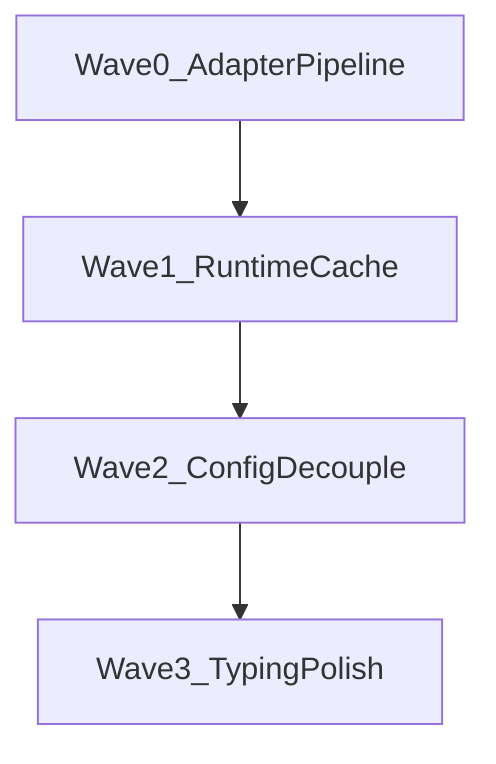

# Python Tools Wave 1 — Thermo-Nuclear Code Quality Review (2026-06-22)

> Strict maintainability and structural-simplification pass over **`app/python_tools/`** on **`6eb9e4fc8885aab4452efc83da10cf28c9f4fe60`**. Single-package integration review (`TN-PYTOOL-INTEG`) using the thermo-nuclear rubric (code-judo, 1k-line rule, no rubber-stamping). **Document only** — no remediation commits in this round.
>
> **Scope:** in-package modules only (`config`, `models`, `vendor_runtime`, `black_adapter`, `isort_adapter`, `__init__`). **Seam notes** (shell, plugins, intelligence) included only where they clarify boundary ownership. **Prior program context:** [`THERMO_PROGRAM_ORCHESTRATOR.md`](../THERMO_PROGRAM_ORCHESTRATOR.md) P2-5 queue; architecture contract **AD-010** in [`docs/ARCHITECTURE.md`](../../ARCHITECTURE.md) §17.5 / AD-010.

---

## 0. How this review is organized


**Severity model (thermo-native):**

| Tier | Meaning |
|------|---------|
| **P0 BLOCKER** | Sole 1k-line violation, hard-cutover regression, ship-blocking contract break |
| **P1 STRUCTURAL** | High-conviction code-judo; debt that multiplies on next format/import feature |
| **P2 NICE-TO-HAVE** | Typing polish, minor SSOT drift, naming/docs backlog |

**Approval bar (integration thermo):** Package is **small, focused, and AD-010-aligned**. No file approaches the 700/1000 LOC smell thresholds. Remaining debt is **pre-growth hygiene** (adapter duplication, per-call runtime probe) rather than active spaghetti. **Do not grow this package** (new tools, save hooks, config surfaces) until P1 themes land.

---

## 1. Executive summary

### 1.1 Metric baseline @ `6eb9e4fc`

| Metric | Value |
|--------|------:|
| Python modules | 6 |
| Total LOC | **549** |
| Largest file | `config.py` — **179 LOC** |
| Files ≥700 LOC | **0** |
| Files ≥1000 LOC | **0** |
| `: Any` / `tuple[Any` boundary hits | **8** |
| `dict[str, Any]` TOML coercion surfaces | **3** (additional, config-only) |

**Per-file LOC (sorted):**

| File | LOC |
|------|----:|
| `__init__.py` | 1 |
| `models.py` | 49 |
| `black_adapter.py` | 85 |
| `isort_adapter.py` | 92 |
| `vendor_runtime.py` | 143 |
| `config.py` | 179 |

### 1.2 Theme rollup

| Metric | Count |
|--------|------:|
| **Deduped cross-cutting themes** | **12** |
| **P0 BLOCKER (deduped)** | **0** |
| **P1 STRUCTURAL (deduped)** | **3** |
| **P2 NICE-TO-HAVE (deduped)** | **9** |

### 1.3 Top structural themes (integration view)

1. **Mirror adapter orchestration** — `black_adapter.py` and `isort_adapter.py` share ~35 lines of identical settings/error envelope logic (CC-PYTOOL-01).
2. **Double runtime probe per transform** — `import_python_tooling_modules()` calls `initialize_python_tooling_runtime()` then re-imports all three modules on every format/organize call (CC-PYTOOL-02).
3. **Vendor bootstrap coupled into config resolution** — `resolve_python_tooling_settings()` always calls `ensure_vendor_path_on_sys_path()` even when only parsing local `pyproject.toml` (CC-PYTOOL-03).
4. **Public API boundary leaks `Any`** — vendored module tuple and dynamic API probe helpers export untyped contracts (CC-PYTOOL-04).
5. **TOML/runtime SSOT fork** — `bootstrap.toml_io` and `vendor_runtime` both gate TOML availability via different import paths (CC-PYTOOL-10).

**Dominant risk:** not missing modules — **duplication at the adapter layer** that will triple if a third transform tool (e.g. autoflake, ruff format) lands without a shared pipeline. Current scale (549 LOC) masks the smell.

**What already works (replicate this pattern):**

- Frozen dataclass contracts in `models.py` (`PythonToolingSettings`, `PythonTextTransformResult`) with explicit status constants.
- Clean AD-010 layering: config → adapters → vendored runtime; no subprocess CLI, no hidden global tool config.
- `vendor_runtime.py` API-surface probe (`_missing_apis`) catches Black 25+ / incomplete vendor trees early.
- Config honors project-local `pyproject.toml` only; reuses `read_toml_mapping` SSOT and `resolve_configured_src_paths` for isort src paths.
- Python 3.9-safe syntax throughout; no dot-prefixed storage paths.
- Unit tests under `tests/unit/python_tools/` and runtime parity under `tests/runtime_parity/python_tools/`.

### 1.4 Vendored dependency seams

| Vendored dep | Role in `app/python_tools/` | Owned elsewhere |
|--------------|----------------------------|-----------------|
| **black** (pinned 24.10.0) | `black_adapter.format_python_text` | — |
| **isort** | `isort_adapter.organize_imports_text` | — |
| **tomli** | Required by `vendor_runtime` availability gate; config reads TOML via `bootstrap.toml_io` | `bootstrap.toml_io` also tries stdlib `tomllib` on 3.11+ |
| **packaging** | Inline import in `config._infer_target_versions_from_requires_python` | Not probed by `vendor_runtime` |
| **jedi / parso / rope** | *Not in this package* | `app/intelligence/` |

**Callers (boundary map):**

- `app/plugins/builtin_workflows.py` — builtin formatter/import providers
- `bundled_plugins/cbcs.python_tools/runtime.py` — plugin delegation (thin)
- `app/bootstrap/capability_probe.py` — startup `python_tooling_runtime` check
- `app/shell/python_tooling_status_controller.py` — status/settings copy (reads config + runtime)
- `app/shell/python_style_workflow.py`, `app/shell/save_workflow.py` — user/save transforms via workflow broker (models constants only in save path)
- `app/plugins/workflow_adapters.py`, `app/plugins/runtime_serializers.py` — broker coercion/serialization

---

## 2. P0 BLOCKER — deduped themes

*None.* No file ≥1000 LOC, no hard-cutover fallback chains, no dot-prefixed paths, no Python 3.10+ syntax in package sources.

---

## 3. P1 STRUCTURAL — deduped themes

| ID | Theme | Severity | Evidence | Recommended remediation |
|----|-------|----------|----------|-------------------------|
| **CC-PYTOOL-01** | Mirror adapter orchestration (black/isort) | P1 | `black_adapter.py:19-40` and `isort_adapter.py:19-40` — identical `resolve_python_tooling_settings` → config_error / tool_unavailable prelude; diverge only at tool invocation | Extract `run_python_text_transform(settings, *, invoke)` or shared `_transform_prelude(source_text, file_path, project_root)` returning `(settings, modules \| error_result)`. Adapters keep tool-specific `invoke` only (~15 LOC each). |
| **CC-PYTOOL-02** | Double runtime probe on every transform | P1 | `vendor_runtime.py:86-94` — `import_python_tooling_modules` calls full `initialize_python_tooling_runtime` (three imports + API walk) then `importlib.import_module` again for each module | Cache successful probe in module-level `_RUNTIME_READY: PythonToolingRuntimeStatus \| None`; `import_python_tooling_modules` returns cached modules after first success. Startup probe and capability check still call `initialize_*` explicitly. |
| **CC-PYTOOL-03** | Vendor bootstrap side effect in config resolution | P1 | `config.py:24` — `ensure_vendor_path_on_sys_path()` on every `resolve_python_tooling_settings` call; couples pure config parsing to vendor layout | Remove vendor bootstrap from config; callers that need TOML via vendored tomli already run after startup probe. If packaging inference needs vendor, isolate to `_infer_target_versions_from_requires_python` only. |

---

## 4. P2 NICE-TO-HAVE — deduped themes

| ID | Theme | Severity | Evidence | Recommended remediation |
|----|-------|----------|----------|-------------------------|
| **CC-PYTOOL-04** | Public `Any` tuple from vendored import API | P2 | `vendor_runtime.py:86` — `tuple[Any, Any, Any]`; `vendor_runtime.py:97,104` — dynamic module typing | Introduce `Protocol` stubs for required Black/isort surfaces used by adapters, or a frozen `PythonToolingModules` dataclass with typed fields. Keep dynamic probe internal. |
| **CC-PYTOOL-05** | Untyped Black target-version resolver | P2 | `black_adapter.py:76-85` — `black_module` untyped; returns `set[object]` | Type as `ModuleType` + explicit `BlackTargetVersion` enum re-export from a small shim, or document as the single allowed dynamic boundary. |
| **CC-PYTOOL-06** | Inline `packaging` import | P2 | `config.py:98-101` — function-body import of `packaging.specifiers` / `packaging.version` | Move to module top with try/except documented fallback to `("py39",)`; or depend on vendored packaging probe in `vendor_runtime` if inference becomes critical path. |
| **CC-PYTOOL-07** | Fragile isort syntax-error heuristic | P2 | `isort_adapter.py:64-72` — `"syntax error" in str(exc).lower()` | Prefer catching documented isort exception types; map unknown exceptions to `TOOL_UNAVAILABLE` unless `SyntaxError` subclass. |
| **CC-PYTOOL-08** | Opaque Python minor encoding | P2 | `config.py:19,176-179` — `SUPPORTED_PYTHON_TARGET_MINORS = (39, 310, …)` with `_minor_to_version_text` arithmetic | Replace with explicit `(minor: int, version: str, black_token: str)` table; delete magic `-30` / `-300` branches. |
| **CC-PYTOOL-09** | Status field is plain `str` | P2 | `models.py:47` — `status: str` on `PythonTextTransformResult` | Use `Literal[...]` over existing constants or a small `StrEnum` for exhaustiveness at broker coercion sites. |
| **CC-PYTOOL-10** | Dual TOML availability paths | P2 | `config.py:36` uses `read_toml_mapping`; `vendor_runtime.py:48-61` requires vendored `tomli` for `is_available` | Document contract: config may succeed on stdlib tomllib (dev 3.11) while capability probe fails if vendor tomli missing — align probes or make capability check mirror `toml_io` resolution. |
| **CC-PYTOOL-11** | Package naming vs scope | P2 | Package docstring `__init__.py:1` — "formatting and import-management"; intelligence owns jedi/rope | Rename is costly; add module docstring cross-ref to `app/intelligence/` for semantic tools. Avoid expanding `python_tools` to intelligence concerns. |
| **CC-PYTOOL-12** | Empty public surface in `__init__.py` | P2 | `__init__.py` — docstring only; all callers import submodules directly | Optional curated re-exports (`format_python_text`, `organize_imports_text`, `resolve_python_tooling_settings`, models) if API stability is desired. |

---

## 5. Architecture alignment (AD-010)

| AD-010 requirement | Package behavior | Status |
|--------------------|------------------|--------|
| In-process vendored Black/isort | `vendor_runtime` + adapters | **OK** |
| Project-local `pyproject.toml` only | `[tool.black]`, `[tool.isort]` in `config.py` | **OK** |
| Black final formatting authority | Format adapter uses Black; isort separate step | **OK** |
| No formatter CLI subprocesses | Direct API calls | **OK** |
| Failures must not discard user edits | Adapters return original text + status on error | **OK** |
| ChoreBoy visible paths | No dot-prefixed dirs in package | **OK** |

---

## 6. Python 3.9 / platform compliance

| Check | Result |
|-------|--------|
| `match` / `case` | None |
| `X \| Y` runtime unions in signatures | Used with `from __future__ import annotations` — **OK** on 3.9 |
| Dot-prefixed storage paths | None |
| Hard-cutover legacy fallbacks | None in package (defensive `("py39",)` defaults only) |

---

## 7. Fix-agent sequencing



| Wave | Focus | Closes |
|------|-------|--------|
| 0 | Shared transform prelude / pipeline | CC-PYTOOL-01 |
| 1 | Module-level runtime ready cache | CC-PYTOOL-02 |
| 2 | Remove vendor bootstrap from config; TOML probe alignment | CC-PYTOOL-03, CC-PYTOOL-10 |
| 3 | Typing, status Literal, minor-version table, isort exceptions | CC-PYTOOL-04 … CC-PYTOOL-09, CC-PYTOOL-12 |

**Global rules:** no new module may exceed **400 LOC** without split plan; any third transform tool must use Wave 0 pipeline — no copy-paste adapter; preserve Black **24.10.0** pin contract documented in `AGENTS.md`.

---

## 8. Integration verdict (`TN-PYTOOL-INTEG`)

**Verdict: ACCEPT**

**Rationale:** At 549 LOC across six focused modules, `app/python_tools/` is **thermo-clean at current scale**. It satisfies AD-010, passes all file-size gates (largest 179 LOC), and keeps vendored format/import concerns isolated from `app/intelligence/`. The three P1 themes are **real code-judo opportunities** but not ship-blocking regressions — they become presumptive blockers **only if** the next feature adds a third adapter or expands save-time transform frequency without landing Waves 0–1 first.

**Conditional acceptance gates (before next growth PR):**

1. Land CC-PYTOOL-01 (shared pipeline) before any new transform adapter.
2. Land CC-PYTOOL-02 before wiring format-on-save to high-frequency paths beyond current save workflow.
3. Do not add jedi/rope/parso to this package — keep semantic tooling in `app/intelligence/`.

**Suggested validation after remediation (not run in this review):**

```bash
python3 run_tests.py tests/unit/python_tools/ tests/runtime_parity/python_tools/
npx pyright app/python_tools/
```

---

*End of Python Tools Wave 1 rollup. Baseline commit: `6eb9e4fc8885aab4452efc83da10cf28c9f4fe60`.*
