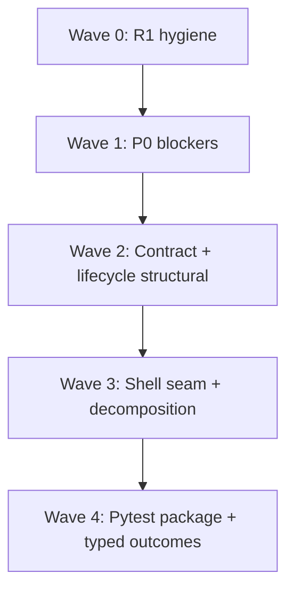

# TN-RUN-INTEG — Thermo-Nuclear Integration Meta Review

**Critic ID:** TN-RUN-INTEG  
**Date:** 2026-05-25  
**Baseline commit:** `24a7cb37fc9c4d2890ab0c0d701d7e61098c13c2`  
**Scope:** Vertical integration rollup after 9 slice critics (`TN-RUN-01` … `TN-RUN-03`, `TN-RUNNER-01` … `TN-RUNNER-03`, `TN-DEBUG-01`, `TN-DEBUG-02`, `TN-RUN-SHELL`). **Document only** — no code changes.

**Inputs:** All finding files under [`_findings/`](./), [`_README.md`](./_README.md), [`00-manifest.md`](../00-manifest.md), [`docs/deslop/AUDIT_app_remaining_handoff.md`](../../../deslop/AUDIT_app_remaining_handoff.md) (R1 brief).

---

## Executive verdict

**Not thermo-clean.** The run/debug process boundary has real extractions (`RunSessionController`, `RunOutputCoordinator`, `RunLaunchWorkflow` + typed `DebugTarget`, `BreakpointStore`, frozen `RunManifest`, `DebugSession` reducer, `RunnerDebugTransportClient`), but **~96 raw slice findings** collapse to **20 cross-cutting themes** (CC-01 … CC-20). The dominant pattern is **contract fragmentation across process boundaries**: breakpoint wire shapes are hand-built in four places with triplicated parsers; pause authority lives on three threads and two stores; pytest discovery and runner spawn incompatible subprocess stacks; and `debug_runner.py` (803 LOC) fuses engine, transport, and inspector before transport failure semantics are correct.

**Six P0 blockers** (8 raw BLOCKER findings) must land before run/debug feature growth: zombie paused runner on transport loss, pause-authority desync, re-entrant debug transport teardown, pytest runtime divergence, broken `-q`/explorer outcome pipeline, and unguarded transport send/teardown races. **R-run-2** is the primary fix lane for manifest/lifecycle/transport/runner decomposition; **shell-wave-1-followup** owns typed debug hosts, lifecycle symmetry, and breakpoint store encapsulation; **R1** absorbs legacy reducer cleanup and bare-`except` hygiene.

---

## Raw vs deduped counts

| Metric | Approximate count |
|--------|------------------:|
| Slice critics | 9 |
| **Raw findings** (TN-*-N entries) | **~96** |
| — BLOCKER severity | 8 |
| — STRUCTURAL severity | ~62 |
| — NICE-TO-HAVE severity | ~26 |
| **Deduped cross-cutting themes** (CC-01 … CC-20) | **20** |
| — Mapped to **P0** | 6 themes (~8 raw blockers) |
| — Mapped to **P1** | 14 themes (~62 raw structural) |
| — Mapped to **P2** | absorbed into CC-18 … CC-20 + backlog nits |
| Compression ratio (raw → themes) | ~4.8:1 |

*Counts are approximate: several findings are facets of the same theme (e.g. TN-RUN-01-1/03 and TN-DEBUG-01-1/03 all feed CC-09; TN-RUN-02-2/09 and TN-DEBUG-02-1 feed CC-02).*

---

## Severity mapping

| Integration tier | Slice severity | Meaning for fix agent |
|------------------|----------------|------------------------|
| **P0** | BLOCKER | Ship-blocking: zombie subprocess, debug desync on main path, Test Explorer lies, transport races |
| **P1** | STRUCTURAL | High-conviction code-judo; debt that multiplies on next run/debug/REPL growth |
| **P2** | NICE-TO-HAVE | Backlog: dead code, test placement, minor typing, UX copy nits |

---

## P0 — Deduped themes (fix first)

| ID | Theme | Primary critics | Key evidence | Handoff |
|----|-------|-----------------|--------------|---------|
| **CC-01** | **Debug transport failure → zombie paused runner** | RUNNER-03, DEBUG-02 | `debug_transport.py:230-241` — read loop exits on EOF without `_on_error`; `debug_runner.py:181-182` — `_pause_loop` blocks on unbounded `queue.get()`; `debug_runner.py:147-148` — write failures bypass `_handle_transport_error` | **R-run-2** |
| **CC-02** | **Pause authority split across threads and two state stores** | RUN-02, DEBUG-02, RUN-SHELL | `run_service.py:234-244` — `_is_debug_paused` set on transport thread before UI queue; `actions.py:51-55` gates toolbar on `RunService.is_debug_paused`; panel reads `DebugSession.state.execution_state` after 50 ms drain; `debug_control_workflow.py:288-289` gates breakpoint sync on pause bool | **R-run-2**, **shell-wave-1-followup** |
| **CC-03** | **Re-entrant / non-atomic `start_run` destroys active debug transport** | RUN-02 | `run_service.py:150-156` — `_close_debug_transport_server()` + new server **before** `start_manifest`; `process_supervisor.py:67-68` — exclusivity raises only at launch; failed second start leaves first run's transport gone | **R-run-2** |
| **CC-04** | **Pytest discovery vs runner subprocess contract diverge** | RUN-03 | Discovery uses inline AppRun payload + ignores `CBCS_PYTEST_EXECUTABLE` (`pytest_discovery_service.py:118-125`); runner prefers `run_tests.py` + env probe (`pytest_runner_service.py:109-156`); dead import of `build_runpy_bootstrap_payload` in discovery | **R-run-2**, **shell-wave-1-followup** |
| **CC-05** | **Quiet-mode pytest cannot populate Test Explorer outcomes (`-q` vs `-v`)** | RUN-03, RUN-SHELL (TEST-UI cross-read) | `pytest_runner_service.py:46-47,98` injects `-q`; `parse_test_results` expects `" PASSED"` tokens; `test_test_runner_workflow.py:203-225` masks with fabricated verbose stdout | **shell-wave-1-followup**, **R3** (typed outcomes) |
| **CC-06** | **Transport send/teardown races and orphaned editor-side server** | DEBUG-02, RUN-02 | `debug_transport.py:76-87` vs `:145-146` — `_client_resources` nulled outside write lock during send; `_forward_debug_transport_error` emits synthetic `session_ended` without `_close_debug_transport_server()` | **R-run-2** |

---

## P1 — Deduped themes (R-run-2 / shell structural wave)

| ID | Theme | Primary critics | Key evidence | Handoff |
|----|-------|-----------------|--------------|---------|
| **CC-07** | **Breakpoint wire format quadruplicated; inbound parsing triplicated** | RUN-01, DEBUG-01, RUNNER-03, RUN-SHELL | `run_manifest.py:61-70`, `debug_command_service.py:52-64`, `debug_breakpoints.py:73-91` (dead), `debug_runner.py:593-606` outbound; `_parse_breakpoints` in manifest, session, runner with divergent hit-condition rules | **R-run-2** |
| **CC-08** | **Run lifecycle non-atomic: artifacts/sockets before process exclusivity** | RUN-02 | `run_service.py:157-177` — manifest persisted before `start_manifest`; debug listener opened before idle check; orphan manifest + leaked port on failure (pairs with CC-03) | **R-run-2** |
| **CC-09** | **Triple session state mirrors across run layer and shell** | RUN-02, RUN-SHELL | `RunService._current_session`, `RunSessionController._active_session_mode`, `MainWindow._active_run_session_info` cleared on different threads/events; event bus reads presenter mirror not `RunService.current_session` | **R-run-2**, **shell-wave-1-followup** |
| **CC-10** | **`debug_runner.py` god module at decomposition threshold** | RUNNER-03 | 803 LOC; `_RunnerDebugHost` ~610 LOC fuses bdb, transport loop, eval, breakpoint apply, variable serialization | **R-run-2** |
| **CC-11** | **Pytest services misplaced in `app/run/`; parallel subprocess stack** | RUN-03 | Three modules (607 LOC) use blocking `subprocess.run` with no `ProcessSupervisor`, no cancellation, no shared launch plan with `RunService` | **R-run-2** |
| **CC-12** | **`RunService.start_run` monolith + `HostProcessManager` pass-through** | RUN-02 | 115-line `start_run` with triplicated cwd resolution; `host_process_manager.py` forwards every call with no earned boundary | **R-run-2** |
| **CC-13** | **Manifest contract drift: duplicate loopback transports, mode-blind validation, shallow frozen containers** | RUN-01 | `ReplControlConfig` ≡ `DebugTransportConfig` with twin parsers; only `python_debug` requires transport; `argv`/`env`/`breakpoints` lists mutable despite `frozen=True` | **R-run-2** |
| **CC-14** | **REPL control protocol half-formed: dict wire, no protocol enforcement, namespace concurrency** | RUNNER-02, RUN-SHELL | `repl_control.py` never validates `config.protocol`; shell builds raw dicts; `ThreadingTCPServer` reads namespace while REPL thread mutates; empty `degradation_reason` on Jedi fallback | **R-run-2**, **shell-wave-1-followup** |
| **CC-15** | **Debug session reducer gaps: stale inspector on continue, silent drops, mutable state escape** | DEBUG-02, DEBUG-01 | `continued` clears flags only — frames/locals persist; unknown `kind` no-op; `@property state` returns live mutable object; `select_frame` merges refs without eviction | **R-run-2**, **shell-wave-1-followup** |
| **CC-16** | **Shell seam: `run_launch_workflow.py` god workflow + `window: Any` debug path** | RUN-SHELL | 725 LOC absorbs launch + run-config dialogs + status-bar chrome; `DebugControlWorkflow` / `RunDebugPresenter` still reach through `window._*` while launch uses typed `RunLaunchWorkflowHost` | **shell-wave-1-followup** |
| **CC-17** | **Shell lifecycle asymmetry: restart race + silent `ALREADY_RUNNING`** | RUN-SHELL, RUN-02 | `main_window.py:2357-2363` — stop then immediate relaunch; `run_debug_presenter.py:57-58` swallows `ALREADY_RUNNING` | **shell-wave-1-followup** |
| **CC-18** | **`BreakpointStore` SSOT bypassed via mutable dict aliases** | RUN-SHELL, DEBUG-01 | Properties return live dicts injected into session/tree workflows; `editor_session_workflow.py` clears dicts directly | **shell-wave-1-followup**, **R1** (immutable helpers) |
| **CC-19** | **REPL/manifest launch logic duplicated (RunService vs ReplSessionManager)** | RUN-SHELL, RUN-01 | Parallel `RunManifest` + `save_run_manifest` + `HostProcessManager.start_manifest` at shell and run boundaries | **R-run-2** |
| **CC-20** | **Misplaced presentation modules in lifecycle package** | RUN-02, RUN-01 | `ConsoleModel` / `OutputTailBuffer` only consumed by `main_window.py`; `describe_exit_code` only used by shell output coordinator | **shell-wave-1-followup** |

---

## P2 — Deduped themes (backlog)

| ID | Theme | Primary critics | Key evidence | Handoff |
|----|-------|-----------------|--------------|---------|
| **CC-21** | **Legacy `DebugEvent` reducer + stale comments (parallel to protocol path)** | DEBUG-01 | `DebugSessionState.apply_event()` hardcodes `stop_reason="breakpoint"`; only `mark_exited()` still uses legacy path | **R1** |
| **CC-22** | **Bare `except Exception` swallowing on hot paths** | RUN-02, RUNNER-01, RUNNER-02, RUNNER-03 | `ProcessSupervisor._emit_event` silent swallow; `repl_control.py:41-42` returns raw `str(exc)`; `_ensure_line_buffering` broad catch | **R1** |
| **CC-23** | **Test gaps / misplaced tests / workflow harness drift** | RUN-01, RUNNER-01/02/03, DEBUG-02, RUN-SHELL | Zero `test_debug_transport.py`; output_bridge tests in `test_debug_runner.py`; integration test applies session off UI-thread contract | **R-run-2**, **R6** (test audit) |
| **CC-24** | **Typed boundaries / stringly pytest outcomes / dead surface** | RUN-03, DEBUG-01, RUNNER-01 | Raw outcome strings end-to-end; `run_pytest_failed` unused; `format_traceback` dead; duplicate serializers in `builtin_workflows` vs `runtime_serializers` | **R3**, **R-run-2** |
| **CC-25** | **Three incompatible “clear console” behaviors + runner hint mismatch** | RUN-SHELL, RUNNER-01 | Menu clears four sinks; toolbar clears widget only; REPL `clear()` hint claims display-only while steering to menu | **shell-wave-1-followup** |

---

## Top P0 blockers for fix agent (integration view, ordered)

| Rank | CC | Blocker | Why integration-first |
|------|-----|---------|------------------------|
| 1 | **CC-01** | Transport EOF / write failure → runner paused forever | Subprocess cannot exit cooperatively; supervisor SIGKILL is the only recovery |
| 2 | **CC-02** | Pause authority split (`RunService._is_debug_paused` vs `DebugSession`) | Toolbar, breakpoint sync, and inspector disagree on same user action |
| 3 | **CC-03** | Re-entrant `start_run` closes first run's debug transport | Latent even when shell guards — API must be atomic at run layer |
| 4 | **CC-06** | Transport send races + editor server left open after read failure | Intermittent `RuntimeError` on step/continue; zombie listener until process exit |
| 5 | **CC-05** | `-q` pytest runs never update explorer outcomes | Test Explorer shows stale `"not_run"` after every Run All — user-visible lie |

*CC-04 (pytest runtime divergence) is rank-6 P0 but should ship in the same PR wave as CC-05 (shared `PytestLaunchPlan`).*

---

## Fix-agent sequencing (ordered PR waves)

### Wave 0 — R1 hygiene (no architectural moves)

| PR | CC themes | Scope | Gate |
|----|-----------|-------|------|
| 0a | CC-21, CC-22 | Delete or migrate legacy `DebugEvent` / `apply_event()`; narrow bare `except Exception` in supervisor, repl_control, runner bootstrap | `rg 'except Exception:\s*$' app/run app/runner app/debug` count ↓; legacy tests migrated |
| 0b | CC-18 (partial) | `replace_breakpoint` / immutable update helpers in `debug_breakpoints.py` | Shell hand-rebuild sites use helpers |

### Wave 1 — P0 blockers (transport + pause + atomic start)

| PR | CC themes | Scope | Gate |
|----|-----------|-------|------|
| 1a | CC-01, CC-06 | EOF → `_on_error`; bounded pause loop; send helpers route write failures; lock `_client_resources` lifecycle; close server on transport error | Unit: fake transport EOF mid-pause → runner exits; threaded send+close stress |
| 1b | CC-02 | Remove `RunService._is_debug_paused`; derive pause from `DebugSession` after queue drain; single reducer path | Integration: toolbar + panel agree in same UI tick |
| 1c | CC-03, CC-08 (partial) | `_assert_idle()` before side effects; debug transport after supervisor accepts; rollback manifest on failed launch | Integration: second `start_run` without stop preserves first transport |
| 1d | CC-04, CC-05 | Unified `PytestLaunchPlan`; align `-q`/parser or switch to structured reporter; fix workflow test fixtures | Explorer outcomes update on Run All with production stdout shape |

### Wave 2 — Contract + lifecycle structural (R-run-2 core)

| PR | CC themes | Scope | Gate |
|----|-----------|-------|------|
| 2a | CC-07, CC-13 (partial) | `manifest_codec` / `debug_breakpoints` SSOT for parse + serialize; delete runner `_parse_breakpoints`; unify loopback transport type | Parametrized round-trip shared by manifest, command, runner |
| 2b | CC-10 | Split `debug_runner.py` → engine / command_loop / inspector / breakpoints | Each module &lt;300 LOC; existing unit tests green |
| 2c | CC-12, CC-08 | `LaunchContext` planner; collapse `HostProcessManager`; unify stop/wait ownership in supervisor | `start_run` &lt;30 LOC coordinator |
| 2d | CC-09, CC-15 (partial) | Single `RunSessionStore`; session snapshot at start; `continued` clears inspector | Exit/start/restart integration tests |
| 2e | CC-14 | Typed REPL protocol + protocol validation; degradation honesty; namespace concurrency model | `test_repl_protocol.py` + `test_repl_control.py` |
| 2f | CC-13 (partial) | Mode-aware manifest validation; tuple container fields; `build_runner_command` resolves manifest path | Mode rejection tests; shallow-mutation prevented |

### Wave 3 — Shell seam (shell-wave-1-followup)

| PR | CC themes | Scope | Gate |
|----|-----------|-------|------|
| 3a | CC-16, CC-17 | Split `RunLaunchWorkflow`; presenter owns start/stop/restart; exit-gated restart; surface `ALREADY_RUNNING` | Restart slow integration green |
| 3b | CC-18 | `BreakpointStore` methods-only API; remove dict alias injection | Store invariant unit tests |
| 3c | CC-16 (partial) | `DebugShellHost` protocols; delete `window: Any` from debug workflow + presenter | Workflow tests without `MainWindow` |
| 3d | CC-19, CC-20 | Shared REPL launch in run layer; relocate `ConsoleModel` / `exit_status` to shell | Import graph: `app/run/` has no shell-only consumers |
| 3e | CC-25 | Unify clear-console policy + REPL hint copy | Characterization tests per surface |

### Wave 4 — Pytest package extraction + typing (R-run-2 + R3)

| PR | CC themes | Scope | Gate |
|----|-----------|-------|------|
| 4a | CC-11 | Move pytest services to `app/pytest/` (or `app/testing/pytest/`); cancellation hooks | No `app/run/pytest_*` imports |
| 4b | CC-24 | `TestOutcome` / `TestNodeKind` literals; consolidate `problem_parser` | pyright strict on workflow + discovery |
| 4c | CC-23 | Add `test_debug_transport.py`; relocate output_bridge tests | Transport lifecycle suite passes |

**Parallelism:** Wave 0 can start immediately. Wave 1 items 1a–1c are sequential (transport before pause reducer). Wave 2a (breakpoint SSOT) unblocks 2b (runner split). Wave 3 shell items can parallelize by module once Wave 1b lands.

---

## R1 / R-run-2 / shell-wave-1-followup mapping summary

| Handoff brief | Primary CC themes | Slice critics most involved |
|---------------|-------------------|----------------------------|
| **R1** — Small cleanup sweep | CC-21, CC-22, CC-18 (partial) | DEBUG-01, RUN-02, RUNNER-01/02/03 |
| **R-run-2** — Run/runner/debug structural wave | CC-01, CC-03, CC-06–CC-15, CC-19, CC-11, CC-13 | RUN-01, RUN-02, RUN-03, RUNNER-02, RUNNER-03, DEBUG-01, DEBUG-02 |
| **shell-wave-1-followup** — Shell run/debug seam | CC-02, CC-05, CC-09, CC-16–CC-18, CC-20, CC-25 | RUN-SHELL, RUN-02, RUNNER-01, RUNNER-02 |
| **R3** — Shell hotspot / Test Explorer typing | CC-05, CC-24 | RUN-03, RUN-SHELL (TEST-UI cross-read) |
| **R6** — Test audit | CC-23 | All slices with test-placement findings |

Global rules: hard cutover importers; do not grow `debug_runner.py` past 1k without split; shell seam workflows use typed host bundles not `window: Any`; four-theme validation recorded for UI-touching shell PRs.

---

## Positive signals (patterns to replicate)

| Extraction / pattern | Why it worked | Critics citing |
|----------------------|---------------|----------------|
| **`RunSessionController`** | Typed `RunSessionStartResult` / failure reasons; clean `RunService` boundary; unit tested without MainWindow | RUN-SHELL, RUN-02 |
| **`RunOutputCoordinator`** | Pure event router with injected callbacks; no `window: Any`; debug/output/exit paths isolated | RUN-SHELL |
| **`RunLaunchWorkflow` + `DebugTarget` union** | Typed host protocol; absorbed MW-08 launch graph; characterization tests without MainWindow | RUN-SHELL |
| **`BreakpointStore` introduction** | Panel toggle syncs gutter via store methods (partial SSOT — extend, don't rewrite) | RUN-SHELL, DEBUG-01 |
| **`ReplSessionManager`** | Private supervisor; auto-restart backoff; completion socket with degradation envelope | RUN-SHELL, RUNNER-02 |
| **Frozen `RunManifest` + canonical `build_breakpoint` on load** | Real typed editor→runner contract; deterministic `sort_keys` persist | RUN-01 |
| **`ProcessSupervisor` stale-exit guard** | Dedicated unit tests for pid/generation races — keep when unifying stop/wait | RUN-02 |
| **`DebugSession.apply_protocol_message`** | Single reducer intent (needs pause authority + continue reset fixes, not replacement) | DEBUG-02 |
| **`debug_protocol` + `rpc_protocol` codec sharing** | JSON-line framing SSOT; extend with envelope validation, don't fork codec | DEBUG-01 |
| **`StructuredBdbDebugger` thin wrapper** | Engine delegates stop decisions without transport knowledge | RUNNER-03 |
| **`dataclasses.replace` for manifest breakpoint updates** | Runner respects frozen manifest (audit stale mutation note obsolete) | RUNNER-03 |
| **Vendor-before-pytest AppRun payload invariant** | Both pytest services and tests enforce `sys.path.insert(vendor)` before `import pytest` | RUN-03 |
| **CC-01 cleared on runner REPL path** | No agent-debug slop in `repl_completion.py` at baseline | RUNNER-02 |
| **`ProblemEntry` cross-pane contract** | Single dataclass for Problems panel — consolidate parsers, not model | RUN-03 |
| **Output tee graceful degradation** | Log open failure prints to stderr, run continues (`output_bridge.py`) | RUNNER-01 |

**Pattern to replicate:** typed ports + immutable snapshots + tests that construct the module without `MainWindow.__new__` + single wire-format owner at process boundaries.

**Pattern to retire:** parallel bool/session mirrors across threads; hand-rolled breakpoint dict literals; blocking pytest `subprocess.run` stacks beside `ProcessSupervisor`; god modules absorbing the next mode field inline.

---

## Approval bar (run wave 1 → fix agent)

**Do not approve** new run modes, debug commands, or Test Explorer features until:

1. All **P0** themes (CC-01 … CC-06) are fixed or explicitly product-waived.
2. `debug_runner.py` does not grow past **803 LOC** without decomposition (CC-10).
3. New manifest or transport fields go through **one codec** (CC-07, CC-13) — no fourth hand-built serializer.
4. Shell debug/run work uses **typed host ports**, not new `window: Any` workflows (CC-16).
5. Pytest discovery and runner share **one launch plan** (CC-04) before adding explorer scopes.

---

## Per-critic verdict summary

| Critic | Verdict | Integration note |
|--------|---------|------------------|
| **TN-RUN-01** | Conditionally thermo-clean for slice size | Contract surface solid but mode-blind and duplicative; blocks manifest growth until CC-13/07 land |
| **TN-RUN-02** | **Not thermo-clean** | Supplies 2 of 8 blockers (CC-03, CC-02); lifecycle package owns shell buffers (CC-20) |
| **TN-RUN-03** | **Not thermo-clean** | Supplies 2 blockers (CC-04, CC-05); pytest stack is parallel universe to RunService (CC-11) |
| **TN-RUNNER-01** | Mostly thermo-clean for size | Bootstrap spine good; clear-console copy feeds CC-25; path rules need contract decision |
| **TN-RUNNER-02** | **Not thermo-clean** | REPL sidecar small but wire contract immature (CC-14); pairs with CC-19 duplication |
| **TN-RUNNER-03** | **Not thermo-clean** | Supplies 2 blockers (CC-01); god module + breakpoint parser drift (CC-10, CC-07) |
| **TN-DEBUG-01** | **Not thermo-clean** | Owns breakpoint serialization fragmentation (CC-07); legacy reducer feeds CC-21 |
| **TN-DEBUG-02** | **Not thermo-clean** | Supplies 2 blockers (CC-02, CC-06); zero transport tests (CC-23) |
| **TN-RUN-SHELL** | **Not thermo-clean** | Best seams (`RunSessionController`, `RunOutputCoordinator`) coexist with 725 LOC workflow and restart race (CC-16, CC-17) |

**Slice approval tally:** 0 of 9 thermo-clean; 1 conditional (TN-RUN-01); 8 not clean.

---

## Cross-reference index (raw finding → CC theme)

Quick lookup: slice finding IDs → CC theme (click to expand)

| Raw IDs (sample) | CC |
|------------------|-----|
| RUNNER-03-3, RUNNER-03-4 | CC-01 |
| RUN-02-2, DEBUG-02-1, RUN-02-9, RUN-SHELL-10 | CC-02 |
| RUN-02-1 | CC-03 |
| RUN-03-2, RUN-03-3 | CC-04 |
| RUN-03-4, RUN-03-5 | CC-05 |
| DEBUG-02-2, DEBUG-02-3, RUN-02-3 | CC-06 |
| RUN-01-3, DEBUG-01-1…3, RUNNER-03-6…8, DEBUG-01-7 | CC-07 |
| RUN-02-3, RUN-02-5 | CC-08 |
| RUN-02-9, RUN-SHELL-3 | CC-09 |
| RUNNER-03-1, RUNNER-03-2 | CC-10 |
| RUN-03-1, RUN-03-8 | CC-11 |
| RUN-02-4, RUN-02-7, RUN-02-12 | CC-12 |
| RUN-01-1, RUN-01-2, RUN-01-4, RUN-01-5, RUN-01-6 | CC-13 |
| RUNNER-02-1…7, RUN-SHELL-8 | CC-14 |
| DEBUG-02-4, DEBUG-02-6…8, DEBUG-01-12 | CC-15 |
| RUN-SHELL-1, RUN-SHELL-2, RUN-SHELL-6 | CC-16 |
| RUN-SHELL-3, RUN-SHELL-4 | CC-17 |
| RUN-SHELL-5, DEBUG-01-4 | CC-18 |
| RUN-SHELL-8, RUN-01-2 | CC-19 |
| RUN-02-8, RUN-01-8 | CC-20 |
| DEBUG-01-5, DEBUG-01-6 | CC-21 |
| RUN-02-6, RUNNER-01-8, RUNNER-02-6, RUNNER-03-9 | CC-22 |
| RUN-01-7, RUNNER-02-8, DEBUG-02-5, RUN-SHELL-12, RUNNER-03-11 | CC-23 |
| RUN-03-5, RUN-03-10…12, DEBUG-01-10, RUNNER-01-6 | CC-24 |
| RUN-SHELL-7, RUNNER-01-1 | CC-25 |

---

*End of TN-RUN-INTEG. Consolidated wave summary: [`../run_wave_1_thermo_review_2026-05-25.md`](../run_wave_1_thermo_review_2026-05-25.md).*
