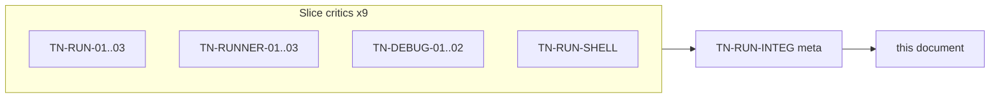

# Run Wave 1 — Thermo-Nuclear Code Quality Review (2026-05-25)

> Strict maintainability and structural-simplification pass over `app/run/`, `app/runner/`, `app/debug/`, and the shell run/debug seam on **`24a7cb37fc9c4d2890ab0c0d701d7e61098c13c2`**. Nine slice critics plus one integration meta-reviewer (`TN-RUN-INTEG`), using the thermo-nuclear rubric (code-judo, 1k-line rule, no rubber-stamping). **Document only** — no remediation commits in this round.
>
> **Per-critic raw findings:** [`_findings/`](_findings/) (11 files). **Prior handoff:** [`docs/deslop/AUDIT_app_remaining_handoff.md`](../deslop/AUDIT_app_remaining_handoff.md) R1 brief; **shell wave 4** backlog from [`shell_wave_1_thermo_review_2026-05-25.md`](../shell-wave-1/shell_wave_1_thermo_review_2026-05-25.md) §7.

---

## 0. How this review is organized



**Severity model (thermo-native):**

| Tier | Meaning |
|------|---------|
| **P0 BLOCKER** | Zombie subprocess, debug desync on main path, Test Explorer lies, transport races |
| **P1 STRUCTURAL** | High-conviction code-judo moves; debt that multiplies on next run/debug growth |
| **P2 NICE-TO-HAVE** | Backlog: legacy reducer, test placement, typing, UX copy nits |

**Approval bar (integration thermo):** The run/debug boundary is **not thermo-clean**. Real extractions exist (`RunSessionController`, `RunOutputCoordinator`, `RunLaunchWorkflow`, frozen `RunManifest`), but **`debug_runner.py` is 803 LOC**, **`run_launch_workflow.py` is 725 LOC**, and contract fragmentation (breakpoint wire formats, pause authority, pytest stacks) will multiply on the next feature unless P0 themes land first.

---

## 1. Executive summary

| Metric | Count |
|--------|------:|
| Slice critics | 9 |
| Raw finding entries (slice) | ~96 |
| — BLOCKER severity | 8 |
| — STRUCTURAL severity | ~62 |
| — NICE-TO-HAVE severity | ~26 |
| **Deduped cross-cutting themes** | **20** |
| **P0 BLOCKER (deduped)** | **6** |
| **P1 STRUCTURAL (deduped)** | **14** |
| **P2 NICE-TO-HAVE (deduped)** | **5** (CC-21 … CC-25) |

**Top 5 blockers (integration view):**

1. **Transport EOF / write failure → zombie paused runner** — runner blocks forever in pause loop; supervisor SIGKILL is the only recovery ([CC-01](_findings/TN-RUN-INTEG.md), [RUNNER-03](_findings/TN-RUNNER-03.md), [DEBUG-02](_findings/TN-DEBUG-02.md)).
2. **Pause authority split** — toolbar reads `RunService._is_debug_paused` (transport thread); inspector reads `DebugSession.execution_state` (UI thread) ([CC-02](_findings/TN-RUN-INTEG.md), [RUN-02](_findings/TN-RUN-02.md), [DEBUG-02](_findings/TN-DEBUG-02.md)).
3. **Re-entrant `start_run` tears down active debug transport** — debug server closed before supervisor exclusivity check ([CC-03](_findings/TN-RUN-INTEG.md), [RUN-02](_findings/TN-RUN-02.md)).
4. **Transport send/teardown races + orphaned editor server** — unguarded `_client_resources`; read failure emits `session_ended` without closing listener ([CC-06](_findings/TN-RUN-INTEG.md), [DEBUG-02](_findings/TN-DEBUG-02.md)).
5. **Quiet-mode pytest never updates Test Explorer** — `-q` runs vs `-v` outcome parser; workflow test masks with fake stdout ([CC-05](_findings/TN-RUN-INTEG.md), [RUN-03](_findings/TN-RUN-03.md)).

*Rank-6 P0:* **Pytest discovery vs runner subprocess contract diverge** ([CC-04](_findings/TN-RUN-INTEG.md)) — ship with CC-05 in the same PR wave.

**Dominant risk:** not missing modules — **contract fragmentation across process boundaries**. Breakpoint wire shapes are hand-built in four places; pause state lives on three threads and two stores; pytest uses a parallel subprocess stack beside `ProcessSupervisor`; `debug_runner.py` fuses bdb, transport, and inspector before transport failure semantics are correct.

**What already works (replicate this pattern):**

- `RunSessionController`, `RunOutputCoordinator`, `RunLaunchWorkflow` + typed `DebugTarget`
- `BreakpointStore` (extend encapsulation, don't rewrite)
- `ReplSessionManager` isolation with degradation envelope
- Frozen `RunManifest` + `dataclasses.replace` for runner breakpoint updates
- `ProcessSupervisor` stale-exit guard; `DebugSession.apply_protocol_message` reducer intent

Full positive-signal table: [TN-RUN-INTEG § Positive signals](_findings/TN-RUN-INTEG.md#positive-signals-patterns-to-replicate).

---

## 2. P0 BLOCKER — deduped themes

| ID | Theme | Primary critics | Key evidence |
|----|-------|-----------------|--------------|
| **CC-01** | Transport failure → zombie paused runner | [RUNNER-03](_findings/TN-RUNNER-03.md), [DEBUG-02](_findings/TN-DEBUG-02.md) | EOF on read loop; unbounded `queue.get()` in pause loop; write failures bypass error handler |
| **CC-02** | Pause authority split across threads/stores | [RUN-02](_findings/TN-RUN-02.md), [DEBUG-02](_findings/TN-DEBUG-02.md), [RUN-SHELL](_findings/TN-RUN-SHELL.md) | `_is_debug_paused` vs `DebugSession.execution_state`; toolbar vs panel disagree |
| **CC-03** | Re-entrant `start_run` destroys debug transport | [RUN-02](_findings/TN-RUN-02.md) | `_close_debug_transport_server()` before supervisor idle check |
| **CC-04** | Pytest discovery vs runner contract diverge | [RUN-03](_findings/TN-RUN-03.md) | Different AppRun payloads, env vars, bootstrap paths |
| **CC-05** | `-q` pytest cannot populate explorer outcomes | [RUN-03](_findings/TN-RUN-03.md) | `parse_test_results` expects verbose tokens; Run All uses `-q` |
| **CC-06** | Transport send/teardown races | [DEBUG-02](_findings/TN-DEBUG-02.md), [RUN-02](_findings/TN-RUN-02.md) | `_client_resources` nulled outside lock; server left open on read failure |

---

## 3. P1 STRUCTURAL — deduped themes

| ID | Theme | Primary critics |
|----|-------|-----------------|
| **CC-07** | Breakpoint wire format quadruplicated; parsers triplicated | [RUN-01](_findings/TN-RUN-01.md), [DEBUG-01](_findings/TN-DEBUG-01.md), [RUNNER-03](_findings/TN-RUNNER-03.md) |
| **CC-08** | Run lifecycle non-atomic (artifacts before exclusivity) | [RUN-02](_findings/TN-RUN-02.md) |
| **CC-09** | Triple session state mirrors (run layer + shell) | [RUN-02](_findings/TN-RUN-02.md), [RUN-SHELL](_findings/TN-RUN-SHELL.md) |
| **CC-10** | `debug_runner.py` god module (803 LOC) | [RUNNER-03](_findings/TN-RUNNER-03.md) |
| **CC-11** | Pytest services misplaced in `app/run/` | [RUN-03](_findings/TN-RUN-03.md) |
| **CC-12** | `RunService.start_run` monolith + pass-through `HostProcessManager` | [RUN-02](_findings/TN-RUN-02.md) |
| **CC-13** | Manifest contract drift (duplicate transports, mode-blind validation) | [RUN-01](_findings/TN-RUN-01.md) |
| **CC-14** | REPL protocol half-formed (dict wire, namespace concurrency) | [RUNNER-02](_findings/TN-RUNNER-02.md), [RUN-SHELL](_findings/TN-RUN-SHELL.md) |
| **CC-15** | Debug session reducer gaps (stale inspector on continue) | [DEBUG-02](_findings/TN-DEBUG-02.md), [DEBUG-01](_findings/TN-DEBUG-01.md) |
| **CC-16** | Shell: `run_launch_workflow.py` god workflow + `window: Any` debug path | [RUN-SHELL](_findings/TN-RUN-SHELL.md) |
| **CC-17** | Shell lifecycle asymmetry (restart race, silent `ALREADY_RUNNING`) | [RUN-SHELL](_findings/TN-RUN-SHELL.md) |
| **CC-18** | `BreakpointStore` SSOT bypassed via mutable dict aliases | [RUN-SHELL](_findings/TN-RUN-SHELL.md), [DEBUG-01](_findings/TN-DEBUG-01.md) |
| **CC-19** | REPL/manifest launch duplicated (RunService vs ReplSessionManager) | [RUN-SHELL](_findings/TN-RUN-SHELL.md), [RUN-01](_findings/TN-RUN-01.md) |
| **CC-20** | Presentation modules misplaced in lifecycle package | [RUN-02](_findings/TN-RUN-02.md), [RUN-01](_findings/TN-RUN-01.md) |

---

## 4. P2 NICE-TO-HAVE — deduped themes

| ID | Theme | Primary critics |
|----|-------|-----------------|
| **CC-21** | Legacy `DebugEvent` reducer + stale comments | [DEBUG-01](_findings/TN-DEBUG-01.md) |
| **CC-22** | Bare `except Exception` on hot paths | [RUN-02](_findings/TN-RUN-02.md), [RUNNER-01](_findings/TN-RUNNER-01.md), [RUNNER-02](_findings/TN-RUNNER-02.md) |
| **CC-23** | Test gaps / misplaced tests | All slices; zero `test_debug_transport.py` |
| **CC-24** | Stringly pytest outcomes / dead surface | [RUN-03](_findings/TN-RUN-03.md), [DEBUG-01](_findings/TN-DEBUG-01.md) |
| **CC-25** | Three incompatible clear-console behaviors | [RUN-SHELL](_findings/TN-RUN-SHELL.md), [RUNNER-01](_findings/TN-RUNNER-01.md) |

---

## 5. Fix-agent sequencing

Ordered PR waves from [TN-RUN-INTEG](_findings/TN-RUN-INTEG.md). **Wave 0 can start immediately; Wave 1 transport fixes are sequential prerequisites for pause reducer work.**

| Wave | Focus | CC themes | Handoff brief |
|------|-------|-----------|---------------|
| **0** | R1 hygiene | CC-21, CC-22, CC-18 (partial) | R1 |
| **1** | P0 blockers | CC-01, CC-02, CC-03, CC-04, CC-05, CC-06 | R-run-2 |
| **2** | Contract + lifecycle structural | CC-07 … CC-15, CC-19 | R-run-2 |
| **3** | Shell seam | CC-16 … CC-18, CC-20, CC-25 | shell-wave-1-followup |
| **4** | Pytest package + typing | CC-11, CC-24, CC-23 | R-run-2 + R3 |

**Wave 1 PR breakdown:**

| PR | Scope | Gate |
|----|-------|------|
| 1a | Transport EOF/write failure handling; lock `_client_resources` | Fake EOF mid-pause → runner exits |
| 1b | Single pause authority from `DebugSession` | Toolbar + panel agree same tick |
| 1c | Atomic `start_run` (idle check before side effects) | Second start preserves first transport |
| 1d | Unified `PytestLaunchPlan`; fix `-q`/outcome pipeline | Explorer updates on Run All |

Full wave tables: [TN-RUN-INTEG § Fix-agent sequencing](_findings/TN-RUN-INTEG.md#fix-agent-sequencing-ordered-pr-waves).

---

## 6. Per-critic verdict summary

| Critic | Verdict | Raw findings | Integration note |
|--------|---------|-------------:|------------------|
| [TN-RUN-01](_findings/TN-RUN-01.md) | Conditionally clean | 8 | Contract surface solid; mode-blind + duplicative |
| [TN-RUN-02](_findings/TN-RUN-02.md) | **Not clean** | 10 | 2 blockers (CC-03, CC-02) |
| [TN-RUN-03](_findings/TN-RUN-03.md) | **Not clean** | 12 | 2 blockers (CC-04, CC-05) |
| [TN-RUNNER-01](_findings/TN-RUNNER-01.md) | Mostly clean | 10 | Bootstrap spine good; clear-console feeds CC-25 |
| [TN-RUNNER-02](_findings/TN-RUNNER-02.md) | **Not clean** | 10 | REPL wire contract immature; CC-01 cleared |
| [TN-RUNNER-03](_findings/TN-RUNNER-03.md) | **Not clean** | 12 | 2 blockers (CC-01); god module |
| [TN-DEBUG-01](_findings/TN-DEBUG-01.md) | **Not clean** | 12 | Breakpoint serialization fragmentation |
| [TN-DEBUG-02](_findings/TN-DEBUG-02.md) | **Not clean** | 10 | 2 blockers (CC-02, CC-06); zero transport tests |
| [TN-RUN-SHELL](_findings/TN-RUN-SHELL.md) | **Not clean** | 12 | Best seams coexist with 725 LOC workflow |
| [TN-RUN-INTEG](_findings/TN-RUN-INTEG.md) | Meta | 20 CC themes | Dedup + sequencing |

**Slice approval tally:** 0 of 9 thermo-clean; 1 conditional; 8 not clean.

---

## 7. Fix-agent quick start

1. Read this rollup for P0/P1 priority.
2. Open [TN-RUN-INTEG](_findings/TN-RUN-INTEG.md) for deduped CC themes and wave ordering.
3. For each CC theme, open linked per-critic files for verbatim evidence and code-judo alternatives.
4. Start **Wave 0** (R1 hygiene) in parallel with **Wave 1a** (transport) if separate agents own them.
5. Do not grow `debug_runner.py` past 803 LOC without decomposition plan (CC-10).
6. New manifest/transport fields must go through **one codec** (CC-07) — no fourth hand-built serializer.
7. Shell debug/run work must use **typed host ports**, not new `window: Any` workflows (CC-16).

**Validation commands (after fixes land):**

```bash
python3 testing/run_test_shard.py fast
python3 testing/run_test_shard.py integration
python3 testing/run_test_shard.py runtime_parity
npx pyright
```

**High-signal targeted tests:**

```bash
python3 run_tests.py tests/unit/runner/test_debug_runner.py
python3 run_tests.py tests/integration/run/test_run_service_integration.py
python3 run_tests.py tests/unit/debug/test_debug_session.py
python3 run_tests.py tests/integration/debug/test_debug_session_integration.py
python3 run_tests.py tests/runtime_parity/debug/test_debug_engine_runtime.py
python3 run_tests.py tests/unit/shell/test_run_session_controller.py tests/unit/shell/test_run_output_coordinator.py
python3 run_tests.py tests/unit/run/test_pytest_runner_service.py tests/unit/shell/test_test_runner_workflow.py
```

**Metric baseline at kickoff:** see [`00-manifest.md`](00-manifest.md).

---

## 8. Wave 2+ backlog (out of scope for run wave 1)

| Wave | Domain | Why next |
|------|--------|----------|
| Intelligence wave 5 | `app/intelligence/` | Async/thread contracts (AD-016) |
| R4 inventory SSOT | `app/project/file_inventory.py` | Exclude/traversal dedup across search/diagnostics |
| R5 classifier SSOT | packaging vs diagnostics | Native extension classification drift |
| R6 test audit | test placement / brittleness | CC-23 backlog |

---

## 9. Cross-reference to shell wave 1

| Shell wave 1 theme | Run wave 1 resolution |
|--------------------|------------------------|
| CC-01 agent debug logging | **Cleared** on `repl_completion.py` at baseline; shell-only remainder |
| TN-SHELL-TEST-UI outcome strings | **CC-05, CC-24** — `-q`/parser bug + typed outcomes |
| TN-SHELL-DEBUG breakpoint helpers | **CC-07, CC-18** — wire SSOT + store encapsulation |
| TN-SHELL-MW-08 run/debug on MainWindow | Partially moved to `RunLaunchWorkflow`; **CC-16, CC-17** remain |
| TN-SHELL-MW-09 clear console | **CC-25** — three semantics + runner hint |

---

**Manifest and metric baseline:** [`00-manifest.md`](00-manifest.md)

**Integration meta-review:** [`_findings/TN-RUN-INTEG.md`](_findings/TN-RUN-INTEG.md)
