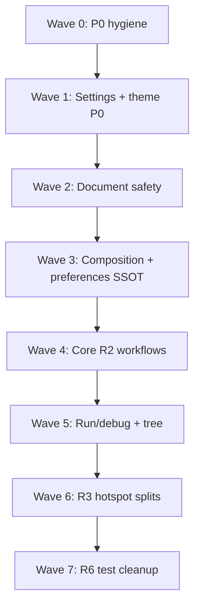

# TN-SHELL-INTEG — Thermo-Nuclear Integration Meta Review

**Critic ID:** TN-SHELL-INTEG  
**Date:** 2026-05-25  
**Baseline commit:** `7d1c89f9154aafb9cf6ccbd38d88890f5e0f39f9`  
**Scope:** Vertical integration rollup after 21 slice critics (`TN-SHELL-MW-01` … `MW-16`, `TN-SHELL-SETTINGS`, `OUTLINE`, `DEBUG`, `TEST-UI`, `LHIST`). **Document only** — no code changes.

**Inputs:** All finding files under [`_findings/`](./), [`_README.md`](./_README.md), [`docs/deslop/AUDIT_app_remaining_handoff.md`](../../deslop/AUDIT_app_remaining_handoff.md) (R2/R3 briefs).

---

## Executive verdict

**Not thermo-clean.** AD-015 decomposition has produced real extractions (`ProjectController`, `SaveWorkflow`, `PluginActivationWorkflow`, `TestRunnerWorkflow`, `SearchSidebarWidget`, `DiagnosticsOrchestrator`, panel widgets), but **~188 raw slice findings** collapse to **25 cross-cutting themes** (CC-01 … CC-25). The dominant pattern is **complexity relocation**: `window: Any` workflows, lambda/`setattr` injection grids, and one-line MainWindow delegators multiply while `main_window.py` remains **5,549 LOC / 332 methods** (~5.5× the 1k-line smell).

**Nine P0 blockers** must land before wave-2 feature work: production agent-debug logging, settings data-loss paths, document-safety holes (tree delete, external reload), HC syntax override gap, and divergent draft recovery. **R2 MainWindow wave 4** is the primary fix lane; **R3 hotspot splits** follow once composition boundaries stabilize.

---

## Raw vs deduped counts

| Metric | Approximate count |
|--------|------------------:|
| Slice critics | 21 |
| **Raw findings** (TN-*-N entries) | **~188** |
| — BLOCKER severity | ~9 |
| — STRUCTURAL severity | ~136 |
| — NICE-TO-HAVE severity | ~43 |
| **Deduped cross-cutting themes** (CC-01 … CC-25) | **25** |
| — Mapped to **P0** | 5 themes (~9 raw blockers) |
| — Mapped to **P1** | 17 themes (~120 raw structural) |
| — Mapped to **P2** | 3 themes (~43 raw nice-to-have + absorbed nits) |
| Compression ratio (raw → themes) | ~7.5:1 |

*Counts are approximate: some slice findings are process notes (e.g. MW-09-9 slice-boundary noise) or overlap heavily (agent log cited in MW-09 and MW-10).*

---

## Severity mapping

| Integration tier | Slice severity | Meaning for fix agent |
|------------------|----------------|------------------------|
| **P0** | BLOCKER | Ship-blocking: wrong behavior, data loss, or debug slop on hot paths |
| **P1** | STRUCTURAL | High-conviction code-judo; debt that multiplies on next shell growth |
| **P2** | NICE-TO-HAVE | Backlog: typing, test brittleness, minor four-theme gaps |

---

## P0 — Deduped themes (fix first)

| ID | Theme | Primary critics | Key evidence | Handoff |
|----|-------|-----------------|--------------|---------|
| **CC-01** | **Agent debug instrumentation in production hot paths** | MW-09, MW-10 | `#region agent log`, hardcoded `.cursor/debug-0b96d3.log` in `python_console_widget.py:33-57`, `main_window.py:3843-3906`, `repl_completion.py`; unreachable duplicate in `python_console_widget.py:405-411` | **Pre-R2 hygiene** (none) — delete before merge |
| **CC-02** | **Settings OK data loss (dual-scope + silent field wipe)** | SETTINGS, MW-05 | Project-scope OK never calls `global_scope_snapshot()` → global edits discarded (`settings_models.py:556`, `main_window.py:1748-1757`); `_snapshot_from_controls` omits highlighting runtime fields → merge resets to defaults (`SETTINGS-2`) | **R3** (models/dialog), **R2** (apply path) |
| **CC-03** | **Document safety asymmetric vs SaveWorkflow** | MW-12, MW-15, MW-16 | Tree delete closes dirty tabs via `close_file` with no save prompt (`MW-12-1`); external reload uses raw Yes/No, `DocumentScope.EXTERNAL_RELOAD` unused (`MW-16-1`); decline-reload sets `original_content = disk_content` + fires text-changed → clean tab becomes dirty (`MW-15-1`) | **R2** (`SaveWorkflow` / `ExternalFileChangeWorkflow` / `ProjectTreeActionWorkflow`) |
| **CC-04** | **HC syntax overrides never loaded at runtime** | MW-03, SETTINGS | `_load_syntax_color_overrides` returns light/dark keys only; `_resolve_theme_tokens` selects HC keys when `is_high_contrast` → persisted HC custom syntax colors ignored (`main_window.py:1318-1324`, `1195-1208`) | **R2** (hard-cutover before R3 stylesheet work) |
| **CC-05** | **Draft recovery divergent paths (dirty-tab dismissal risk)** | LHIST | `maybe_restore_draft` vs `_review_draft_entry` compare draft to buffer vs `original_content` differently; Recovery Center path omits tokens/meta chips (`LHIST-4`, `LHIST-9`) | **R3** |

---

## P1 — Deduped themes (R2/R3 structural wave)

| ID | Theme | Primary critics | Key evidence | Handoff |
|----|-------|-----------------|--------------|---------|
| **CC-06** | **MainWindow god file / composition root still monolithic** | MW-01, MW-02, MW-11, MW-14, all MW | 460-line `__init__`, 265-line import block, 5,549 LOC, 332 methods; slice boundaries routinely ~75% non-cluster code | **R2** (`shell_composition.py`, phased `__init__`) |
| **CC-07** | **`window: Any` ceremonial workflows (relocation not ownership)** | MW-01, MW-16, DEBUG, LHIST, TEST-UI, MW-04 | `SaveWorkflow`, `DebugControlWorkflow`, `PythonStyleWorkflow`, `RunDebugPresenter`, `LocalHistoryWorkflow` (18+ callables), `TestRunnerWorkflow` (17 params) reach into `window._*` | **R2** (typed host ports / dataclass bundles) |
| **CC-08** | **Settings/preferences load amplification (6× disk read)** | MW-01, MW-03, MW-04, MW-05, SETTINGS | Six `_load_*_preferences` each call `_load_main_window_settings()` on init and settings apply; parallel effective-settings parsers duplicate merge work | **R2** + **R3** (`ShellPreferencesSnapshot`, single bundle loader) |
| **CC-09** | **Theme orchestration + explorer tree rebuild on every theme pass** | MW-03, OUTLINE | `_apply_theme_styles` 50+ line fan-out on MainWindow; `_apply_explorer_theme` full `_populate_project_tree` on theme switch (`MW-03-3`); outline layout still 7 MainWindow methods | **R2** (`ShellThemeWorkflow`, `ExplorerOutlineLayoutController`) + **R3** |
| **CC-10** | **Runtime/onboarding/welcome circular split** | MW-01, MW-02 | `RuntimeSupportWorkflow` vs MainWindow ping-pong for runtime center; duplicate issue-report merge; welcome 13 lambdas; onboarding state persisted but unread; inline onboarding dialog | **R2** (`RuntimeOnboardingWorkflow` / `WelcomeWorkflow`) |
| **CC-11** | **Project load / settings-apply mega-orchestrators** | MW-05, MW-07 | `_apply_loaded_project` ~25-step sequential mutator; `_handle_open_settings_action` ~135 lines; redundant exclude refresh on settings apply | **R2** (`ProjectLoadWorkflow`, `SettingsApplyWorkflow`) + **R4** (exclude SSOT) |
| **CC-12** | **Debug breakpoint state split across MainWindow + workflows** | MW-01, DEBUG, LHIST | `_breakpoints_by_file` vs `_breakpoint_specs_by_key`; panel disable doesn't sync gutter (`DEBUG-1`); injected into `LocalHistoryWorkflow`, tree coordinator | **R2** (`BreakpointStore` in `DebugControlWorkflow`) |
| **CC-13** | **One-line MainWindow delegators violate shrink rule** | MW-04, MW-05, MW-07, MW-08, MW-11, MW-12, MW-15, MW-16 | ~40+ pass-through methods (find bar ×7, markdown ×3, tree presenter ×12, lint ×2, help ×2, theme token mirror, etc.) | **R2** (hard cutover menu/panel wiring to workflows) |
| **CC-14** | **Run/debug launch graph still on MainWindow** | MW-07, MW-08, DEBUG | `_last_debug_target` untyped dict router; dual entry-resolution (dead modal path); restart races `ALREADY_RUNNING`; run-config UX ~200 LOC outside controller | **R2** (`RunLaunchWorkflow`, `RunConfigurationWorkflow`, typed `DebugTarget`) |
| **CC-15** | **Intelligence / editor async still on MainWindow** | MW-06, MW-14 | ~430 lines semantic handlers; duplicated `semantic_unavailable` trees; rename nested closures; completion/hover/signature stale-guard triplicated | **R2** (`SemanticNavigationWorkflow`, shared revision-gated callback) |
| **CC-16** | **Project tree: no action workflow; full reload cascade** | MW-11, MW-12, MW-13 | Delete bypasses save (P0); preserve-then-reveal clobber; clipboard on MainWindow; cut-paste partial failure clears clipboard; every FS op → `_reload_current_project` | **R2** (`ProjectTreeActionWorkflow`, tiered refresh) + **R3** (presenter boundary) |
| **CC-17** | **Ghost MainWindow search pipeline + shutdown gap** | MW-10, MW-16 | `_active_search_worker` never assigned; dead `SearchResultsCoordinator`; shutdown cancels ghost worker not sidebar worker; four duplicate open-at-line delegators | **R2** (hard delete dead path; sidebar `cancel_active_search` on teardown) |
| **CC-18** | **Python console: no workflow; raw threads + tuple REPL events** | MW-09 | Three incompatible clear behaviors; `threading.Thread` for completion vs `_background_tasks` elsewhere; untyped `ReplEvent` tuple queue | **R2** (`PythonConsoleWorkflow`) + **R3** (console theme tokens) |
| **CC-19** | **Editor disk sync / indent / external poll fused on MainWindow** | MW-15, MW-16, MW-05 | Duplicate disk→editor paths with divergent revision bump; indent dict + 4 methods; poll fuses stale-file check + full project reload | **R2** (`EditorSyncWorkflow`, `EditorIndentWorkflow`, `ExternalFileChangeWorkflow`) |
| **CC-20** | **Cohesive menu workflows not extracted** | MW-05, MW-06, MW-14 | Find/replace ×7, quick open, project creation, new window launch, markdown triplicate mode paths, plugin manager dialog on MainWindow | **R2** |
| **CC-21** | **R3 hotspot modules oversized / split stalled** | SETTINGS, OUTLINE, DEBUG, TEST-UI, LHIST | `settings_dialog.py` 1,311 LOC; `outline_panel.py` 1,155 LOC; collapse property drift; `debug_panel_widget.py` 753 LOC; test panel 830 LOC + 270 LOC icons; `local_history_workflow.py` 765 LOC four-domain monolith | **R3** (per handoff § Shell Hotspot Splits) |
| **CC-22** | **Init ordering / lambda injection soup** | MW-01, MW-02, TEST-UI | Layout before `TestRunnerWorkflow`; 15-lambda `RuntimeSupportWorkflow`; `setattr` mutators for runtime reports; optional `getattr` for test runner on project load | **R2** (two-phase composition, `ShellRuntimeState` dataclass) |

---

## P2 — Deduped themes (backlog)

| ID | Theme | Primary critics | Key evidence | Handoff |
|----|-------|-----------------|--------------|---------|
| **CC-23** | **Four-theme gaps (HC kind colors, inline styles, QSS omissions)** | MW-03, MW-09, OUTLINE, DEBUG, TEST-UI, SETTINGS | Outline kind colors binary light/dark; console stderr hardcoded hex; search delegate defaults; `threadsTree` / `debugFailedBtn` missing from QSS; settings dialog HC manual QA undocumented | **R3** + manual acceptance |
| **CC-24** | **Test brittleness / dead API surface** | MW-06, DEBUG, TEST-UI, LHIST | `MainWindow.__new__` harness tests; private `_bp_tree` / `_tree` assertions; `update_outcomes` / `set_discovering` never called from production; dead `_execute_plugin_runtime_command` | **R6** (test audit) |
| **CC-25** | **Typed boundaries / stringly protocols** | MW-06, MW-13, MW-15, TEST-UI | `list[object]` definition chooser; tree entry tuples; indent tuples; raw outcome strings; positional 15-tuple `MainWindowSettingsSnapshot` | **R2** / **R3** (models cleanup) |

---

## Top P0 blockers for fix agent (ordered)

1. **CC-01** — Remove all agent debug logging (`#region agent log`, hardcoded log paths) from `app/shell/` and `app/runner/repl_completion.py`; restore normal `keyPressEvent` / completion paths.
2. **CC-02** — Fix settings dual-scope merge on OK (persist global + project snapshots); preserve highlighting runtime fields through dialog capture/merge.
3. **CC-03a** — Route tree delete/bulk delete through `SaveWorkflow` before filesystem delete (`MW-12-1`).
4. **CC-03b** — Wire external file reload through `SaveWorkflow` + `DocumentScope.EXTERNAL_RELOAD` (`MW-16-1`).
5. **CC-03c** — Fix decline-reload path: do not assign `original_content = disk_content` + simulate text change on clean tabs (`MW-15-1`).
6. **CC-04** — Load all four syntax override scopes via `parse_syntax_color_overrides` / snapshot HC fields (`MW-03-1`).
7. **CC-05** — Unify draft recovery into one helper with consistent buffer vs disk semantics (`LHIST-4`).

*Items 3–5 may ship as one **Document Safety** PR; items 1–2 as **Hygiene + Settings** PRs independent of large R2 extractions.*

---

## Fix-agent sequencing (ordered PR waves)

### Wave 0 — P0 hygiene (no architectural moves)

| PR | CC themes | Scope | Gate |
|----|-----------|-------|------|
| 0a | CC-01 | Delete agent debug regions; dead code in `_trigger_completion` | `rg 'debug-0b96d3\|#region agent log' app/` empty |
| 0b | CC-02 (partial) | Settings highlighting field preservation; dual-scope OK merge | Unit tests in `test_settings_models.py` |

### Wave 1 — Theme + settings correctness

| PR | CC themes | Scope | Gate |
|----|-----------|-------|------|
| 1a | CC-04 | HC syntax override loader hard cutover | HC Light/Dark syntax override characterization test |
| 1b | CC-08 (partial) | Single effective-settings load on init + settings apply | Mock `SettingsService` call count == 1 per reload |

### Wave 2 — Document safety

| PR | CC themes | Scope | Gate |
|----|-----------|-------|------|
| 2a | CC-03 | Tree delete → `SaveWorkflow`; external reload → themed dialog + EXTERNAL_RELOAD | Tab-close parity tests |
| 2b | CC-03, CC-05 | Decline-reload bugfix; unified draft recovery | Dirty-tab draft dismissal test |
| 2c | CC-12 (partial) | Pre-delete local-history captures buffer not disk only | LHIST + tree delete integration |

### Wave 3 — Composition root slimming (R2 tranche A)

| PR | CC themes | Scope | Gate |
|----|-----------|-------|------|
| 3a | CC-06, CC-22 | `ShellPreferencesSnapshot` / composition phases; drop six tuple loaders | `MainWindow` method count ↓ |
| 3b | CC-09 | `RuntimeOnboardingWorkflow` + merged runtime issue report | Runtime center integration test |
| 3c | CC-13 (batch 1) | Delete help/zoom/python-tooling pass-throughs; wire menus direct | Method count ↓ |

### Wave 4 — Core workflows (R2 tranche B)

| PR | CC themes | Scope | Gate |
|----|-----------|-------|------|
| 4a | CC-12, CC-07 | `BreakpointStore` + invert `DebugControlWorkflow` deps | Workflow tests without `MainWindow` |
| 4b | CC-11, CC-08 | `SettingsApplyWorkflow` + `ProjectLoadWorkflow` | Integration: open project B after A |
| 4c | CC-15 | `SemanticNavigationWorkflow` | Port MW-06 unit tests |
| 4d | CC-20 | `FindReplaceWorkflow`, `QuickOpenWorkflow`, project creation on `ProjectController` | Method count ↓ |
| 4e | CC-09, CC-18 | `ShellThemeWorkflow`; `PythonConsoleWorkflow` | Four-theme smoke on theme switch |
| 4f | CC-17 | Delete ghost search pipeline; sidebar shutdown cancel | Grep: no `_set_search_results` production callers |

### Wave 5 — Run/debug + tree (R2 tranche C)

| PR | CC themes | Scope | Gate |
|----|-----------|-------|------|
| 5a | CC-14 | `RunLaunchWorkflow`, typed `DebugTarget`, restart race fix | Restart integration test |
| 5b | CC-16 | `ProjectTreeActionWorkflow` + tiered refresh (not always full reload) | Delete/save gate + refresh characterization |
| 5c | CC-19 | `EditorSyncWorkflow`, `ExternalFileChangeWorkflow`, lint pass-through deletion | Unified revision bump tests |

### Wave 6 — R3 hotspot splits

| PR | CC themes | Scope | Gate |
|----|-----------|-------|------|
| 6a | CC-21 | `settings_dialog_*` modules; dialog < 400 LOC shell | Existing settings dialog tests |
| 6b | CC-21, CC-09 | `outline/` split; collapse property fix; sort SSOT | `test_outline_panel.py` |
| 6c | CC-21, CC-12 | `debug_panel_*` split; breakpoint clear-all single path | `test_debug_panel_widget.py` |
| 6d | CC-21 | `test_explorer_icons.py`; wire `set_discovering`; outcome SSOT | `test_test_runner_workflow.py` |
| 6e | CC-21, CC-05 | Split `LocalHistoryWorkflow` → session/autosave/history/recovery | LOC < 700 per module |

### Wave 7 — Hygiene (R6)

| PR | CC themes | Scope |
|----|-----------|-------|
| 7a | CC-24, CC-25 | Migrate tests off `MainWindow.__new__`; typed outcomes/enums |

**Parallelism:** Waves 0–2 can start immediately. Wave 3–4 items can parallelize by subdomain if agents own disjoint modules. **R4/R5** (file inventory, dependency classifier) from handoff are out of shell-wave-1 scope but unblock CC-11 exclude dedup long-term.

---

## R2 / R3 handoff mapping summary

| Handoff brief | Primary CC themes | Slice critics most involved |
|---------------|-------------------|----------------------------|
| **R2** — MainWindow wave 4 | CC-06–CC-20, CC-22, CC-12–CC-14 | MW-01 … MW-16, DEBUG |
| **R3** — Shell hotspot splits | CC-21, CC-09 (outline layout), CC-23 | SETTINGS, OUTLINE, DEBUG, TEST-UI, LHIST, MW-03 |
| **R4** — Project inventory SSOT | CC-11 (exclude dedup) | MW-05, MW-07, MW-11, MW-15 |
| **R6** — Test audit | CC-24 | MW-06, DEBUG, TEST-UI |
| **Pre-R2 hygiene** | CC-01 | MW-09, MW-10 |
| **Immediate bugfix (any brief)** | CC-02, CC-03, CC-04, CC-05 | SETTINGS, MW-03, MW-12, MW-15, MW-16, LHIST |

Global rules from handoff §3 apply to every wave: **MainWindow method count must go down** on every touching PR; **no new one-line delegators**; hard cutover importers; four-theme validation recorded for UI changes.

---

## Positive signals (extractions that worked)

| Extraction | Why it worked | Critics citing |
|------------|---------------|----------------|
| **`ProjectController`** | Callback-based boundary (`confirm_proceed`, `on_loaded`); no `window: Any` | MW-05, MW-07 |
| **`SaveWorkflow`** | Themed unsaved dialog, autosave, style-on-save; menu wired direct | MW-16, MW-12 (target to extend) |
| **`PluginActivationWorkflow`** | Typed protocols, immutable snapshot, pure enable map | MW-01, MW-14 |
| **`TestRunnerWorkflow`** | Pytest discover/run/debug out of MainWindow; solid unit harness | TEST-UI, MW-01 |
| **`SearchSidebarWidget`** | Owns worker, debounce, filters, main-thread apply signal | MW-10 |
| **`DiagnosticsOrchestrator`** | Realtime lint debounce + active-tab guard | MW-15, MW-16 |
| **`RunSessionController` / `RunConfigController`** | Typed I/O boundaries | MW-08 |
| **`EditorWorkspaceController`** | Clean path→widget alias (underused — opportunity) | MW-01, MW-05 |
| **`main_window_layout.build_layout_shell`** | Layout outside class | MW-01 |
| **`ProjectTreeActionCoordinator` + `ProjectTreeController`** | FS + editor remap separated (needs workflow wrapper + safety) | MW-12, MW-13 |
| **`LocalHistoryStore` / persistence facade** | Workflow delegates storage correctly | LHIST |
| **`OutlinePanel` private sub-widgets** | Cohesive sketch ready for file split | OUTLINE |
| **`DebugPanelWidget` signal surface** | 11 signals, one wiring block | DEBUG |
| **`MarkdownEditorPane`** | Preview/mode/theme at editor layer | MW-14 |
| **`outline_service` boundary** | Panel consumes symbols, no parsing in widget | OUTLINE |

**Pattern to replicate:** typed ports + user-action-shaped public methods + tests that construct the module without `MainWindow.__new__`.

**Pattern to retire:** `def __init__(self, window: Any)`, MainWindow one-line delegators, and sequential 20-step orchestrators on the composition root.

---

## Approval bar (shell wave 1 → fix agent)

**Do not approve** wave-2 feature work on `app/shell/main_window.py` until:

1. All **P0** themes (CC-01 … CC-05) are fixed or explicitly product-waived.
2. Each MainWindow-touching PR **net-reduces** method count (handoff §3).
3. New extractions use **typed host ports**, not `window: Any`.
4. R3 module splits start only after Wave 3–4 composition boundaries exist (per handoff sequencing: R2 before R3).

---

## Cross-reference index (raw finding → CC theme)

Quick lookup: slice finding IDs → CC theme (click to expand)

| Raw IDs (sample) | CC |
|------------------|-----|
| MW-09-1, MW-10-2, MW-09-10 | CC-01 |
| SETTINGS-1, SETTINGS-2, MW-05-1 | CC-02 |
| MW-12-1, MW-15-1, MW-16-1, MW-12-2, LHIST-4 | CC-03, CC-05 |
| MW-03-1 | CC-04 |
| MW-01-1, MW-01-8, MW-11-8, MW-14-7 | CC-06 |
| MW-01-2, DEBUG-2, MW-16-5, TEST-UI-7 | CC-07 |
| MW-01-4…5, MW-02-7…8, LHIST-3, TEST-UI-3 | CC-22 |
| MW-01-3, MW-04-1…3, MW-05-1, SETTINGS-5…6 | CC-08 |
| MW-03-2…4, OUTLINE-4…5 | CC-09 |
| MW-02-1…6, MW-01-7 | CC-10 |
| MW-07-1…2, MW-05-2 | CC-11 |
| MW-01-6, DEBUG-1, LHIST-2 | CC-12 |
| MW-04-2, MW-05-4…5, MW-11-5, MW-12-4, MW-15-4 | CC-13 |
| MW-07-3…4, MW-08-1…8 | CC-14 |
| MW-06-*, MW-14-8 | CC-15 |
| MW-11-1…6, MW-12-*, MW-13-* | CC-16 |
| MW-10-1,3,5, MW-16-8 | CC-17 |
| MW-09-2…7 | CC-18 |
| MW-15-*, MW-16-6 | CC-19 |
| MW-05-3…8, MW-14-1…4 | CC-20 |
| SETTINGS-3…8, OUTLINE-1…3, DEBUG-6, TEST-UI-1…5, LHIST-1…6 | CC-21 |
| MW-03-6…7, MW-09-8, OUTLINE-7…8, DEBUG-9, TEST-UI-5…9 | CC-23 |
| MW-06-9, DEBUG-10, TEST-UI-6…10, LHIST-7…8 | CC-24 |
| MW-06-6, MW-13-7, MW-15-7, TEST-UI-8, MW-04-7 | CC-25 |

---

*End of TN-SHELL-INTEG. Consolidated wave summary: [`../shell_wave_1_thermo_review_2026-05-25.md`](../shell_wave_1_thermo_review_2026-05-25.md).*
