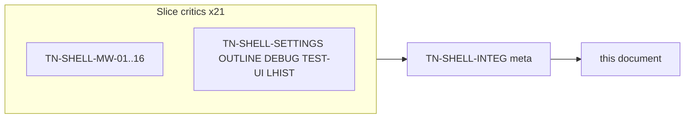
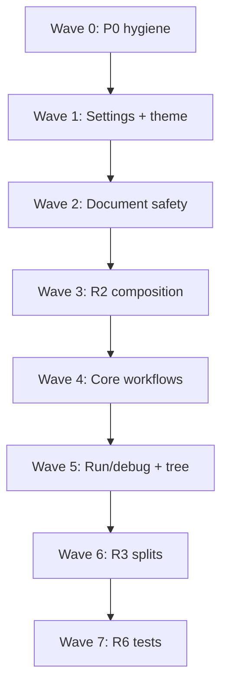

# Shell Wave 1 — Thermo-Nuclear Code Quality Review (2026-05-25)

> Strict maintainability and structural-simplification pass over `app/shell/` on **`7d1c89f9154aafb9cf6ccbd38d88890f5e0f39f9`**. Twenty-one slice critics plus one integration meta-reviewer (`TN-SHELL-INTEG`), using the thermo-nuclear rubric (code-judo, 1k-line rule, no rubber-stamping). **Document only** — no remediation commits in this round.
>
> **Per-critic raw findings:** [`_findings/`](_findings/) (22 files). **Prior deslop handoff:** [`docs/deslop/AUDIT_app_remaining_handoff.md`](../deslop/AUDIT_app_remaining_handoff.md) — this pass extends R2/R3 with line-level evidence.

---

## 0. How this review is organized

**Severity model (thermo-native):**

| Tier | Meaning |
|------|---------|
| **P0 BLOCKER** | Wrong behavior, data loss, debug slop on hot paths, document-safety holes |
| **P1 STRUCTURAL** | High-conviction code-judo moves; debt that multiplies on next shell growth |
| **P2 NICE-TO-HAVE** | Backlog: typing, test brittleness, minor four-theme gaps |

**Approval bar (integration thermo):** `app/shell/` is **not thermo-clean**. Individual extractions are real, but `main_window.py` remains **5,549 LOC / 332 methods** (~5.5× the 1k-line smell). Do not grow shell features until P0 themes land and MainWindow-touching PRs **net-reduce** method count.

---

## 1. Executive summary

| Metric | Count |
|--------|------:|
| Slice critics | 21 |
| Raw finding entries (slice) | ~188 |
| — BLOCKER severity | ~9 |
| — STRUCTURAL severity | ~136 |
| — NICE-TO-HAVE severity | ~43 |
| **Deduped cross-cutting themes** | **25** |
| **P0 BLOCKER (deduped)** | **5** |
| **P1 STRUCTURAL (deduped)** | **17** |
| **P2 NICE-TO-HAVE (deduped)** | **3** |

**Top 5 blockers (integration view):**

1. **Agent debug instrumentation on production hot paths** — hardcoded `.cursor/debug-*.log` in console/completion code ([CC-01](_findings/TN-SHELL-INTEG.md), [MW-09](_findings/TN-SHELL-MW-09.md), [MW-10](_findings/TN-SHELL-MW-10.md)).
2. **Settings OK data loss** — project-scope OK discards global edits; highlighting runtime fields wiped on save ([CC-02](_findings/TN-SHELL-INTEG.md), [SETTINGS](_findings/TN-SHELL-SETTINGS.md)).
3. **Document safety asymmetric vs SaveWorkflow** — tree delete skips save prompt; external reload bypasses themed dialog; decline-reload marks clean tabs dirty ([CC-03](_findings/TN-SHELL-INTEG.md), [MW-12](_findings/TN-SHELL-MW-12.md), [MW-15](_findings/TN-SHELL-MW-15.md), [MW-16](_findings/TN-SHELL-MW-16.md)).
4. **HC syntax overrides never loaded** — loader returns light/dark keys only while resolver selects HC keys ([CC-04](_findings/TN-SHELL-INTEG.md), [MW-03](_findings/TN-SHELL-MW-03.md)).
5. **Draft recovery divergent paths** — buffer vs disk semantics differ between recovery entry points ([CC-05](_findings/TN-SHELL-INTEG.md), [LHIST](_findings/TN-SHELL-LHIST.md)).

**Dominant risk:** not missing abstractions — **ceremonial extractions**. Workflows take `window: Any`, MainWindow keeps 40+ one-line delegators, and mega-orchestrators (`__init__` ~460 lines, `_apply_loaded_project` ~25 steps, settings apply ~135 lines) remain on the composition root.

**What already works (replicate this pattern):**

- `ProjectController`, `SaveWorkflow` (tab close / exit), `PluginActivationWorkflow`, `TestRunnerWorkflow`
- `SearchSidebarWidget`, `DiagnosticsOrchestrator`, `main_window_layout.build_layout_shell`
- Panel signal surfaces (`DebugPanelWidget`, `OutlinePanel` sub-widgets)

Full positive-signal table: [TN-SHELL-INTEG § Positive signals](_findings/TN-SHELL-INTEG.md#positive-signals-extractions-that-worked).

---

## 2. P0 BLOCKER — deduped themes

| ID | Theme | Primary critics | Key evidence |
|----|-------|-----------------|--------------|
| **CC-01** | Agent debug logging in production hot paths | [MW-09](_findings/TN-SHELL-MW-09.md), [MW-10](_findings/TN-SHELL-MW-10.md) | `#region agent log`, hardcoded `.cursor/debug-0b96d3.log` in console/completion |
| **CC-02** | Settings OK data loss (dual-scope + field wipe) | [SETTINGS](_findings/TN-SHELL-SETTINGS.md), [MW-05](_findings/TN-SHELL-MW-05.md) | Global edits discarded on project-scope OK; highlighting fields reset to defaults |
| **CC-03** | Document safety gaps vs SaveWorkflow | [MW-12](_findings/TN-SHELL-MW-12.md), [MW-15](_findings/TN-SHELL-MW-15.md), [MW-16](_findings/TN-SHELL-MW-16.md) | Tree delete no save prompt; external reload raw Yes/No; decline-reload dirty bug |
| **CC-04** | HC syntax overrides never loaded | [MW-03](_findings/TN-SHELL-MW-03.md), [SETTINGS](_findings/TN-SHELL-SETTINGS.md) | `_load_syntax_color_overrides` light/dark only; resolver uses HC keys |
| **CC-05** | Draft recovery divergent semantics | [LHIST](_findings/TN-SHELL-LHIST.md) | `maybe_restore_draft` vs Recovery Center path compare buffer/disk differently |

---

## 3. P1 STRUCTURAL — deduped themes

| ID | Theme | Primary critics |
|----|-------|-----------------|
| **CC-06** | MainWindow god file (5,549 LOC, 332 methods, 460-line `__init__`) | MW-01 … MW-16 |
| **CC-07** | `window: Any` ceremonial workflows | MW-01, MW-16, DEBUG, LHIST, TEST-UI |
| **CC-08** | Settings load amplification (6× disk read per reload) | MW-01, MW-04, MW-05, SETTINGS |
| **CC-09** | Theme orchestration + full tree rebuild on theme pass | MW-03, OUTLINE |
| **CC-10** | Runtime/onboarding/welcome circular split | MW-01, MW-02 |
| **CC-11** | Project load / settings-apply mega-orchestrators | MW-05, MW-07 |
| **CC-12** | Breakpoint state split across MainWindow + workflows | MW-01, DEBUG, LHIST |
| **CC-13** | One-line MainWindow delegators (shrink-rule violation) | MW-04 … MW-16 |
| **CC-14** | Run/debug launch graph still on MainWindow | MW-07, MW-08, DEBUG |
| **CC-15** | Intelligence / editor async still on MainWindow | MW-06, MW-14 |
| **CC-16** | Project tree: no action workflow; full reload cascade | MW-11, MW-12, MW-13 |
| **CC-17** | Ghost MainWindow search pipeline + shutdown gap | MW-10, MW-16 |
| **CC-18** | Python console: no workflow; raw threads | MW-09 |
| **CC-19** | Editor disk sync / indent / poll fused on MainWindow | MW-15, MW-16 |
| **CC-20** | Cohesive menu workflows not extracted | MW-05, MW-06, MW-14 |
| **CC-21** | R3 hotspot modules oversized (SETTINGS, OUTLINE, DEBUG, TEST-UI, LHIST) | SETTINGS, OUTLINE, DEBUG, TEST-UI, LHIST |
| **CC-22** | Init ordering / lambda injection soup | MW-01, MW-02, TEST-UI |

---

## 4. P2 NICE-TO-HAVE — deduped themes

| ID | Theme | Primary critics |
|----|-------|-----------------|
| **CC-23** | Four-theme gaps (HC kind colors, inline styles, QSS omissions) | MW-03, MW-09, OUTLINE, DEBUG, TEST-UI |
| **CC-24** | Test brittleness / dead API surface | MW-06, DEBUG, TEST-UI, LHIST |
| **CC-25** | Typed boundaries / stringly protocols | MW-06, MW-13, MW-15, TEST-UI, SETTINGS |

---

## 5. Fix-agent sequencing

Ordered PR waves from [TN-SHELL-INTEG](_findings/TN-SHELL-INTEG.md). **Waves 0–2 are independent and should land first.**

| Wave | Focus | CC themes | Gate |
|------|-------|-----------|------|
| **0** | P0 hygiene | CC-01 | `rg 'debug-0b96d3\|#region agent log' app/` empty |
| **1** | Settings + theme P0 | CC-02, CC-04, CC-08 (partial) | HC syntax override test; settings merge tests |
| **2** | Document safety | CC-03, CC-05 | Tab-close parity; draft recovery unified |
| **3** | Composition slimming (R2-A) | CC-06, CC-08, CC-09, CC-10, CC-13, CC-22 | MainWindow method count ↓ each PR |
| **4** | Core workflows (R2-B) | CC-07, CC-11, CC-12, CC-15, CC-17, CC-18, CC-20 | Workflow tests without `MainWindow.__new__` |
| **5** | Run/debug + tree (R2-C) | CC-14, CC-16, CC-19 | Restart race test; delete→save gate |
| **6** | R3 hotspot splits | CC-21 | Each module < 700–400 LOC targets per handoff |
| **7** | R6 test cleanup | CC-24, CC-25 | Public-behavior tests |

**Handoff mapping:**

| Brief | CC themes |
|-------|-----------|
| **R2** MainWindow wave 4 | CC-06 … CC-20, CC-22 |
| **R3** Shell hotspot splits | CC-21, CC-09 (outline), CC-23 |
| **R4** Project inventory SSOT | CC-11 (exclude dedup) — wave 2+ |
| **R6** Test audit | CC-24 |
| **Immediate bugfix** | CC-01 … CC-05 |

**Global rules (every PR):** MainWindow method count must go down; no new one-line delegators; hard cutover importers; four-theme validation recorded for UI changes ([handoff §3](../deslop/AUDIT_app_remaining_handoff.md)).

---

## 6. Per-critic index

Use this document for prioritization; drill into per-critic files for evidence and local code-judo detail.

### MainWindow slices

| Critic | Lines | Verdict | Findings |
|--------|-------|---------|----------|
| [TN-SHELL-MW-01](_findings/TN-SHELL-MW-01.md) | 1–772 | Not thermo-clean | 8 |
| [TN-SHELL-MW-02](_findings/TN-SHELL-MW-02.md) | 773–1117 | Not thermo-clean | 10 |
| [TN-SHELL-MW-03](_findings/TN-SHELL-MW-03.md) | 1118–1395 | Not thermo-clean | 7 (1 BLOCKER) |
| [TN-SHELL-MW-04](_findings/TN-SHELL-MW-04.md) | 1396–1557 | Not thermo-clean | 8 |
| [TN-SHELL-MW-05](_findings/TN-SHELL-MW-05.md) | 1558–1996 | Not thermo-clean | 10 |
| [TN-SHELL-MW-06](_findings/TN-SHELL-MW-06.md) | 1997–2664 | Not thermo-clean | 9 |
| [TN-SHELL-MW-07](_findings/TN-SHELL-MW-07.md) | 2665–2936 | Not thermo-clean | 9 |
| [TN-SHELL-MW-08](_findings/TN-SHELL-MW-08.md) | 2937–3483 | Not thermo-clean | 9 |
| [TN-SHELL-MW-09](_findings/TN-SHELL-MW-09.md) | 3484–3827 | Not thermo-clean | 10 (1 BLOCKER) |
| [TN-SHELL-MW-10](_findings/TN-SHELL-MW-10.md) | 3828–4223 | Not thermo-clean | 8 (1 BLOCKER) |
| [TN-SHELL-MW-11](_findings/TN-SHELL-MW-11.md) | 4224–4477 | Not thermo-clean | 8 |
| [TN-SHELL-MW-12](_findings/TN-SHELL-MW-12.md) | 4478–4681 | Not thermo-clean | 8 (1 BLOCKER) |
| [TN-SHELL-MW-13](_findings/TN-SHELL-MW-13.md) | 4682–4911 | Not thermo-clean | 9 |
| [TN-SHELL-MW-14](_findings/TN-SHELL-MW-14.md) | 4912–5368 | Not thermo-clean | 9 |
| [TN-SHELL-MW-15](_findings/TN-SHELL-MW-15.md) | 5369–5522 | Not thermo-clean | 8 (1 BLOCKER) |
| [TN-SHELL-MW-16](_findings/TN-SHELL-MW-16.md) | 5523–EOF | Not thermo-clean | 10 (1 BLOCKER) |

### Hotspot modules

| Critic | Files | Verdict | Findings |
|--------|-------|---------|----------|
| [TN-SHELL-SETTINGS](_findings/TN-SHELL-SETTINGS.md) | settings_dialog, settings_models | Blocked (2 P0) | 10 |
| [TN-SHELL-OUTLINE](_findings/TN-SHELL-OUTLINE.md) | outline_panel | Not thermo-clean | 9 |
| [TN-SHELL-DEBUG](_findings/TN-SHELL-DEBUG.md) | debug_panel, debug_control_workflow | Not thermo-clean | 10 |
| [TN-SHELL-TEST-UI](_findings/TN-SHELL-TEST-UI.md) | test_explorer, test_runner_workflow | Not thermo-clean | 10 |
| [TN-SHELL-LHIST](_findings/TN-SHELL-LHIST.md) | local_history_workflow, dialog | Not thermo-clean | 10 (1 BLOCKER) |

### Integration

| Critic | Role |
|--------|------|
| [TN-SHELL-INTEG](_findings/TN-SHELL-INTEG.md) | Deduped CC-01 … CC-25, fix sequencing, handoff mapping |

---

## 7. Wave 2+ backlog (out of scope for wave 1)

| Wave | Domain | Why next |
|------|--------|----------|
| Shell wave 2 | R4 project file inventory SSOT | CC-11 exclude dedup across search/index/diagnostics |
| Shell wave 3 | R5 dependency classifier SSOT | diagnostics vs packaging drift |
| Shell wave 4 | `app/runner/` + `app/run/` + `app/debug/` | subprocess/debug correctness |
| Shell wave 5 | `app/intelligence/` | async/thread contracts (AD-016) |
| Shell wave 6 | R6 test brittleness | after shell stabilizes |

---

## 8. Fix-agent quick start

1. Read this rollup for P0/P1 priority.
2. Start **Wave 0** (delete agent debug logging) — zero architectural risk.
3. Start **Wave 1–2** in parallel if different agents own settings vs document safety.
4. For each finding, open the linked per-critic file for verbatim evidence and code-judo alternative.
5. Before closing any MainWindow PR: count methods (`rg "^    def " app/shell/main_window.py | wc -l`) — must decrease.
6. Run `python3 testing/run_test_shard.py fast` and `npx pyright` before declaring a wave complete.

**Manifest and metric baseline:** [`00-manifest.md`](00-manifest.md)
