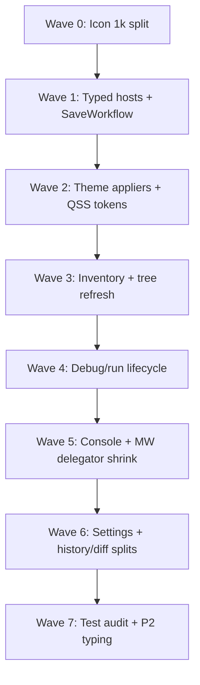

# TN-SHELL2-INTEG — Thermo-Nuclear Integration Meta Review

**Critic ID:** TN-SHELL2-INTEG  
**Date:** 2026-06-17  
**Baseline commit:** `fccb6113577752eed330fd8910f72de598c97ec2`  
**Scope:** Vertical integration rollup after 12 slice critics (`TN-SHELL2-ICON` … `TN-SHELL2-LHIST-DIFF`). **Document only** — no code changes.

**Inputs:** All finding files under [`_findings/`](./), [`00-manifest.md`](../00-manifest.md) prep P3 CC reconciliation, prior [`shell-wave-1/_findings/TN-SHELL-INTEG.md`](../../shell-wave-1/_findings/TN-SHELL-INTEG.md).

---

## 1. Executive verdict

**REJECT — shell subsystem at HEAD is not thermo-clean.**

Shell Wave 1 remediation **achieved the composition cutover**: `main_window.py` **542 LOC / 45 methods** (from 5,549 / 332), **six Wave 1 P0 themes closed** (agent debug, settings data-loss, document safety, HC syntax overrides, draft recovery, ghost search), and real extractions (`BreakpointStore`, `RunLaunchWorkflow`, `SemanticNavigationWorkflow`, `ShellThemeWorkflow`, `ProjectInventoryOrchestrator`, outline package split). Complexity was **relocated**, not deleted: **`install_main_window_composition`** is a 465-line setattr grid; **79 `window: Any`** bindings persist; **`icon_provider.py` is the sole `app/` file above 1k** (1,106 LOC).

**~124 raw slice findings** collapse to **22 cross-cutting themes** (`CC-SHELL2-01` … `CC-SHELL2-22`). Dominant blockers: **1k icon pipeline**, **typed-host migration stalled**, **theme/QSS four-theme drift**, **project inventory walk duplication**, **debug restart race**, **console/REPL lifecycle split**, **`diff_view` monolith**. **No Wave 1 P0 REGRESSION** detected.

**Do not approve** new shell surface area on `main_window.py`, `icon_provider.py`, `main_window_composition.py`, or `diff_view.py` until Wave 0–3 fix lanes below land. **Editors Wave 2 ACCEPT gates hold** — shell editor-tab seam quality is a separate bar (TN-SHELL2-EDITOR-SEAM).

---

## 2. Raw vs deduped counts

| Metric | Count |
|--------|------:|
| Slice critics | 12 |
| **Raw findings** (TN-SHELL2-*-N entries) | **~124** |
| — BLOCKER severity | ~1 |
| — STRUCTURAL severity | ~85 |
| — NICE-TO-HAVE severity | ~40 |
| **Deduped cross-cutting themes** (`CC-SHELL2-01` … `CC-SHELL2-22`) | **22** |
| Compression ratio (raw → themes) | ~5.6:1 |

| Integration tier | Slice severity | Meaning |
|------------------|----------------|---------|
| **P0** | BLOCKER + architecture-gate presumptive blockers | Ship-blocking or 1k-line gate |
| **P1** | STRUCTURAL | High-conviction code-judo; debt that multiplies on next growth |
| **P2** | NICE-TO-HAVE + test/hygiene backlog | Typing, dead code, test brittleness |

---

## 3. Deduped themes — CC-SHELL2-01 … CC-SHELL2-22

| ID | Theme | Tier | Primary slices | Key evidence |
|----|-------|------|----------------|--------------|
| **CC-SHELL2-01** | **Sole `app/` 1k violation: `icon_provider.py` + ~92 copy-paste SVG factories** | **P0** | ICON | 1,106 LOC only file ≥1k; grew from ~172 LOC when menu SVGs consolidated without split |
| **CC-SHELL2-02** | **Icon pipeline: cache churn, QPainter sprawl, menu registry fragmentation** | P1 | ICON | No `clear_icon_caches` in `icon_provider`; six modules duplicate QPainter paths; three menu icon subsystems |
| **CC-SHELL2-03** | **Four-theme icon/kind palette gaps (binary `is_dark`, explorer hex literals)** | P1 | ICON, OUTLINE, SEARCH, CONSOLE | `outline_icons` HC-unaware; `main_window_panels` hardcoded explorer toolbar hex; console stderr literals |
| **CC-SHELL2-04** | **Mega-compositor: `install_main_window_composition` setattr grid** | P1 | COMP | 590 LOC installer, 339 `window._*` touches, 53 shell imports — CC-06 debt relocated |
| **CC-SHELL2-05** | **`window: Any` + `MainWindow*Host` adapter explosion** | P1 | COMP, PROJECT, DEBUG-RUN, CONSOLE, SEARCH, EDITOR-SEAM, LHIST-DIFF | 79 shell-wide; SaveWorkflow sole untyped `*Workflow`; presenter/launch hosts `Any`-heavy |
| **CC-SHELL2-06** | **Init ordering + lambda/setattr injection soup** | P1 | COMP, MW, LHIST-DIFF | Forward-reference lambdas; `RuntimeSupportWorkflow` setattr closures; `LocalHistoryWorkflow` 16+ callables |
| **CC-SHELL2-07** | **Layer inversion: L1 workflow imports L0 `shell_composition`** | P1 | COMP, EDITOR-SEAM | `editor_tab_workflow` → `build_editor_sync_workflow` upward import |
| **CC-SHELL2-08** | **`ShellThemeWorkflow` wired but surface appliers live in composition host** | P1 | COMP, STYLES | 90-line `_build_child_callbacks`; deferred editor rehighlight `QTimer` chain in host |
| **CC-SHELL2-09** | **QSS accent hover/pressed uses binary `is_dark` literals, not token fields** | P1 | STYLES | `#4D7AFF` / `#2952CC` ternaries across section modules; CC-23 partial |
| **CC-SHELL2-10** | **Settings: handlers monolith + models monolith + apply diff duplication** | P1 | SETTINGS | 778 LOC mixin; baseline mirrors snapshot; dead `retention_policy_changed`; unconditional bundle apply |
| **CC-SHELL2-11** | **MainWindow delegator shrink backlog (editor text, run session, console handlers)** | P1 | MW, DEBUG-RUN, CONSOLE | 11 `menu_wiring` → `window._handle_*`; stop/restart on MW; console signals → MW |
| **CC-SHELL2-12** | **Search: CC-17 CLOSED; sidebar 687 LOC monolith + options/glob SSOT fork** | P1 | SEARCH | Ghost pipeline deleted; `FindOptions` vs `SearchOptions`; session globs bypass inventory matchers |
| **CC-SHELL2-13** | **Project tree: every FS mutation → full `rescan_from_disk`** | P1 | PROJECT | `ProjectTreeActionCoordinator` blind `_reload_project()` — CC-16 partial |
| **CC-SHELL2-14** | **Inventory orchestrator partial: double walk, poll fallback, search-sidebar coupling** | P1 | PROJECT, EDITOR-SEAM | `open_project` + `rebuild`; poll `iter_project_entries` fallback; rebuild gated under search sidebar |
| **CC-SHELL2-15** | **Project load surface imperative mega-block** | P1 | PROJECT | `project_load_surface.py` untyped `window: Any` fan-out — CC-11 partial |
| **CC-SHELL2-16** | **Outline R3 split win; theme full-rebuild + sort SSOT + symbol clone debt** | P1 | OUTLINE | `_render_tree` on every theme pass; dual sort ownership; `OutlineSymbol` clone on sort |
| **CC-SHELL2-17** | **Debug/run restart race + lifecycle asymmetry on MainWindow** | P1 | DEBUG-RUN, MW | Stop-then-immediate-relaunch; start via presenter, stop/restart on MW — Run CC-17 partial |
| **CC-SHELL2-18** | **Breakpoint SSOT substantially closed; dual clear-all + dual-store residuals** | P1 | DEBUG-RUN | `BreakpointStore` owned; panel clear loops N emits vs atomic menu path |
| **CC-SHELL2-19** | **`RunLaunchWorkflow` facade + `RunDebugPresenter` typing gap** | P1 | DEBUG-RUN | 582 LOC facade; presenter `window: Any`; 10 `Any` ports on launch host |
| **CC-SHELL2-20** | **Console: partial workflow + tuple `ReplEvent` + 782 LOC widget monolith** | P1 | CONSOLE | Submit/interrupt on MW; `ReplEvent` tuple queue; completion state duplicated from editor |
| **CC-SHELL2-21** | **Editor tab registry fragmentation + coordinator↔workflow cycle** | P1 | EDITOR-SEAM, PROJECT | Three `MarkdownTabRegistry(` sites; pass-through `EditorTabContentRegistry`; coordinator calls `window._editor_tab_workflow` |
| **CC-SHELL2-22** | **`diff_view` 830 LOC monolith + history orchestration crowding** | P1 | LHIST-DIFF | Parser-only tests; triplicate history-restore dispatch; recovery center overlap |

---

## 4. Wave 1 supersession table — CC-01 … CC-25

| Wave 1 CC | Wave 1 tier | Wave 2 status | CC-SHELL2 mapping | Notes |
|-----------|-------------|---------------|-------------------|-------|
| **CC-01** | P0 | **CLOSED** | — | Agent debug markers 0 |
| **CC-02** | P0 | **CLOSED** | — | Dual-scope OK + highlighting round-trip |
| **CC-03** | P0 | **CLOSED** | — | SaveWorkflow + ExternalFileChangeWorkflow |
| **CC-04** | P0 | **CLOSED** | CC-SHELL2-08 (keeper) | Four-scope syntax overrides + tests |
| **CC-05** | P0 | **CLOSED** | — | Unified `_offer_draft_recovery` |
| **CC-06** | P1 | **PARTIAL** | CC-SHELL2-04, CC-SHELL2-05 | MW slim; debt → mega-compositor |
| **CC-07** | P1 | **OPEN** | CC-SHELL2-05, CC-SHELL2-06 | 79 `window: Any`; SaveWorkflow untyped |
| **CC-08** | P1 | **PARTIAL** | CC-SHELL2-10 | OK path single bundle load; apply still unconditional |
| **CC-09** | P1 | **PARTIAL** | CC-SHELL2-08, CC-SHELL2-16 | Workflow wired; tree rebuild removed from explorer theme; outline still rebuilds |
| **CC-10** | P1 | **PARTIAL** | CC-SHELL2-06 | Runtime/onboarding lambdas persist |
| **CC-11** | P1 | **PARTIAL** | CC-SHELL2-15 | Phases extracted; surface imperative |
| **CC-12** | P1 | **PARTIAL** | CC-SHELL2-18 | BreakpointStore landed; dual clear/store residuals |
| **CC-13** | P1 | **PARTIAL** | CC-SHELL2-11 | Help/zoom/find direct; editor/run/console pass-throughs remain |
| **CC-14** | P1 | **PARTIAL** | CC-SHELL2-17, CC-SHELL2-19 | Launch extracted; lifecycle asymmetry |
| **CC-15** | P1 | **PARTIAL** | OUTLINE (symbol_nav) | `SemanticNavigationWorkflow` extracted; 380 LOC nested callbacks |
| **CC-16** | P1 | **PARTIAL** | CC-SHELL2-13 | Delete workflow closed; full rescan cascade open |
| **CC-17** | P1 | **CLOSED** | CC-SHELL2-12 (closure half) | Ghost search hard-deleted; shutdown cancel wired |
| **CC-18** | P1 | **PARTIAL** | CC-SHELL2-20 | Workflows exist; lifecycle + tuple events open |
| **CC-19** | P1 | **PARTIAL** | PROJECT, EDITOR-SEAM | External sync workflow extracted; poll fallback open |
| **CC-20** | P1 | **PARTIAL** | CC-SHELL2-11, CC-SHELL2-12 | Find/replace substantially closed; run/console residuals |
| **CC-21** | P1 | **PARTIAL** | CC-SHELL2-01, CC-SHELL2-02, CC-SHELL2-10, CC-SHELL2-22 | Outline/settings splits landed; icon_provider became 1k; diff_view 830 |
| **CC-22** | P1 | **PARTIAL** | CC-SHELL2-06, CC-SHELL2-05 | Ordering fragile; host adapters untyped |
| **CC-23** | P2 | **PARTIAL** | CC-SHELL2-03, CC-SHELL2-09 | threadsTree/debugFailedBtn QSS closed; accent literals + icon palettes open |
| **CC-24** | P2 | **OPEN** | P2 rollup (tests) | `MainWindow.__new__` harness; private-cache probing |
| **CC-25** | P2 | **OPEN** | P2 rollup (typing) | Positional tuples; stringly protocols persist |

**REGRESSION:** none detected for Wave 1 P0 themes.

---

## 5. P0 / P1 / P2 rollup tables

### P0 — presumptive blockers

| ID | Theme | Slices | Gate |
|----|-------|--------|------|
| **CC-SHELL2-01** | `icon_provider.py` sole 1k `app/` file | ICON | Architecture gate §2 — no new glyphs until split |

*Wave 1 P0 (CC-01…CC-05) remain CLOSED. No new ship-blocking data-loss or debug-slop blockers in Wave 2 slice audit.*

### P1 — structural wave (R2/R3)

| ID | Theme | Slices |
|----|-------|--------|
| CC-SHELL2-02 | Icon cache + QPainter consolidation | ICON |
| CC-SHELL2-03 | Four-theme icon/console/outline palettes | ICON, OUTLINE, CONSOLE, SEARCH |
| CC-SHELL2-04 | `ShellCompositionContext` / phased install | COMP |
| CC-SHELL2-05 | Typed host ports (`SaveWorkflow` priority) | COMP, PROJECT, DEBUG-RUN, CONSOLE, SEARCH, EDITOR-SEAM, LHIST-DIFF |
| CC-SHELL2-06 | Init DAG + collapse lambda grids | COMP, MW, LHIST-DIFF |
| CC-SHELL2-07 | Delete upward workflow→composition import | COMP |
| CC-SHELL2-08 | `ShellThemeSurfaceAppliers` extraction | COMP, STYLES |
| CC-SHELL2-09 | Token `accent_hover` / `accent_pressed` on QSS | STYLES |
| CC-SHELL2-10 | Settings handler/model split + apply diff SSOT | SETTINGS |
| CC-SHELL2-11 | MW delegator shrink (editor/run/console) | MW, DEBUG-RUN, CONSOLE |
| CC-SHELL2-12 | Search sidebar decompose + options SSOT | SEARCH |
| CC-SHELL2-13 | Tiered tree refresh policy | PROJECT |
| CC-SHELL2-14 | Inventory one-walk-per-generation | PROJECT, EDITOR-SEAM |
| CC-SHELL2-15 | Typed project surface appliers | PROJECT |
| CC-SHELL2-16 | Outline in-place theme repaint + sort SSOT | OUTLINE |
| CC-SHELL2-17 | Restart exit-gated relaunch | DEBUG-RUN |
| CC-SHELL2-18 | Breakpoint clear-all single path + store invariant | DEBUG-RUN |
| CC-SHELL2-19 | `RunDebugPresenterHost` + launch host typing | DEBUG-RUN |
| CC-SHELL2-20 | Full `PythonConsoleWorkflow` + typed `ReplEvent` | CONSOLE |
| CC-SHELL2-21 | Canonical `EditorTabContentRegistry` + break coordinator cycle | EDITOR-SEAM, PROJECT |
| CC-SHELL2-22 | `diff_view` layer split + history dispatch consolidation | LHIST-DIFF |

### P2 — backlog

| Theme | Slices | Wave 1 CC |
|-------|--------|-----------|
| `MenuCallbacks` 95-field dual-edit tax | MW | CC-22 |
| `ShellThemeTokens` 84-field god dataclass | STYLES | CC-23 |
| `diagnostics_search_coordinator` misname | SEARCH | CC-17 cleanup |
| Settings positional `MainWindowSettingsSnapshot` tuples | SETTINGS | CC-25 |
| `symbol_navigation_workflow` mixin delegate `Any` graph | OUTLINE | CC-15 |
| Composition / QSS / icon / diff **contract tests** gap | COMP, STYLES, ICON, LHIST-DIFF | CC-24 |
| `MainWindow.__new__` + private-cache test probing | ICON, OUTLINE, SETTINGS | CC-24 |
| Dead helpers (`_disk_mtime_iso`, `record_transaction` guard, inline imports) | LHIST-DIFF, PROJECT, EDITOR-SEAM | — |
| Four-theme settings dialog manual QA undocumented | SETTINGS | CC-23 |
| `SemanticNavigationWorkflow: Any` on MW field | MW | CC-25 |

---

## 6. Fix-wave sequencing

### Wave 0 — Architecture gate (icon pipeline)

| PR | CC-SHELL2 | Scope | Gate |
|----|-----------|-------|------|
| 0a | CC-SHELL2-01, CC-SHELL2-02 | Split `icon_provider`; SVG registry; shared `render_svg` | No `app/` file >1k; `test_menu_icons` green |
| 0b | CC-SHELL2-02, CC-SHELL2-03 | `clear_icon_caches` + shared QPainter primitives | Theme preamble clears icon caches |

### Wave 1 — Composition + typed ports

| PR | CC-SHELL2 | Scope | Gate |
|----|-----------|-------|------|
| 1a | CC-SHELL2-04, CC-SHELL2-06 | `ShellCompositionContext` phased install; timer registry | Composition LOC ↓; cold-start smoke |
| 1b | CC-SHELL2-05, CC-SHELL2-14 | `SaveDocumentHost` protocol; invert SaveWorkflow deps | `test_save_workflow` stub-only |
| 1c | CC-SHELL2-07 | Extract editor-sync factory; delete upward import | Import-graph test |
| 1d | CC-SHELL2-05 | `LocalHistoryEditorHost`; collapse LHIST lambdas | Composition lambda count ↓ |

### Wave 2 — Theme + four-theme QSS

| PR | CC-SHELL2 | Scope | Gate |
|----|-----------|-------|------|
| 2a | CC-SHELL2-09 | `accent_hover` / `accent_pressed` token fields | Four-theme QSS contract test |
| 2b | CC-SHELL2-08 | `ShellThemeSurfaceAppliers`; shrink theme host | `test_shell_theme_workflow` extended |
| 2c | CC-SHELL2-03 | Token-driven outline kind colors; explorer hex removal; console `diag_error_color` | Manual four-theme smoke |

### Wave 3 — Project inventory + tree refresh

| PR | CC-SHELL2 | Scope | Gate |
|----|-----------|-------|------|
| 3a | CC-SHELL2-14 | Decouple orchestrator from search sidebar; remove poll fallback walk | Single walk spy per rescan |
| 3b | CC-SHELL2-13 | Tiered `RefreshTier` in tree coordinator | Tree op without full `open_project` |
| 3c | CC-SHELL2-15 | Typed `ProjectSurfaceApplier` / finalizer ports | Phase-order unit test |
| 3d | CC-SHELL2-21 | Single `MarkdownTabRegistry` instance; registry API only | `rg 'MarkdownTabRegistry\('` ≤2 |

### Wave 4 — Debug/run seam

| PR | CC-SHELL2 | Scope | Gate |
|----|-----------|-------|------|
| 4a | CC-SHELL2-17, CC-SHELL2-11 | Exit-gated restart; stop/restart → presenter | Restart integration test |
| 4b | CC-SHELL2-18 | Panel clear-all → atomic workflow path | Single `clear_all` per action |
| 4c | CC-SHELL2-19 | `RunDebugPresenterHost` + narrow launch protocols | Presenter unit tests without MW |

### Wave 5 — Console + MainWindow shrink

| PR | CC-SHELL2 | Scope | Gate |
|----|-----------|-------|------|
| 5a | CC-SHELL2-20 | Expand `PythonConsoleWorkflow`; typed `ReplEvent` union | No `_handle_python_console` on MW |
| 5b | CC-SHELL2-20 | Shared completion typing controller; tier-header guard | Editors+console parametrized tests |
| 5c | CC-SHELL2-11 | Editor text menus → coordinator; run session → presenter | MW methods ≤40 |

### Wave 6 — Settings + history/diff R3

| PR | CC-SHELL2 | Scope | Gate |
|----|-----------|-------|------|
| 6a | CC-SHELL2-10 | Split settings handlers by tab; collapse apply baseline | Handler modules ≤400 LOC |
| 6b | CC-SHELL2-22 | Split `diff_parser` / gutter / widget layers | `diff_view` children <400 LOC each |
| 6c | CC-SHELL2-22 | `RecoveryOrchestrator` + `_execute_history_action` | History facade <450 LOC |
| 6d | CC-SHELL2-16 | Outline in-place theme repaint; sort SSOT | Theme apply without `_tree.clear()` |

### Wave 7 — Hygiene (R6)

| PR | CC-SHELL2 | Scope |
|----|-----------|-------|
| 7a | P2 rollup | Migrate tests off `MainWindow.__new__`; public widget seams |
| 7b | P2 rollup | QSS/icon/diff contract tests; rename `diagnostics_orchestrator.py` |
| 7c | P2 rollup | Positional tuple cleanup; `MenuCallbacks` refactor |

**Parallelism:** Wave 0 blocks icon feature work only. Waves 1–3 can parallelize by subdomain after Wave 0a lands. Wave 4–5 depend on typed hosts (Wave 1). R4 inventory fast-path (`build_snapshot_from_loaded_entries`) unblocks CC-SHELL2-14 long-term.

---

## 7. Cross-wave map

### Editors Wave 2

| Editors theme | Shell CC-SHELL2 | Status | Action |
|---------------|-----------------|--------|--------|
| CC-EDIT-01 tab workflow ≤200 LOC | CC-SHELL2-21 (keeper) | **CLOSED** | Preserve 101 LOC façade |
| CC-EDIT-17 markdown registry SSOT | CC-SHELL2-21 | **PARTIAL** | Shell must canonicalize registry — do not reopen Editors |
| CC-EDIT-06 completion prefix reuse | CC-SHELL2-20 | **IMPROVED** | Shared typing controller follow-up |
| CC-EDIT-10 poll orchestrator consumer | CC-SHELL2-14 | **PARTIAL** | Delete poll filesystem fallback |
| TN-EDIT-SEARCH options fork | CC-SHELL2-12 | **OPEN** | Joint `SearchOptions` SSOT PR |

**Verdict:** Editors Wave 2 **ACCEPT preserved**. Shell remediation must not undo Editors closure.

### Project SSOT Wave 1

| PROJ theme | Shell CC-SHELL2 | Status |
|------------|-----------------|--------|
| CC-PROJ-03 one walk per generation | CC-SHELL2-14 | **PARTIAL** — orchestrator exists; double walk + poll fallback |
| CC-PROJ-01 exclude SSOT | CC-SHELL2-12 | **PARTIAL** — sidebar session globs bypass matchers |
| Inventory snapshot consumers | CC-SHELL2-14, CC-SHELL2-15 | Wired on open/save/rescan |

**Verdict:** Project SSOT P0 closed; shell orchestration **not** thermo-clean on walk count.

### Intelligence Wave 1

| INT theme | Shell CC-SHELL2 | Status |
|-----------|-----------------|--------|
| Shell seam partially remediated | CC-SHELL2-05, OUTLINE-10 | `SemanticNavigationWorkflow` extracted; 380 LOC nested callbacks |
| Prefix SSOT (`resolve_completion_prefix`) | CC-SHELL2-20 | Delta landed in console |
| Composition intelligence bootstrap | CC-SHELL2-06 | `intelligence_composition.py` untyped bundle |

**Verdict:** Intelligence shell seam **improved** but symbol-nav workflow still spaghetti-prone.

### Run Wave 1

| Run theme | Shell CC-SHELL2 | Status |
|-----------|-----------------|--------|
| CC-17 restart race | CC-SHELL2-17 | **OPEN** — presenter warns but race persists |
| CC-16 run_launch god workflow | CC-SHELL2-19 | **PARTIAL** — 582 LOC + `run_launch/` split |
| CC-18 BreakpointStore bypass | CC-SHELL2-18 | **SUBSTANTIALLY CLOSED** |
| CC-09 session mirrors | CC-SHELL2-19 | `RunSessionStore` in controller; presenter still publishes bus |
| Clear-console policy | CC-SHELL2-20 | Named policy module; untested |

**Verdict:** Run transport P0s out of slice; **shell lifecycle asymmetry** is the cross-wave reliability debt.

---

## 8. Raw finding coverage checklist

Coverage: every `TN-SHELL2-*-N` raw finding maps to ≥1 `CC-SHELL2` theme. ✓ = mapped.

### TN-SHELL2-ICON (11)

| Raw ID | CC-SHELL2 |
|--------|-----------|
| ICON-1 | CC-SHELL2-01 |
| ICON-2 | CC-SHELL2-01 |
| ICON-3 | CC-SHELL2-02 |
| ICON-4 | CC-SHELL2-02 |
| ICON-5 | CC-SHELL2-02 |
| ICON-6 | CC-SHELL2-03 |
| ICON-7 | CC-SHELL2-03 |
| ICON-8 | CC-SHELL2-02 |
| ICON-9 | P2 (tests) |
| ICON-10 | CC-SHELL2-02 |
| ICON-11 | CC-SHELL2-02 |

### TN-SHELL2-COMP (12)

| Raw ID | CC-SHELL2 |
|--------|-----------|
| COMP-1 | CC-SHELL2-04 |
| COMP-2 | CC-SHELL2-05 |
| COMP-3 | CC-SHELL2-06 |
| COMP-4 | CC-SHELL2-06 |
| COMP-5 | CC-SHELL2-07 |
| COMP-6 | CC-SHELL2-05 |
| COMP-7 | CC-SHELL2-08 |
| COMP-8 | CC-SHELL2-08 |
| COMP-9 | CC-SHELL2-05 |
| COMP-10 | CC-SHELL2-06 |
| COMP-11 | CC-SHELL2-21 (keeper pattern) |
| COMP-12 | P2 (tests) |

### TN-SHELL2-MW (12)

| Raw ID | CC-SHELL2 |
|--------|-----------|
| MW-1 | CC-SHELL2-04 (keeper) |
| MW-2 | CC-SHELL2-11 |
| MW-3 | CC-SHELL2-11 |
| MW-4 | CC-SHELL2-12 (keeper) |
| MW-5 | CC-SHELL2-11 |
| MW-6 | CC-SHELL2-12 (keeper) |
| MW-7 | CC-SHELL2-05 |
| MW-8 | CC-SHELL2-11, CC-SHELL2-20 |
| MW-9 | P2 |
| MW-10 | CC-SHELL2-11 |
| MW-11 | CC-SHELL2-04 (keeper) |
| MW-12 | P2 |

### TN-SHELL2-SETTINGS (10)

| Raw ID | CC-SHELL2 |
|--------|-----------|
| SETTINGS-1 | CC-SHELL2-10 |
| SETTINGS-2 | CC-SHELL2-10 |
| SETTINGS-3 | CC-SHELL2-10 |
| SETTINGS-4 | CC-SHELL2-10 |
| SETTINGS-5 | CC-SHELL2-10 |
| SETTINGS-6 | CC-SHELL2-10 |
| SETTINGS-7 | P2 |
| SETTINGS-8 | P2 |
| SETTINGS-9 | CC-SHELL2-10 |
| SETTINGS-10 | P2 |

### TN-SHELL2-STYLES (11)

| Raw ID | CC-SHELL2 |
|--------|-----------|
| STYLES-1 | CC-SHELL2-08 (keeper) |
| STYLES-2 | CC-SHELL2-08 (CC-04 CLOSED) |
| STYLES-3 | CC-SHELL2-08 |
| STYLES-4 | CC-SHELL2-08 (keeper) |
| STYLES-5 | CC-SHELL2-09 |
| STYLES-6 | CC-SHELL2-09 |
| STYLES-7 | P2 |
| STYLES-8 | P2 |
| STYLES-9 | CC-SHELL2-09 (keeper) |
| STYLES-10 | CC-SHELL2-08 |
| STYLES-11 | CC-SHELL2-08 |

### TN-SHELL2-OUTLINE (11)

| Raw ID | CC-SHELL2 |
|--------|-----------|
| OUTLINE-1 | CC-SHELL2-16 |
| OUTLINE-2 | CC-SHELL2-16 |
| OUTLINE-3 | CC-SHELL2-03 |
| OUTLINE-4 | CC-SHELL2-16 |
| OUTLINE-5 | CC-SHELL2-16 |
| OUTLINE-6 | CC-SHELL2-03 |
| OUTLINE-7 | CC-SHELL2-02, CC-SHELL2-16 |
| OUTLINE-8 | CC-SHELL2-16 (keeper) |
| OUTLINE-9 | CC-SHELL2-16 |
| OUTLINE-10 | CC-SHELL2-15 (symbol_nav) |
| OUTLINE-11 | P2 |

### TN-SHELL2-DEBUG-RUN (12)

| Raw ID | CC-SHELL2 |
|--------|-----------|
| DEBUG-RUN-1 | CC-SHELL2-17 |
| DEBUG-RUN-2 | CC-SHELL2-17 |
| DEBUG-RUN-3 | CC-SHELL2-19 |
| DEBUG-RUN-4 | CC-SHELL2-18 |
| DEBUG-RUN-5 | CC-SHELL2-19 |
| DEBUG-RUN-6 | CC-SHELL2-19 |
| DEBUG-RUN-7 | CC-SHELL2-18 |
| DEBUG-RUN-8 | CC-SHELL2-18 (keeper) |
| DEBUG-RUN-9 | P2 |
| DEBUG-RUN-10 | CC-SHELL2-18 (keeper) |
| DEBUG-RUN-11 | CC-SHELL2-19 (keeper) |
| DEBUG-RUN-12 | CC-SHELL2-20 |

### TN-SHELL2-CONSOLE (11)

| Raw ID | CC-SHELL2 |
|--------|-----------|
| CONSOLE-1 | CC-SHELL2-20 |
| CONSOLE-2 | CC-SHELL2-20 |
| CONSOLE-3 | CC-SHELL2-20 (keeper) |
| CONSOLE-4 | CC-SHELL2-03 |
| CONSOLE-5 | CC-SHELL2-03 |
| CONSOLE-6 | CC-SHELL2-20 |
| CONSOLE-7 | CC-SHELL2-20 |
| CONSOLE-8 | CC-SHELL2-20 |
| CONSOLE-9 | CC-SHELL2-20 |
| CONSOLE-10 | CC-SHELL2-20 |
| CONSOLE-11 | CC-SHELL2-20 |

### TN-SHELL2-SEARCH (10)

| Raw ID | CC-SHELL2 |
|--------|-----------|
| SEARCH-1 | CC-SHELL2-12 (CC-17 CLOSED) |
| SEARCH-2 | CC-SHELL2-12 (keeper) |
| SEARCH-3 | CC-SHELL2-12 |
| SEARCH-4 | P2 |
| SEARCH-5 | CC-SHELL2-05 |
| SEARCH-6 | P2 |
| SEARCH-7 | CC-SHELL2-12 |
| SEARCH-8 | CC-SHELL2-12 |
| SEARCH-9 | CC-SHELL2-03 |
| SEARCH-10 | P2 |

### TN-SHELL2-PROJECT (12)

| Raw ID | CC-SHELL2 |
|--------|-----------|
| PROJECT-1 | — (CC-03 CLOSED keeper) |
| PROJECT-2 | CC-SHELL2-13 |
| PROJECT-3 | CC-SHELL2-15 |
| PROJECT-4 | CC-SHELL2-14 |
| PROJECT-5 | CC-SHELL2-14 |
| PROJECT-6 | CC-SHELL2-14 |
| PROJECT-7 | CC-SHELL2-05 |
| PROJECT-8 | CC-SHELL2-13 |
| PROJECT-9 | CC-SHELL2-21 |
| PROJECT-10 | CC-SHELL2-14 |
| PROJECT-11 | CC-SHELL2-05 (keeper pattern) |
| PROJECT-12 | P2 |

### TN-SHELL2-EDITOR-SEAM (12)

| Raw ID | CC-SHELL2 |
|--------|-----------|
| EDITOR-SEAM-1 | CC-SHELL2-21 |
| EDITOR-SEAM-2 | CC-SHELL2-21 |
| EDITOR-SEAM-3 | CC-SHELL2-21 |
| EDITOR-SEAM-4 | CC-SHELL2-21 |
| EDITOR-SEAM-5 | CC-SHELL2-05 |
| EDITOR-SEAM-6 | P2 |
| EDITOR-SEAM-7 | CC-SHELL2-21 |
| EDITOR-SEAM-8 | CC-SHELL2-14 |
| EDITOR-SEAM-9 | CC-SHELL2-21 (keeper) |
| EDITOR-SEAM-10 | CC-SHELL2-21 (keeper) |
| EDITOR-SEAM-11 | P2 |
| EDITOR-SEAM-12 | CC-SHELL2-21 |

### TN-SHELL2-LHIST-DIFF (10)

| Raw ID | CC-SHELL2 |
|--------|-----------|
| LHIST-DIFF-1 | CC-SHELL2-22 |
| LHIST-DIFF-2 | CC-SHELL2-22 |
| LHIST-DIFF-3 | CC-SHELL2-05, CC-SHELL2-06 |
| LHIST-DIFF-4 | CC-SHELL2-22 |
| LHIST-DIFF-5 | CC-SHELL2-22 |
| LHIST-DIFF-6 | CC-SHELL2-22 |
| LHIST-DIFF-7 | P2 |
| LHIST-DIFF-8 | P2 |
| LHIST-DIFF-9 | P2 |
| LHIST-DIFF-10 | — (CC-05 CLOSED keeper) |

**Checklist summary:** 124 raw findings mapped; 6 closure/keeper items reference closed Wave 1 CCs; P2 bucket absorbs ~28 nice-to-have / test items.

---

## 9. Slice approval tally (12 critics)

| Critic ID | Verdict | Primary blocker themes |
|-----------|---------|------------------------|
| TN-SHELL2-ICON | **REJECT** | CC-SHELL2-01, CC-SHELL2-02 |
| TN-SHELL2-COMP | **REJECT** | CC-SHELL2-04, CC-SHELL2-05, CC-SHELL2-06 |
| TN-SHELL2-MW | **APPROVE** | — (P1 shrink backlog only) |
| TN-SHELL2-SETTINGS | **REJECT** | CC-SHELL2-10 |
| TN-SHELL2-STYLES | **REJECT** | CC-SHELL2-08, CC-SHELL2-09 |
| TN-SHELL2-OUTLINE | **REJECT** | CC-SHELL2-16, CC-SHELL2-03 |
| TN-SHELL2-DEBUG-RUN | **REJECT** | CC-SHELL2-17, CC-SHELL2-18, CC-SHELL2-19 |
| TN-SHELL2-CONSOLE | **REJECT** | CC-SHELL2-20, CC-SHELL2-03 |
| TN-SHELL2-SEARCH | **APPROVE** | CC-SHELL2-12 (P1 decompose backlog) |
| TN-SHELL2-PROJECT | **REJECT** | CC-SHELL2-13, CC-SHELL2-14, CC-SHELL2-05 |
| TN-SHELL2-EDITOR-SEAM | **REJECT** | CC-SHELL2-21 (Editors ACCEPT preserved) |
| TN-SHELL2-LHIST-DIFF | **REJECT** | CC-SHELL2-22, CC-SHELL2-05 |

| Tally | Count |
|-------|------:|
| **APPROVE** | **2** (MW, SEARCH) |
| **REJECT** | **10** |
| Integration meta verdict | **REJECT** |

---

## 10. Positive signals (do not regress)

| Extraction / closure | Why it worked | Critics |
|----------------------|---------------|---------|
| **MainWindow composition cutover** | 542 LOC / 45 methods; `install_main_window_composition` | MW, COMP |
| **Wave 1 P0 closures** | CC-01…CC-05, CC-17 document safety + search | SETTINGS, PROJECT, LHIST-DIFF, SEARCH |
| **`ShellThemeWorkflow` + stylesheet sections** | 105 LOC orchestrator; CC-04 closed | STYLES |
| **`BreakpointStore` + `DebugShellHost`** | Typed debug workflow; stub tests | DEBUG-RUN |
| **`RunLaunchWorkflow` + `run_launch/`** | Typed `DebugTarget`; active-file delegated | DEBUG-RUN |
| **`ExternalFileChangeWorkflow`** | Port inversion template | PROJECT |
| **`ProjectInventoryOrchestrator`** | 71 LOC focused owner | PROJECT |
| **`EditorTabWorkflow` façade** | 101 LOC; sub-workflows | EDITOR-SEAM |
| **Outline package split** | No module ≥700 LOC; collapse bug fixed | OUTLINE |
| **`FindReplaceWorkflow` + sidebar search** | Ghost pipeline deleted | SEARCH, MW |
| **`EditorSessionWorkflow` + `DraftAutosaveWorkflow`** | History monolith reduced | LHIST-DIFF |

**Pattern to replicate:** typed host protocols + user-action-shaped workflows + tests without `MainWindow.__new__`.

**Pattern to retire:** `window: Any`, setattr composition grids, complexity relocation without LOC/net-concept deletion.

---

## 11. Approval bar (shell @ HEAD)

**REJECT.** Thermo-clean requires:

1. **CC-SHELL2-01** resolved — no `app/` file >1k without compelling structure.
2. **CC-SHELL2-05** migration plan executing — SaveWorkflow + presenter/launch hosts typed before new shell features.
3. **CC-SHELL2-14** — one inventory walk per generation at shell boundary.
4. **CC-SHELL2-17** — restart reliability fixed (Run CC-17).
5. **CC-SHELL2-22** — `diff_view` decomposed before new diff/history UX.
6. MainWindow method count **must not grow** without net extraction (AD-015).
7. Editors Wave 2 ACCEPT gates **must remain** green.

---

*End of TN-SHELL2-INTEG. Consolidated wave summary target: [`../shell_wave_2_thermo_review_2026-06-17.md`](../shell_wave_2_thermo_review_2026-06-17.md).*
