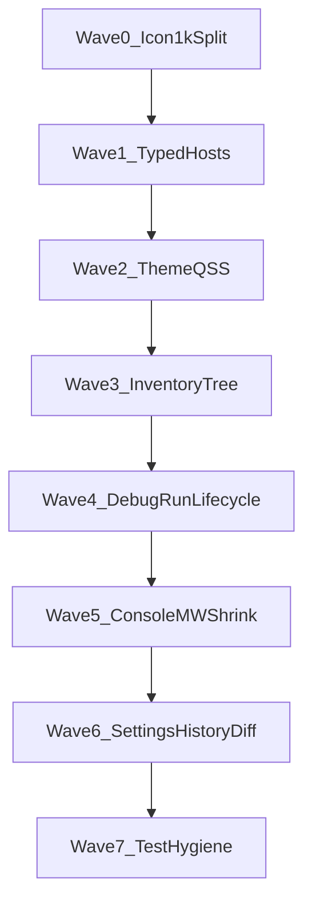

# Shell Wave 2 — Thermo-Nuclear Code Quality Review (2026-06-17)

> Strict **delta re-baseline** of `app/shell/` on **`fccb6113577752eed330fd8910f72de598c97ec2`** after Shell Wave 1 remediation (May 2025 baseline: `main_window.py` 5,549 LOC / 332 methods). Twelve slice critics plus one integration meta-reviewer (`TN-SHELL2-INTEG`), using the thermo-nuclear rubric (code-judo, 1k-line rule, no rubber-stamping). **Document only** — no remediation commits in this round.
>
> **Per-critic raw findings:** [`_findings/`](_findings/) (13 files). **Prior handoff:** [`shell-wave-1`](../shell-wave-1/shell_wave_1_thermo_review_2026-05-25.md); cross-waves: [`editors-wave-1`](../editors-wave-1/), [`project-ssot-wave-1`](../project-ssot-wave-1/).

---

## 0. How this review is organized

```mermaid
flowchart LR
    subgraph sliceCritics [Slice Critics x12]
        icon[TN-SHELL2-ICON]
        comp[TN-SHELL2-COMP]
        mw[TN-SHELL2-MW]
        settings[TN-SHELL2-SETTINGS]
        styles[TN-SHELL2-STYLES]
        outline[TN-SHELL2-OUTLINE]
        debugrun[TN-SHELL2-DEBUG-RUN]
        console[TN-SHELL2-CONSOLE]
        search[TN-SHELL2-SEARCH]
        project[TN-SHELL2-PROJECT]
        editor[TN-SHELL2-EDITOR-SEAM]
        lhist[TN-SHELL2-LHIST-DIFF]
    end
    sliceCritics --> integration[TN-SHELL2-INTEG Meta]
    integration --> summary[This Rollup]
```

**Severity model (thermo-native):**

| Tier | Meaning |
|------|---------|
| **P0 BLOCKER** | Sole 1k-line `app/` violation, Wave 1 P0 regression, ship-blocking data-loss/debug-slop |
| **P1 STRUCTURAL** | High-conviction code-judo: `window: Any` hosts, mega-compositor, inventory walk duplication, theme/QSS drift, monolith relocation |
| **P2 NICE-TO-HAVE** | Test brittleness, positional tuples, dead helpers, manual four-theme QA gaps |

**Approval bar (integration thermo):** Shell subsystem is **not thermo-clean**. Wave 1 cutover succeeded (`main_window.py` **542 LOC / 45 methods**), but complexity **relocated** to `install_main_window_composition`, **`icon_provider.py` (sole 1k `app/` file)**, and **79 `window: Any`** bindings. **No Wave 1 P0 regression.**

---

## 1. Executive summary

| Metric | Shell Wave 1 (2026-05-25) | Shell Wave 2 (2026-06-17) |
|--------|---------------------------|---------------------------|
| `main_window.py` LOC | 5,549 | **542** |
| `MainWindow` methods | 332 | **45** |
| `app/shell/` LOC | 30,766 | **42,446** |
| Files ≥1k in `app/` | many | **1** (`icon_provider.py` 1,106) |
| Wave 1 P0 CC-01…05 | OPEN | **CLOSED** |
| Integration verdict | REJECT | **REJECT** |

| Metric | Count |
|--------|------:|
| Slice critics | 12 |
| Raw finding entries (slice) | ~124 |
| — BLOCKER severity | ~1 |
| — STRUCTURAL severity | ~85 |
| — NICE-TO-HAVE severity | ~40 |
| **Deduped cross-cutting themes** | **22** |
| **P0 (deduped)** | **1** (+ Wave 1 P0 remain closed) |
| **P1 STRUCTURAL (deduped)** | **21** |
| **P2 (backlog)** | ~28 items in P2 rollup |
| Slice thermo-clean tally | **2 / 12 APPROVE** |

**Top blockers (integration view):**

1. **`icon_provider.py` at 1,106 LOC** — sole `app/` file above 1k; grew when menu SVGs consolidated without split (CC-SHELL2-01).
2. **`window: Any` host adapter explosion** — 79 shell-wide; `SaveWorkflow` sole untyped `*Workflow`; composition hosts multiply (CC-SHELL2-05).
3. **Mega-compositor setattr grid** — `install_main_window_composition` 465-line installer; CC-06 debt relocated, not deleted (CC-SHELL2-04).
4. **Project inventory walk duplication** — orchestrator exists but double-walk + poll filesystem fallback remain (CC-SHELL2-14).
5. **Debug restart race** — stop-then-immediate-relaunch; lifecycle asymmetry presenter vs MainWindow (CC-SHELL2-17).
6. **`diff_view.py` at 830 LOC** — parser-only tests; history dispatch triplicated (CC-SHELL2-22).
7. **Four-theme QSS/icon drift** — binary `is_dark` accent literals; outline kind colors HC-unaware (CC-SHELL2-03, CC-SHELL2-09).

**Dominant risk:** not missing extractions — **complexity relocation without SSOT**. Wave 1 shrank `MainWindow` but grew `main_window_composition`, `icon_provider`, and untyped host adapters. Editors Wave 2 **ACCEPT preserved**; shell editor-tab registry seam still fragmented.

**What already works (replicate this pattern):**

- `main_window.py` composition façade (542/45); help/find/zoom wired direct in `menu_wiring`.
- Wave 1 P0 closures: agent debug gone, settings dual-scope OK, document safety workflows, HC syntax overrides, draft recovery, ghost search deleted.
- `ShellThemeWorkflow` + stylesheet section modules; `BreakpointStore`; `RunLaunchWorkflow` + `run_launch/`; `SemanticNavigationWorkflow` 130 LOC.
- `ExternalFileChangeWorkflow` port inversion; `ProjectInventoryOrchestrator` 71 LOC; `EditorTabWorkflow` façade 101 LOC.
- Outline package split (no module ≥700 LOC); `FindReplaceWorkflow` + sidebar search pipeline.

---

## 2. Wave 1 closure scorecard (CC-01 … CC-25)

| Status | Count | CC themes |
|--------|------:|-----------|
| **CLOSED** | 6 | CC-01, CC-02, CC-03, CC-04, CC-05, CC-17 |
| **PARTIAL** | 16 | CC-06…CC-16, CC-18…CC-23 |
| **OPEN** | 3 | CC-07, CC-24, CC-25 |
| **REGRESSION** | 0 | — |

Full supersession table with CC-SHELL2 mapping: [`_findings/TN-SHELL2-INTEG.md` §4](_findings/TN-SHELL2-INTEG.md).

---

## 3. P0 BLOCKER — deduped themes

| ID | Theme | Primary critics |
|----|-------|-----------------|
| **CC-SHELL2-01** | `icon_provider.py` sole 1k `app/` file + ~92 copy-paste SVG factories | ICON |

*Wave 1 P0 (CC-01…CC-05) remain **CLOSED**. No new ship-blocking data-loss or debug-slop blockers.*

---

## 4. P1 STRUCTURAL — deduped themes

| ID | Theme | Primary critics |
|----|-------|-----------------|
| **CC-SHELL2-02** | Icon cache churn + QPainter sprawl + menu registry fragmentation | ICON |
| **CC-SHELL2-03** | Four-theme icon/outline/console palette gaps | ICON, OUTLINE, CONSOLE, SEARCH |
| **CC-SHELL2-04** | Mega-compositor `install_main_window_composition` | COMP |
| **CC-SHELL2-05** | `window: Any` + `MainWindow*Host` adapter explosion | COMP, PROJECT, DEBUG-RUN, CONSOLE, SEARCH, EDITOR-SEAM, LHIST-DIFF |
| **CC-SHELL2-06** | Init ordering + lambda/setattr injection soup | COMP, MW, LHIST-DIFF |
| **CC-SHELL2-07** | Layer inversion: workflow imports `shell_composition` | COMP, EDITOR-SEAM |
| **CC-SHELL2-08** | `ShellThemeWorkflow` wired; appliers still in composition host | COMP, STYLES |
| **CC-SHELL2-09** | QSS accent hover/pressed binary `is_dark` literals | STYLES |
| **CC-SHELL2-10** | Settings handlers/models monolith + apply diff duplication | SETTINGS |
| **CC-SHELL2-11** | MainWindow delegator shrink backlog | MW, DEBUG-RUN, CONSOLE |
| **CC-SHELL2-12** | Search sidebar 687 LOC + options/glob SSOT fork | SEARCH |
| **CC-SHELL2-13** | Tree FS mutation → full `rescan_from_disk` | PROJECT |
| **CC-SHELL2-14** | Inventory double-walk + poll fallback + search-sidebar coupling | PROJECT, EDITOR-SEAM |
| **CC-SHELL2-15** | Project load surface imperative mega-block | PROJECT |
| **CC-SHELL2-16** | Outline theme full-rebuild + sort SSOT debt | OUTLINE |
| **CC-SHELL2-17** | Debug/run restart race + lifecycle asymmetry | DEBUG-RUN, MW |
| **CC-SHELL2-18** | Breakpoint dual clear-all paths (store substantially closed) | DEBUG-RUN |
| **CC-SHELL2-19** | `RunLaunchWorkflow` facade + presenter typing gap | DEBUG-RUN |
| **CC-SHELL2-20** | Console partial workflow + tuple `ReplEvent` + 782 LOC widget | CONSOLE |
| **CC-SHELL2-21** | Editor tab registry fragmentation + coordinator cycle | EDITOR-SEAM, PROJECT |
| **CC-SHELL2-22** | `diff_view` 830 LOC monolith + history dispatch crowding | LHIST-DIFF |

---

## 5. Fix-agent sequencing

**Parallelism:** Wave 0 blocks icon feature work. Waves 1–3 can parallelize by subdomain after Wave 0a. Waves 4–5 depend on typed hosts (Wave 1).

Full wave detail: [`shell_wave_2_remediation_plan.md`](shell_wave_2_remediation_plan.md). Executable PR catalog: [`shell_wave_2_implementation_plan.md`](shell_wave_2_implementation_plan.md).

---

## 6. Per-critic index

| Critic | Verdict | Integration note |
|--------|---------|-------------------|
| [TN-SHELL2-ICON](_findings/TN-SHELL2-ICON.md) | REJECT | Supplies CC-SHELL2-01 P0 |
| [TN-SHELL2-COMP](_findings/TN-SHELL2-COMP.md) | REJECT | CC-SHELL2-04/05/06 |
| [TN-SHELL2-MW](_findings/TN-SHELL2-MW.md) | **APPROVE** | P1 shrink backlog only |
| [TN-SHELL2-SETTINGS](_findings/TN-SHELL2-SETTINGS.md) | REJECT | CC-SHELL2-10; CC-02 closed |
| [TN-SHELL2-STYLES](_findings/TN-SHELL2-STYLES.md) | REJECT | CC-SHELL2-08/09; CC-04 closed |
| [TN-SHELL2-OUTLINE](_findings/TN-SHELL2-OUTLINE.md) | REJECT | R3 split win; theme rebuild open |
| [TN-SHELL2-DEBUG-RUN](_findings/TN-SHELL2-DEBUG-RUN.md) | REJECT | Restart race; store substantially closed |
| [TN-SHELL2-CONSOLE](_findings/TN-SHELL2-CONSOLE.md) | REJECT | CC-SHELL2-20 |
| [TN-SHELL2-SEARCH](_findings/TN-SHELL2-SEARCH.md) | **APPROVE** | CC-17 closed; P1 decompose backlog |
| [TN-SHELL2-PROJECT](_findings/TN-SHELL2-PROJECT.md) | REJECT | CC-03 closed; inventory walks open |
| [TN-SHELL2-EDITOR-SEAM](_findings/TN-SHELL2-EDITOR-SEAM.md) | REJECT | Editors ACCEPT preserved |
| [TN-SHELL2-LHIST-DIFF](_findings/TN-SHELL2-LHIST-DIFF.md) | REJECT | CC-05 closed; diff_view 830 |
| [TN-SHELL2-INTEG](_findings/TN-SHELL2-INTEG.md) | Meta | Deduped CC-SHELL2-01 … CC-SHELL2-22 |

**Slice approval tally:** 2 of 12 thermo-clean (MW, SEARCH).

---

## 7. Cross-reference to prior waves

| Prior theme | Shell Wave 2 status |
|-------------|---------------------|
| Shell **CC-01…05, CC-17** | **CLOSED** — no regression |
| Shell **CC-06** MainWindow god file | **Substantially closed** on MW; debt → mega-compositor |
| Shell **CC-07** `window: Any` | **OPEN** — 79 bindings |
| Shell **CC-09** theme orchestration | **PARTIAL** — `ShellThemeWorkflow` wired |
| Shell **CC-21** hotspot splits | **PARTIAL** — outline/debug/settings split; icon_provider became 1k |
| Editors **CC-EDIT-01** tab workflow 1k | **CLOSED** — 101 LOC façade |
| Editors **CC-EDIT-17** markdown registry | **PARTIAL** at shell — CC-SHELL2-21 |
| Project **CC-PROJ-03** orchestrator | **PARTIAL** — CC-SHELL2-14 |
| Run **CC-17** restart race | **OPEN** at shell — CC-SHELL2-17 |

---

## 8. Fix-agent quick start

1. Read [`TN-SHELL2-INTEG`](_findings/TN-SHELL2-INTEG.md) first for deduped CC themes and ordered waves.
2. Start with **Wave 0** `icon_provider` 1k split — architecture gate before new shell UI.
3. Land **Wave 1** typed hosts (`SaveWorkflow` priority) before debug/console lifecycle PRs.
4. Do not grow `MainWindow` method count; target **≤40** after Wave 5.
5. Preserve Editors Wave 2 grep gates (see INTEG §7).
6. Run `python3 testing/run_test_shard.py fast` and `npx pyright` before closing any remediation PR.
7. Four-theme manual acceptance for every UI-touching PR.

**Manifest and metric baseline:** [`00-manifest.md`](00-manifest.md)

**Remediation plan:** [`shell_wave_2_remediation_plan.md`](shell_wave_2_remediation_plan.md)

**Implementation plan:** [`shell_wave_2_implementation_plan.md`](shell_wave_2_implementation_plan.md)
