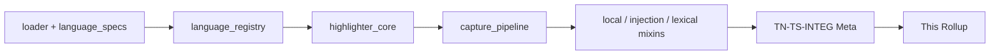
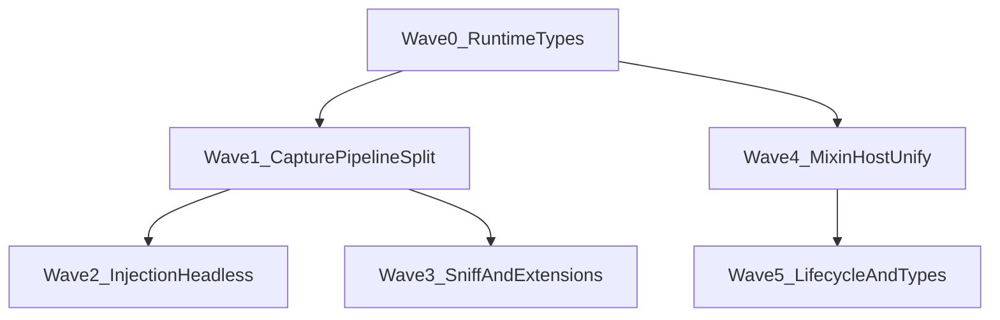

# Tree-Sitter Wave 1 — Thermo-Nuclear Code Quality Review (2026-06-22)

> Strict maintainability and structural-simplification pass over `app/treesitter/` on **`6eb9e4fc8885aab4452efc83da10cf28c9f4fe60`**. Single integration reviewer (`TN-TS-INTEG`), using the thermo-nuclear rubric (code-judo, 1k-line rule, no rubber-stamping). **Document only** — no remediation commits in this round.
>
> **Cross-waves:** [`editors-wave-1`](../editors-wave-1/editors_wave_1_thermo_review_2026-06-17.md) CC-EDIT-19 (syntax↔treesitter coupling — treesitter side assessed here); [`shell-wave-2`](../shell-wave-2/shell_wave_2_thermo_review_2026-06-17.md) (syntax palette SSOT upstream).

---

## 0. How this review is organized

**Severity model (thermo-native):**

| Tier | Meaning |
|------|---------|
| **P0 BLOCKER** | Sole 1k-line violation, ship-blocking boundary leak, hard-cutover regression, Python 3.9 / dot-path violation |
| **P1 STRUCTURAL** | High-conviction code-judo: untyped runtime seams, mixin adapter sprawl, perf-heavy injection path, SSOT fragmentation |
| **P2 NICE-TO-HAVE** | Proactive decomposition margin, FD lifecycle, private-type exports, version-compat shims |

**Approval bar (integration thermo):** `app/treesitter/` is **thermo-acceptable as a decomposition reference** — no file crosses 700 LOC, editors boundary is clean, and the ARCHITECTURE §12.5 split is real. Remaining debt is **typing and mixin orchestration polish**, not god-file relocation. Do not grow `capture_pipeline.py` past 700 without splitting first.

---

## 1. Baseline commit and metric sweep

| Field | Value |
|-------|-------|
| **Baseline commit** | `6eb9e4fc8885aab4452efc83da10cf28c9f4fe60` |
| **Package path** | `app/treesitter/` |
| **Python modules** | 11 |
| **Total LOC** | 2,469 |
| **Files ≥1,000 LOC** | **0** |
| **Files ≥700 LOC (smell)** | **0** (largest: `capture_pipeline.py` **671**) |
| **Largest file** | `capture_pipeline.py` — 671 LOC |
| **`: Any` / `-> Any` / `cast(Any)` count** | **40** (4 files: `capture_pipeline.py`, `highlighter_core.py`, `injection_highlights.py`, `local_semantics.py`) |
| **Dot-prefixed storage paths** | **0** |
| **Python 3.10+ syntax** | **0** (`match`/`case` absent; `from __future__ import annotations` on all modules) |
| **`app.editors` imports** | **0** (ARCHITECTURE §12.5 boundary respected) |

### Per-file LOC (`find app/treesitter -name '*.py' -exec wc -l {} +`)

| LOC | File |
|----:|------|
| 671 | `capture_pipeline.py` |
| 448 | `highlighter_core.py` |
| 263 | `language_registry.py` |
| 255 | `local_semantics.py` |
| 231 | `loader.py` |
| 151 | `injection_highlights.py` |
| 140 | `language_specs.py` |
| 110 | `jsonc_lexical.py` |
| 94 | `markdown_lexical.py` |
| 81 | `python_tokens.py` |
| 25 | `__init__.py` |

### Cross-package import seams

| Upstream | Consumers in `app/treesitter/` | Assessment |
|----------|----------------------------------|------------|
| `app.bootstrap.paths` | `loader.py`, `language_registry.py` | Acceptable bootstrap seam |
| `app.bootstrap.memfd_shim` | `loader.py` (inline when `os.memfd_create` missing) | ChoreBoy runtime shim; documented |
| `app.bootstrap.logging_setup` | `highlighter_core.py`, `local_semantics.py`, `injection_highlights.py` | Acceptable |
| `app.core.constants` | `highlighter_core.py`, `capture_pipeline.py` | Highlighting mode SSOT |
| `app.core.highlighting_policy` | `highlighter_core.py` | Adaptive mode policy |
| `app.syntax.contracts` | `highlighter_core.py` | Neutral highlighter contract (correct layer) |
| `PySide2.QtGui.QTextDocument` | `injection_highlights.py` | Injection-only Qt touch; acceptable but perf-sensitive |

### Native binding / vendor seams (`loader.py`)

- Resolves `vendor/tree_sitter/_binding.{SOABI}.so` via `sysconfig.get_config_var("SOABI")` — **hard cp39/cp311 discrimination**, no silent wrong-binding fallback.
- Grammar wheels use `abi3` naming (`_binding.abi3.so`) except core `tree_sitter` package.
- Extensions loaded through **memfd** (`/proc/self/fd/{fd}`) after copying `.so` bytes — avoids AppArmor/path restrictions on ChoreBoy.
- `_OPEN_FDS` accumulates memfd descriptors with **no teardown** (see CC-TS-09).

---

## 2. Executive summary

| Metric | Count |
|--------|------:|
| **Deduped cross-cutting themes** | **12** |
| **P0 BLOCKER** | **0** |
| **P1 STRUCTURAL** | **6** |
| **P2 NICE-TO-HAVE** | **6** |

**Dominant risk:** not missing modules — **untyped tree-sitter runtime at the mixin boundary**. The package successfully decomposed highlighting into focused modules per `docs/ARCHITECTURE.md`, but forty `Any` annotations and five parallel `Protocol`/`_host()` adapters mean the next feature (new language, new injection, query API change) will pay compounding cast-and-probe tax.

**What already works (replicate this pattern):**

- Deliberate module split: `highlighter_core`, `capture_pipeline`, `local_semantics`, `injection_highlights`, `jsonc_lexical`, `markdown_lexical` — no monolith.
- `language_specs.py` as declarative SSOT for grammars, extensions, query files, injection aliases.
- `loader.py` exact SOABI binding resolution with explicit incompatible-candidate errors (no silent wrong-wheel fallback).
- Incremental parse path (`tree.edit` + `parser.parse(source, old_tree)`) with changed-range cache refresh in `highlighter_core.py`.
- `TreeSitterLanguageRegistry` extension + sniff + override resolution without `app.editors` coupling.
- Lexical supplements (`jsonc_lexical`, `markdown_lexical`) isolated from core capture pipeline.
- Python 3.9 compliance and visible-path conventions throughout.

---

## 3. P0 BLOCKER — deduped themes

*None.* No file crosses 1k or 700 LOC; no editors-boundary violation; no dot-prefixed paths; no hard-cutover fallback chains beyond documented tree-sitter API version shims (CC-TS-11, P2).

---

## 4. Cross-cutting themes (CC-TS-01 … CC-TS-12)

### P1 STRUCTURAL

| ID | Theme | Severity | Evidence | Recommended remediation |
|----|-------|----------|----------|-------------------------|
| **CC-TS-01** | Tree-sitter runtime fully untyped at package boundary | **P1** | 40 `Any` uses across `capture_pipeline.py:17-19`, `highlighter_core.py:89-110`, `injection_highlights.py:16-39`, `local_semantics.py:15-29`; `language_registry.py:36` uses `language: object` | Add `app/treesitter/runtime_types.py` (or extend `loader.py`) with `Protocol` types for `Parser`, `Tree`, `Node`, `Query` derived from `tree_sitter_module()`; replace `Any` on host Protocols and instance fields |
| **CC-TS-02** | Five duplicate mixin `Protocol` + `_host()` cast adapters | **P1** | Identical pattern in `capture_pipeline.py:15-64`, `local_semantics.py:13-41`, `injection_highlights.py:15-44`, `jsonc_lexical.py:8-20`, `markdown_lexical.py:15-27` | Code-judo: single `TreeSitterHighlighterHost` Protocol composing shared fields; mixins take `self: TreeSitterHighlighterHost` or use a thin typed base class instead of per-file `_host()` |
| **CC-TS-03** | `capture_pipeline.py` monolith (671 LOC, margin to 700 smell) | **P1** | Single mixin owns: incremental cache update (`154-188`), UTF-8 byte/col mapping (`646-671`), escape lexing (`556-574`), capture normalization (`415-432`), node span building (`440-516`), priority/merge (`348-387`), point lookup (`576-624`) | Split into `capture_cache.py`, `node_spans.py`, `utf8_coords.py` before next feature lands; keep `TreeSitterCapturePipelineMixin` as orchestrator only |
| **CC-TS-04** | Injection path instantiates full Qt highlighter per content node | **P1** | `injection_highlights.py:126-134` creates `QTextDocument`, `TreeSitterHighlighter`, calls `rehighlight()` + `_ensure_tree_and_cache()` for each injection content node | Extract headless `capture_spans_for_source(source, resolved_language)` that reuses parse/query pipeline without `QTextDocument` or signal wiring; injection mixin maps relative spans to parent coordinates |
| **CC-TS-05** | Language sniff heuristics embedded in registry | **P1** | `language_registry.py:177-256` — six `_looks_like_*` static methods + basename sets inside `TreeSitterLanguageRegistry` | Move to `language_sniff.py` (pure functions + basename tables); registry calls `sniff_extension(path, sample_text) -> str | None` — SSOT for extension-less file detection |
| **CC-TS-06** | Language-specific span hooks as conditionals in shared query path | **P1** | `capture_pipeline.py:314-328` — `if language_key == "markdown"` / `"jsonc"` branches inside `_query_capture_ranges` | Replace with `LanguageSpanExtension` registry keyed by `language_key` (or spec field); pipeline calls `extensions.apply(...)` — deletes special-case branches from shared path |

### P2 NICE-TO-HAVE

| ID | Theme | Severity | Evidence | Recommended remediation |
|----|-------|----------|----------|-------------------------|
| **CC-TS-07** | `_PointRange` duck-types tree-sitter `Node` for locals spans | **P2** | `capture_pipeline.py:133-136` defines `_PointRange`; `local_semantics.py:242-248` passes it to `_build_spans_for_node` which expects `node.start_point` / `node.end_point` | Introduce explicit `SpanSource` Protocol or overload `_build_spans_for_node` with `PointRangeSource` type — document the seam instead of structural duck typing |
| **CC-TS-08** | `_query_settings` lives on locals mixin; injection depends implicitly | **P2** | Defined `local_semantics.py:164-171`; consumed via `_InjectionHost._query_settings` at `injection_highlights.py:32,102` | Hoist `_query_settings` to shared module (`query_utils.py`) or `TreeSitterHighlighter` base; both mixins import canonical helper |
| **CC-TS-09** | Memfd FD accumulation without lifecycle cleanup | **P2** | `loader.py:32` `_OPEN_FDS: list[int]`; `loader.py:221` appends on every `_write_memfd`; no close on re-init or shutdown | Add `shutdown_tree_sitter_runtime()` that closes tracked FDs and clears module caches; call from app teardown if runtime re-init becomes possible |
| **CC-TS-10** | Private types imported across modules without public seam | **P2** | `_CaptureSpan`, `_PendingEdit` exported from `capture_pipeline` into 4 modules; `_LocalDefinition` imported in `highlighter_core.py:19` | Add `app/treesitter/types.py` with public `CaptureSpan`, `PendingEdit`, `PointRange`; keep underscore internals private to defining module |
| **CC-TS-11** | Parser/Language API version shims (dual code paths) | **P2** | `highlighter_core.py:90-93` (`set_language` vs `.language`); `language_registry.py:155-158` (`Language(value, name)` vs `Language(value)`) | After confirming minimum vendored tree-sitter version, hard-cutover to single API; until then document minimum version in `language_specs.py` header and gate shims behind `loader` capability flags |
| **CC-TS-12** | `highlighter_core.py` still owns edit-sync + signal + tree-orchestration | **P2** | `highlighter_core.py:246-363` — `_on_contents_change`, `_on_contents_changed`, `_ensure_tree_and_cache`, document signal connect/disconnect in `__init__`/`setDocument` | Optional extraction: `DocumentEditSync` helper or mixin for revision tracking and pending-edit queue; keeps `TreeSitterHighlighter` focused on highlight policy |

---

## 5. Fix-agent sequencing

**Parallelism:** Wave 0 (runtime types) unblocks Waves 1 and 4. Wave 2 (injection) depends on capture split. Wave 3 (sniff/extensions) can parallelize with Wave 2 after Wave 1. Wave 5 is hygiene (FD cleanup, public types).

**Guardrails:**

1. Do **not** grow `capture_pipeline.py` past **700 LOC** without landing CC-TS-03 split first.
2. Do **not** add `app.editors` imports — keep orchestration in `app/editors/syntax_registry.py`.
3. Preserve incremental parse + changed-range refresh semantics when refactoring injection (CC-TS-04).
4. New languages belong in `language_specs.py` + `queries/` — not ad-hoc branches in `capture_pipeline.py`.
5. Run `python3 testing/run_test_shard.py fast` and `npx pyright` before closing any remediation PR.
6. Four-theme manual acceptance for any UI-visible highlighting change.

---

## 6. Cross-reference to prior waves

| Prior theme | Tree-Sitter Wave 1 status |
|-------------|----------------------------|
| Editors **CC-EDIT-19** syntax↔treesitter bidirectional coupling | **Treesitter side clean** — no `app.editors` import; orchestration stays in `syntax_registry.py` |
| ARCHITECTURE §12.5 highlighter split | **Implemented** — six focused modules + registry/loader |
| Shell syntax palette SSOT (`ShellThemeTokens`) | **Respected** — `ThemedSyntaxHighlighter` + `syntax_palette` only |
| Hard-cutover rule (no legacy fallback chains) | **Mostly clean** — version shims are API-compat, not silent feature fallback (CC-TS-11) |
| Python 3.9 / no dot-paths | **Clean** |

---

## 7. TN-TS-INTEG verdict

| Field | Value |
|-------|-------|
| **Integration reviewer** | TN-TS-INTEG |
| **Verdict** | **ACCEPT** |
| **Rationale** | Package meets thermo decomposition bar: zero files ≥700/1k LOC, ARCHITECTURE editor-boundary clean, intentional module split with real incremental-parse pipeline. No P0 blockers. P1 themes are typing, perf, and SSOT hardening — not complexity relocation from a shrunk god file. **Conditional:** next treesitter PR that adds >30 LOC to `capture_pipeline.py` should net-split per CC-TS-03 or flips verdict to REJECT. |

---

## 8. Fix-agent quick start

1. Read CC-TS-01 and CC-TS-03 first — typing and capture-pipeline size are the highest-leverage judo moves.
2. Land **Wave 0** runtime `Protocol` types before adding languages or injection targets.
3. Split `capture_pipeline.py` before any incremental-cache or capture-priority feature work.
4. Replace injection highlighter instantiation (CC-TS-04) before adding new embedded-language targets.
5. Keep `language_specs.py` as grammar SSOT; do not scatter extension/sniff tables.
6. Verify cp39 vendor bundle still loads via `initialize_tree_sitter_runtime()` after loader changes.

**Metric baseline recorded at:** `6eb9e4fc8885aab4452efc83da10cf28c9f4fe60`
