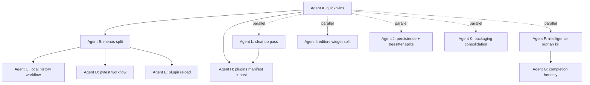

# Deslop Audit — `app/`

Status: draft v1
Scope: everything under `/home/joshua/Documents/ChoreBoyCodeStudio/app/`
Out of scope (this pass): `tests/`, `scripts/`, `bundled_plugins/`, `templates/` (top-level), `example_projects/`, `packaging/` at repo root, `vendor/`, top-level `*.py` launchers
Owner: Codebase quality
Audience: any agent or human picking up one of the eleven work briefs in section 6

---

## 1. Purpose

This document is a single-source playbook for systematically reducing "AI slop" in the `app/` tree of ChoreBoy Code Studio. It exists because the codebase has grown quickly through AI-assisted development and is now showing the predictable signatures of that growth: a 7,151-line god module, parallel implementations of the same workflow, silent fallback chains, vestigial migration helpers, several "service" modules that exist only because tests reference them, and documentation that no longer matches the code.

The goal is **not** a one-shot rewrite. The goal is a sequenced series of small, well-scoped agent runs, each leaving the code provably cleaner against the architecture stated in [docs/ARCHITECTURE.md](../ARCHITECTURE.md), the rules in [.cursor/rules/](../../.cursor/rules/), and the constraints in [docs/DISCOVERY.md](../DISCOVERY.md).

Each work brief in section 6 is **self-contained**: an executing agent should be able to read only its brief plus the cross-cutting rules in section 4 and produce a mergeable PR.

---

## 2. What is "AI slop"

"AI slop" is not "code an LLM wrote". It is the **specific class of defects that AI-assisted code reliably introduces when a human did not push back hard enough during planning or review**. Synthesizing the public literature and our own findings, the recurring signatures are:

1. **Structural duplication.** New features add code rather than consolidating existing code. Two functions do nearly the same thing in two modules; two engines model the same domain; two readers parse the same JSON shape with subtly different validation. Reusable abstractions stop being extracted.
2. **Silent fallback chains and swallowed errors.** `try new_path; except Exception: legacy_path` patterns; `except: pass` blocks with no logging; degradation states hidden behind empty-list returns. Code "works" but cannot be supported.
3. **Complexity inflation.** Wrapper-of-wrapper indirection, abstraction "in case", configuration knobs no caller sets, defensive `Optional[Any]` returns that hide a missing contract.
4. **Test–implementation coupling.** Tests assert how the code happens to work rather than what it should do. Result: high coverage numbers and low actual safety. A frequent symptom in this codebase is whole modules that are imported only from `tests/` and exist solely to make a particular test setup convenient.
5. **Architectural drift.** New code does not follow patterns the codebase already established. Each individual deviation is minor; cumulative drift erodes the value of the architecture document. AD-015 says `MainWindow` is a composition root; today it has 387 methods.
6. **Documentation lying.** Rules and architecture documents describe a state the code already moved past (or never reached). Stale docs are slop because they cost every future agent a wrong assumption.
7. **Cosmetic noise.** Comments restating code, signal types declared as `Any`, `# type: ignore` scattered to silence the checker, builtin `callable` used as an annotation.

This audit hunts all seven. It does not measure them with a third-party scanner; the per-section briefs in section 6 cite concrete file paths and line ranges so the work is grounded.

A good deslop PR is **subtractive** more often than additive. The right question on review is: *would a human who has been in this file for six months write this?*

---

## 3. Audit methodology

The audit was performed in three waves:

1. **Baseline metrics.** File counts, line counts, top god modules, and method counts on suspicious classes were gathered with `wc -l`, `find`, and `rg` against the `app/` tree.
2. **Four parallel exploration passes.** Each pass read the relevant ARCHITECTURE sections and rules first, then performed a targeted reading of the assigned directories looking for the seven slop signatures above. The four passes covered:
  - `app/shell/`
  - `app/intelligence/` and `app/plugins/`
  - `app/editors/`, `app/persistence/`, `app/treesitter/`, `app/packaging/`
  - `app/run/`, `app/runner/`, `app/debug/`, `app/project/`, `app/bootstrap/`, `app/core/`, `app/support/`, `app/python_tools/`, `app/templates/`, `app/examples/`, `app/filesystem/`, `app/ui/`, `app/designer/`
3. **Citation verification.** Every line range and snippet referenced in section 6 was re-read against the current code at the time of writing. If a citation in this document is wrong, that is itself slop and should be fixed in the same PR that touches the cited file.

Findings appear in two forms below: a quantitative overview (section 5) and per-section work briefs (section 6). Section 6 is what executing agents should read.

---

## 4. Cross-cutting ground rules every agent must follow

These ground rules apply to **every** brief in section 6. They are pulled from existing repo rules and architecture so an executing agent does not have to re-discover them.

### 4.1 Hard cutover, not legacy fallback chains

Source: [.cursor/rules/hard_cutover_refactor.mdc](../../.cursor/rules/hard_cutover_refactor.mdc).

When replacing an implementation, migrate callers and delete the old path in the same change. Do not preserve long-lived `try new; except: legacy` branches. Do not add silent fallback that hides failures. If a temporary bridge is genuinely required, document the removal condition in the same PR.

### 4.2 No hidden dot-prefixed paths

Source: [.cursor/rules/no_hidden_folders.mdc](../../.cursor/rules/no_hidden_folders.mdc).

Do not write or read storage at dot-prefixed directories. Visible names only: `cbcs/` for per-project metadata, `choreboy_code_studio_state/` for global app state. Any other new directory should also be visible. Note: the rule file's "Current migration status" section is itself stale (see Agent L) — `app/core/constants.py` already uses visible names.

### 4.3 Python 3.9 syntax only

Source: [.cursor/rules/python39_compatibility.mdc](../../.cursor/rules/python39_compatibility.mdc).

The shipped runtime is Python 3.9.2. Do not use `match`/`case`, runtime `X | Y` union annotations, `tomllib`, `ParamSpec`/`TypeAlias` from `typing`, `ExceptionGroup`/`except`*, `asyncio.TaskGroup`, or `type` keyword aliases. When in doubt, add `from __future__ import annotations` at the top of the module.

### 4.4 TDD for non-UI logic

Source: [.cursor/rules/tdd_business_logic_non_ui.mdc](../../.cursor/rules/tdd_business_logic_non_ui.mdc).

For service, model, manifest, scheduling, and other business-logic changes: write a failing test first, then implement the smallest change to pass it, then refactor. If existing code is hard to test, add a characterization test before the refactor.

### 4.5 Dual-theme validation for UI changes

Source: [.cursor/rules/ui_light_dark_mode.mdc](../../.cursor/rules/ui_light_dark_mode.mdc).

If a brief touches user-facing UI, verify both light and dark mode before declaring done; explicitly note the gap in the PR if dual-theme validation cannot be run in your environment.

### 4.6 Test commands

The canonical test runner is `python3 run_tests.py --import-mode=importlib`. Always run a focused subset for the area touched plus the full unit suite before declaring a brief complete:

```bash
python3 run_tests.py -v --import-mode=importlib tests/unit/<area>/
python3 run_tests.py -q --import-mode=importlib tests/unit/
```

`npx pyright` must remain at zero errors. Latest checkpoint per `AGENTS.md`: `1386 passed, 1 skipped`, `0 errors, 0 warnings, 0 informations`.

### 4.7 Architecture is the source of truth

Any change that affects module boundaries, contracts, schemas, or process model must be reflected in `docs/ARCHITECTURE.md` in the same PR. If a brief deletes an architectural element, update the section that referenced it. If a brief introduces a new module name, add it to section 9 (Repository / Source Layout) of the architecture.

### 4.8 No new slop

Each PR must not increase any of the following counts in `app/`:

- `except Exception:` blocks with no logging or re-raise
- methods on `MainWindow`
- modules imported only from `tests/`
- dot-prefixed runtime paths
- `# type: ignore` lines

Before opening the PR, run the metric sweep in section 9 and paste the before/after numbers in the PR body.

---

## 5. Findings overview

### 5.1 Quantitative shape of `app/`

- Subsystems under `app/`: 19 (counting `app/designer/`, which is empty of `.py` and not in git)
- Total Python source lines under `app/`: ~52,378
- Subsystem leaderboard by LOC:
  - `app/shell/` — 53 files, 22,402 lines
  - `app/intelligence/` — 28 files, 5,177 lines
  - `app/plugins/` — 23 files, 4,572 lines
  - `app/editors/` — 20 files, 3,738 lines
  - `app/packaging/` — 10 files, 2,288 lines
  - `app/persistence/` — 9 files, 2,236 lines
  - `app/treesitter/` — 5 files, 2,097 lines
  - `app/project/` — 13 files, 1,994 lines
  - `app/run/` — 13 files, 1,801 lines
  - `app/debug/` — 9 files, 1,141 lines
  - `app/runner/` — 6 files, 1,094 lines
  - `app/support/` — 5 files, 1,019 lines
  - `app/bootstrap/` — 6 files, 995 lines
  - `app/core/` — 4 files, 585 lines
  - `app/python_tools/` — 6 files, 571 lines
  - `app/ui/` — 2 files, 342 lines
  - `app/templates/` — 2 files, 145 lines
  - `app/filesystem/` — 2 files, 140 lines
  - `app/examples/` — 2 files, 40 lines
  - `app/designer/` — 0 `.py` files (orphan; see Agent L)

### 5.2 Top god modules

- `app/shell/main_window.py` — 7,151 lines, 387 methods on `MainWindow`
- `app/shell/style_sheet_sections.py` — 1,787 lines
- `app/treesitter/highlighter.py` — 1,440 lines
- `app/persistence/local_history_store.py` — 1,237 lines
- `app/shell/settings_dialog.py` — 1,216 lines
- `app/shell/menus.py` — 952 lines, single function `build_menu_stubs` spans roughly lines 137–925
- `app/shell/test_explorer_panel.py` — 810 lines
- `app/runner/debug_runner.py` — 783 lines
- `app/shell/debug_panel_widget.py` — 752 lines
- `app/editors/code_editor_widget.py` — 752 lines
- `app/intelligence/diagnostics_service.py` — 717 lines

### 5.3 Most consequential findings

1. `**MainWindow` violates AD-015 by an order of magnitude.** 387 methods is not a "composition root", it is an orchestration monolith. The architecture explicitly lists which controllers should own which workflows; the work has been started but is far from complete. Three large workflow groups are still inside the file (local history, pytest, plugin contributions reload).
2. `**menus.py` has one ~780-line function.** `build_menu_stubs` registers the entire application menu surface in a single function and uses `main_window: Any` to escape typing. It is also the upstream chokepoint for any `MainWindow` decomposition because every workflow handler is wired here.
3. **The intelligence layer has parallel orphan engines.** `hover_service.py`, `signature_service.py`, `navigation_service.py`, `refactor_service.py` and the `find_references` heuristic in `reference_service.py` are not imported from any module under `app/`. They duplicate `SemanticSession` / `SemanticFacade` capability and exist only because tests reference them, which directly contradicts AD-016 ("Single-owner semantic session").
4. **Silent fallback in completion ranking.** `app/intelligence/completion_service.py` lines 51–62 swallow Jedi failures into an empty list and then continue to rank approximate-only candidates as if Jedi had simply returned nothing. ARCHITECTURE 17.4.1 requires degradation states to be **visible**.
5. `**app/designer/` is dead code.** No `.py` files; not in git; no imports anywhere in `app/` or `tests/`. The directory exists only because old `__pycache__/` was left behind.
6. **Stale rule documentation.** `.cursor/rules/no_hidden_folders.mdc` claims `app/core/constants.py` still uses `.cbcs` and `.choreboy_code_studio`. The constants file already migrated to `cbcs` and `choreboy_code_studio_state` (see lines 7 and 211).
7. **Architecture example diverges from implementation.** `docs/ARCHITECTURE.md` §13.1 example uses `debug_options`; the runtime serializer in `app/run/run_manifest.py` uses `debug_exception_policy`.
8. **Frozen dataclass mutated in place.** `RunManifest` is `frozen=True`, but `app/runner/debug_runner.py` line 350 does `self._manifest.breakpoints[:] = breakpoints  # type: ignore[misc]`. This compiles, but breaks the immutable manifest story.
9. **Vestigial debug stdout marker path.** `app/debug/debug_event_protocol.py` and `DebugSession.ingest_output_line` parse `__CB_DEBUG_*__` markers from stdout. Production routes through the dedicated transport (matching ARCHITECTURE §13.4A), so the stdout path is not exercised. It survives only in tests of itself. Hard cutover applies.
10. **Naming collision under `app/run/`.** `app/run/test_runner_service.py` and `app/run/test_discovery_service.py` are product features (the in-app pytest runner and discovery), but the `test_`* prefix collides with pytest test files everywhere else in the repo.

---

## 6. Per-agent work briefs (playbook)

Each brief below is self-contained. An executing agent should read its brief, the cross-cutting rules in section 4, and the relevant ARCHITECTURE sections cited inside the brief — and nothing else — to produce a mergeable PR.

Effort labels: **S** = under a day, **M** = one to three days, **L** = three to seven days. Effort excludes review.

---

### Agent A — Quick-wins sweep (S)

**Goal.** Eliminate the easily-fixable silent failures and a small number of type escapes uncovered during the audit. This brief is intentionally a single small PR so it can land first and be referenced from later PRs as evidence the rules are being followed.

**Files in scope.**

- `app/shell/main_window.py`
- `app/shell/events.py`
- `app/runner/runner_main.py`
- `app/treesitter/highlighter.py`
- `app/shell/plugins_panel.py`
- `app/shell/editor_intelligence_controller.py`
- `app/shell/main_window.py` again for the active-tab path helper
- `app/plugins/project_config.py` (host of new shared helper)

**Concrete changes.**

1. Replace `except Exception: pass` in the REPL interrupt handler with a logged warning, mirroring the pattern already used by the REPL submit handler one function above:

```4602:4613:app/shell/main_window.py
        try:
            self._repl_manager.send_input(command_text)
        except Exception as exc:
            self._logger.warning("REPL send_input failed: %s", exc)

    def _handle_python_console_interrupt(self) -> None:
        if self._repl_manager.is_running:
            try:
                self._repl_manager.send_input("\x03")
            except Exception:
                pass
```

1. Log dropped subscriber exceptions in the event bus instead of silently continuing. Keep the bus resilient (still continue), but add `logger.exception("event subscriber raised: %s", handler)`.

```71:77:app/shell/events.py
    def publish(self, event: object) -> None:
        handlers = list(self._subscribers.get(type(event), []))
        for handler in handlers:
            try:
                handler(event)
            except Exception:
                continue
```

1. Replace bare swallowing in runner stdio reconfigure with `logger.debug` (or `print` to stderr if no logger is initialized at that point — runner bootstrap predates logging setup):

```48:61:app/runner/runner_main.py
def _ensure_line_buffering() -> None:
    """Force line buffering on stdout/stderr to guarantee pipe delivery."""
    stdout_reconfigure = getattr(sys.stdout, "reconfigure", None)
    if callable(stdout_reconfigure):
        try:
            stdout_reconfigure(line_buffering=True)
        except Exception:
            pass
    stderr_reconfigure = getattr(sys.stderr, "reconfigure", None)
    if callable(stderr_reconfigure):
        try:
            stderr_reconfigure(line_buffering=True)
        except Exception:
            pass
```

1. Treesitter highlighter signal-disconnect swallowing (`app/treesitter/highlighter.py` lines 303–310). Disconnecting an already-disconnected signal raises in PySide2, but other failures should not be hidden. Either narrow to `RuntimeError` or use a `_safe_disconnect(signal, slot)` helper that catches only the documented failure mode.
2. Add `app.plugins.project_config.load_project_plugin_config_or_none(project_root: str) -> ProjectPluginConfig | None`. Replace both call sites that currently swallow `Exception` into `None`:

```4221:4225:app/shell/main_window.py
        if self._loaded_project is not None:
            try:
                project_plugin_config = load_project_plugin_config(self._loaded_project.project_root)
            except Exception:
                project_plugin_config = None
```

```129:134:app/shell/plugins_panel.py
        if self._project_root:
            try:
                project_config = load_project_plugin_config(self._project_root)
            except Exception:
                project_config = None
```

`app/support/support_bundle.py` lines 159–163 has the same pattern; update it too. The new helper should `logger.warning(...)` on the swallow so support bundle diagnostics show why config loading failed.

1. Add `EditorManager.active_file_path() -> str | None` and use it in `MainWindow.get_active_tab_file_path` instead of `getattr` + `cast`. The current pattern (around `main_window.py` line 547) hides a missing typed contract on the editor manager.
2. Tighten `app/shell/editor_intelligence_controller.py` lines 28–47 to forward explicit parameters that match `SemanticSession`'s public API instead of `**kwargs` plus `# type: ignore`. The controller becomes a typed pass-through.

**Anti-patterns this brief targets.** Swallowed except (catalog #4), type escape (#5), structural duplication (#1).

**Acceptance criteria.**

- Diff is subtractive overall (`# type: ignore` count down, `except Exception:\s*$` count down)
- No `except: pass` introduced anywhere
- `python3 run_tests.py -q --import-mode=importlib tests/unit/` passes
- `npx pyright` reports 0 errors
- New helper has at least one unit test (`tests/unit/plugins/test_project_config.py`)

**Suggested PR boundary.** One PR. Title: `deslop: tighten silent-failure paths and dedupe project plugin config load`.

---

### Agent B — Shell `menus.py` split (M)

**Goal.** Decompose the ~780-line god function `build_menu_stubs` into per-menu builders so menu wiring stops being a merge-conflict magnet and so the upcoming `MainWindow` decomposition (Agents C, D, E) has a stable interface to register against.

**Files in scope.**

- `app/shell/menus.py` (existing, will be split)
- `app/shell/main_window.py` (one call site)
- `tests/unit/shell/test_menus.py` (existing tests, must keep passing)

**Concrete changes.**

The current shape is:

```137:145:app/shell/menus.py
def build_menu_stubs(
    main_window: Any,
    callbacks: MenuCallbacks | None = None,
    *,
    shortcut_overrides: Mapping[str, str] | None = None,
) -> MenuStubRegistry:
    """Create top-level shell menus and stable action IDs."""
    callback_registry = callbacks or MenuCallbacks()
```

Refactor to:

1. Define a `MenuBuildContext` dataclass that bundles `(qt_widgets_module, qt_core_module, menu_bar, action_lookup, menu_lookup, callbacks, shortcut_overrides)`. Pass it to each per-menu builder.
2. Extract one builder per top-level menu. Names should match the existing menu identifiers:
  - `build_file_menu(ctx) -> QMenu`
  - `build_edit_menu(ctx) -> QMenu`
  - `build_run_menu(ctx) -> QMenu`
  - `build_view_menu(ctx) -> QMenu`
  - `build_theme_menu(ctx) -> QMenu`
  - `build_tools_menu(ctx) -> QMenu`
  - `build_help_menu(ctx) -> QMenu`
3. `build_menu_stubs` becomes a ~30-line orchestrator: build the context, invoke each builder, attach `WA_TranslucentBackground`, return `MenuStubRegistry`.
4. Drop `main_window: Any`. The new context does not need a `MainWindow` reference at all — only the QMenuBar and callbacks. Update the one call site in `MainWindow` to pass `self.menuBar()` directly.
5. Action IDs and shortcut behavior must be unchanged. Existing menu builder unit tests are the contract.

**Anti-patterns this brief targets.** God function (#2), type escape `Any` (#5).

**Acceptance criteria.**

- `tests/unit/shell/test_menus.py` passes unchanged (or with mechanical import-only updates)
- No file in this brief exceeds 200 lines
- `MainWindow` does not gain any new methods
- Menu rendering manually verified once: `Run > Run`, `Edit > Find`, `Help > About` all open and their shortcuts fire
- PR target: ~600 LOC moved, 0 LOC of new behavior

**Suggested PR boundary.** One PR. Title: `deslop(shell): split build_menu_stubs into per-menu builders`.

**Why this lands before C, D, E.** Agents C/D/E will move workflow handlers out of `MainWindow`. Each of those handlers is currently referenced from `MenuCallbacks` in `build_menu_stubs`. With per-menu builders in place, those agents only edit one small function instead of editing inside the giant `build_menu_stubs`.

---

### Agent C — `MainWindow` decomposition wave 1: local history & autosave workflow (L)

**Goal.** Lift the local history and autosave/session orchestration out of `MainWindow` into a dedicated controller, in line with AD-015 and the architecture's listed controller modules.

**Files in scope.**

- `app/shell/main_window.py` (source of methods to move)
- `app/shell/local_history_workflow.py` (new module)
- `app/persistence/local_history_store.py` (no changes; consumed)
- `app/persistence/autosave_store.py` (no changes; consumed)
- `app/shell/menus.py` (after Agent B; one callback wire-up)
- `tests/unit/shell/test_local_history_workflow.py` (new)

**Methods to move.** Verified against current file:

- `_persist_session_state` — line 2648
- `_restore_session_state` — line 2684
- `_record_local_history_checkpoint` — line 2869
- `_record_local_history_transaction` — line 2917
- `_show_local_history_for_entry` — line 3033
- `_show_local_history_for_path` — line 3041
- `_flush_pending_autosaves` — line 7128
- All sibling helpers in the 2648–3071 range that are only called from this group

**Approach.**

1. Create `LocalHistoryWorkflow` taking the dependencies as constructor arguments: `LocalHistoryStore`, `AutosaveStore`, `EditorWorkspaceController` (for buffer-to-tab apply), `ShellThemeTokens`, `Logger`. The controller exposes an explicit public surface with one method per moved behavior.
2. Move methods in groups, one per commit, following TDD: add a characterization test in `tests/unit/shell/test_local_history_workflow.py` that exercises the method against fakes for the dependencies, then move the implementation.
3. In `MainWindow`, replace the moved methods with thin delegations:
  - `def _record_local_history_checkpoint(self, ...): return self._local_history.record_checkpoint(...)`. Remove these one wave at a time as call sites are migrated.
4. Crucially, **restore-to-buffer first** semantics from AD-014 must be preserved. The buffer apply path goes through `EditorWorkspaceController.apply_text_to_open_tab` / `open_file_with_content`. Do not regress to writing to disk before user confirms save.
5. Remove the `_local_history_`* instance attributes from `MainWindow` once the controller is the sole owner. Do not keep parallel state.

**Anti-patterns this brief targets.** God class (#1), architectural drift (AD-015).

**Acceptance criteria.**

- `MainWindow` method count drops by at least 30 (use `rg "    def " app/shell/main_window.py | wc -l` as the metric; record before/after in PR body)
- `app/shell/local_history_workflow.py` exists, has a single class plus pure helpers, file is under 700 lines
- `tests/unit/shell/test_local_history_workflow.py` covers each public method behavior
- No `MainWindow` method is left as a one-line delegator — the menu/event wiring moves to the controller's signal connections directly
- Full unit suite green; affected integration tests in `tests/integration/persistence/` green

**Suggested PR boundary.** One PR or two PRs split at the `_persist_session_state` / `_restore_session_state` boundary. Aim for under 800 net LOC moved per PR.

---

### Agent D — `MainWindow` decomposition wave 2: pytest workflow (L)

**Goal.** Lift the in-app pytest discovery and execution orchestration out of `MainWindow` into a dedicated controller, and resolve the `app/run/test_`* naming collision in the same PR series.

**Files in scope.**

- `app/shell/main_window.py` (source of methods to move)
- `app/shell/test_runner_workflow.py` (new module)
- `app/shell/test_explorer_panel.py` (recipient of more direct wiring)
- `app/run/test_runner_service.py` → rename to `app/run/pytest_runner_service.py`
- `app/run/test_discovery_service.py` → rename to `app/run/pytest_discovery_service.py`
- `app/run/__init__.py` (re-exports)
- All importers of the renamed modules (use `rg "from app.run.test_(runner|discovery)_service"` to find them)
- `tests/unit/shell/test_test_runner_workflow.py` (new)
- `tests/unit/run/test_pytest_runner_service.py` and `test_pytest_discovery_service.py` (renamed from existing test files)

**Methods to move.** Verified against current file:

- `_handle_run_pytest_project_action` — line 3427
- `_handle_run_pytest_current_file_action` — line 3462
- `_refresh_test_discovery_async` — line 3551
- `_update_test_outcomes_from_pytest` — line 3584
- `_handle_run_test_node_action` — line 3598
- All sibling helpers in the 3427–3784 range

**Approach.**

1. Rename the two `test_`* services in `app/run/` to `pytest_*`. Use a hard cutover: rename the file, update all importers in the same commit, do not add a re-export shim. This eliminates the long-standing collision with pytest test files.
2. Build `PytestWorkflow` (or `TestRunnerWorkflow` if you prefer the panel name) in `app/shell/test_runner_workflow.py` taking dependencies: `pytest_runner_service`, `pytest_discovery_service`, `RunSessionController`, `TestExplorerPanel`, `ProblemsPanel`, `Logger`.
3. Move methods following the same per-method TDD pattern as Agent C.
4. The `TestExplorerPanel` should talk to the workflow directly (signal + slot) rather than going through `MainWindow`. After this brief, `MainWindow` should not be on the call path between the panel and the runner service.
5. ARCHITECTURE §25b lists the canonical pytest scopes (Run All, Run File, Run At Cursor, Rerun Failed, Debug Failed). The workflow should expose exactly those five public methods. Anything else is internal helper.

**Anti-patterns this brief targets.** God class (#1), naming-as-slop (cosmetic), test–implementation coupling (the rename forces tests to be reorganized, exposing any test that was importing `test_runner_service` for the wrong reason).

**Acceptance criteria.**

- Rename complete; `rg "test_runner_service\|test_discovery_service" app/ tests/` returns no matches
- `MainWindow` loses at least 12 methods
- `tests/unit/shell/test_test_runner_workflow.py` covers the five canonical pytest scopes
- `python3 run_tests.py --collect-only -q` reports the same number of test items as before the rename, modulo the renamed test files
- Full unit + integration suite green

**Suggested PR boundary.** Two PRs:

- PR1: rename only (`app/run/test_`* → `app/run/pytest_*`), no behavior change.
- PR2: workflow extraction.

---

### Agent E — `MainWindow` decomposition wave 3: plugin contributions reload (M)

**Goal.** Eliminate the duplicated plugin-list logic that lives in both `MainWindow._reload_plugin_contributions` and `app/shell/plugins_panel.py`, and finish the plugin activation workflow by giving it one owner.

**Files in scope.**

- `app/shell/main_window.py` (source of `_reload_plugin_contributions`, line 4208)
- `app/shell/plugins_panel.py` (overlapping ownership)
- `app/shell/plugin_activation_workflow.py` (new module)
- `app/plugins/contributions.py` (consumed)
- `app/plugins/runtime_manager.py` (consumed)
- `tests/unit/shell/test_plugin_activation_workflow.py` (new)

**Approach.**

1. Define `PluginActivationWorkflow` owning: discovery refresh, project plugin config load (uses the helper added by Agent A), enabled/disabled set computation, contribution registry rebuild, and panel refresh signal.
2. `MainWindow._reload_plugin_contributions` becomes `self._plugin_activation.reload()`. Remove from `MainWindow` after migration is complete.
3. `PluginManagerDialog` (in `plugins_panel.py`) consumes the same workflow rather than re-deriving the project plugin config and registry map.
4. Verify no UI-only state is dropped during migration: the existing dialog has filtering and sort state that lives on the dialog widget, not on the workflow. That stays where it is.

**Anti-patterns this brief targets.** Structural duplication (#1), god class (#1).

**Acceptance criteria.**

- Both call sites use the new workflow; no duplicated discovery or config-load logic remains
- `MainWindow` loses at least 1 large method (the reload) plus its private helpers
- New workflow has unit coverage for: enable, disable, project pin add/remove, refresh after install
- Full suite green

**Suggested PR boundary.** One PR. Title: `deslop(shell): consolidate plugin activation behind PluginActivationWorkflow`.

---

### Agent F — Intelligence orphan kill (L)

**Goal.** Eliminate parallel intelligence engines that exist only because tests import them, and consolidate around `SemanticSession` / `SemanticFacade` per AD-016.

**Files in scope.**

- `app/intelligence/hover_service.py` — delete or move (no `app/` importers)
- `app/intelligence/signature_service.py` — delete or move (no `app/` importers)
- `app/intelligence/navigation_service.py` — delete or move (no `app/` importers)
- `app/intelligence/refactor_service.py` — delete or move (no `app/` importers)
- `app/intelligence/reference_service.py` — trim: keep shared types and `_extract_symbol_under_cursor`, remove the `find_references` heuristic + token-scan fallback
- `tests/unit/intelligence/test_hover_service.py`
- `tests/unit/intelligence/test_signature_service.py`
- `tests/unit/intelligence/test_navigation_service.py`
- `tests/unit/intelligence/test_refactor_service.py`
- `tests/unit/intelligence/test_reference_service.py`
- `tests/integration/intelligence/test_semantic_navigation_integration.py`
- `tests/integration/intelligence/test_semantic_rename_integration.py`
- `app/intelligence/refactor_engine.py` line 49 — the `cast(Any, None)` for Rope `ropefolder`

**Verification before deletion.** The grep evidence used to identify these as orphans is:

```
rg "from app.intelligence.(hover_service|signature_service|navigation_service|refactor_service)" app/
# returns: app/intelligence/hover_service.py and app/intelligence/refactor_service.py only
```

That is, only intra-intelligence references. The shell and editors do not import them. Re-run this exact grep at the start of the brief; if any `app/` file outside `app/intelligence/` matches, escalate before deleting.

**Approach.**

1. Rewrite each existing test to exercise `SemanticSession` (the production path) or `SemanticFacade` directly. The tests' job is to assert what the editor actually depends on, not to assert that an internal duplicate engine still exists.
2. Once the tests are green against the facade, delete the orphan modules in a separate commit so the diff cleanly shows "code removed, test coverage preserved".
3. For `reference_service.py`: keep `_extract_symbol_under_cursor` if it is the canonical implementation (move it to `app/intelligence/semantic_utils.py` or wherever it has the most callers), delete `find_references` and the heuristic token-scan fallback. The comment in ARCHITECTURE 17.4.5 is clear: heuristic search is a separate user workflow, not a silent backup.
4. Replace `Project(str(root), ropefolder=cast(Any, None))` in `refactor_engine.py` line 49 with a typed approach. Two options:
  - Option A (preferred): if Rope accepts `None`, type-stub it as `Optional[str]` and drop the cast.
  - Option B: use `Project(str(root))` and inspect the project root after construction to ensure no `.ropeproject` was written; if Rope is creating the directory regardless, set `ropefolder` to a path under the visible global cache directory.
5. Add a parity test under `tests/integration/intelligence/test_no_hidden_metadata.py` that runs a Rope rename against a temp project and asserts no dot-prefixed directories appear under that temp project.

**Anti-patterns this brief targets.** Test-only modules (#4), structural duplication (#1), AD-016 drift, AD-009 (hidden metadata).

**Acceptance criteria.**

- Net deletion: at least 3 files removed from `app/intelligence/`
- All previously passing intelligence tests still pass against the facade
- `npx pyright` reports 0 errors
- `tests/integration/intelligence/test_no_hidden_metadata.py` passes (asserts AD-009)
- `rg "from app.intelligence.hover_service|from app.intelligence.signature_service|from app.intelligence.navigation_service|from app.intelligence.refactor_service"` returns nothing under `app/`

**Suggested PR boundary.** Three PRs:

- PR1: rewire tests to facade (no module deletion yet)
- PR2: delete orphan modules + trim `reference_service.py`
- PR3: Rope cast removal + AD-009 parity test

---

### Agent G — Intelligence completion honesty (M)

**Goal.** Make completion-engine degradation visible per ARCHITECTURE §17.4.1 / §17.4.2 instead of silently masking it as "no semantic results".

**Files in scope.**

- `app/intelligence/completion_service.py` (lines 51–62 are the slop site)
- `app/intelligence/completion_models.py` (may need a `degradation_reason` field on the completion result envelope)
- `app/shell/editor_intelligence_controller.py` (formats results for the editor popup)
- `tests/unit/intelligence/test_completion_service.py`

**Current shape.**

```51:62:app/intelligence/completion_service.py
        try:
            semantic_candidates = self._semantic_facade.complete(
                project_root=request.project_root,
                current_file_path=request.current_file_path,
                source_text=request.source_text,
                cursor_position=request.cursor_position,
                trigger_is_manual=request.trigger_is_manual,
                min_prefix_chars=request.min_prefix_chars,
                max_results=request.max_results * 2,
            )
        except Exception:
            semantic_candidates = []
```

**Approach.**

1. Replace the bare `except Exception` with two branches:
  - Catch `Exception as exc`, log with `self._logger.warning("semantic completion failed: %s", exc)`, and tag the resulting completion envelope with `degradation_reason="semantic_engine_error"`.
  - The downstream rank still proceeds with approximate-only candidates (for usability), but the envelope makes the failure observable.
2. Add a `CompletionEnvelope` (or extend the existing return type) carrying:
  - `items: list[CompletionItem]`
  - `engine: Literal["jedi", "approximate"]`
  - `degradation_reason: Optional[str]` (e.g. `"semantic_engine_error"`, `"jedi_unavailable"`, `"unsupported_construct"`)
3. In `EditorIntelligenceController`, the popup formatter already shows confidence and unsupported reason for hover. Do the same for completion: when `degradation_reason` is set, show a small inline label ("approximate") and surface a one-shot status notification on first occurrence per session.
4. Per 17.4.2, do **not** keep silently mixing semantic and approximate items under one ranked list. Either group them in the popup with section headers (preferred) or stamp each item with its `engine` so the formatter can render it differently.
5. Remove `_mark_as_approximate` if the new envelope makes per-item engine tagging redundant.

**Anti-patterns this brief targets.** Silent fallback (#2), semantic-label-on-lexical-result (catalog #7).

**Acceptance criteria.**

- Test asserting that when `_semantic_facade.complete` raises, the returned envelope has `degradation_reason == "semantic_engine_error"` and items still rank
- Test asserting that under normal operation, items are not re-tagged as approximate when they came from Jedi
- Manual UI check: pop completion in a normal Python file (semantic items present) and in a file Jedi cannot parse (approximate-only with visible label)
- Full suite green

**Suggested PR boundary.** One PR. Title: `deslop(intelligence): surface completion engine degradation states`.

---

### Agent H — Plugins manifest + host cleanup (M)

**Goal.** Tighten manifest validation drift, log instead of swallow plugin event errors, and plan removal of the `_call_runtime_callable` arg-count probe.

**Files in scope.**

- `app/plugins/manifest.py` (canonical schema)
- `app/plugins/contributions.py` (loose `commands` validation drift)
- `app/plugins/host_runtime.py` (signature ladder)
- `app/plugins/runtime_manager.py` (where the ladder is invoked from)
- `tests/unit/plugins/test_contributions.py`
- `tests/unit/plugins/test_host_runtime.py`

**Concrete changes.**

1. `app/plugins/contributions.py` lines 78–85 currently re-parses `contributes.commands` as loose dicts:

```78:85:app/plugins/contributions.py
    def _apply_commands(self, plugin_id: str, version: str, commands_payload: list[Any]) -> None:
        for command_payload in commands_payload:
            if not isinstance(command_payload, dict):
                continue
```

Move the `commands` shape into the strict schema in `manifest.py` so there is **one** validation path. `_apply_commands` then takes already-validated typed objects and only handles registration.

1. `app/plugins/contributions.py` lines 190–203 swallow `Exception` when invoking event hooks. Add `logger.exception("plugin event hook %s failed", hook_id)`. Optional but recommended: track per-hook failure counts and surface "this plugin's hook is failing repeatedly" in the plugins panel.
2. `app/plugins/host_runtime.py` lines 370–381 contain a `TypeError` ladder that calls plugin code with multiple argument shapes:

```370:381:app/plugins/host_runtime.py
def _call_runtime_callable(runtime_callable: Callable[..., Any], *args: Any) -> Any:
    try:
        return runtime_callable(*args)
    except TypeError:
        if len(args) >= 2:
            try:
                return runtime_callable(args[-1])
            except TypeError:
                pass
        if len(args) >= 1:
            return runtime_callable(args[0])
        raise
```

This is a long-lived compatibility chain that hides plugin signature drift. Decide on **one** supported plugin function signature, document it in the architecture (section 24, plugin platform), update the bundled first-party plugins under `bundled_plugins/` to match, then delete the ladder. If you cannot delete in this PR, narrow it: at minimum remove the inner `pass` (line 378), change to `logger.warning("plugin %s ignored extra args; falling back to single-arg call", ...)`, and add a deprecation date to a comment that names the removal PR.

**Anti-patterns this brief targets.** Long-lived legacy fallback (#2), structural duplication (#1), swallowed except (#4).

**Acceptance criteria.**

- `tests/unit/plugins/test_contributions.py` exercises the validated-commands path; the loose-dict path no longer exists
- Plugin event hook failures are logged at WARN with the hook id and plugin id
- `_call_runtime_callable` either deleted or narrowed with no `pass` swallow
- `bundled_plugins/` plugins still load; existing integration tests for plugin lifecycle pass
- `docs/ARCHITECTURE.md` §24 updated with the canonical plugin function signature

**Suggested PR boundary.** Two PRs:

- PR1: validation consolidation + event hook logging
- PR2: signature ladder removal + bundled plugin migration

---

### Agent I — Editors widget split (L)

**Goal.** Continue the mixin decomposition of `CodeEditorWidget` per ARCHITECTURE §12.4 and bound the bracket-match scan distance.

**Files in scope.**

- `app/editors/code_editor_widget.py` (source)
- `app/editors/code_editor_chrome_mixin.py` (new)
- `app/editors/code_editor_bracket_overlay_mixin.py` (new)
- `app/editors/quick_open.py` (ranking)
- `app/editors/quick_open_dialog.py` (debounce)
- `tests/unit/editors/` (multiple)

**Concrete changes.**

1. The class today imports four mixins but still owns gutter, breakpoint markers, debug-current-line indicator, theme attach, language attach, completion wiring, viewport policy, latency metrics, bracket matching, and overlay caps:

```60:116:app/editors/code_editor_widget.py

```

Carve a `CodeEditorChromeMixin` covering gutter widget + breakpoint markers + debug-current-line indicator. Carve a `CodeEditorBracketOverlayMixin` covering bracket matching. Both take their dependencies through their own constructors; do not add to `CodeEditorWidget.__init__` chaos.

1. Bracket-match scan currently bounds work only when `_is_large_document()` returns true:

```681:684:app/editors/code_editor_widget.py

```

```725:734:app/editors/code_editor_widget.py

```

Per ARCHITECTURE §21.3 ("bracket-match path must remain bounded on large files"), bound the scan for **all** files. Use a fixed character/line distance (viewport plus a safety margin of, say, 2,000 chars) and return no match if the partner is past that distance. Add a unit test that opens a 500-line file with mismatched braces and asserts the scan does not walk to EOF.

1. Quick-open ranks all candidates on every keystroke:

```379:385:app/editors/quick_open_dialog.py

```

```158:172:app/editors/quick_open.py

```

Add a `QTimer.singleShot(80, self._refresh_results)` debounce. For projects with thousands of files, also cache the `(prefix, candidate_count)` slot and only re-rank when the prefix grows or shrinks past one character. SQLite-backed candidate cache is optional and out of scope for this brief.

1. While in `quick_open_dialog.py`, fix the inline import (`from PySide2.QtCore import Qt as _Qt` line 236) by hoisting it to the module top, and remove the hardcoded `ShellThemeTokens(...)` default — require the parent to pass tokens.

**Anti-patterns this brief targets.** God class (#1), unbounded expensive op (a perf signature in catalog), cosmetic noise (#7).

**Acceptance criteria.**

- `app/editors/code_editor_widget.py` drops below 600 lines (currently 752)
- Two new mixin files exist and have unit tests
- New unit test for bracket-match bounding passes
- Quick-open debounce verified with a manual smoke (type into the dialog, observe that ranking does not run on every key)
- Full suite green, perf gates in `tests/integration/editors/` (if any) still meet thresholds

**Suggested PR boundary.** Three PRs:

- PR1: chrome mixin extraction
- PR2: bracket overlay mixin extraction + scan bounding
- PR3: quick-open debounce + inline-import cleanup

---

### Agent J — Persistence + treesitter splits (L)

**Goal.** Decompose two of the largest god modules in the codebase and remove a long-lived autosave migration helper.

**Files in scope.**

- `app/persistence/local_history_store.py` (split target)
- `app/persistence/local_history_schema.py` (new)
- `app/persistence/local_history_blob_store.py` (new)
- `app/persistence/local_history_repository.py` (new)
- `app/persistence/autosave_store.py` (sunset legacy helpers)
- `app/treesitter/highlighter.py` (split target)
- `app/treesitter/highlighter_core.py` (new)
- `app/treesitter/capture_pipeline.py` (new)
- `app/treesitter/injection_highlights.py` (new)
- `app/treesitter/markdown_lexical.py` (new)
- `tests/unit/persistence/` and `tests/unit/treesitter/`

**Concrete changes — persistence.**

1. The current store is one ~1,237-line class doing schema migrations, blob storage, lineage updates, checkpoint queries, draft management, and global listing. Split into:
  - `LocalHistorySchema`: connection factory + migrations + version table
  - `LocalHistoryBlobStore`: content-addressed blob read/write (already roughly `_store_blob` / `_load_blob`)
  - `LocalHistoryRepository`: SQL CRUD on `files`, `checkpoints`, `drafts`
  - `LocalHistoryStore` (existing class): thin facade that composes the three and exposes today's public API
   The facade preserves the public API; callers do not change.
2. Rewrite `list_global_history_files` (lines 405–449) to drop the five correlated subqueries per row. Use a window function:

```sql
WITH ranked AS (
    SELECT c.*, ROW_NUMBER() OVER (PARTITION BY file_key ORDER BY created_at DESC, revision_id DESC) AS rn
    FROM checkpoints c
), latest AS (
    SELECT * FROM ranked WHERE rn = 1
), counts AS (
    SELECT file_key, COUNT(*) AS checkpoint_count FROM checkpoints GROUP BY file_key
)
SELECT f.*, latest.revision_id, latest.created_at, latest.label, latest.source, counts.checkpoint_count
FROM files f
LEFT JOIN projects p ON p.project_id = f.project_id
LEFT JOIN latest  ON latest.file_key = f.file_key
LEFT JOIN counts  ON counts.file_key = f.file_key
WHERE EXISTS (SELECT 1 FROM checkpoints c WHERE c.file_key = f.file_key)
```

Add a perf test that creates 500 files with 10 checkpoints each and asserts `list_global_history_files` returns under 250ms.

1. Sunset the autosave `_legacy_*` helpers:

```28:36:app/persistence/autosave_store.py

```

Procedure:

- Add a one-release telemetry log line each time `_migrate_legacy_draft` finds something to migrate. Land that.
- Wait one release, then delete `_legacy_draft_root`, `_delete_legacy_draft`, `_migrate_legacy_draft`, `_migrate_all_legacy_drafts`, `_load_legacy_draft`, `_legacy_draft_path`. The autosave store becomes a thin facade over `LocalHistoryStore` drafts.

**Concrete changes — treesitter.**

1. `app/treesitter/highlighter.py` is 1,440 lines. Split:
  - `highlighter_core.py`: `TreeSitterHighlighter` class + `setDocument` + `highlightBlock` + lifecycle
  - `capture_pipeline.py`: capture-query execution, viewport windowing, fallback line ranges, reduced/lexical-only modes
  - `injection_highlights.py`: HTML script/style and Markdown fenced-code injection support
  - `markdown_lexical.py`: Markdown-specific lexical helpers
   The public `TreeSitterHighlighter` API is unchanged; the four files just delineate concerns.
2. Replace `decode(errors="ignore")` for injection bytes:

```1240:1250:app/treesitter/highlighter.py

```

Use `errors="replace"` so invalid UTF-8 is surfaced as replacement characters (visible, not silent). Or, if the embedded source is invalid, log a debug line and skip the injection for that block.

1. Narrow the signal-disconnect swallowing on `setDocument` lines 303–310 (also covered by Agent A's brief if A lands first; otherwise do it here).

**Anti-patterns this brief targets.** God class (#1), structural duplication (#1), long-lived legacy helper (catalog #10), silent fallback / decode-with-errors-ignore (#2), unbounded query (perf).

**Acceptance criteria.**

- No file in `app/persistence/` exceeds 700 lines
- No file in `app/treesitter/` exceeds 700 lines
- `list_global_history_files` perf test passes
- All existing local-history and highlighter tests pass with no behavioral change
- Autosave legacy helpers tracked for removal in a follow-up issue (or removed if you opted to remove now)

**Suggested PR boundary.** Three PRs:

- PR1: local_history_store split + perf rewrite
- PR2: highlighter split
- PR3: autosave legacy sunset (after the one-release telemetry window)

---

### Agent K — Packaging consolidation (L)

**Goal.** Per AD-019, the product distribution and in-app project export should share one manifest-driven substrate. Today they partially overlap: both build a manifest via `create_distribution_manifest`, but the repo-root `package.py` owns its own staging, vendor allowlist, and zip logic.

**Files in scope.**

- `package.py` (repo root) — staging/zip/launcher logic to absorb
- `app/packaging/packager.py` — current in-app entrypoint
- `app/packaging/artifact_builder.py` — current in-app artifact builder
- `app/packaging/validator.py`
- `app/packaging/dependency_audit.py`
- `app/core/constants.py` — `PROJECT_META_DIRNAME` and visible-name migration
- `tests/integration/packaging/` (existing parity-style tests)

**Approach.**

1. Add `app/packaging/build_product_artifact(...)` that takes the product staging inputs (vendor allowlist, version, output path) and invokes the same manifest + zip path used for project export. Repo-root `package.py` becomes a thin CLI argument parser that delegates here.
2. Add a parity test that builds a product artifact two ways (old `package.py` path and new `build_product_artifact` path) and asserts byte-equivalent zip contents (or at least equivalent manifest + identical file inventory). This test runs once at the start of the brief; once the new path is the only path, the test is rewritten to a simple "build product artifact and assert manifest fields" test.
3. Coordinate the visible-name migration for project metadata. `PROJECT_META_DIRNAME = "cbcs"` is already visible, so the migration here is mostly cosmetic: confirm no packaging code path still touches `.cbcs` (it should not, but `dependency_audit.py` and `packager.py` are the places to verify). If everything is already on `cbcs`, simply update [.cursor/rules/no_hidden_folders.mdc](../../.cursor/rules/no_hidden_folders.mdc) "Current migration status" to reflect this.
4. `packager.build_desktop_entry` is labeled as a compatibility wrapper for tests. After consolidation, fold the test helper into `tests/unit/packaging/conftest.py` and delete the wrapper.

**Anti-patterns this brief targets.** Structural duplication (#1), AD-019 drift, "compatibility wrapper for tests" code in production (catalog #11).

**Acceptance criteria.**

- `package.py` is under 100 lines and contains no manifest, staging, or zip logic
- `app/packaging/build_product_artifact` produces a product artifact byte-equivalent to the previous one (parity test green)
- No new dot-prefixed directories appear in any packaged artifact
- `dependency_audit.py` does not skip directories by name "cbcs" except via the `constants.PROJECT_META_DIRNAME` reference
- `docs/ARCHITECTURE.md` AD-019 updated to reflect that the substrate is unified

**Suggested PR boundary.** Two PRs:

- PR1: introduce `build_product_artifact`, leave `package.py` calling both paths under a flag, parity test passing
- PR2: cut `package.py` over to the new path only, delete duplicate code, remove flag

**Risk callout.** Packaging touches release. Do not change shipped artifact byte-for-byte without the parity test first.

---

### Agent L — Cleanup pass (S)

**Goal.** Knock out the small cleanups: delete the dead `app/designer/` tree, fix the stale rule documentation, align the architecture example with the implementation, route template manifest writes through the canonical writer, cut over the vestigial debug stdout marker path, and fix the immutable-manifest-mutation footgun.

**Files in scope.**

- `app/designer/` (delete)
- `.cursor/rules/no_hidden_folders.mdc` (status update)
- `docs/ARCHITECTURE.md` (§13.1 manifest example)
- `app/templates/template_service.py` (manifest write through canonical helper)
- `app/debug/debug_event_protocol.py` (delete)
- `app/debug/debug_session.py` (`ingest_output_line` removal)
- `tests/unit/debug/test_debug_event_protocol.py` (delete)
- `tests/unit/debug/test_debug_session.py` (drop legacy ingest assertions)
- `app/runner/debug_runner.py` line 350 (mutation fix)
- `app/run/run_manifest.py` (if `RunManifest` mutability needs to change)

**Concrete changes.**

1. `app/designer/` has no `.py` files (only stale `__pycache__/`), is not in git (`git ls-files app/designer/` is empty), and `rg "from app.designer|import app.designer" .` returns nothing under `app/` or `tests/`. Delete the directory:
  ```bash
   rm -rf /home/joshua/Documents/ChoreBoyCodeStudio/app/designer
  ```
   Do not commit a placeholder. The plan in `docs/designer/` continues to describe the intended subsystem; this directory will be created when implementation actually begins.
2. Update [.cursor/rules/no_hidden_folders.mdc](../../.cursor/rules/no_hidden_folders.mdc) "Current migration status" section. The rule currently states:
  > `app/core/constants.py` still defines `PROJECT_META_DIRNAME = ".cbcs"` and `GLOBAL_STATE_DIRNAME = ".choreboy_code_studio"`. These are known legacy values tracked for migration to visible names.
   The actual constants are:

```7:7:app/core/constants.py
GLOBAL_STATE_DIRNAME = "choreboy_code_studio_state"
```

```211:211:app/core/constants.py
PROJECT_META_DIRNAME = "cbcs"
```

   Either delete the "Current migration status" section entirely (cleanest) or rewrite it to: "Migration complete: `PROJECT_META_DIRNAME` and `GLOBAL_STATE_DIRNAME` use visible names; agents must not introduce new dot-prefixed paths."

1. Update `docs/ARCHITECTURE.md` §13.1. The example JSON uses `debug_options`; the runtime serializer uses `debug_exception_policy`:

```71:74:app/run/run_manifest.py
            "debug_exception_policy": {
                "stop_on_uncaught_exceptions": self.debug_exception_policy.stop_on_uncaught_exceptions,
                "stop_on_raised_exceptions": self.debug_exception_policy.stop_on_raised_exceptions,
            },
```

   Replace `debug_options` in the example with `debug_exception_policy` so the example reflects the wire format.

1. Route template manifest writes through `save_project_manifest`. Currently:

```112:126:app/templates/template_service.py
    def _inject_project_manifest(self, *, destination: Path, project_name: str, template_id: str) -> None:
        if not project_name.strip():
            raise AppValidationError("project_name must be a non-empty string.")
        manifest_path = destination / constants.PROJECT_META_DIRNAME / constants.PROJECT_MANIFEST_FILENAME
        manifest_path.parent.mkdir(parents=True, exist_ok=True)
        try:
            payload = build_default_project_manifest_payload(
                project_name=project_name.strip(),
                default_entry="main.py",
                working_directory=".",
                template=template_id,
            )
        except ValueError as exc:
            raise AppValidationError(str(exc)) from exc
        manifest_path.write_text(json.dumps(payload, indent=2, sort_keys=True) + "\n", encoding="utf-8")
```

   Replace the `write_text` call with `save_project_manifest(parse_project_manifest(payload), destination)` (or whatever the canonical writer in `app/project/project_manifest.py` exposes). Reason: validation and indentation become single-sourced; templates cannot drift from the canonical schema.

1. Cut over the legacy debug stdout marker path. Current state:
  - `app/debug/debug_event_protocol.py` defines `__CB_DEBUG_*__` markers and `parse_debug_output_line`
  - `app/debug/debug_session.py::ingest_output_line` is the only caller
  - `ingest_output_line` is not referenced from any non-test app code (`rg "ingest_output_line" app/` returns only the definition)
  - Production debug routes through `DebugTransportServer` / `RunnerDebugTransportClient`, matching ARCHITECTURE §13.4A
   Per the hard cutover rule, delete:
  - `app/debug/debug_event_protocol.py`
  - `tests/unit/debug/test_debug_event_protocol.py`
  - `DebugSession.ingest_output_line` and its docstring
  - Any test in `tests/unit/debug/test_debug_session.py` that asserts marker parsing
2. Fix `app/runner/debug_runner.py` line 350:

```350:350:app/runner/debug_runner.py
        self._manifest.breakpoints[:] = breakpoints  # type: ignore[misc]
```

   `RunManifest` is `frozen=True`; the in-place list mutation works only by accident. Either:

- Option A (preferred): replace with `self._manifest = replace(self._manifest, breakpoints=breakpoints)` — `dataclasses.replace` already imported by `MainWindow`; add to `debug_runner.py` imports.
- Option B: drop `frozen=True` from `RunManifest` if mutation is genuinely intentional. Document why in the dataclass docstring.

   Pick A unless an integration test demonstrates that the manifest needs to retain object identity across the mutation. Remove the `# type: ignore[misc]`.

**Anti-patterns this brief targets.** Documentation lying (#6), test–implementation coupling (#4), parallel implementation (#1), contract footgun (#3).

**Acceptance criteria.**

- `app/designer/` no longer exists on disk
- `git status` shows the rule file, ARCHITECTURE.md, template service, debug session, debug runner, and the deleted protocol file
- `npx pyright` reports 0 errors after the `replace()` change
- Full unit suite green
- `rg "__CB_DEBUG_" app/` returns nothing
- `rg "ingest_output_line" app/` returns nothing

**Suggested PR boundary.** Two PRs (this brief is small enough to combine, but the debug cutover is independent enough to split):

- PR1: dead designer + rule + architecture + template writer
- PR2: debug stdout cutover + frozen-manifest fix

---

## 7. Sequencing & dependencies




Reading the DAG:

- **Agent A** and **Agent L** are independent and should land first. They establish the metric baselines and clear stale documentation.
- **Agent B** unblocks the `MainWindow` decomposition trio (C, D, E). C/D/E should land sequentially (in that order) to avoid merge conflicts inside `MainWindow`.
- **Agent F** unblocks **G**: the completion honesty work is easier once the orphan engines are gone, because `EditorIntelligenceController` becomes simpler.
- **Agents H, I, J, K** are independent of each other and of the `MainWindow` work; they can run in parallel with the C → D → E series.

A reasonable schedule for a small team with three concurrent agent runs:


| Wave | Concurrent work |
| ---- | --------------- |
| 1    | A, L            |
| 2    | B, F, J         |
| 3    | C, G, I         |
| 4    | D, H, K         |
| 5    | E               |


---

## 8. Acceptance criteria (apply to every PR)

Every brief inherits these acceptance criteria in addition to its own:

1. **Unit suite green.** `python3 run_tests.py -q --import-mode=importlib tests/unit/` exits 0.
2. **Affected integration tests green.** Run the closest integration subset: `python3 run_tests.py -v --import-mode=importlib tests/integration/<area>/`.
3. **Type check clean.** `npx pyright` reports `0 errors, 0 warnings, 0 informations`.
4. **No regression on slop metrics.** Run section 9.1 before and after the change. None of the metrics may increase.
5. **No silent failures introduced.** `rg "except Exception:\s*$" app/` count must not increase. `rg "except.*:\s*\n\s*pass" -U app/` count must not increase.
6. **No new hidden directories at runtime.** `rg "\.\w[\w-]+/" app/ --type py | rg -v "(\.git|\.\w+\.pyc|\\\.cursor|\\\.venv|\\\.pytest|\\\.ruff|\\\.vscode|\\\.gitignore|\\\.desktop|\\\.so|\\\.json|\\\.py|\\\.md|\\\.toml)"` should not surface a new dot-prefixed runtime path.
7. **No re-export shims.** Hard cutover rule: when a module moves, every importer is updated in the same PR. Do not add `from old_module import `* aliases.
8. **MainWindow shrinks if touched.** If a brief touches `app/shell/main_window.py`, the method count `rg "    def " app/shell/main_window.py | wc -l` must be lower at the end of the PR than at the start.
9. **Documentation updates land in the same PR.** Architecture changes, rule updates, and significant module renames must be reflected in their respective docs in the same commit series.
10. **PR description includes the metric sweep.** Use the table in Appendix B.

---

## 9. Validation checklists

### 9.1 Slop metric sweep (run before and after every PR)

```bash
cd /home/joshua/Documents/ChoreBoyCodeStudio

echo "=== app/ Python LOC ==="
find app -name "*.py" -not -path "*__pycache__*" -exec wc -l {} + | tail -1

echo "=== Methods on MainWindow ==="
rg "^    def " app/shell/main_window.py | wc -l

echo "=== bare 'except Exception:' lines ==="
rg "^\s*except\s+Exception\s*:\s*$" app/ --type py | wc -l

echo "=== '# type: ignore' lines ==="
rg "# type: ignore" app/ --type py | wc -l

echo "=== modules with no app/ importer (orphan candidates) ==="
for f in app/intelligence/*.py; do
  base=$(basename "$f" .py)
  if [ "$base" != "__init__" ] && ! rg -l "from app.intelligence.$base|import app.intelligence.$base" app/ tests/ --type py | rg -v "$f|tests/" -q; then
    echo "  candidate: $f"
  fi
done

echo "=== dot-prefixed runtime paths (informational) ==="
rg "[\"'](\.[a-zA-Z][a-zA-Z0-9_-]+)[/\"']" app/ --type py | rg -v "(\.py|\.json|\.toml|\.md|\.so|\.pyc|\.git)" | head
```

Paste the before/after numbers in the PR body.

### 9.2 Test commands

```bash
python3 run_tests.py -v --import-mode=importlib tests/unit/<your area>/
python3 run_tests.py -q --import-mode=importlib tests/unit/
python3 run_tests.py -v --import-mode=importlib tests/integration/<your area>/
npx pyright
```

### 9.3 Manual checks (UI-touching briefs only)

- Light theme: open a Python file, edit a line, save, run pytest, open settings dialog, open plugins panel.
- Dark theme: same path.
- Quick open dialog: type a few characters, observe responsiveness.

---

## 10. Appendix A — AI slop pattern catalog

Each pattern: definition, detection, fix.

### 1. God class / god module

**Definition.** A class or module with too many responsibilities. The signal is method count (>40 on a single class is a strong smell), file length (>700 lines for non-data modules), or fan-in/fan-out concentration.
**Detection.** `rg "^    def " path/to/file.py | wc -l` and `wc -l`. Cross-check by looking at how the class is used: does any caller use only a coherent subset?
**Fix.** Extract subsets into focused controllers with constructor-injected dependencies. The original class becomes a composition root that delegates.

### 2. God function / procedural sprawl

**Definition.** A single function that does many unrelated things, often a builder that registers everything in an application.
**Detection.** Function spans more than ~150 lines or nests more than ~3 levels.
**Fix.** Extract sub-functions per concern, sharing a small context dataclass.

### 3. Long-lived legacy fallback chain

**Definition.** `try new_path; except: legacy_path` left in place for many releases. Hides which path is "real".
**Detection.** Search for `legacy`, `_old`, `_v1`, `try ... except (TypeError|ImportError)` blocks that swap behavior.
**Fix.** Hard cutover. Migrate callers and delete the old branch in the same change.

### 4. Swallowed except / silent failure

**Definition.** `except Exception: pass` or `except Exception: return None` with no logging or re-raise.
**Detection.** `rg "except\s+Exception\s*:\s*$" app/` plus visual scan of the next two lines.
**Fix.** Either log at WARN/DEBUG (resilient path) or re-raise (fail loud). Decide which based on whether downstream callers can tolerate the failure.

### 5. Type escape

**Definition.** `cast(Any, x)`, `# type: ignore` without a tracked reason, builtin `callable` used as an annotation, `**kwargs` passthroughs that drop the parameter contract.
**Detection.** `rg "cast\(Any" app/`, `rg "# type: ignore" app/`, `rg "def \w+\(.*\*\*kwargs" app/`.
**Fix.** Define a Protocol or TypedDict, narrow the type, or accept the runtime type and validate at the boundary.

### 6. Placeholder stub

**Definition.** Function returning `None`, `pass`, `[]`, or `{}` because "implementation later". Imports of helpers that are not used. TODO comments with no owner.
**Detection.** `rg "def \w+.*:\s*$" -A 1 app/` plus visual scan.
**Fix.** Implement, or delete and add an issue to the backlog. Do not leave stubs in the production tree.

### 7. Semantic-label-on-lexical-result

**Definition.** UI labels a result as "semantic" or "go to definition" when it actually came from a token scan or AST walk.
**Detection.** Compare the `engine` / `source` field on result envelopes against the path that produced them. If a heuristic path can return a result with `engine="jedi"`, that's slop.
**Fix.** Tag at the source. Surface degradation in UI. ARCHITECTURE 17.4.1 has the contract.

### 8. Parallel engines for one domain

**Definition.** Two engines model the same domain (e.g. semantic completion). Tests cover both. Production uses one. The other persists because tests still import it.
**Detection.** Find modules where every importer outside the module's own directory is in `tests/`.
**Fix.** Rewrite tests against the production path. Delete the other engine.

### 9. Hidden engine metadata path

**Definition.** Storage at `.jedi`, `.ropeproject`, `.cache`, etc. Forbidden by `no_hidden_folders.mdc` and AD-009.
**Detection.** Search for dot-prefixed string literals: `rg '"\.[a-z]' app/ --type py | rg -v '\.py"|\.json"|\.toml"'`.
**Fix.** Move to visible cache dir under `choreboy_code_studio_state/`. Add a parity test that creates a Rope/Jedi/etc. session against a temp project and asserts no dot directories exist.

### 10. Vestigial migration helper

**Definition.** `_legacy_`* helpers that have outlived their purpose because the migration has long since occurred for any installed user.
**Detection.** Look for `_legacy_`, `_migrate_`, "for backwards compatibility" comments.
**Fix.** Add one-release telemetry to confirm the migration is no longer triggering, then delete.

### 11. "Compatibility wrapper for tests" in production

**Definition.** Production module exposes a function whose only caller is a test fixture, often documented as "kept for backwards compatibility" or "for tests".
**Detection.** Find functions whose only callers are under `tests/`.
**Fix.** Move into `tests/conftest.py` or test helper module. Production tree is for production code.

### 12. Comments that restate code

**Definition.** `# Set the title` above `self.setWindowTitle(...)`. `# Loop through items` above a `for`.
**Detection.** Visual scan during review. Comments above one-line obvious operations.
**Fix.** Delete. Comments should explain why (constraint, trade-off, non-obvious intent), not what.

---

## 11. Appendix B — PR template

Each deslop PR should use this template in the description.

```
## Brief
Agent <letter>: <name>

## Summary
<2-3 sentence summary of the change>

## Slop metrics

| metric | before | after | delta |
| --- | --- | --- | --- |
| total app/ LOC |  |  |  |
| methods on MainWindow |  |  |  |
| bare except Exception: lines |  |  |  |
| # type: ignore lines |  |  |  |
| files changed |  |  |  |

## Acceptance checklist

- [ ] Unit suite green: `python3 run_tests.py -q --import-mode=importlib tests/unit/`
- [ ] Affected integration suite green
- [ ] `npx pyright` 0 errors
- [ ] No silent failures introduced (no new `except: pass`)
- [ ] No new hidden runtime paths
- [ ] No re-export shims (hard cutover preserved)
- [ ] If `MainWindow` was touched, method count went down
- [ ] Architecture / rules / docs updated in the same PR if structure changed
- [ ] Manual UI checks done in light and dark mode (UI briefs only)

## Test plan
<copy-paste of commands run and their summary>

## Out of scope
<anything noticed but intentionally not addressed in this PR, with a note about which agent brief or backlog item should pick it up>
```

---

## 12. Appendix C — How findings were sourced

Every claim in this document traces to one of three sources. If a future agent updates the audit, these are the regions that were already canvassed.

### 12.1 Quantitative sources

- `find app -name "*.py" -not -path "*__pycache__*" -exec wc -l {} +` — file LOC counts
- `rg "^    def " app/shell/main_window.py | wc -l` — MainWindow method count (387 at audit time)
- `rg "except Exception" app/` — silent-failure candidate set
- `git ls-files app/designer/` — confirmed orphan
- `rg "from app.intelligence.(hover_service|signature_service|navigation_service|refactor_service)" app/` — confirmed orphan intelligence modules

### 12.2 Architectural reading

- [docs/ARCHITECTURE.md](../ARCHITECTURE.md) sections 12.1–12.12, 13, 16, 17, 19, 21, 24, 25b
- Architecture decisions AD-007, AD-008, AD-009, AD-010, AD-011, AD-012, AD-013, AD-014, AD-015, AD-016, AD-017, AD-018, AD-019
- [docs/DISCOVERY.md](../DISCOVERY.md) section 4A (no hidden folders)
- All five `.cursor/rules/*.mdc` files

### 12.3 Per-directory deep reads

The four exploration passes that produced the per-brief findings:

1. `app/shell/` — produced findings 1–7 of section 5.3 plus the basis for Agents A, B, C, D, E
2. `app/intelligence/` and `app/plugins/` — produced findings 3, 4 of section 5.3 plus the basis for Agents F, G, H
3. `app/editors/`, `app/persistence/`, `app/treesitter/`, `app/packaging/` — produced findings 8 of section 5.3 plus the basis for Agents I, J, K
4. `app/run/`, `app/runner/`, `app/debug/`, `app/project/`, `app/bootstrap/`, `app/core/`, `app/support/`, `app/python_tools/`, `app/templates/`, `app/examples/`, `app/filesystem/`, `app/ui/`, `app/designer/` — produced findings 5, 6, 7, 8, 9, 10 of section 5.3 plus the basis for Agent L and the renaming portion of Agent D

### 12.4 What this audit did NOT cover

These remain candidates for a follow-up deslop pass:

- `tests/` — the audit identified tests as the home of orphan-keeping behavior (#8 in catalog) but did not catalog test slop directly
- `scripts/`
- `bundled_plugins/`
- `templates/` (top-level shipped templates)
- `example_projects/`
- `package.py` (covered partly by Agent K) and `run_editor.py`, `run_runner.py`, `run_plugin_host.py`
- `vendor/` (vendored libraries, intentionally out of scope)

---

End of audit.