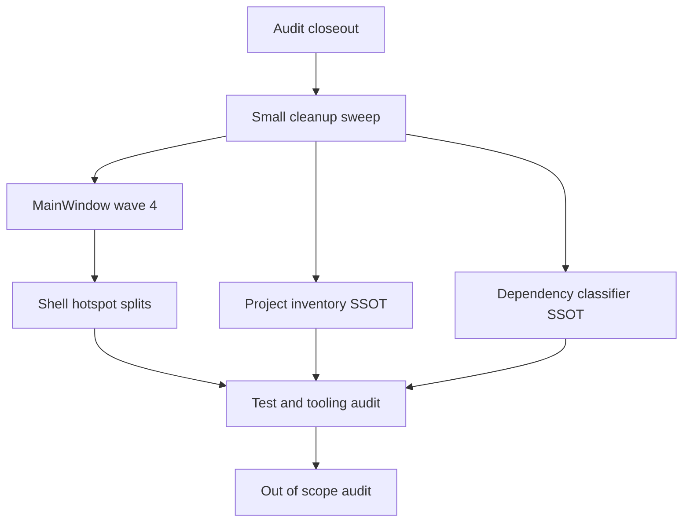

# Remaining App Deslop Handoff

Status: handoff v1
Scope: remaining issues after `docs/deslop/AUDIT_app.md` briefs A-L
Audience: future AI agents taking one focused cleanup brief at a time
Intent: document and hand off work, not claim that all remaining gaps must be solved in one PR

---

## 1. Purpose

The original app deslop audit has mostly been implemented. The big hard-cutover items are done: the old intelligence orphan modules are gone, production pytest services were renamed away from `test_*`, the empty `app/designer/` tree is gone, the legacy stdout debug marker protocol is gone, visible metadata paths are in place, and `package.py` delegates to product packaging code.

This document captures what remains so future agents can pick up small, reviewable follow-up PRs without re-reading the full historical audit. Treat this as the working handoff for the next deslop wave.

Agents should still read the canonical docs before implementation:

- `docs/PRD.md`
- `docs/DISCOVERY.md`
- `docs/ARCHITECTURE.md`
- `docs/TASKS.md`
- `AGENTS.md`
- `.cursor/rules/testing_when_to_write.mdc`
- `.cursor/rules/hard_cutover_refactor.mdc`
- `.cursor/rules/python39_compatibility.mdc`
- `.cursor/rules/ui_light_dark_mode.mdc`

---

## 2. Current State Summary

Known completed areas from the original audit:

- `app/intelligence/hover_service.py`, `signature_service.py`, `navigation_service.py`, `refactor_service.py`, and `reference_service.py` are removed.
- `app/run/pytest_runner_service.py` and `app/run/pytest_discovery_service.py` are the production pytest service names.
- `app/shell/menus.py` has been split into smaller menu builders.
- `LocalHistoryWorkflow`, `TestRunnerWorkflow`, and `PluginActivationWorkflow` exist and own their original target workflows.
- `app/persistence/local_history_store.py` is now a facade over focused local-history modules.
- `app/treesitter/highlighter.py` was hard-cut; `TreeSitterHighlighter` lives in `app/treesitter/highlighter_core.py`.
- `app/packaging/product_builder.py` owns product artifact building; root `package.py` is a thin CLI.
- `app/debug/debug_event_protocol.py` and `DebugSession.ingest_output_line` are gone.
- `app/runner/debug_runner.py` now uses `dataclasses.replace` for breakpoint updates instead of mutating a frozen manifest list in place.

Remaining risk areas:

- `app/shell/main_window.py` is still the highest concentration of orchestration and change risk.
- Several shell/debug/intelligence modules still exceed or sit near the original 700-line smell threshold.
- Some silent fallback paths remain and need triage.
- The autosave legacy migration bridge still exists and needs a dated removal decision.
- Project traversal/exclude policy is repeated across multiple subsystems.
- Dependency/native-extension/runtime classification is split across project, packaging, and diagnostics code.
- `AUDIT_app.md` now mixes historical findings with completed notes and stale metrics, so future agents can misread fixed items as open.
- `tests/`, top-level launchers, scripts, bundled plugins, top-level templates, and examples were out of scope for the original app audit.

Re-run metrics at the start of any implementation. Do not trust historical line counts in `AUDIT_app.md`.

---

## 3. Global Rules For Every Brief

- Keep PRs small. One brief may still be split into multiple PRs if it touches broad UI or shared contracts.
- If touching `MainWindow`, the method count must go down. Do not add new one-line delegator methods.
- Do not add compatibility shims when moving modules. Hard cut over importers in the same PR.
- Do not add dot-prefixed runtime paths.
- Preserve Python 3.9 source compatibility.
- Write tests only when the risk-first gate says they are justified.
- For UI changes, validate light and dark themes or explicitly record why validation was not possible.
- Run targeted tests plus `python3 testing/run_test_shard.py fast` and `npx pyright` before declaring a brief complete.
- Update architecture or deslop docs in the same PR when a module boundary or ownership rule changes.

Suggested metric sweep:

```bash
echo "=== app/ Python LOC ==="
find app -name "*.py" -not -path "*__pycache__*" -exec wc -l {} + | tail -1

echo "=== Methods on MainWindow ==="
rg "^    def " app/shell/main_window.py | wc -l

echo "=== bare 'except Exception:' lines ==="
rg "^\s*except\s+Exception\s*:\s*$" app/ --type py | wc -l

echo "=== '# type: ignore' lines ==="
rg "# type: ignore" app/ --type py | wc -l

echo "=== old hard-cutover names ==="
rg "__CB_DEBUG_|ingest_output_line|debug_event_protocol|app\.run\.test_(runner|discovery)_service" app/ tests/ bundled_plugins/
```

---

## 4. Sequencing




Practical order:

1. R0 and R1 first, because they make the status clear and remove cheap ambiguity.
2. R2, R4, and R5 can proceed in parallel if separate agents own them.
3. R3 should happen after at least one more `MainWindow` extraction, because shell UI tests may change.
4. R6 and R7 are follow-up hygiene passes after app ownership boundaries are clearer.

---

## 5. Work Briefs

### R0 - Close Out The Original Audit

Goal: make `docs/deslop/AUDIT_app.md` safe to read as history.

Files in scope:

- `docs/deslop/AUDIT_app.md`
- `docs/deslop/AUDIT_app_remaining_handoff.md`
- `AGENTS.md` or `docs/TESTS.md` only if their test checkpoints are wrong

Concrete work:

1. Run the metric sweep and record current numbers.
2. Add a short "Current closeout status" section near the top of `AUDIT_app.md`.
3. Mark section 5 findings as historical if they were fixed by Agents A-L.
4. Reconcile stale validation caveats:
  - old test counts in `AUDIT_app.md`
  - Agent K pyright caveat for tree-sitter mixins
  - Agent L pyright caveat for `resizeEvent` / `product_builder`
  - manual light/dark validation caveats
5. Keep the detailed old briefs intact enough for archaeology, but direct new agents to this handoff for remaining work.

Acceptance criteria:

- Future readers can tell what is fixed, what remains, and where to start.
- No code changes in this brief.
- Metric sweep included in the doc.

Suggested validation:

```bash
python3 testing/run_test_shard.py fast
npx pyright
```

---

### R1 - Small Cleanup Sweep

Goal: remove or document remaining low-risk slop before larger refactors.

Files in scope:

- `app/runner/debug_runner.py`
- `app/runner/output_bridge.py`
- `app/plugins/runtime_manager.py`
- `app/debug/debug_models.py`
- `app/persistence/autosave_store.py`
- `app/intelligence/completion_service.py`
- `app/shell/main_window.py` only if completion UI needs shell messaging updates

Concrete work:

1. Replace the remaining `except Exception: pass` in runner/debug shutdown paths with narrow exception handling or debug logging.
2. In `PluginRuntimeManager`, log or explicitly account for decode failures and queue backpressure drops. Do not spam logs on expected idle reads.
3. Rename or reword stale debug model comments so `DebugEvent` and `DebugSessionState.apply_event()` no longer claim they are tied to the deleted stdout-marker parser.
4. Decide the autosave legacy bridge:
  - If the telemetry window has elapsed, delete `_legacy_draft_root`, `_legacy_draft_path`, `_delete_legacy_draft`, `_migrate_legacy_draft`, `_migrate_all_legacy_drafts`, `_load_legacy_draft`, and `_load_legacy_draft_payload`.
  - If not, add a dated removal note in `docs/TASKS.md` or this handoff.
5. Finish the completion honesty decision:
  - Either group semantic and approximate items in the popup, or document that item-level source/detail tagging plus the status-bar notice is the accepted UX.

Acceptance criteria:

- Bare `except Exception:` count does not increase.
- No new `except: pass`.
- Debug model naming/comments match structured transport.
- Autosave legacy status is either deleted or explicitly dated.
- Completion degradation UX is no longer ambiguous in docs.

Suggested validation:

```bash
python3 run_tests.py tests/unit/debug/test_debug_session.py tests/unit/runner/test_debug_runner.py tests/unit/plugins/test_runtime_manager.py tests/unit/intelligence/test_completion_service.py tests/unit/persistence/test_autosave_store.py
python3 testing/run_test_shard.py fast
npx pyright
```

---

### R2 - MainWindow Decomposition Wave 4

Goal: continue AD-015 by moving cohesive workflows out of `MainWindow`.

Files in scope:

- `app/shell/main_window.py`
- new or existing shell workflow/controller modules
- focused tests under `tests/unit/shell/` and affected integration tests

Candidate extractions:

1. `PythonStyleWorkflow` or `SaveWorkflow` extension:
  - save action
  - save all
  - format current file
  - organize imports
  - lint-on-save
  - safe fixes
2. `DebugControlWorkflow`:
  - continue/pause/step commands
  - breakpoint list state
  - remove all breakpoints
  - debug action enablement
3. `RuntimeOnboardingWorkflow`:
  - startup capability report refresh
  - runtime guide dismissal/completion
  - runtime center opening
  - project health/support bundle/package-project async tasks
4. Thin pass-through cleanup:
  - help menu actions that only call `HelpController`
  - settings getter methods that only read service values
  - inline hover/signature helpers that mostly forward to `EditorIntelligenceController`

Implementation notes:

- Do not create a controller that simply mirrors every `MainWindow` method. Extract one cohesive workflow at a time.
- Prefer connecting menu callbacks directly to workflow methods where practical.
- If a workflow needs UI dialogs, pass explicit callables or narrow collaborators rather than the whole `MainWindow`.
- Preserve existing behavior with characterization tests before moving complex paths.

Acceptance criteria:

- `MainWindow` method count decreases in every PR that touches it.
- No new one-line `MainWindow` delegators.
- Workflow modules have public methods that match user actions, not private implementation steps.
- Affected shell tests pass.
- Manual light/dark validation is recorded for user-facing UI changes.

Suggested validation:

```bash
python3 run_tests.py tests/unit/shell/
python3 run_tests.py tests/integration/shell/
python3 testing/run_test_shard.py fast
npx pyright
```

---

### R3 - Shell Hotspot Splits

Goal: reduce remaining oversized shell UI/style modules without changing behavior.

Files in scope:

- `app/shell/style_sheet_sections.py`
- `app/shell/style_sheet.py`
- `app/shell/settings_dialog.py`
- `app/shell/settings_dialog_sections.py`
- `app/shell/outline_panel.py`
- `app/shell/debug_panel_widget.py`
- `app/shell/test_explorer_panel.py`
- focused tests under `tests/unit/shell/`

Concrete work:

1. Split stylesheet sections by area while keeping `style_sheet.py` as the composer:
  - shell/chrome
  - settings
  - explorer/outline
  - debug/test
  - dialogs
2. Finish extracting `SettingsDialog` construction:
  - general tab builders
  - scope banner/update helpers
  - reset/apply helpers that are not tied to the dialog object lifecycle
3. Split `OutlinePanel` into icon, header, filter row, tree widget, and main panel modules.
4. Tackle `DebugPanelWidget` and `TestExplorerPanel` only after public-behavior tests are in place. Do not overfit tests to private child widget names.

Acceptance criteria:

- No shell UI module touched by the brief remains above the chosen line cap unless documented.
- Behavior and object names required by existing tests remain stable unless the test is intentionally rewritten to public behavior.
- Light/dark visual validation is recorded.

Suggested validation:

```bash
python3 run_tests.py tests/unit/shell/test_settings_dialog.py tests/unit/shell/test_outline_panel.py tests/unit/shell/test_test_explorer_panel.py tests/unit/shell/test_debug_panel_widget.py
python3 testing/run_test_shard.py fast
npx pyright
```

---

### R4 - Project Inventory Source Of Truth

Goal: centralize project traversal, metadata skipping, and exclude policy.

Files in scope:

- `app/project/file_excludes.py`
- new `app/project/file_inventory.py`
- `app/project/project_service.py`
- `app/editors/search_panel.py`
- `app/intelligence/diagnostics_service.py`
- `app/intelligence/symbol_index.py`
- `app/intelligence/import_rewrite.py`
- `app/intelligence/completion_providers.py`
- `app/intelligence/code_actions.py`
- packaging validators or artifact builders that enumerate project files
- focused tests under `tests/unit/project/`, `tests/unit/intelligence/`, `tests/unit/editors/`, and `tests/unit/packaging/`

Concrete work:

1. Add a project inventory API that supports:
  - effective exclude patterns
  - metadata directory skipping through `constants.PROJECT_META_DIRNAME`
  - Python-file iteration
  - generic file iteration
  - deterministic ordering
  - optional cancellation checks for UI searches
2. Add characterization tests for current traversal behavior before moving call sites.
3. Migrate one subsystem at a time.
4. Delete duplicated traversal helpers once all callers are migrated.

Acceptance criteria:

- Search, diagnostics, symbol indexing, import rewrite, completion providers, project inference, and packaging use the same inventory API.
- Existing exclude behavior is preserved.
- No hidden directory rule regressions.
- No long-lived compatibility wrapper for the old traversal behavior.

Suggested validation:

```bash
python3 run_tests.py tests/unit/project/ tests/unit/editors/test_search_panel.py tests/unit/intelligence/ tests/unit/packaging/
python3 testing/run_test_shard.py fast
npx pyright
```

---

### R5 - Dependency And Runtime Classification Source Of Truth

Goal: move ChoreBoy dependency/native-extension/runtime classification into one owned module.

Files in scope:

- new `app/project/dependency_classifier.py` or another clearly owned module
- `app/project/dependency_ingest.py`
- `app/project/dependency_manifest.py`
- `app/packaging/dependency_audit.py`
- `app/intelligence/diagnostics_service.py`
- `app/intelligence/import_resolver.py`
- `app/plugins/auditor.py` if plugin package classification overlaps
- focused tests under `tests/unit/project/`, `tests/unit/packaging/`, and `tests/unit/intelligence/`

Concrete work:

1. Extract shared constants and behavior:
  - compiled extension suffixes
  - stdlib/runtime/project/vendor/missing classification
  - native extension detection in wheels, zips, and folders
2. Remove the production import of private `_STDLIB_FALLBACK` from `app/packaging/dependency_audit.py`.
3. Add direct tests for stdlib, project, vendor pure-Python, vendor native, runtime-provided, and missing dependency cases.
4. Migrate packaging and diagnostics to the shared classifier.

Acceptance criteria:

- Dependency classification rules live in one public module.
- Packaging does not import private intelligence symbols.
- Diagnostics and packaging agree on representative dependency cases.
- No packaging regression on native-extension blocking.

Suggested validation:

```bash
python3 run_tests.py tests/unit/project/ tests/unit/packaging/test_dependency_audit.py tests/unit/intelligence/test_diagnostics_service.py
python3 testing/run_test_shard.py fast
npx pyright
```

---

### R6 - Test And Tooling Audit

Goal: make future refactors less noisy after shell and SSOT work.

Files in scope:

- `tests/unit/shell/`
- `tests/unit/editors/`
- `tests/integration/shell/`
- `requirements-dev.txt`
- `pyproject.toml`
- docs that describe test/tool commands

Concrete work:

1. Review UI tests that reach into private widget internals.
2. Replace brittle private layout assertions with public signal/state tests where practical.
3. Delete low-signal tests that only assert object names, icon cache identity, or exact layout details unless they protect an accessibility/manual-acceptance contract.
4. Decide whether to add Ruff, Vulture, Radon, Lizard, or no new tool.
5. If adding tooling, pin it intentionally and document how it runs in this repo's AppRun/no-venv workflow.

Acceptance criteria:

- Test changes reduce coupling without reducing meaningful behavior coverage.
- New tooling is explicit, documented, and Python 3.9 compatible.
- No broad coverage-chasing tests added.

Suggested validation:

```bash
python3 testing/run_test_shard.py fast
npx pyright
```

---

### R7 - Out-Of-Scope Deslop Audit

Goal: audit areas intentionally excluded from the original app pass.

Scope:

- `tests/`
- `scripts/`
- `bundled_plugins/`
- top-level `templates/`
- `example_projects/`
- root launchers such as `run_editor.py`, `run_runner.py`, `run_plugin_host.py`
- packaging/release scripts outside `app/`

Concrete work:

1. Produce a new audit document rather than mixing these findings into `AUDIT_app.md`.
2. Use the same slop catalog from `AUDIT_app.md`.
3. Separate findings into "must fix before release", "refactor when touched", and "do not touch unless product scope changes".
4. For tests, prioritize brittleness and low-signal coverage over raw line count.

Acceptance criteria:

- New audit document exists under `docs/deslop/`.
- Findings cite concrete paths.
- Proposed briefs are small enough for future agents.

Suggested validation:

```bash
python3 testing/run_test_shard.py fast
npx pyright
```

---

## 6. Handoff Notes

- `docs/deslop/AUDIT_Maintainability.md` exists as an additional maintainability audit. Before committing any handoff doc, decide whether it should be kept, merged into this document, or replaced by this handoff.
- If an agent discovers that code has already changed since this document was written, update metrics first and preserve the newest code reality over historical numbers.
- Do not treat line count alone as a bug. Use it as a smell that must be paired with unclear ownership, repeated logic, or review risk.
- Prefer deleting obsolete tests/helpers over preserving compatibility with unshipped branch-era code.

End of handoff.