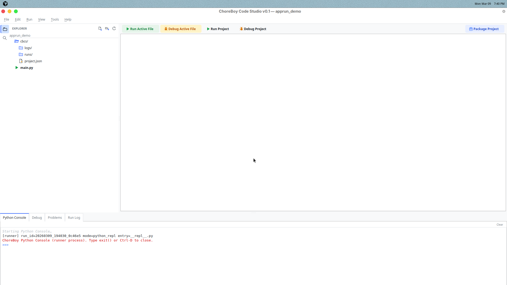
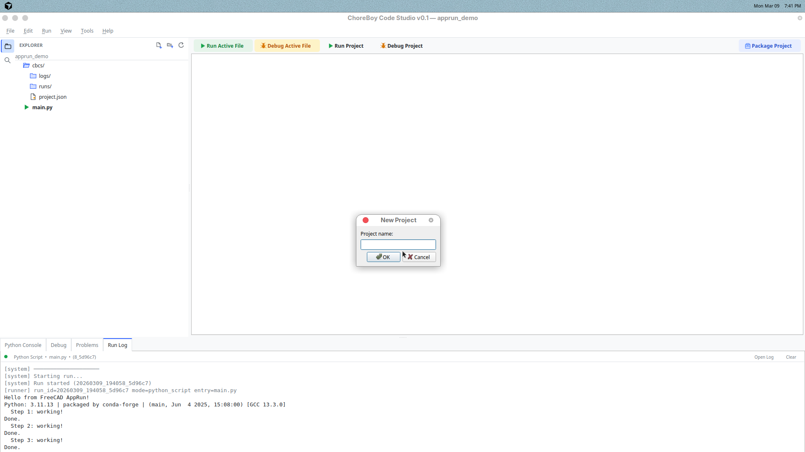
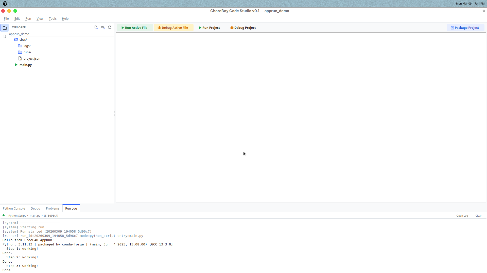

# 1) Quick Start

This chapter gets you from launch to a successful run.

If all you do today is this chapter, that is enough.



## Step 1 — Launch the editor

Open ChoreBoy Code Studio from your application menu or desktop shortcut.

When the window opens, check the status bar.
Look for a startup message like:

- `Startup: Runtime ready (x/x checks)` (best case), or
- `Startup: Runtime issues (x/x checks)` (still usable, but you should run health checks soon).

If you need the details behind that status, click it or open `Tools > Runtime Center...`.

## Step 2 — Open or create a project

Choose one:

- `File > Open Project...` to open an existing folder, or
- `File > New Project...` to create a project from a template.

If this is your first time, use **Utility Script** template.

You can reopen the first-run checklist any time from `Help > Runtime Onboarding...`.



## Step 3 — Open `main.py`

In the left project tree, click `main.py`.
The file opens in the editor tabs.

Type a simple line:

```python
print("Hello from ChoreBoy Code Studio")
```

## Step 4 — Save your changes

Press `Ctrl+S` (or use `File > Save`).

You should see the tab’s modified marker clear after save.

## Step 5 — Run your code

Press `F5` for **Run Active File**.
Use `Shift+F5` for **Run Project** when you want the project's default entry.

Output appears in the **Run Log** panel at the bottom.



## Step 6 — Read output and errors

- Normal output appears as run log text.
- Error output appears with traceback details.
- The **Problems** panel helps you jump to the right file and line.

## Step 7 — Stop a running script

If your script keeps running, press `Shift+F2` or click **Stop** in the toolbar.

The status bar changes from running to terminated/idle.

## Quick success checklist

You are set up if all of these are true:

- You opened a project.
- You edited and saved a file.
- You ran code with `F5`.
- You saw output in Run Log.
- You can stop a long-running script.

If one of these fails, go to **Chapter 10 (Troubleshooting)**.

