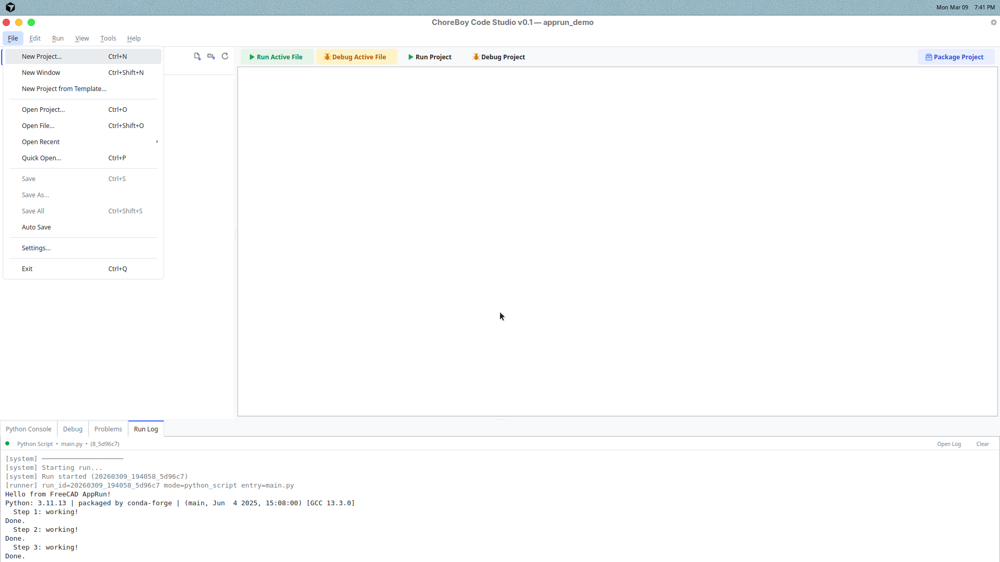
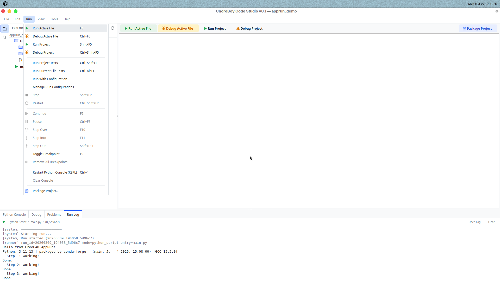

# 3) Core Daily Workflow

This chapter is the practical "everyday use" sequence.

## Open a project

Use `File > Open Project...` and pick a project folder.

If the folder is a normal Python folder without `cbcs/project.json`,
Code Studio can initialize it on first open.

## Open files

In the project tree:

- single-click opens a preview tab,
- double-click opens a permanent tab.

If you open the same file again, Code Studio reuses the tab.

## Edit safely

When you type, the tab shows a modified marker.
That means changes are not saved yet.

Use:

- `Ctrl+S` for Save,
- `Ctrl+Shift+S` for Save All.

## Run active file vs run project

This is an important difference:

- `F5` -> **Run Active File** (the file you are currently editing)
- `Shift+F5` -> **Run Project** (project entry point)

Use Active File for quick tests.
Use Run Project for full app behavior.

## Read results

After a run:

- check **Run Log** for output,
- check **Problems** for parsed errors and jump links.

If the run fails, look at traceback lines first.

## Stop long runs

If a script is still running:

- click **Stop** in toolbar, or
- use `Shift+F2`.

You should see run state change in the status bar.

## Avoid common mistakes

### Mistake: running old code
Cause: forgot to save before run.  
Fix: press `Ctrl+S`, then run again.

### Mistake: running the wrong file
Cause: used Run Project when you expected Active File.  
Fix: use `F5` for active file, or set correct project entry point.

### Mistake: output appears missing
Cause: wrong bottom tab selected.  
Fix: open **Run Log** tab.

