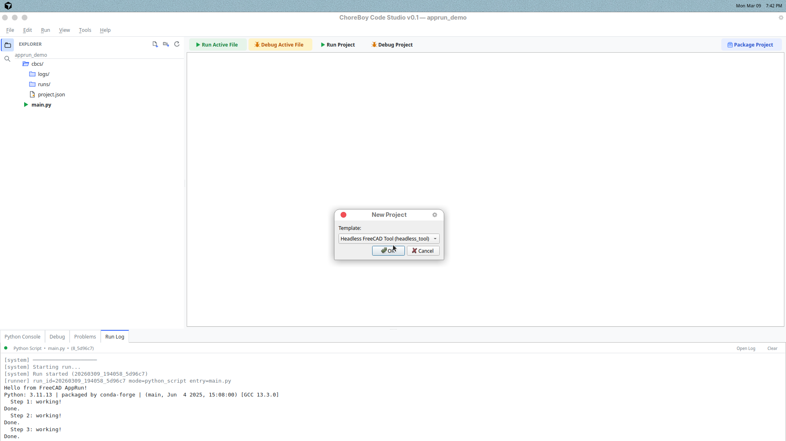
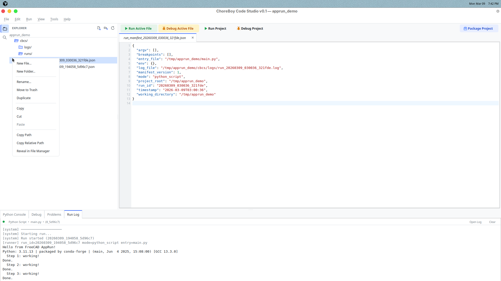

# 4) Projects and Files

This chapter covers project setup and file-tree operations.

## Create a new project

Use `File > New Project...`.

Choose a template:

- **Utility Script** — simplest starter
- **Qt App** — GUI starter
- **Headless FreeCAD Tool** — backend-safe starter

## Open recent projects

Use `File > Open Recent`.

This is the fastest way to get back to current work.

## Test Explorer

Use `View > Show Test Explorer` (shortcut: `Ctrl+Shift+X`) to open the Test Explorer in the left sidebar.

From this panel you can:

- Discover project tests
- Run all tests
- Re-run failed tests
- Run or debug specific tests from the tree

The test tree updates after project loads and Python file saves.

## Dependency tools

Use `Tools > Dependency Inspector...` to review dependencies configured for the current project.

Use `Tools > Add Dependency...` to add a local package archive (`.whl` / `.zip`) or a package folder to your project.

## File tree actions

Right-click files/folders in the tree for actions like:

- New File / New Folder
- Rename
- Move to Trash
- Duplicate
- Copy / Cut / Paste
- Copy path / Copy relative path
- Reveal in file manager
- Run (for Python files)

## Set the project entry point

If `Run Project` should start from a specific file:

1. Right-click that file in tree.
2. Click **Set as Entry Point**.

This updates project metadata and helps keep team behavior consistent.

## Project metadata

Important files inside a project:

- `cbcs/project.json` — project behavior settings (entry file, run info)
- `cbcs/settings.json` — project-level setting overrides
- `cbcs/logs/` — run logs

## Good project habits

1. Keep source files in clear folders (for example `app/`, `tests/`).
2. Use meaningful file names.
3. Keep `README.md` updated with project purpose.
4. Back up the full project folder regularly.

