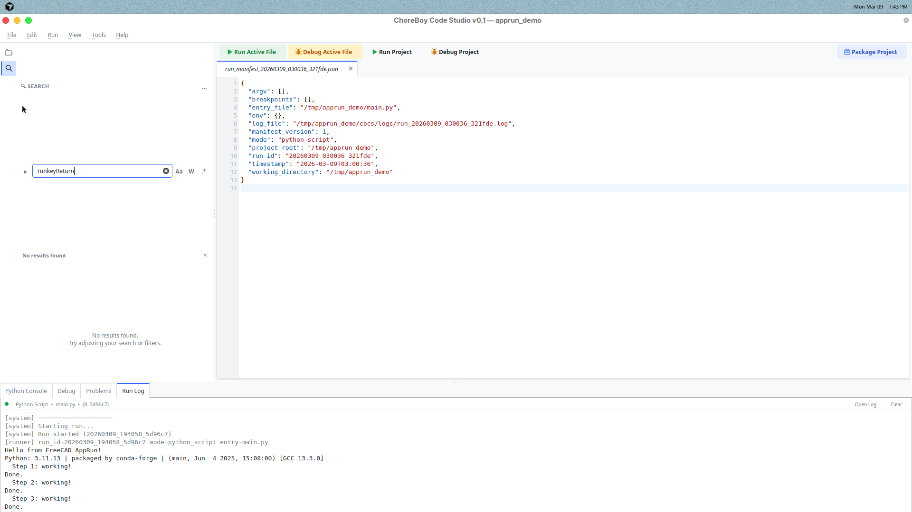

# 5) Editing and Navigation

This chapter helps you move faster inside code and text files.

## Find and replace in current file

Use:

- `Ctrl+F` to find
- `Ctrl+H` to replace

Use this for focused edits in one file.

## Find in files (project-wide)

Use `Ctrl+Shift+F`.

This searches across your project and groups results by file.
Click a result to preview, double-click to open permanently.

## Quick Open

Use `Ctrl+P`.

Type part of a filename and choose from matches.
This is usually faster than browsing deep folders.

## Go to line

Use `Ctrl+G`, type line number, press Enter.

Helpful for traceback navigation and code review.

## Go to definition and outline

Useful commands:

- `F12` -> Go to Definition
- `Tools > Show Current File Outline`

Use these when moving between related functions/classes.

## Preview tabs (important behavior)

Code Studio supports preview tabs:

- single-click file -> preview tab (reused by next single-click),
- double-click file -> permanent tab,
- editing a preview tab promotes it to permanent.

This keeps tab clutter low while browsing.

## Edit reliability tips

1. Save often (`Ctrl+S`).
2. Use Save All before major runs.
3. Keep tabs organized: close files you are done with.
4. Use Quick Open for fast file switching.

