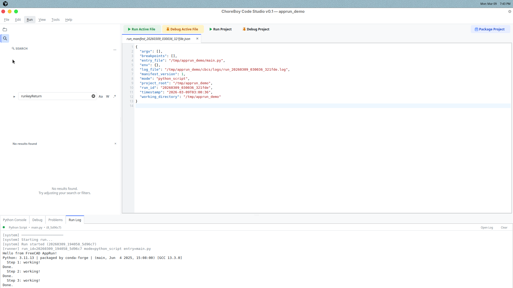

# 6) Run, Debug, and Python Console

This chapter explains how to execute and investigate your code.

## Run modes at a glance

- **Run Active File** (`F5`): runs the file in the active editor tab.
- **Run Project** (`Shift+F5`): runs the configured project entry file.
- **Debug Active File** (`Ctrl+F5`): starts debug flow for active file.
- **Debug Project** (`Ctrl+Shift+F5`): debug run for project entry file.
- **Debug Current Test**: starts a pytest-targeted debug run for the active test file.
- **Rerun Last Debug Target**: repeats the most recent debug launch intent.

## Basic run workflow

1. Save the file (`Ctrl+S`).
2. Press `F5`.
3. Watch **Run Log**.
4. If errors appear, open **Problems** and jump to issue lines.



## Passing arguments to a run

Code Studio runs do not have a terminal, but `sys.argv` and environment variables can be supplied through dialogs and saved configurations. Three surfaces cover the common cases:

### One-off: Run With Arguments…

`Run` → `Run With Arguments…` opens a small dialog that collects an entry file, an **Arguments** string, a **Working directory**, and **Environment overrides** (comma-separated `KEY=VALUE`). The dialog parses the argument string with shell-style quoting, so `--config "/tmp/a b/c.toml" --verbose` parses into three argv tokens with the path's space preserved. A "Recent…" dropdown next to the field remembers the last 10 argument strings across projects.

The dialog runs the configuration once and does **not** modify `cbcs/project.json`. Click **Save as Configuration…** instead of **Run** to promote the values into a named entry through the Run Configurations editor.

### Persistent: Run Configurations…

`Run` → `Run Configurations…` opens a two-pane editor. The left pane lists named configurations stored in `cbcs/project.json` under `run_configs`; the right pane edits the selected configuration's Name, Entry file, Arguments, Working directory, and Environment overrides. Use the buttons under the list to **Add**, **Duplicate**, or **Delete** entries. **Save** writes the full edited list back to `cbcs/project.json` in one commit.

The top of the dialog also exposes a **Default arguments for Run Project** field, which edits the project's `default_argv` — the argv that F5 uses when no named configuration is active.

### Active run target indicator (status bar)

The status bar shows the current run target (`Default` or the name of the active configuration). Click it to switch between configurations, open **Run With Arguments…**, or open **Edit Configurations…**. While a named configuration is active, both **Run Project** (F5) and **Debug Project** (Ctrl+Shift+F5) use that configuration's entry, argv, working directory, and environment overrides.

### Right-click on a file

Right-clicking a `.py` file in the project tree exposes **Run** (no arguments) and **Run With Arguments…** alongside **Set as Entry Point**. The Run With Arguments dialog opens pre-filled with the right-clicked file as the entry.

## Debug workflow (explicit step-by-step)

### Step 1 — Set breakpoints

Click in the editor gutter next to a line number.
A marker appears for that line.

Optional: open breakpoint properties to add:

- a condition
- a hit-count threshold
- enable/disable state without removing the breakpoint

### Step 2 — Start debug

Use `Ctrl+F5` for active file, or `Ctrl+Shift+F5` for project entry.

### Step 3 — Use Debug panel

Open the **Debug** bottom tab and use:

- Continue (`F6`)
- Pause (`Ctrl+F6`)
- Step Over (`F10`)
- Step Into (`F11`)
- Step Out (`Shift+F11`)

You can also inspect:

- threads
- call stack
- scopes (`locals`, `globals`, and exception state when relevant)
- watch expressions
- lazy-expanded variables for lists, dicts, and objects

Selecting a frame in the panel updates the current execution highlight in the editor.

### Step 3a — Evaluate watches and variables

When paused:

1. Add a watch expression in the Debug panel.
2. Expand scopes or nested variables as needed.
3. Select a different frame if you need values from another stack level.

Watch results are tied to the selected paused frame, not to raw console commands.

### Step 3b — Exception stops

The debugger can stop on uncaught exceptions and, when enabled, raised exceptions.
Use the session controls to decide how noisy you want exception pausing to be.

### Step 4 — Stop debugging

Use **Stop** when done or when execution is stuck.

## Important debug notes

Debug behavior depends on runtime conditions.
If breakpoints do not pause where expected:

1. Confirm breakpoint is on executable code (not blank/comment line).
2. Save file before starting debug.
3. Confirm you started the correct mode (Active File vs Project).
4. Use Run Log + Problems as fallback diagnosis path.

In other words: if stepping is not acting as expected, you can still diagnose most issues quickly with a normal run and traceback.

During debugging, program output still appears in **Run Log**. The **Debug** tab is reserved for structured inspector state, watches, and breakpoint/session controls.

## Python Console (REPL)

Use the **Python Console** tab for quick experiments.

Examples:

```python
x = 2
print(x + 3)
```

You can run short snippets, test expressions, and inspect values without changing files first.

## When to use each tool

- Use **Run** for normal development.
- Use **Debug** when you need step-by-step control.
- Use **Debug Current Test** for pytest-oriented troubleshooting loops.
- Use **Python Console** for quick experiments and checks.

## FreeCAD macro workflow

For FreeCAD macros that need an open document (`FreeCAD.ActiveDocument`) or the GUI (selection, view manipulation, etc.):

- **Recommended workflow**: Edit and save in Code Studio, then run the macro inside FreeCAD.
- Code Studio provides syntax highlighting, linting, and editing. FreeCAD provides the document and GUI context needed for execution and debugging.
- Code Studio Run/Debug runs scripts headless. `FreeCAD.ActiveDocument` is `None` and GUI operations fail, so it is suitable for headless scripts and utilities only.

