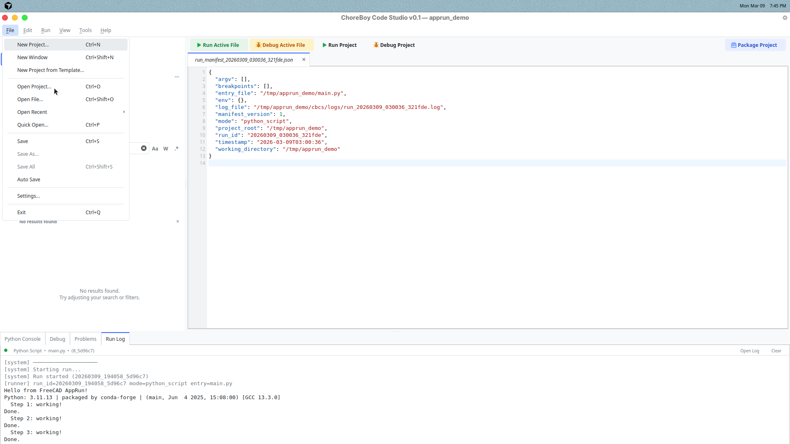

# 7) Settings and Customization

Use Settings to make Code Studio fit your workflow.

Open with `File > Settings...`.

## Global vs project scope

The scope selector controls where changes are saved:

- **Global**: applies to all projects for this user/machine.
- **Project**: applies only to current project (`cbcs/settings.json`).

Project scope is useful when sharing consistent behavior with others.

## Theme and view options

Use `View > Theme` to switch:

- System
- Light
- Dark

Use `View > Zoom In/Out/Reset` for text readability.

## Keybindings

In Settings, **Keybindings** tab lets you:

- search commands,
- change shortcuts,
- detect conflicts,
- reset to defaults.

## Syntax colors

Use **Syntax Colors** tab to customize token colors.
You can control light and dark colors separately.

## Linter controls

In **Linter** tab you can:

- enable or disable linting,
- choose lint provider,
- tune rule severities,
- override rules for a project.

## Recommended starter setup

For most hobby users:

1. Keep theme on System or Dark.
2. Keep linting enabled.
3. Use default shortcuts first, then customize only what you use daily.
4. Use project scope only for settings that truly belong to that project.

