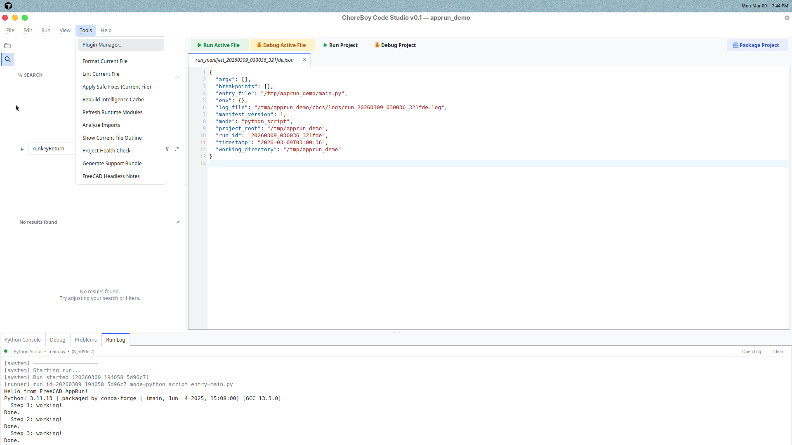

# 8) Plugins

Plugins let you add optional features without cluttering the core editor.

Open plugin tools from:

- `Tools > Plugin Manager...`

## What plugins are good for

Use plugins for specialized tasks that not every user needs.

Examples:

- extra automation commands,
- project-specific helpers,
- custom integrations.

## Basic plugin lifecycle

1. Install plugin from local package/folder.
2. Review compatibility and trust prompts.
3. Enable plugin.
4. Use contributed commands.
5. Disable/remove when no longer needed.

## Safety features

Code Studio includes safety controls:

- safe mode startup,
- plugin failure quarantine,
- compatibility checks before activation.

These protections help keep the editor stable if a plugin fails.

## Good plugin habits

1. Install only from trusted sources.
2. Keep plugin count small.
3. Disable plugins you do not actively use.
4. If startup issues appear, use safe mode and re-enable one-by-one.

