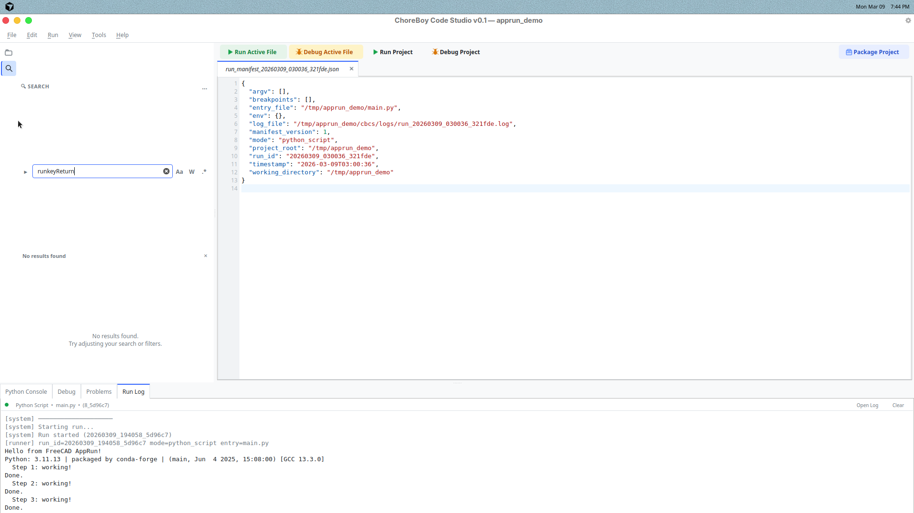

# 9) Packaging, Sharing, and Backup

This chapter covers how to move your work safely.

## Package a project

Use:

- `Run > Package Project...`

This opens a packaging wizard and creates a new export folder outside your live project.

The supported default profile is `installable`.

An installable export contains:

- an installer `.desktop` launcher
- `installer/install.py`
- `installer/launcher_bootstrap.py`
- `payload/app_files/` with your packaged project source
- `package_manifest.json` and `package_report.json`
- generated `README.txt` and `INSTALL.txt`

Portable export is also available, but it has a stricter contract:

- keep the portable `.desktop` file in the same folder as the packaged files
- use installable packaging when you want the clearest install/upgrade path
- use installable packaging when you want menu/Desktop launcher publishing

## Package metadata

Package Project stores its export metadata in:

- `cbcs/package.json`

This is separate from `cbcs/project.json` on purpose.

Typical fields include:

- stable `package_id`
- package `version`
- user-facing `display_name`
- optional `description`
- package entry file override
- optional icon path

Keep `package_id` stable between releases so installable packages can support clearer upgrade behavior.

## Validation before export

Before exporting, Code Studio runs:

- package-metadata validation
- packaging preflight for entry file and output path safety
- dependency audit against project files, `vendor/`, and the AppRun runtime

Results are written into:

- `package_report.json`

If packaging stops before export, read that report or open Runtime Center first.

## Share projects with other users

When sharing:

1. Include the whole project folder.
2. Keep `cbcs/` metadata included.
3. Include `README.md` with basic run instructions.

For packaged exports, send the whole exported folder, not only the `.desktop` file.

For installable exports, recipients should keep the whole installer package together.

## Backup best practices

1. Back up project folders regularly (for example, to USB).
2. Keep at least two backup copies for important projects.
3. Do a quick run test after restoring from backup.

## Keep diagnostic history

Do not delete logs too aggressively.

Run logs in `cbcs/logs/` are useful when troubleshooting older issues.

## Before sending a project for help

Do this checklist:

1. Save all files.
2. Reproduce the issue once.
3. Generate a support bundle (see Chapter 10).
4. Share project + support bundle together.

## Packaging preflight

If packaging stops before export, read the Runtime Center explanation first.

Common blockers:

- missing or invalid package metadata
- missing default entry file
- entry file inside an excluded `cbcs/` path
- icon path outside the project or inside an excluded path
- missing dependency or unsupported vendored native extension
- output folder overlapping the live project

## Installable package workflow on ChoreBoy

1. Copy the whole exported installable folder into `/home/default/`.
2. Keep the installer `.desktop`, `installer/`, `payload/`, and package manifest files together.
3. Right-click the installer `.desktop` and allow launching if ChoreBoy asks.
4. Run the installer.
5. Choose the final install folder.
6. Let the installer publish the application-menu launcher and optional Desktop shortcut.
7. If you later move the installed folder, rerun the installer so the launcher points at the new location.

The installer launcher resolves the package folder from its own `.desktop` path,
so renaming the exported folder is allowed as long as the folder stays together.
The installer performs a staged copy before switching the final install directory,
and it can optionally remove older installed versions after a successful upgrade.

For project packages, the installed launcher runs the app from the installed
`app_files/` folder. This keeps project-relative imports and resource files
working the same way they did inside Code Studio.

## Portable package workflow on ChoreBoy

1. Keep the portable `.desktop` file in the root of the exported folder.
2. Keep the whole export folder together when copying it to USB or another machine.
3. If the target desktop does not launch the portable package reliably, export again using the installable profile.

## What gets left out

Packaging intentionally excludes:

- `cbcs/runs/`
- `cbcs/logs/`
- `cbcs/cache/`
- `__pycache__/`
- hidden dot-folders such as `.git/`
- `.pyc` files

This keeps exports focused on runnable project content instead of transient or unsupported paths.
