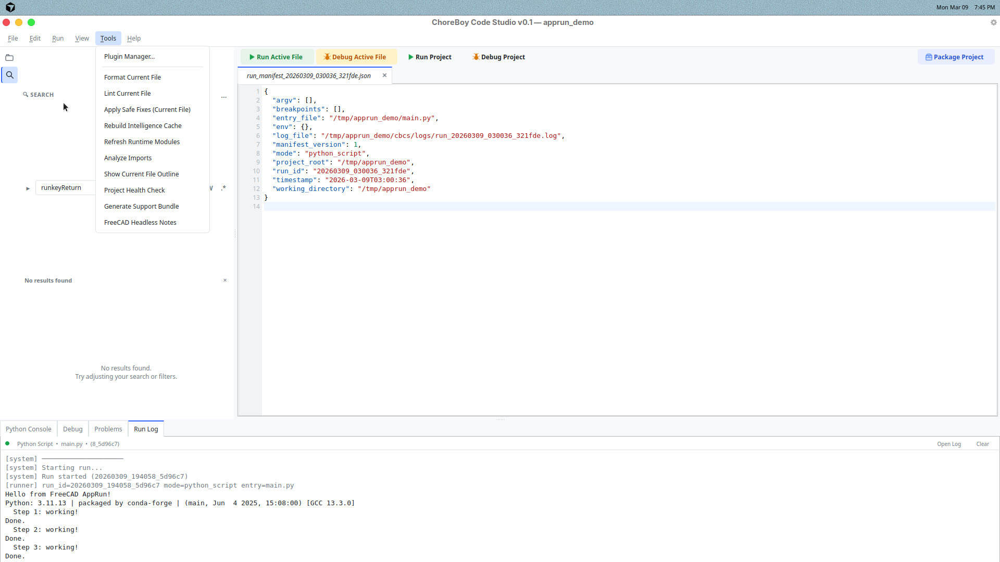

# 10) Troubleshooting

Use this chapter when something does not work as expected.

## First checks (always do these)

1. Read the **Run Log** tab.
2. Check the **Problems** panel.
3. Look at startup status in the status bar.
4. Run `Tools > Project Health Check`.

## Problem: project will not open

Likely causes:

- selected folder is not a valid/importable project,
- metadata file is invalid.

Fix:

1. Open a folder that contains Python files.
2. If needed, create/open with `File > New Project...`.
3. Check error message details in popup/log.

## Problem: run fails immediately

Likely causes:

- syntax/runtime error in file,
- wrong entry file.

Fix:

1. Open Problems panel.
2. Jump to first traceback line.
3. Fix and save.
4. Run again.

## Problem: entry file is missing

If entry file was deleted or moved, Code Studio can prompt for replacement.

Fix:

1. Choose a valid `.py` replacement file in prompt.
2. Save updated project entry.
3. Run project again.

## Problem: debug does not pause at breakpoints

Likely causes:

- breakpoint on non-executable line,
- unsaved file,
- debugging different file than expected.

Fix:

1. Save file first.
2. Move breakpoint to executable code.
3. Confirm active file vs project debug mode.
4. If still not pausing, use normal run + Run Log + Problems for diagnosis.

## Problem: FreeCAD macro needs document or Gui

Symptom:

- `FreeCAD.ActiveDocument` is `None` when running from Code Studio.
- Script fails with errors related to selection, view, or GUI operations.

Meaning:

Code Studio runs scripts headless. There is no open FreeCAD document or GUI context.

Fix:

1. Edit and save your macro in Code Studio (syntax highlighting and linting remain useful).
2. Run the macro inside FreeCAD (Macro > Macros or your usual macro launcher).
3. Use FreeCAD for execution and debugging; use Code Studio for editing.
4. Avoid broad top-level `try/except` wrappers that swallow traceback details; keep exception output visible and handle errors at targeted boundaries.

## Problem: FreeCAD GUI module error in run

Symptom:

`Cannot load Gui module in console application`

Meaning:

Your script hit a GUI-only FreeCAD path in a headless run context.

Fix:

1. Open `Tools > FreeCAD Headless Notes`.
2. Use headless-safe API path where possible.
3. Retest.

## Problem: uncertain environment state

Fix:

1. Run `Tools > Project Health Check`.
2. Read each failed check line.
3. Apply suggested correction.
4. Re-run the check.

## Generate support bundle

When you need help from another person:

1. Open project.
2. Use `Tools > Generate Support Bundle`.
3. Share generated bundle and project folder.

