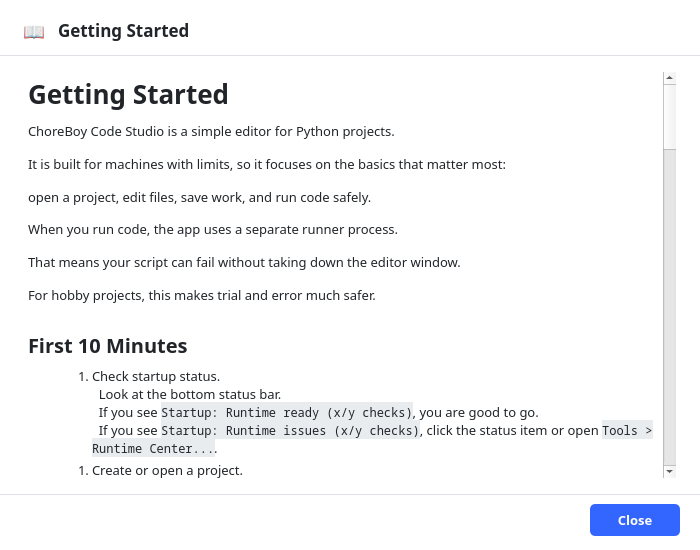

# Installing & First Launch

This chapter covers how ChoreBoy Code Studio is started on the appliance, what you see
the first time it opens, and how to confirm the application is ready to use.

## How the application is launched

On a ChoreBoy appliance, ChoreBoy Code Studio is installed as a normal desktop
application. You start it the same way you start any other program on the machine —
from its desktop icon or application launcher. There is nothing to install from the
internet and no terminal commands to type.

> [!NOTE] ChoreBoy Code Studio runs inside the appliance's bundled Python runtime. That
> runtime is already present on every ChoreBoy machine, which is why no separate
> installation step is required.

## The welcome screen

The first time you open the application — or any time no project is open — you see the
**welcome screen**. From here you can:

- **New Project** — create a project from a template.
- **Open Project** — open an existing project folder.
- **Search projects...** — filter your list of recent projects.
- **Recent Projects** — reopen a project you used before (this list fills in over time).

> [!TIP] After you have opened a project once, ChoreBoy Code Studio can reopen it
> automatically the next time you launch. If that happens, you go straight to your
> project instead of the welcome screen. You can always return to onboarding help from
> the **Help** menu.

## Confirming the application is ready

When the application starts, it runs a quick **capability check** to confirm the runtime
is healthy. The result appears at the far left of the **status bar** along the bottom of
the window.

- **Runtime ready (8/8 checks)** means everything is working.
- **Runtime issues (N/8 checks)** means one or more checks did not pass. The application
  still opens, but some features may be limited.

The capability check confirms things such as:

- the bundled runtime launcher is available,
- the Qt user-interface library can be loaded,
- the application's settings and log folders can be written,
- a temporary working folder is available,
- syntax highlighting support loaded successfully.

> [!IMPORTANT] If the status bar reports runtime issues, open **Tools > Runtime Center**
> for a plain-language explanation of what failed and what to do. See the chapter
> "Diagnostics & support tools" for details.

## Getting started help

ChoreBoy Code Studio includes built-in onboarding help that stays available even after
the welcome screen is gone:

- **Help > Getting Started** opens an in-application guide to your first steps.
- **Tools > Runtime Center** explains the current runtime and project health.

These surfaces are designed so you never need a terminal or external documentation to
understand the state of the application.

## What happens on first launch

The first time you open ChoreBoy Code Studio:

1. It creates its global state folder for settings, recent projects, logs, and Local
   History. New machines use `/home/default/FreeCAD/choreboy_code_studio_state/`. If
   `~/choreboy_code_studio_state/` already exists, that older location is kept.
2. It runs the capability check and shows the result in the status bar.
3. It shows the welcome screen, because you have no recent project yet.

On later launches, if you have a recent project, it may reopen that project directly
instead of the welcome screen — getting you back to work faster. Onboarding help stays
reachable from the **Help** menu either way.

## If the status bar shows a warning at startup

A startup warning does not mean the application is broken — it usually means one optional
capability is unavailable, and most features still work. The right first step is always
**Tools > Runtime Center**, which translates the check results into plain language and
suggested actions. The chapter "Diagnostics & support tools" covers this in depth.

## Shop LAN install (opt-in shared settings)

The product installer still defaults to `/home/default/choreboy_code_studio_vX` on this
machine. The launcher stays per-machine.

To put the **application** on the shop share, use the installer's folder picker
(**Ask for install folder**) and choose:

`/home/default/share/Chore_Boy/CBCS/choreboy_code_studio_vX`

Installing onto the share does **not** automatically share settings. Shared settings are
opt-in. To share one state directory, set `CBCS_STATE_ROOT` to an absolute path, or write
a visible `cbcs_state_root` pointer file (one absolute path; blank and `#` lines are
ignored) next to the install parent, or at
`/home/default/share/Chore_Boy/CBCS/cbcs_state_root`.

Two machines writing the same NFS state directory can overwrite each other's
`settings.json` and related files. Do not point two live editors at one shared root
unless you accept that.

Projects themselves can live on `/home/default/share/...`; that is independent of
application state.

## Where your settings and logs live

ChoreBoy Code Studio stores its own settings and logs in a single, visible folder named
`choreboy_code_studio_state`. On a new machine that folder is
`/home/default/FreeCAD/choreboy_code_studio_state`. If `~/choreboy_code_studio_state`
already exists, that older location is kept. This includes:

- your editor preferences and theme,
- your list of recent projects,
- the application log (`logs/app.log`),
- Local History data for crash recovery.

You normally never need to touch these files, but it is reassuring to know they are
plain, visible files you can inspect or back up. See Part V, "File & folder reference",
for the complete layout.

## Where to go next

Continue with "Your first project in 10 minutes" to build and run something right away.
