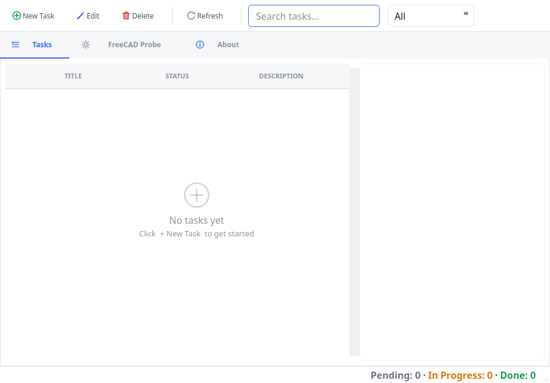

# Your First Project in 10 Minutes

This is a hands-on tutorial. By the end you will have created a project, edited a file,
run it, and read its output. If you can finish this chapter, you can use everything else
in the manual.

> [!NOTE] This is a learning exercise. Follow every step in order. Later chapters explain
> each feature in depth; here the goal is simply to succeed once, end to end.

## Step 1 — Create a new project

1. Open the **File** menu and choose **New Project from Template...**.
2. In the **Template:** dropdown, choose a template. For your first project, choose
   **Utility Script (utility_script)** — it is the simplest.
3. Click **OK**.


4. Type a **Project name**, for example `HelloChoreBoy`, and click **OK**.
5. Choose the folder where the project should be created, then confirm.

The project is created and opens automatically. The **Explorer** on the left shows your
new project's files, and the status bar shows the project name.

> [!NOTE] The templates are: **Qt App** (a windowed application), **Headless FreeCAD
> Tool** (a script that uses the FreeCAD engine without a graphical window), and
> **Utility Script** (a plain script). Templates are covered in detail in the chapter
> "Projects: open, create, import".

## Step 2 — Open a file

1. In the **Explorer**, find `main.py`.
2. Double-click it.

The file opens in the center editor area. The file's name appears on a tab at the top of
the editor.

> [!TIP] A single click opens a file in a temporary **preview** tab; a double-click (or
> editing the file) opens it permanently. Preview tabs are explained in the editing
> chapter.

## Step 3 — Edit the file

1. Click into the editor.
2. Find the line that prints a message and change the text, or add a new line such as:

   ```python
   print("Hello from ChoreBoy Code Studio!")
   ```

As soon as you type, the tab shows a small marker and the status bar changes to show the
file is modified (not yet saved).

## Step 4 — Save your changes

1. Press `Ctrl+S` (or choose **File > Save**).

The modified marker clears, and the status bar shows the file is saved. Your change is
now written to disk.

## Step 5 — Run the project

1. Press `F5` to **Run Active File**, or press `Shift+F5` to **Run Project**.

The bottom panel switches to **Run Log**, and you see your program start and print its
output. A red **Stop** button appears in the toolbar while the program is running.


For a windowed (Qt) template, your program opens in its own separate window — for
example, the TaskTracker example below:



## Step 6 — Read the output and stop the run

- Everything your program prints appears in the **Run Log**.
- If your program keeps running (for example, a windowed app), press **Stop**
  (`Shift+F2`) or close its window to end the run.
- When the run ends, the status bar shows the final state: finished, failed, or
  terminated.

> [!TIP] If your program fails, the **Problems** panel opens and lists the error with a
> link you can click to jump straight to the offending line.

## You did it

You have completed the core loop that you will use every day:

1. open a file,
2. edit,
3. save,
4. run,
5. read the output,
6. repeat.

## If your first run fails

Do not worry — this is normal and easy to diagnose:

1. Look at the **Run Log** for the error message and traceback.
2. If the **Problems** panel opened, click the entry to jump to the offending line.
3. Common first-run issues:
   - **A typo** (for example, a misspelled name) — the traceback names the line; fix and
     re-run.
   - **No active file for `F5`** — use `Shift+F5` (Run Project), or open a file first.
   - **A windowed app "stays running"** — that is expected; close its window or press
     **Stop** (`Shift+F2`).
4. Fix the issue, save (`Ctrl+S`), and run again.

The chapter "Troubleshooting by symptom" covers many more cases.

## What you learned

In this one tutorial you used the complete core loop:

| Step | Feature | Chapter |
| --- | --- | --- |
| Create | Templates | "Projects: open, create, import" |
| Open & edit | Editor, tabs | "Editing files" |
| Save | Save + Local History | "Editing files", "Local History & recovery" |
| Run | Runner, Run Log | "Running code" |
| Read output | Run Log / Problems | "Running code", "Linting & the Problems panel" |
| Stop | Stop control | "Running code" |

Everything else in the manual builds on this loop.

## Where to go next

- Learn what every part of the window does in "A tour of the window".
- Learn the full project and template options in "Projects: open, create, import".
- Learn everything about running and stopping programs in "Running code".
- Follow a longer worked example in "Worked Tutorial: Build a Windowed (Qt) App".
