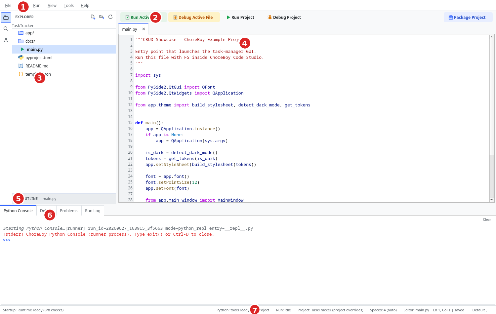

# A Tour of the Window

This chapter explains every part of the main window. Once you know what each area does,
the rest of the manual will make immediate sense.

The numbers below match the numbered badges in the screenshot above.

## 1. Menu bar

The menu bar holds every command, grouped into six menus:

| Menu | What it contains |
| --- | --- |
| **File** | Create, open, and save projects and files; settings; exit. |
| **Edit** | Undo/redo, find and replace, navigation, and code-editing helpers. |
| **Run** | Run, debug, stop, test, and the Python Console. |
| **View** | Layout reset, theme, zoom, and Markdown view modes. |
| **Tools** | Formatting, linting, plugins, dependencies, diagnostics. |
| **Help** | Getting Started, keyboard shortcuts, example project, version. |

Every command in these menus is documented in Part V, "Menu & command reference".

## 2. Run / Debug toolbar

The toolbar gives one-click access to the most common run actions:

- **Run Active File** — run the file in the current editor tab.
- **Debug Active File** — debug the current file.
- **Run Project** — run the project's configured entry file.
- **Debug Project** — debug the project entry file.
- **Package Project** — open the packaging wizard.

While a program is running, the toolbar shows a red **Stop** button instead. Buttons
that are not valid in the current state are disabled, so you always know what is
possible.

## 3. Explorer (left sidebar)

The left sidebar is your project navigator. It has three icons down its left edge that
switch between:

- **Explorer** — the file tree of your project (shown here).
- **Search** — find text across every file in the project.
- **Test Explorer** — discover and run your tests.

In the Explorer you can open files, and right-click to create, rename, duplicate, move
to trash, copy paths, and more. File management is covered in "The project tree & file
management".

## 4. Editor (center)

The center area is where you read and write code. It uses tabs, so you can keep several
files open at once. Each tab shows:

- the file name,
- a marker when the file has unsaved changes,
- a close button.

The editor provides syntax highlighting, code completion, go-to-definition, find and
replace, and more. Editing is covered in "Editing files" and "Navigation & search".

## 5. Outline

Below the Explorer, the **Outline** panel lists the symbols (functions, classes, and
similar) in the file you are currently editing. Click an entry to jump straight to it.
You can collapse the Outline to make more room for the file tree.

## 6. Bottom panels

The bottom of the window holds four tabbed panels that are essential for running and
diagnosing your code:

| Panel | Purpose |
| --- | --- |
| **Python Console** | An interactive Python prompt (REPL) that runs in a separate process. |
| **Debug** | The debugger's variable inspector, call stack, and watches. |
| **Problems** | Errors and warnings from linting and failed runs, with jump-to-source. |
| **Run Log** | Live output from your running program, plus saved per-run logs. |

The application switches to the most relevant panel automatically — for example, to
**Run Log** when you start a run, or to **Problems** when a run fails.

## 7. Status bar

The status bar along the bottom is a compact dashboard. Reading left to right, it shows:

- **Runtime readiness** — for example, "Runtime ready (8/8 checks)". Click it to open
  the Runtime Center.
- **Python tooling status** — whether code tools loaded, and the active configuration
  source (for example, `pyproject`).
- **Run state** — idle, running, finished, failed, or terminated.
- **Project** — the open project's name; `(project overrides)` appears when the project
  has its own settings.
- **Editor position** — indentation, the active file, line and column, and saved state.
- **Active run target** — the configuration that Run Project will use (for example,
  `Default`). Click it to switch configurations.

## First things to try

To get oriented quickly, try these in order:

1. Press `Ctrl+P` and open a file — see how Quick Open fuzzy-matches names.
2. Watch the **status bar** as you move the cursor — note the line/column and saved state.
3. Switch the bottom panel between **Run Log**, **Problems**, and **Python Console**.
4. Open **View > Theme** and try Dark and a High Contrast mode.
5. Press `F5` to run, then `Shift+F2` to stop.

After these five, the layout will feel familiar.

## Hovering reveals more

Many controls have tooltips. Hover the runtime-readiness text, the run-target indicator,
and toolbar buttons to see what they do. The status bar's leftmost item is also a button —
click it to open the Runtime Center.

## Resizing and resetting the layout

You can drag the dividers (splitters) between the sidebar, editor, and bottom panels to
resize them. Your layout is remembered between sessions. To return to the default
arrangement, choose **View > Reset Layout**.

## Where to go next

Now that you know the window, continue into Part II to learn the everyday workflows,
starting with "Projects: open, create, import".
