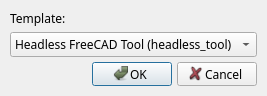

# Projects: Open, Create, Import

Everything in ChoreBoy Code Studio happens inside a **project**. This chapter explains
how to create projects from templates, open existing ones, import ordinary Python
folders, and what the project's metadata contains.

## What a project is

A project is simply a folder on disk. ChoreBoy Code Studio adds one small, visible
sub-folder named `cbcs/` that holds the project's metadata and logs. Everything else in
the folder is your own code and files.

Because a project is just a folder, you can copy, zip, back up, and inspect it with
ordinary tools. There is no hidden database.

> [!NOTE] The `cbcs/` folder uses a normal, visible name on purpose. Hidden
> (dot-prefixed) folders are unreliable on ChoreBoy, so the application keeps all of its
> project data in plain sight.

## Creating a project from a template

1. Choose **File > New Project from Template...**.
2. Pick a template from the **Template:** dropdown.
3. Click **OK**, enter a **Project name**, and choose a location.

### The available templates

| Template | Use it for | What you get |
| --- | --- | --- |
| **Qt App** (`qt_app`) | Windowed applications | A starter PySide2/Qt window with logging and error handling. |
| **Headless FreeCAD Tool** (`headless_tool`) | Backend tools using the FreeCAD engine without a window | A script that uses `import FreeCAD` along headless-safe paths. |
| **Utility Script** (`utility_script`) | Simple scripts and automation | A minimal, runnable script that prints output. |

Every template includes a working entry point, example logging, example error handling,
valid project metadata, and a short README explaining how to run it.

> [!TIP] Not sure which to choose? Start with **Utility Script**. You can always create
> another project later.

## Opening an existing project

1. Choose **File > Open Project...** (`Ctrl+O`).
2. Select the project folder.

The project loads in place — the application does not restart. The Explorer fills with
your files and the status bar shows the project name.

### Open Recent

Choose **File > Open Recent** to reopen a project you used before. The welcome screen
also lists recent projects, with a search box to filter them.

> [!NOTE] If a recent project's folder has moved or been deleted, the application skips
> it gracefully instead of failing.

## Importing an ordinary Python folder

You do not need a project that was created by ChoreBoy Code Studio. You can open **any**
folder that contains Python files:

1. Choose **File > Open Project...**.
2. Select the folder.

If the folder has no `cbcs/project.json` yet but contains Python files, the application
creates one automatically with sensible defaults and an inferred entry point. From then
on, that file is the project's metadata.

## Loading the example project

To explore a complete, runnable application, choose **Help > Load Example Project...**.
This copies the built-in CRUD example (the TaskTracker used throughout this manual) into
a folder you choose and opens it. The example does not appear in the New Project
template list — it is only available through the Help menu.

## Project metadata: `cbcs/project.json`

Each project's identity and run settings live in `cbcs/project.json`. It is plain,
human-readable JSON. The main fields are:

| Field | Meaning |
| --- | --- |
| `name` | The project's display name. |
| `project_id` | A stable identifier used by features such as Local History. |
| `schema_version` | The metadata format version. |
| `default_entry` | The file that **Run Project** runs (defaults to `main.py`). |
| `working_directory` | The directory runs start in (defaults to the project root). |
| `template` | Which template the project was created from. |
| `default_argv` | Default command-line arguments for Run Project. |
| `env_overrides` | Environment variables applied to runs. |
| `run_configs` | Saved named run configurations. |
| `project_notes` | Free-form notes you can keep with the project. |

You can edit this file directly, but most fields are easier to change through the
application — for example, **Set as Entry Point** in the tree, or the Run Configurations
dialog. The complete schema is in Part V, "File & folder reference".

## A worked example: import an existing Python folder

Suppose a colleague gives you a plain folder of Python files (no `cbcs/` folder) on a USB
drive:

1. Copy the folder onto the appliance.
2. In Code Studio, choose **File > Open Project...** and select the folder.
3. Because the folder has Python files but no `cbcs/project.json`, the application creates
   one automatically with sensible defaults and an inferred entry point.
4. The project opens normally — browse files, run, and edit as usual.

From then on, the generated `cbcs/project.json` is the project's metadata. If the inferred
entry point is wrong, right-click the correct file and choose **Set as Entry Point**.

## Setting up a `src/` layout

If the imported project keeps its package under `src/`, mark that folder as a **Sources
Root** (right-click it in the Explorer). This makes `import yourpackage` resolve correctly
in both diagnostics and runs, without adding `sys.path` hacks to your code. See "The
project tree & file management" and "Code intelligence".

## Closing or switching projects

Open another project at any time with **File > Open Project...** or **Open Recent**. The
new project replaces the current one in the same window. To work on two projects side by
side, use **File > New Window** (`Ctrl+Shift+N`).

## Where to go next

- Manage the files inside your project in "The project tree & file management".
- Set up how the project runs in "Running code".
