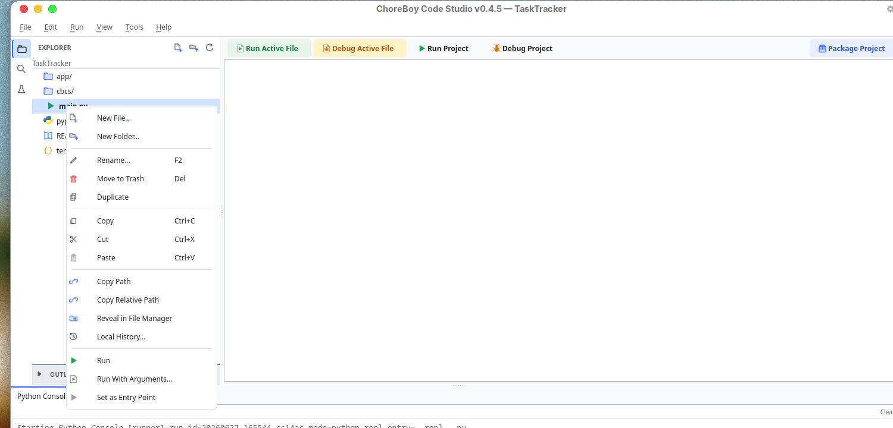

# The Project Tree & File Management

The **Explorer** (the file tree on the left) is where you browse and manage your
project's files. This chapter covers every file operation available there.

## Browsing files

- Click a folder to expand or collapse it.
- Single-click a file to open it in a temporary **preview** tab.
- Double-click a file to open it in a permanent tab.

The Explorer is one of three sidebar views. Use the icons on the far left edge to switch
between **Explorer**, **Search**, and **Test Explorer**.

## The right-click menu

Right-click any file or folder in the tree to open its context menu. This is the fastest
way to manage files.

| Action | Shortcut | What it does |
| --- | --- | --- |
| **New File...** | — | Create a new file in the selected folder. |
| **New Folder...** | — | Create a new sub-folder. |
| **Rename...** | `F2` | Rename the item. |
| **Move to Trash** | `Del` | Move the item to the trash (recoverable). |
| **Duplicate** | — | Make a copy of the item. |
| **Copy** | `Ctrl+C` | Copy the item to the clipboard. |
| **Cut** | `Ctrl+X` | Cut the item to the clipboard. |
| **Paste** | `Ctrl+V` | Paste a copied/cut item into the selected folder. |
| **Copy Path** | — | Copy the item's absolute path. |
| **Copy Relative Path** | — | Copy the item's path relative to the project root. |
| **Reveal in File Manager** | — | Open the item's folder in the system file manager. |
| **Local History...** | — | Open the Local History for the selected file. |
| **Run** | — | Run the selected `.py` file (no arguments). |
| **Run With Arguments...** | — | Run the file with custom arguments. |
| **Set as Entry Point** | — | Make this file the project's entry file for Run Project. |

> [!IMPORTANT] **Move to Trash** does not delete immediately. Items go to a recoverable
> trash, and you are asked to confirm. This protects you from accidental loss.

## Moving files by dragging

You can drag a file or folder onto another folder in the tree to move it. The tree
refreshes to show the result.

## When you move or rename a Python file

If you move or rename a Python module that other files import, ChoreBoy Code Studio can
update those imports for you. The first time this happens you are asked how to handle it:

- **Ask every time** (the default) — you are prompted on each move.
- **Always** — imports are updated automatically from now on.
- **Never** — imports are never rewritten automatically.

Import rewrites are previewed before they are applied. You can change this policy later
in Settings.

> [!NOTE] This is covered in detail, including the preview, in "Code intelligence".

## Marking a folder as a Sources Root

If your project keeps its packages under a folder such as `src/`, you can tell the
application to treat that folder as an import root. Right-click the folder and choose the
**Sources Root** option. The folder is then labelled `[source root]`, and imports
beneath it resolve correctly in both diagnostics and runs — with no `sys.path` hacks in
your code.

## Hidden and excluded files

Some files are hidden from the Explorer by default to reduce clutter — for example, the
vendored dependencies folder (`vendor/`). You can control what is hidden in
**Settings > Files** by editing the exclude patterns (for example, `*.sqlite3` or
`__pycache__`). See "Every settings tab & field".

> [!TIP] If you need to browse a normally-hidden folder such as `vendor/`, remove its
> pattern from the file excludes in Settings.

## Cut, copy, paste, and duplicate

These behave like a file manager:

- **Copy** (`Ctrl+C`) then **Paste** (`Ctrl+V`) into a folder makes a copy there.
- **Cut** (`Ctrl+X`) then **Paste** moves the item.
- **Duplicate** makes a copy next to the original (useful for "save a variant").

After any of these the tree refreshes to show the result.

## Recovering from the trash

**Move to Trash** does not destroy a file — it moves it to a recoverable trash with a
confirmation. If you change your mind, deleted items remain recoverable; for files that
had history, you can also restore them through **File > Open Global History...** (see
"Local History & recovery").

> [!IMPORTANT] Prefer **Move to Trash** over permanent deletion. Combined with Local
> History, it means an accidental delete is almost always recoverable.

## A worked example: reorganize into a package

Suppose you started with everything in the project root and want to move `helpers.py` into
a new `app/` package:

1. Right-click the root and choose **New Folder...**, name it `app`.
2. Drag `helpers.py` onto the `app` folder (or Cut it and Paste into `app`).
3. If other files import it, Code Studio offers to update those imports. Choose **Ask
   every time** (default), review the previewed rewrite, and apply it.
4. Run your project to confirm everything still imports correctly.

Because the move is tracked, `helpers.py` keeps its Local History across the rename, and
the import rewrite is recorded as one grouped history transaction.

## Reserved names

Two top-level names are reserved for the application: `cbcs/` (project metadata) and
`vendor/` (third-party packages). Avoid using these names for your own folders.

## Where to go next

- Open and edit files in "Editing files".
- Recover a deleted or earlier version of a file in "Local History & recovery".
