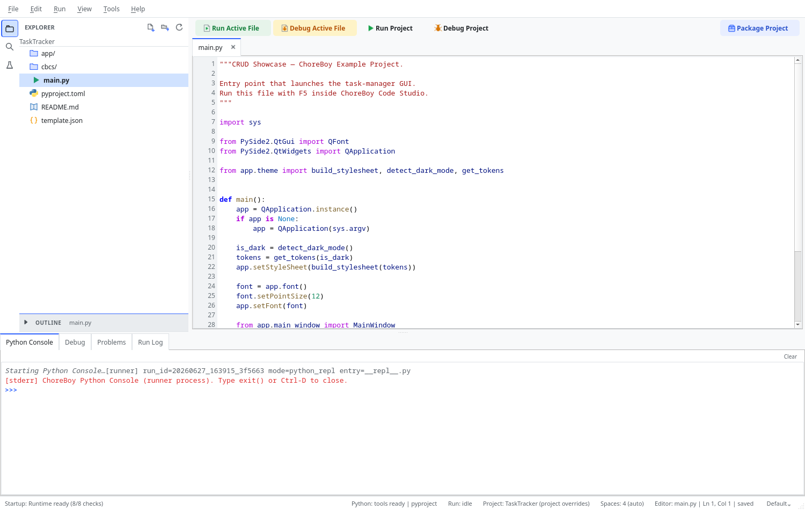

# Editing Files

This chapter covers the editor itself: tabs, saving, indentation, comments, zoom, and
the editing helpers built into ChoreBoy Code Studio.

## Tabs and the editor area

Open files appear as tabs across the top of the editor. Each tab shows the file name, a
close button, and a small marker when the file has unsaved changes.

### Preview tabs

To keep your workspace tidy, the editor uses **preview** tabs:

- A **single click** on a file in the Explorer opens it in a preview tab (shown in
  italics). Opening another file in preview replaces it, so casual browsing never piles
  up dozens of tabs.
- A **double click**, or **editing the file**, promotes the preview into a permanent
  tab.

You can turn preview tabs off in **Settings > Editor** (`enable_preview`). When off,
every file opens in a permanent tab.

## Saving your work

| Command | Shortcut | Effect |
| --- | --- | --- |
| Save | `Ctrl+S` | Save the active file. |
| Save All | `Ctrl+Shift+S` | Save every modified file. |

When you save, the modified marker clears and the status bar shows the file as saved.

### Autosave drafts and recovery

ChoreBoy Code Studio continuously protects your unsaved work with **autosave drafts**.
Drafts are written to a recovery store, debounced so they do not churn the disk on every
keystroke. They do **not** overwrite your source file.

- If the application closes unexpectedly, you can recover your unsaved text the next time
  you open the file (see "Local History & recovery").
- You can also enable **File > Auto Save** to save automatically.

> [!IMPORTANT] Saving is always authoritative. **Save** writes the file and records a
> Local History checkpoint; a draft never silently replaces what you explicitly saved.

## Indentation

The editor respects per-project indentation settings (see "Every settings tab & field"):

- **Indent style** — spaces or tabs.
- **Indent size** / **Tab width** — how wide indentation is.
- **Detect indentation from file** — match the existing file's style automatically.

The status bar shows the active indentation, for example `Spaces: 4 (auto)`.

Use these commands while editing:

| Command | Shortcut | Effect |
| --- | --- | --- |
| Indent | `Tab` | Increase indentation of the selected lines. |
| Outdent | `Shift+Tab` | Decrease indentation. |
| Toggle Comment | `Ctrl+/` | Comment or uncomment the selected lines. |

## Undo and redo

| Command | Shortcut |
| --- | --- |
| Undo | `Ctrl+Z` |
| Redo | `Ctrl+Shift+Z` |

## Zooming the editor font

| Command | Shortcut |
| --- | --- |
| Zoom In | `Ctrl+=` |
| Zoom Out | `Ctrl+-` |
| Reset Zoom | `Ctrl+0` |

Zoom changes the editor font size for comfortable reading; it does not change your saved
settings permanently unless you adjust the font size in Settings.

## Pasting flattened Python code

Sometimes code copied from a PDF or web page loses its indentation, leaving everything at
the left margin. ChoreBoy Code Studio can repair this:

- If you paste flattened Python, an inline hint offers **Re-indent**, **Always**, and a
  dismiss button.
- You can also right-click and choose **Paste and Re-indent (Flat Python)**
  (`Ctrl+Alt+V`), or select flattened lines and choose **Re-indent Selection (Flat
  Python)**.
- A single **Undo** reverts the re-indent to the literal paste.

Turn on automatic repair (for high-confidence cases) with **Settings > Editor >
Auto re-indent flat-Python pastes**.

## Syntax highlighting

The editor highlights Python and many other languages (JSON, TOML, INI/desktop, HTML,
CSS, Markdown, YAML, JavaScript, Bash, SQL, XML). Highlighting is role-aware: imports,
parameters, class names, and constructors are coloured distinctly.

- Override the language for a file with **Tools > Set Language Mode...**.
- Return to automatic detection with **Tools > Clear Language Override**.
- Inspect how a token is highlighted with **Tools > Inspect Token Under Cursor**.

> [!NOTE] For very large files, the editor automatically reduces highlighting work to
> keep typing responsive. This is configurable in **Settings > Intelligence**.

## Where to go next

- Find and jump around your code in "Navigation & search".
- Get completion, hover, and rename in "Code intelligence".
