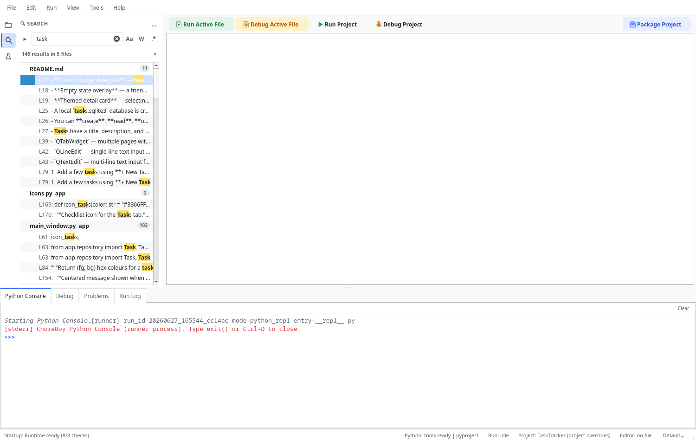
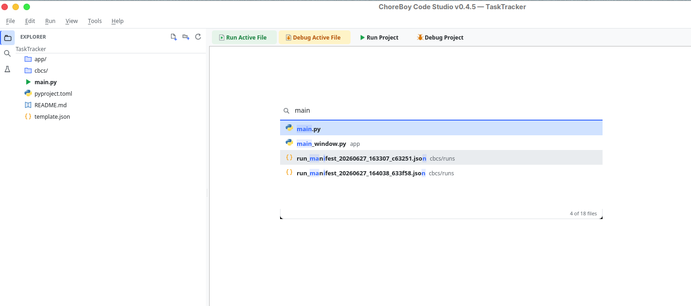

# Navigation & Search

This chapter covers every way to find text and move quickly around your project: in-file
search, project-wide search, quick file opening, and symbol navigation.

## Find and replace in the current file

| Command | Shortcut | What it does |
| --- | --- | --- |
| Find | `Ctrl+F` | Open the find bar to search the active file. |
| Replace | `Ctrl+H` | Open find with a replace field. |
| Go To Line | `Ctrl+G` | Jump to a specific line number. |

The find bar supports case-sensitive, whole-word, and regular-expression matching, and
shows how many matches were found.

## Find in Files (project-wide search)

To search across every file in the project, choose **Edit > Find in Files**
(`Ctrl+Shift+F`). The sidebar switches to the **Search** view.

- Type your query at the top. Toggle case-sensitive (**Aa**), whole-word (**W**), and
  regular-expression (**.\***) matching with the buttons beside it.
- Results are grouped by file, with a count per file and the total at the top
  (for example, "145 results in 5 files").
- Click any result to jump straight to that line in the editor.

> [!NOTE] Search runs in the background and can be cancelled, so even large projects stay
> responsive. Very long or pathological regular expressions are bounded to protect the
> editor.

## Quick Open (jump to any file)

Press `Ctrl+P` to open **Quick Open**, then type part of a file name. ChoreBoy Code
Studio fuzzy-matches your text against every file in the project.

- The matched portions of each name are highlighted.
- Use the arrow keys to choose a result and press `Enter` to open it.
- A single click opens a preview; pressing `Enter` opens a permanent tab.

## Go to Symbol in File

Press `Ctrl+R` (**Tools > Go to Symbol in File**) to jump to a function or class within
the active file. Type to filter the list, then press `Enter`.

## The Outline panel

The **Outline** panel, below the Explorer, always lists the symbols in the file you are
editing. Click an entry to jump to it. The Outline updates as you edit.

## Go to Definition and Find References

These commands use real semantic analysis (see "Code intelligence"):

| Command | Shortcut | What it does |
| --- | --- | --- |
| Go To Definition | `F12` | Jump to where the symbol under the cursor is defined. |
| Find References | `Shift+F12` | List every place the symbol is used. |
| Show Hover Info | `Ctrl+Shift+I` | Show documentation for the symbol under the cursor. |
| Signature Help | `Ctrl+Shift+Space` | Show the call signature of the current function. |

## The find bar in detail

When you press `Ctrl+F`, a small find bar appears for the active file. It offers three
matching modes you can toggle independently:

| Toggle | Effect | Example |
| --- | --- | --- |
| **Aa** (case-sensitive) | Matches case exactly | `Task` matches `Task` but not `task`. |
| **W** (whole word) | Matches whole words only | `app` does not match `application`. |
| **.\*** (regular expression) | Treats the query as a regex | `def \w+\(` finds function definitions. |

The bar shows the number of matches and lets you step through them. Matches are
highlighted in the editor so you can see them in context.

> [!TIP] Regular-expression search is bounded for safety: extremely long or pathological
> patterns are limited so they cannot freeze the editor. Normal patterns are unaffected.

## Replacing safely

`Ctrl+H` opens the find bar with a replace field. You can:

- replace the current match and move to the next, or
- replace all matches at once.

Because replace operates on the active file's buffer, you can always **Undo** (`Ctrl+Z`) a
replacement, and the change is only written to disk when you **Save**.

> [!IMPORTANT] In-file Replace changes only the current file. To change text across many
> files, use Find in Files to locate occurrences, then edit each file deliberately — this
> keeps multi-file changes reviewable. For symbol renames specifically, prefer **Rename
> Symbol** (`F2`), which is semantic and previewed (see "Code intelligence").

## Working with Find in Files results

The Search view groups results by file with a per-file count and a grand total. To work
through them efficiently:

1. Click a result to open that file at the matching line.
2. Refine the query with the **Aa**, **W**, and **.\*** toggles to narrow results.
3. Re-run by editing the query; results update in the background so the editor stays
   responsive even on large projects.

## Navigation scenarios

- **"Where is this function defined?"** Put the cursor on the call and press `F12`.
- **"What uses this function?"** Put the cursor on it and press `Shift+F12`.
- **"Jump to a function in this file."** Press `Ctrl+R` and type its name.
- **"Open that file I was just in."** Press `Ctrl+P` and type a few letters of its name.
- **"Go to a specific line from a traceback."** Press `Ctrl+G` and type the line number,
  or click the entry in the Problems panel.

## Where to go next

- Understand how definitions and references are resolved in "Code intelligence".
- Manage many open files efficiently with preview tabs (see "Editing files").
