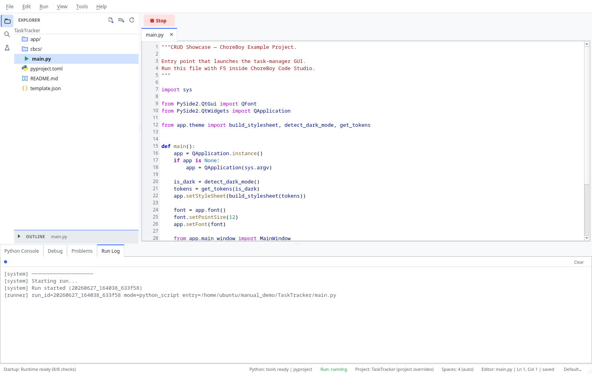
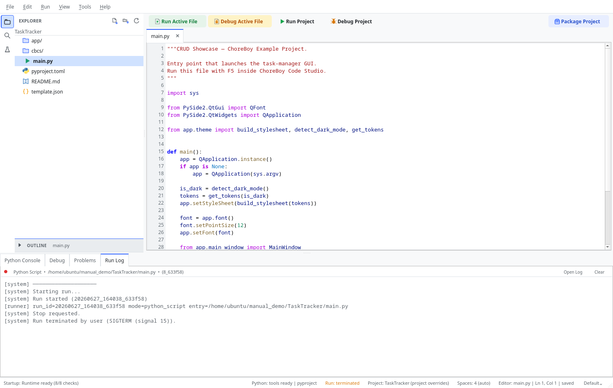
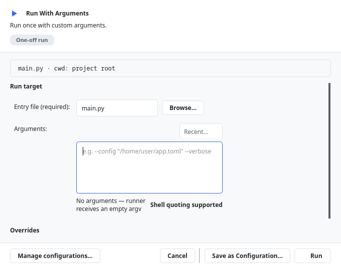
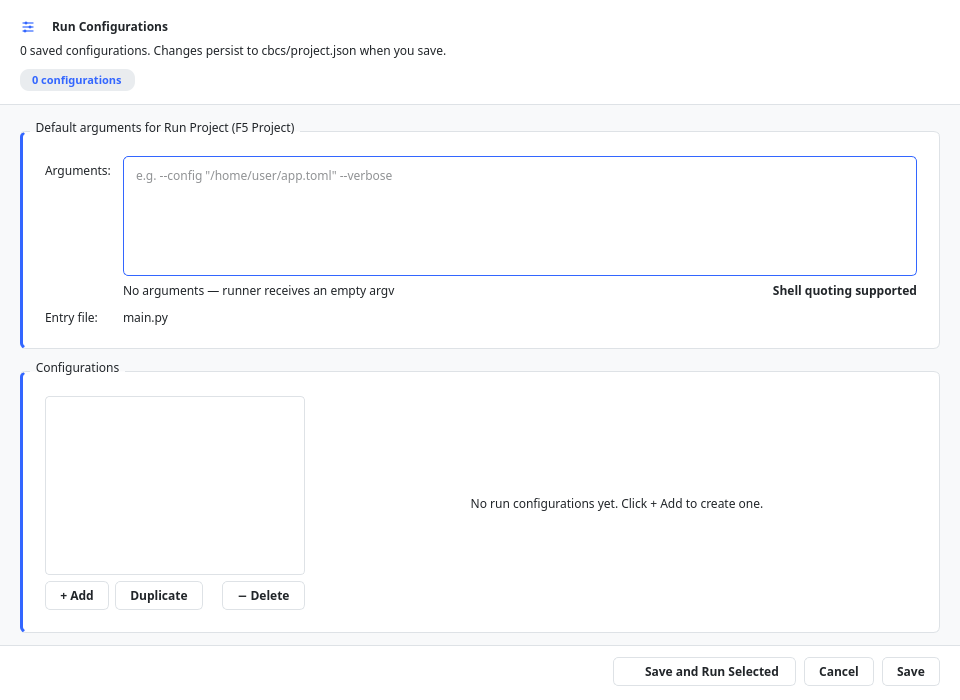

# Running Code

This chapter explains every way to run your program, how to read its output, how to stop
it, and how to pass arguments and environment settings to a run.

Remember the core idea from Chapter "What is ChoreBoy Code Studio?": your program always
runs in a **separate runner process**, so the editor stays responsive and a crash in
your code never takes down the editor.

## Run Active File vs Run Project

There are two everyday ways to run:

| Command | Shortcut | What it runs |
| --- | --- | --- |
| **Run Active File** | `F5` | The file currently shown in the editor. |
| **Run Project** | `Shift+F5` | The project's configured **entry file** (and active run configuration). |

Use **Run Active File** when you are working on a specific script. Use **Run Project**
when you want to launch your application the "real" way, through its entry point.

> [!NOTE] The project entry file is set in `cbcs/project.json` (`default_entry`). You can
> change it by right-clicking a file in the Explorer and choosing **Set as Entry Point**,
> or by editing a run configuration.

## The Run Log

When a run starts, the bottom panel switches to **Run Log**. It shows:

- `[system]` lines that mark the run starting, stopping, and finishing;
- `[runner]` lines that report the run id, mode, and entry file;
- everything your program prints to standard output and standard error.



While a run is active, the toolbar shows a red **Stop** button and the status bar shows
**Run: running**.

> [!TIP] The Run Log also keeps a saved copy of each run on disk, under the project's
> `cbcs/logs/` folder. Use the **Open Log** link in the Run Log header to open the saved
> file. Logs survive even after you close the application.

## Stopping and restarting a run

- **Stop** (`Shift+F2`) ends the current run. The Run Log records that the run was
  terminated by the user, and the status bar shows **Run: terminated**.
- **Restart** (`Ctrl+Shift+F2`) stops the current run and starts it again.



Closing a windowed program's own window also ends its run.

> [!IMPORTANT] Always use **Stop** for long-running or windowed programs. Because your
> code runs in a separate process, Stop cleanly terminates that process and any children
> it started.

## Understanding the final run state

When a run ends, the status bar and Run Log report the outcome:

| Outcome | Meaning |
| --- | --- |
| **finished** | The program exited normally (exit code 0). |
| **failed** | The program exited with an error (non-zero exit code). The Problems panel opens with details. |
| **terminated** | You stopped the run, or it was ended by a signal. |

## Passing arguments, working directory, and environment

ChoreBoy Code Studio has no terminal, but you can still give your program command-line
arguments (`sys.argv`), a working directory, and environment variables. There are three
ways to do this, from quickest to most permanent.

### One-off: Run With Arguments...

Choose **Run > Run With Arguments...** (`Ctrl+Shift+A`).



This dialog lets you set, for a single run:

- **Entry file** — which file to run.
- **Arguments** — command-line arguments, written with normal shell-style quoting. A
  live preview shows exactly how the text splits into separate arguments. For example,
  `--path "/tmp/a b/c.toml" --flag` becomes three arguments, with the space inside the
  quoted path preserved.
- **Working directory** and **Environment overrides** (in an Advanced section).

A **Recent...** dropdown remembers your last several argument strings. This dialog runs
once and does **not** change your project's saved settings.

> [!TIP] To turn a one-off command into a saved configuration, click **Save as
> Configuration...** instead of **Run**.

### Persistent: Run Configurations...

Choose **Run > Run Configurations...** to create named configurations that are saved in
`cbcs/project.json`.



Each configuration has a **Name**, **Entry file**, **Arguments**, **Working directory**,
and **Environment overrides**. Use **Add**, **Duplicate**, and **Delete** to manage them,
then **Save**.

The same dialog has a **Default arguments for Run Project** field, which sets the
arguments used by **Run Project** (`Shift+F5`) when no named configuration is active.

### The active run target (status bar)

The right side of the status bar shows the active run target — `Default`, or the name of
the configuration that **Run Project** will use. Click it to:

- switch between named configurations,
- open **Run With Arguments...**,
- open **Edit Configurations...**.

While a named configuration is active, both **Run Project** and **Debug Project** use
that configuration's entry file, arguments, working directory, and environment.

### Running a file from the project tree

Right-click a `.py` file in the Explorer to find **Run** (no arguments) and **Run With
Arguments...**, with the dialog pre-filled for that file.

## A worked example: arguments, environment, and a saved config

Suppose your program reads a config path argument and a `DEBUG` environment variable:

```python
import os, sys
print("config:", sys.argv[1] if len(sys.argv) > 1 else "(default)")
print("debug:", os.environ.get("DEBUG", "0"))
```

To run it once with custom values:

1. **Run > Run With Arguments...** (`Ctrl+Shift+A`).
2. In **Arguments**, type `--config "/tmp/my settings/app.toml"`. The "Parsed argv"
   preview shows two tokens, with the quoted path kept intact (the space is preserved).
3. Expand **Advanced**, set **Environment overrides** to `DEBUG=1`.
4. Click **Run**. The Run Log shows the config path and `debug: 1`.

To make this repeatable, click **Save as Configuration...**, name it `Debug run`, and
**Save**. Later, pick `Debug run` from the status-bar run-target indicator and press
`Shift+F5` — it reuses the entry, argv, working directory, and environment. The
configuration is stored in `cbcs/project.json` under `run_configs`.

> [!TIP] If you type an unbalanced quote in the Arguments field, the dialog shows an
> inline error and disables Run until you fix it — so you never launch with mis-parsed
> arguments.

## Output panel behavior

By default, the application is helpful about which panel it shows:

- It switches to **Run Log** when a run produces output.
- It switches to **Problems** when a run fails.

You can turn these behaviors off in **Settings > Output** (see "Every settings tab &
field").

## Where to go next

- To pause your program and inspect variables, see "Debugging".
- To experiment with short snippets, see "The Python Console (REPL)".
- For FreeCAD-specific run limitations, see "FreeCAD workflows & headless limits".
