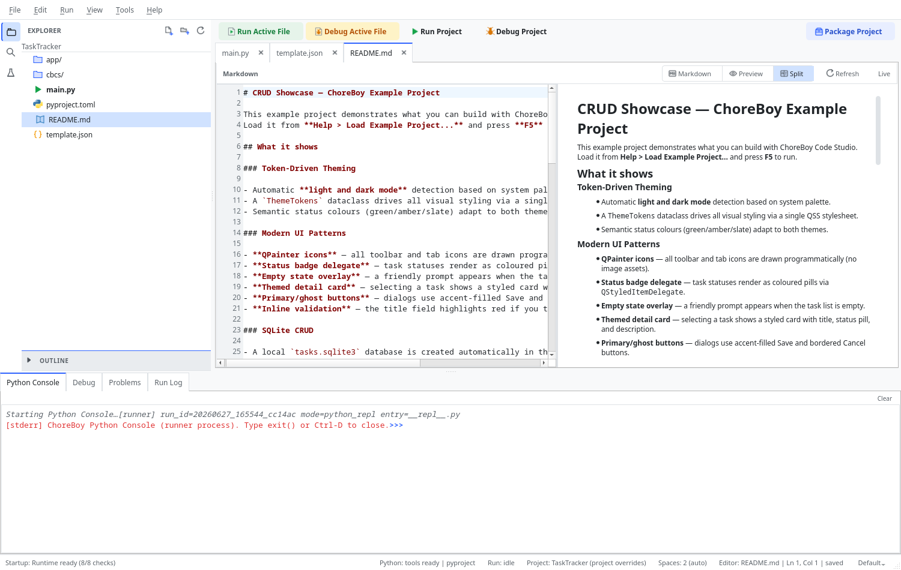

# Working with Markdown Files

ChoreBoy Code Studio can edit and preview Markdown documents (`.md` files) such as your
project's `README.md`. This chapter covers the Markdown view modes and their behavior.

## Opening a Markdown file

Open any `.md` file the way you open any other file — from the Explorer or Quick Open. It
opens in a normal editor tab.

## View modes

A Markdown file has its own toolbar with view-mode buttons, also available under
**View > Markdown**:

| Mode | Menu command | Shortcut | What you see |
| --- | --- | --- | --- |
| **Markdown** (source) | Markdown: Show Source | — | The raw Markdown text only. |
| **Preview** | Markdown: Show Preview | — | The rendered document only. |
| **Split** | Markdown: Show Split View | `Ctrl+K, V` | Source and preview side by side. |
| Toggle preview | Markdown: Toggle Preview | `Ctrl+Shift+V` | Switch the preview on or off. |

In Split view, the rendered preview updates as you edit the source. The toolbar also has
a **Refresh** control and a **Live** toggle for the preview.

## Editing and saving

Markdown editing behaves like any other file:

- Editing the source marks the file modified.
- `Ctrl+S` saves it and clears the modified marker.
- Only one tab is used per file — switching between Source, Preview, and Split does not
  create duplicate tabs.

## Links in the preview

- Clicking a link to a local file (another `.md` or a source file) opens it through the
  normal file-opening workflow inside the editor.
- The preview does **not** execute embedded code or shell commands. It is a safe,
  read-only rendering.

## Large documents

Very large Markdown files can be expensive to render continuously. For big documents the
preview is refreshed manually (or via the Refresh control) rather than live, so the
editor stays responsive.

## Supported Markdown elements

The preview renders the common Markdown you will use in a `README.md` or notes: headings
(`#`, `##`), bold (`**...**`) and italic (`*...*`), bulleted and numbered lists, links
(`[text](url)`), inline code (`` `code` ``), fenced code blocks (triple backticks), and
pipe tables.

## Tips for good project docs

- Keep a `README.md` at the project root explaining what the project is and how to run it
  (the templates start you with one).
- Use headings so the document is scannable, and fenced code blocks for commands and
  snippets.
- Link to other files with relative links; they open inside the editor.

> [!TIP] This very manual is written in Markdown and built into HTML and PDF by a small
> pipeline. Plain Markdown files are a durable, portable way to keep documentation with a
> project.

## Themes

The Markdown preview — its text, links, code blocks, and toolbar — remains readable in
all theme modes, including the High Contrast modes.

## Where to go next

- Edit code files in "Editing files".
- Render this very manual: its chapters are Markdown, built into HTML and PDF (see the
  manual's own `README.md`).
