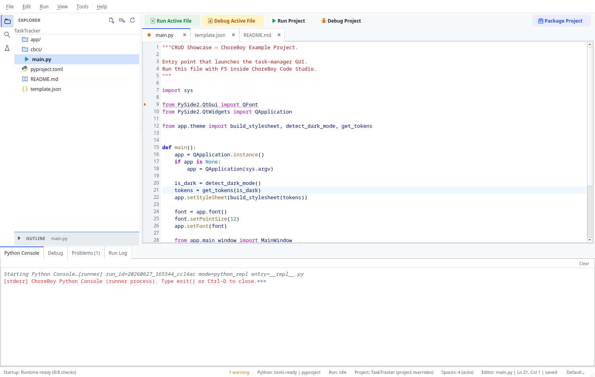

# Debugging

The debugger lets you pause your program, inspect variables, and step through code line
by line. This chapter explains how to set breakpoints, control a debug session, and
inspect program state — and how to fall back gracefully when stepping is not available.

## Run vs Debug

A **debug** run is like a normal run, but the debugger can pause your program at
breakpoints so you can inspect it. As with normal runs, your code executes in a separate
process, and program output still appears in the **Run Log**. The **Debug** panel is
reserved for the inspector: stack, variables, and watches.

| Command | Shortcut |
| --- | --- |
| Debug Active File | `Ctrl+F5` |
| Debug Project | `Ctrl+Shift+F5` |
| Debug Current Test | `Ctrl+Alt+Shift+T` |
| Rerun Last Debug Target | `Ctrl+Shift+F6` |

## Step 1 — Set breakpoints

Click in the **gutter** (the margin left of the line numbers) next to a line, or place
the cursor on a line and press `F9` (**Toggle Breakpoint**). A red marker shows the
breakpoint.



Breakpoints can be more than simple stops. Open a breakpoint's properties to add:

- a **condition** (pause only when an expression is true),
- a **hit count** threshold (pause only after the line is reached N times),
- an enabled/disabled state (keep the breakpoint but turn it off).

To clear every breakpoint, use **Run > Remove All Breakpoints**.

## Step 2 — Start debugging

Press `Ctrl+F5` (active file) or `Ctrl+Shift+F5` (project). The program starts under
debugger control.

## Step 3 — Use the Debug panel

Open the **Debug** bottom tab. While paused you can:

- **Continue** (`F6`) — resume until the next breakpoint.
- **Pause** (`Ctrl+F6`) — pause a running program.
- **Step Over** (`F10`) — run the current line without entering calls.
- **Step Into** (`F11`) — enter the function called on the current line.
- **Step Out** (`Shift+F11`) — run until the current function returns.

The panel also shows:

- **threads** and the **call stack** (select a frame to jump the editor to that line);
- **scopes** — `locals`, `globals`, and exception state when relevant;
- **watch expressions** you add yourself;
- nested variables (lists, dicts, objects) that expand on demand, with large values
  truncated so the UI stays responsive.

Selecting a stack frame updates the current-line highlight in the editor.

## Step 3a — Watches and variable inspection

While paused:

1. Add a **watch expression** in the Debug panel.
2. Expand scopes or nested variables as needed.
3. Select a different stack frame to see values at that level.

Watch results are evaluated against the selected paused frame. Watch evaluation is
read-only and safe by default.

## Step 3b — Exception stops

The debugger can pause when an exception is raised or goes uncaught. Configure this with
**Run > Exception Stop Settings...** — for example, stop on uncaught exceptions but not on
caught ones. When the debugger stops on an exception, it shows the exception details as
the stop reason.

## Step 4 — Stop

Use **Stop** (`Shift+F2`) when you are finished or if execution is stuck.

## Debugging unsaved changes

You can debug a file with unsaved edits. The runner executes a snapshot of your unsaved
buffer, but editor navigation and the current-line highlight still point at your real
project file, so breakpoints and stepping stay coherent.

## Important note on debug availability

Breakpoint pausing and stepping depend on the runtime environment. On some setups the
structured debug channel may not deliver pause events reliably.

> [!LIMITATION] If breakpoints do not pause where you expect, this can be an
> environment limitation, not a problem with your code or your breakpoints. The
> ChoreBoy appliance and your development machine may behave differently here.

### Fallback workflow

If stepping is not behaving, you can still diagnose most issues quickly:

1. Confirm the breakpoint is on executable code (not a blank or comment line).
2. Save the file before starting debug.
3. Confirm you started the correct mode (Active File vs Project).
4. Use a normal **Run** and read the **Run Log** and **Problems** panel. A traceback
   usually tells you exactly what went wrong and where.

## Worked example: a conditional breakpoint

Suppose a loop misbehaves only on a particular item:

```python
for index, task in enumerate(tasks):
    process(task)   # fails only for one task
```

Instead of stepping through every iteration:

1. Set a breakpoint on the `process(task)` line (`F9`).
2. Open the breakpoint's properties and add a **condition**, for example
   `task.name == "broken"`.
3. Start debugging. Execution runs full speed and pauses **only** when the condition is
   true — dropping you exactly at the problematic item.

A **hit count** works similarly: set it to pause only after the line has been reached a
certain number of times.

## Worked example: watch expressions

While paused, you often want to track a value as you step:

1. In the **Debug** panel, add a watch expression such as `len(tasks)` or
   `task.status`.
2. Step with `F10`/`F11`. The watch re-evaluates against the current paused frame after
   each step.
3. Switch frames in the call stack to evaluate the same watch at a different level.

Watch evaluation is read-only by default, so inspecting values does not change program
state.

## Worked example: stop on an exception

To catch where an exception originates:

1. Open **Run > Exception Stop Settings...** and enable **stop on uncaught exceptions**.
2. Debug the program. When an uncaught exception occurs, the debugger pauses at the point
   it propagated from, with the exception details shown as the stop reason.
3. Inspect the stack and locals to see what led to it, then stop the session.

This is often faster than reading a traceback after the fact, because you can inspect live
state at the moment of failure.

## FreeCAD macros

Debug runs execute headless. If your code needs an open FreeCAD document
(`FreeCAD.ActiveDocument`) or the FreeCAD GUI, edit and save it in Code Studio, then run
the macro inside FreeCAD itself. See "FreeCAD workflows & headless limits".

## Where to go next

- Experiment interactively in "The Python Console (REPL)".
- Diagnose failures with logs in "Diagnostics & support tools".
