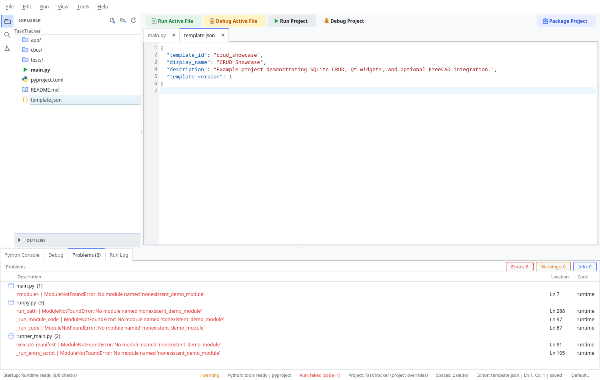

# Linting & the Problems Panel

ChoreBoy Code Studio checks your Python for problems as you work and lists them in the
**Problems** panel. This chapter explains linting, the Problems panel, and how to
configure rules.

## The Problems panel

The **Problems** panel is one of the bottom tabs. It lists issues found by the linter and
by failed runs, grouped by file. Each entry shows a description, the file, the line and
column, and a code (for example, `PY220`).



- Click any entry to jump straight to the offending line in the editor.
- The panel header summarizes counts: errors, warnings, and info.
- The application switches to the Problems panel automatically when a run fails (you can
  turn this off in **Settings > Output**).

In the editor itself, problems appear as colored squiggles under the affected code.

## Real-time vs on-demand

By default, diagnostics update **in real time** as you type (configurable in
**Settings > Intelligence > Real-time diagnostics**). You can also lint a file on demand
with **Tools > Lint Current File**.

## Choosing a linter provider

In **Settings > Linter** you can:

- **Enable Python linting** — turn linting on or off. When off, the provider and rule
  controls are disabled.
- **Provider** — choose the lint backend:
  - **Default (built-in)** — the built-in checks (rules with `PY###` codes).
  - **Pyflakes** — the Pyflakes checker (catches issues such as undefined names and
    unused imports).

Your provider choice persists across sessions and can be set per project.

## Customizing rules

For the built-in provider, you can adjust individual rules under **Settings > Linter >
Rule overrides**:

- **Disable** a rule you do not care about (for example, an "unused import" rule).
- Change a rule's **severity** (for example, make a rule a warning instead of an error).

In project scope, each override offers **Reset to Global** to drop the project-specific
value.

### Example built-in rule codes

| Code | Meaning (example) |
| --- | --- |
| `PY200` | Unresolved import (resolved using your project's source roots). |
| `PY220` | Unused import. |
| `PY230` | Unreachable statement. |

> [!NOTE] The exact rule set depends on the provider and version. Open the Linter settings
> to see the rules available in your build.

## Apply Safe Fixes

Some problems have automatic, safe fixes. Choose **Tools > Apply Safe Fixes (Current
File)** to apply them. Fixes that touch multiple files are previewed first (you can
require this in **Settings > Intelligence**).

## Analyze Imports

**Tools > Analyze Imports** checks the active file's imports specifically and reports
unresolved or problematic ones, distinguishing likely causes such as a missing project
module, a missing vendored dependency, or a module that is simply not available in the
runtime.

## A worked example: fixing a diagnostic

Suppose you write:

```python
import os
import sys


def greet(name):
    print(mesage)  # typo
```

The linter flags two things:

1. an **unused import** (`os` and `sys` are never used), and
2. an **undefined name** (`mesage` — a typo for `message`).

To fix them:

1. Open the **Problems** panel and read the entries; each shows the file, line, and a
   code.
2. Click the "undefined name" entry to jump to the `print(mesage)` line and correct the
   typo to a defined variable.
3. Remove the unused imports (or run **Tools > Apply Safe Fixes (Current File)** if a safe
   fix is offered).
4. Re-lint with **Tools > Lint Current File** (or just keep typing — real-time
   diagnostics update automatically).

## Reading severities

Diagnostics carry a severity that controls how they appear:

| Severity | Editor indicator | Meaning |
| --- | --- | --- |
| Error | Red squiggle | Likely a real bug or invalid code. |
| Warning | Yellow/orange squiggle | Style or potential issue. |
| Info | Subtle underline | Advisory note. |

You can change a built-in rule's severity, or disable it, under **Settings > Linter > Rule
overrides** (per project if you like). For example, you might set an "unused import" rule
to a warning instead of an error while prototyping.

## Tips

- If diagnostics feel noisy, reduce them per rule rather than turning linting off
  entirely.
- If imports under a `src/` layout are wrongly flagged as unresolved, mark the folder as a
  **Sources Root** (see "The project tree & file management").
- A clean Problems panel before you run saves time — fix what the linter catches first.

## Where to go next

- Fix formatting and import order in "Python formatting & imports".
- Understand how imports resolve in "Code intelligence".
- See diagnostics in support context in "Diagnostics & support tools".
