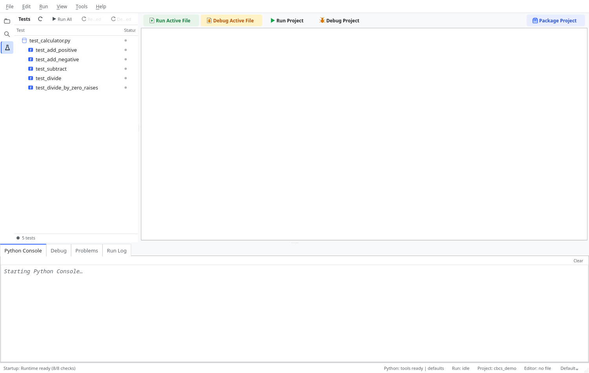
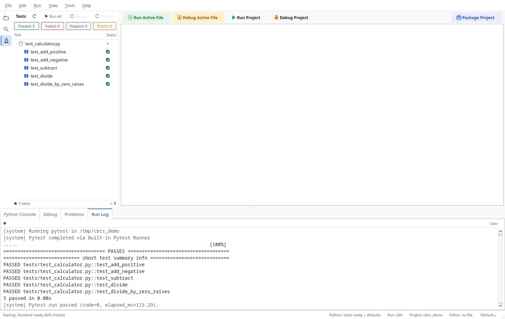

# The Testing Workflow

ChoreBoy Code Studio has an integrated **Test Explorer** for discovering and running
pytest tests, with results that persist between sessions. This chapter covers the testing
workflow end to end.

## Opening the Test Explorer

Choose **View > Show Test Explorer** (`Ctrl+Shift+X`), or click the Test Explorer icon in
the sidebar. It shows your tests as a tree.

## Discovering tests

The Test Explorer discovers pytest-compatible tests and organizes them by file, class,
and function. Each node shows its last-run status:

- not run,
- passed,
- failed,
- skipped.

The tree refreshes when you save test files.



> [!NOTE] Tests are discovered with pytest's collection. Tests live in files pytest
> recognizes (for example, `test_*.py` or `*_test.py`).

## Running tests

You can run tests at several scopes, from the Test Explorer's context menus or the Run
menu:

| Command | Shortcut | Scope |
| --- | --- | --- |
| Run Project Tests | `Ctrl+Shift+T` | Every test in the project. |
| Run Current File Tests | `Ctrl+Alt+T` | Tests in the active file. |
| Run Test at Cursor | — | The single test function at the cursor. |
| Debug Current Test | `Ctrl+Alt+Shift+T` | Debug the active file's tests. |
| Debug Failed Test | — | Debug the first previously failed test. |

Right-click a node in the Test Explorer to **Run** or **Debug** just that test, file, or
class.

## Reading results

- The Test Explorer updates each node's pass/fail/skip status after a run.
- Failures also appear in the **Problems** panel with jump-to-source, so you can go
  straight to the failing assertion.


- Test output appears in the **Run Log**, like any other run.

## Rerun failed and debug failed

After a run with failures:

- **Rerun Failed** re-runs only the tests that failed, which is much faster than
  re-running everything.
- **Debug Failed Test** launches the first failed test under the debugger so you can
  inspect why it failed.

## Results persist across sessions

When you close and reopen the project, the Test Explorer restores the last-run
pass/fail/skip status from persistent storage, so you keep your context.

## A worked test-driven loop

A productive loop with the Test Explorer:

1. Write a test that describes the behavior you want, for example:

   ```python
   from app.calc import add_all

   def test_add_all_sums_numbers():
       assert add_all([1, 2, 3]) == 6
   ```

2. Open the **Test Explorer** (`Ctrl+Shift+X`) and run the file's tests
   (`Ctrl+Alt+T`). The new test fails (red) because `add_all` does not exist yet.
3. Implement `add_all` until the test passes (green).
4. Use **Rerun Failed** to re-run only the red tests as you iterate — faster than running
   everything.
5. When a test fails unexpectedly, use **Debug Failed Test** to pause inside it and
   inspect values.

## Interpreting results

- **Green (passed):** the assertions held.
- **Red (failed):** an assertion failed or the test raised. The failure also appears in
  **Problems** with a link to the failing line, and the full output is in the **Run Log**.
- **Skipped:** the test was intentionally skipped (for example, a `pytest.mark.skip`).
- **Not run:** discovered but not yet executed.

## Organizing tests

- Put tests in a `tests/` folder or alongside code, in files pytest recognizes
  (`test_*.py` or `*_test.py`).
- Keep one behavior per test and give tests descriptive names; the Test Explorer shows
  those names, so good names make the tree readable.
- Separate pure logic from UI so the logic is easy to test; validate UI by running the
  app.

> [!NOTE] Discovery uses pytest. If your project keeps packages under `src/`, configure a
> **Sources Root** so test imports resolve (see "The project tree & file management").

## Themes

The Test Explorer's status indicators (pass/fail/skip) and selected/hovered states remain
readable in all theme modes, including High Contrast.

## Where to go next

- Debug a failing test in "Debugging".
- Diagnose environment problems in "Diagnostics & support tools".
