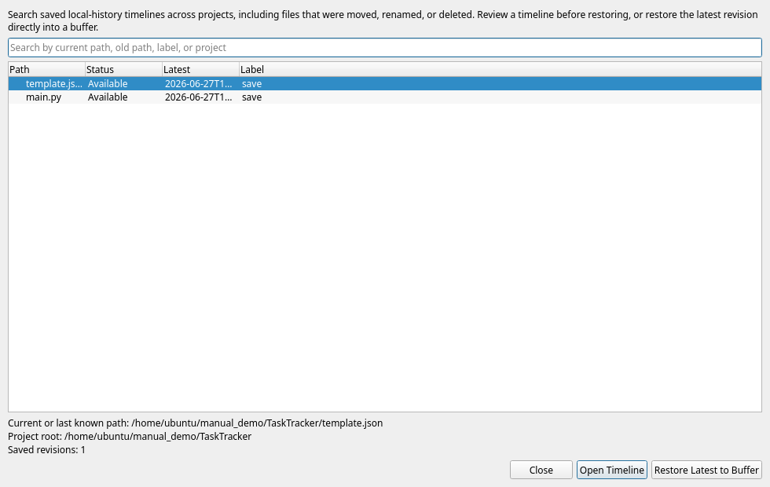

# Local History & Recovery

ChoreBoy Code Studio protects your work with two related safety nets: **autosave drafts**
that recover unsaved text after a crash, and **Local History** that keeps a timeline of
saved versions you can compare and restore. Neither relies on Git or a terminal.

## Two different safety nets

| Feature | Protects against | How it works |
| --- | --- | --- |
| **Autosave drafts** | Losing *unsaved* edits (crash, power loss) | Debounced drafts of dirty buffers, kept until you decide. |
| **Local History** | Losing or wanting back a *saved* version | Durable checkpoints created on save and other key moments. |

> [!IMPORTANT] Recovery always restores into the editor **buffer** first, never silently
> overwriting your file on disk. You review the recovered content and then decide whether
> to save.

## Crash recovery (drafts)

If the application closes unexpectedly while you had unsaved changes, the next time you
open the affected file you are offered recovery. Open the **Recovery Center**
(**File > Open Recovery Center...**) to:

- **compare** the draft against the saved file,
- **Restore Draft to Buffer** (then decide whether to save),
- keep the saved version and discard the draft.

### Deciding what happens to unsaved work on exit

When you exit with unsaved changes, the choices are explicit:

- **Save** — write the file (and record a checkpoint).
- **Discard Changes** — drop the draft; it will **not** reappear next launch.
- **Keep Unsaved Changes For Next Launch** — preserve the draft so the file reopens dirty,
  intentionally.
- **Cancel** — go back without exiting.

You can set the default behavior in **Settings > Editor > Exit behavior**.

## Local History (checkpoints)

ChoreBoy Code Studio records durable **checkpoints** at key moments:

- every successful save,
- explicit snapshots/labels,
- when you reload a file that changed on disk,
- before high-risk multi-file edits (such as a rename or import rewrite).

### Viewing and restoring

Right-click a file in the Explorer and choose **Local History...** (also available from
the editor). You can:

- see the list of checkpoints with timestamps and labels,
- **compare** a checkpoint with the current file or with another checkpoint (a diff),
- **Restore to Buffer** an older version (then save if you want to keep it).

Opening Local History never changes the file on disk.

## Multi-file changes are grouped

When a single action changes several files (for example, a semantic rename), Local
History records it as **one labeled transaction** that lists the affected files — not as a
scatter of unrelated per-file entries. You can restore the whole transaction
deterministically.

## Surviving move, rename, and delete

Local History follows a file's *identity*, not just its path:

- Moving or renaming a file in the Explorer keeps its earlier history.
- A **deleted** file remains recoverable. Use **File > Open Global History...** to search
  history across all files — including deleted ones — and restore them.

The Global History Restore dialog lists each tracked file with its current or last-known
path, status, latest revision time, and label. Select an entry and choose **Open
Timeline** to review its revisions, or **Restore Latest to Buffer** to bring back the most
recent version.

## Where history is stored, and limits

Local History is stored in the visible global app-state folder
(`~/choreboy_code_studio_state/history/`), not inside your project, so a deleted project
file can still be recovered.

You can tune retention in **Settings > Local History**:

| Setting | Default |
| --- | --- |
| Max checkpoints per file | 50 |
| Retention days | 30 |
| Max tracked file size | 1,000,000 bytes |
| Exclude patterns | (none) |

Files larger than the size limit, or matching an exclude pattern, are not tracked, and
the UI tells you clearly when history is intentionally not recorded.

## Where to go next

- Understand saving and drafts in "Editing files".
- Recover from other problems in "Troubleshooting by symptom".
