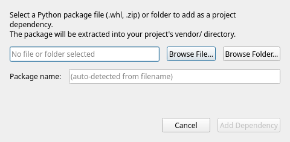
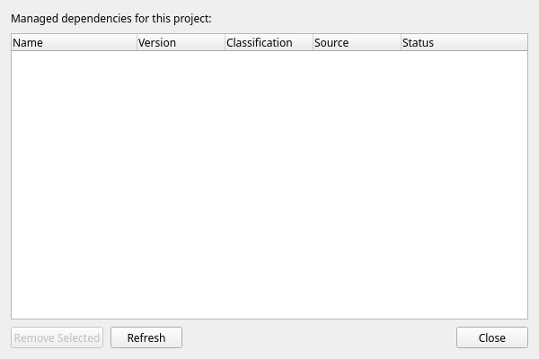

# Managing Dependencies

ChoreBoy has no internet access and no terminal, so you cannot run a package installer.
ChoreBoy Code Studio instead lets you **add Python packages from local files** and keeps
a visible record of them. This chapter explains how.

## How dependencies work here

Third-party packages live in a visible `vendor/` folder inside your project. ChoreBoy
Code Studio tracks what you added in a plain manifest, `cbcs/dependencies.json`, so the
decision history is always inspectable and travels with the project.

> [!NOTE] Because everything is local files, there is nothing to download and nothing to
> install system-wide. Your dependencies move with the project folder.

## Adding a dependency

1. Choose **Tools > Add Dependency...**.
2. Choose a source — a `.whl` wheel file, a `.zip` containing a Python package, or a
   folder.
3. Review the **classification preview**, which tells you whether the package is
   pure-Python or contains native (compiled) extensions.
4. Confirm.

The package is extracted into `vendor/` and recorded in `cbcs/dependencies.json`.

> [!LIMITATION] Packages that contain **native extensions** (compiled `.so`/`.pyd`
> files) may not work on the ChoreBoy appliance. The wizard flags these with a clear
> compatibility warning. You can still proceed if you understand the risk, but
> pure-Python packages are strongly preferred.

## Inspecting dependencies

Choose **Tools > Dependency Inspector...** to see every dependency the project manages.

Each row shows the dependency's **Name**, **Version**, **Classification** (pure-Python or
native extension), **Source** (wheel, zip, folder, or runtime), and **Status** (active or
removed). Use **Remove Selected** to remove a dependency and **Refresh** to re-scan.

## Removing a dependency

1. Select the dependency in the Dependency Inspector.
2. Click **Remove Selected**.
3. Choose whether to also delete its files from `vendor/`.

The manifest marks the dependency as **removed** rather than silently erasing the record,
so the history stays clear.

## The dependency manifest: `cbcs/dependencies.json`

The manifest is plain JSON. Each entry records:

| Field | Meaning |
| --- | --- |
| `name` | Package name. |
| `version` | Declared or detected version. |
| `source` | How it was added: `wheel`, `zip`, `folder`, or `runtime`. |
| `classification` | `pure_python`, `native_extension`, or `runtime`. |
| `status` | `active` or `removed`. |
| `added_at` | When it was added. |

## How dependencies relate to packaging

When you package a project (see "Packaging, sharing & installing"), the packaging
workflow reads `cbcs/dependencies.json` to confirm that the vendored files for each
active dependency are actually present. If a dependency is listed but its files are
missing from `vendor/`, packaging warns you before exporting.

> [!TIP] If a diagnostic reports an unresolved import for a third-party package, the
> message links to the Add Dependency workflow so you can vendor it.

## A worked example: add a pure-Python package

Suppose you have a wheel file for a small pure-Python library (for example, on a USB
drive):

1. Choose **Tools > Add Dependency...**.
2. Select the `.whl` file.
3. The classification preview reports **pure-Python** — the safest kind on ChoreBoy.
4. Confirm. The package is extracted into `vendor/`, and an entry is added to
   `cbcs/dependencies.json`.
5. In your code, simply `import` the package — `vendor/` is on the path at runtime.

If the import is still flagged after adding it, run **Tools > Refresh Runtime Modules** so
the editor re-checks what is importable.

## Pure-Python vs native extensions

| Classification | ChoreBoy compatibility | Guidance |
| --- | --- | --- |
| `pure_python` | Reliable | Preferred. Works without special handling. |
| `native_extension` | Risky | Contains compiled `.so`/`.pyd` files; may not load on the appliance. The wizard warns you; proceed only if you understand the risk and have validated it on the device. |
| `runtime` | Provided by the runtime | Already available; recorded for clarity. |

> [!TIP] When choosing between two libraries, prefer the pure-Python one for ChoreBoy.
> See "Appendix C — Runtime Capabilities" for the cases where compiled packages can work.

## Keeping dependencies and packaging in sync

Before you package a project, make sure every **active** dependency's files are actually
present in `vendor/`. The packaging preflight checks this and warns if the manifest lists
a dependency whose files are missing. If you see such a warning, re-add the dependency,
then package again. See "Packaging, sharing & installing".

## Where to go next

- Bundle your project for sharing in "Packaging, sharing & installing".
- Understand import resolution in "Code intelligence".
